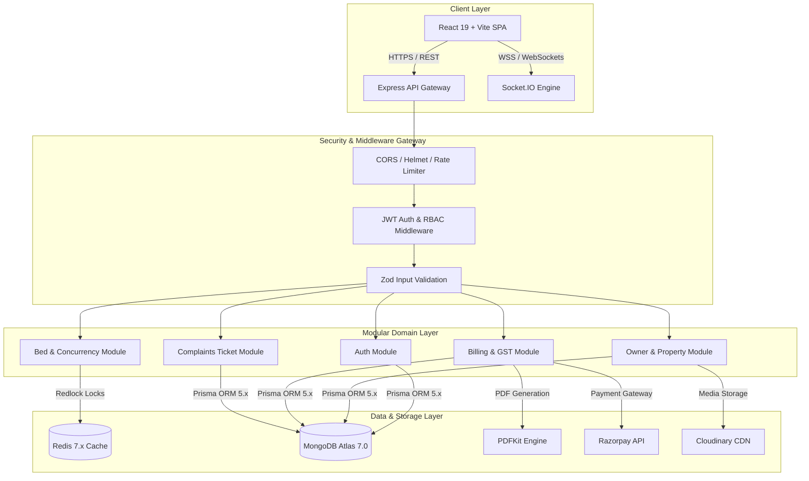

# 🏰 RoomBae PG Management System — Master System Architecture & Design Specification (`DESIGN.md`)

> **Comprehensive End-to-End Architectural Specification, Visual Design System, API & Data Model Reference, and Security Blueprint** for the RoomBae Multi-Tenant SaaS PG & Co-Living Property Management Platform.
>
> **STATUS**: Verified & Enforced Production-Grade System Architecture (Updated August 2026).

---

## 📋 Table of Contents

1. [🌟 System Architecture & Executive Summary](#1-system-architecture--executive-summary)
2. [🧰 Complete Technology Stack & Ecosystem](#2-complete-technology-stack--ecosystem)
3. [📂 Project File & Folder Directory Tree](#3-project-file--folder-directory-tree)
4. [🎨 Frontend Architecture & Visual Design System](#4-frontend-architecture--visual-design-system)
   - [4.1 Color Engine & Tokens](#41-color-engine--tokens)
   - [4.2 Typography & Layout Engine](#42-typography--layout-engine)
   - [4.3 Micro-Animations, Glassmorphism & Transitions](#43-micro-animations-glassmorphism--transitions)
   - [4.4 Detailed Page-by-Page & Component Breakdown](#44-detailed-page-by-page--component-breakdown)
5. [⚙️ Backend Architecture & Domain Services](#5-backend-architecture--domain-services)
   - [5.1 Clean Architecture & Domain Modules](#51-clean-architecture--domain-modules)
   - [5.2 Distributed Concurrency Locks (Redlock)](#52-distributed-concurrency-locks-redlock)
   - [5.3 Real-Time WebSocket Engine](#53-real-time-websocket-engine)
   - [5.4 PDF Pipeline & Scheduled Cron Workers](#54-pdf-pipeline--scheduled-cron-workers)
6. [🗄️ Database Schema & Data Models](#6-database-schema--data-models)
   - [6.1 Entity Relationship Diagram (ERD)](#61-entity-relationship-diagram-erd)
   - [6.2 Detailed Prisma Data Models](#62-detailed-prisma-data-models)
   - [6.3 Field Encryption & Sensitivity Mapping](#63-field-encryption--sensitivity-mapping)
7. [🔌 Tri-Protocol API Specification](#7-tri-protocol-api-specification)
   - [7.1 Protocol Architecture](#71-protocol-architecture)
   - [7.2 REST v1 Endpoint Directory](#72-rest-v1-endpoint-directory)
   - [7.3 Realtime Socket.IO Events](#73-realtime-socketio-events)
8. [🛡️ Comprehensive Security & Compliance Architecture](#8-comprehensive-security--compliance-architecture)
   - [8.1 Zero-Trust Framework & RBAC](#81-zero-trust-framework--rbac)
   - [8.2 Cryptographic Standards & Token Lifecycle](#82-cryptographic-standards--token-lifecycle)
   - [8.3 Network & Infrastructure Defense](#83-network--infrastructure-defense)
   - [8.4 Audit Logging & Forensics](#84-audit-logging--forensics)
9. [🚀 DevOps, Infrastructure & Deployment Pipeline](#9-devops-infrastructure--deployment-pipeline)

---

## 1. 🌟 System Architecture & Executive Summary

**RoomBae** is an enterprise-grade, multi-tenant SaaS platform engineered specifically for modern PG (Paying Guest) accommodations, co-living spaces, and hostel property management across India. The platform bridges the gap between **PG Owners**, **Residents**, and **Platform Administrators** by providing real-time room allocation, automated GST invoicing, digital rental contracts, maintenance ticketing, and multi-channel communication.

### Core Architectural Philosophy

- **Clean Feature-First Modular Architecture**: Code is structured around business domains rather than tech layers, facilitating scaling and independent feature maintenance.
- **REST & Real-Time API Engine**: Unified REST API for CRUD operations paired with a Socket.IO WebSocket engine for instant state synchronization and real-time dashboard updates.
- **Zero-Trust Security Model**: Role-Based Access Control (RBAC), short-lived JWTs (15-minute access token) with HTTP-only refresh tokens (7-day lifetime), AES-256-GCM field encryption for sensitive KYC data, and complete request tracing.
- **High-Concurrency Inventory Management**: Redis Redlock distributed locks prevent double-booking of beds during simultaneous check-in workflows and manual bed status edits.



---

## 2. 🧰 Complete Technology Stack & Ecosystem

### Frontend Technologies

| Component | Technology | Version | Purpose & Description |
| :--- | :--- | :--- | :--- |
| **Core Framework** | React | `^19.0.0` | Next-generation React library utilizing concurrent rendering and automatic batching. |
| **Build Tooling** | Vite | `^6.0.0` | Ultra-fast HMR build server leveraging ES modules for instant bundling. |
| **Language** | TypeScript | `^5.7.0` | Strict static typing ensuring zero runtime type errors across components. |
| **Styling System** | Vanilla CSS Tokens + TailwindCSS | `^4.0.0` | Custom CSS variables design tokens paired with utility-first layout primitives. |
| **Icons & Visuals** | Lucide React | `^1.26.0` | Clean, accessible SVG icon set formatted as React components. |
| **Animations** | Framer Motion | `^12.42.2` | Spring physics animations, layout transitions, and page route enter/exit sequences. |
| **Real-Time Client** | Socket.IO Client | `^4.8.3` | Event-driven WebSocket client for live status changes and notification listening. |
| **Data Viz** | Recharts | `^3.10.0` | Composably built SVG charts for revenue, MRR, and occupancy breakdown. |

### Backend Technologies

| Component | Technology | Version | Purpose & Description |
| :--- | :--- | :--- | :--- |
| **Runtime** | Node.js | `>=20.0.0` | Asynchronous event-driven I/O JavaScript runtime. |
| **Server Framework** | Express.js | `^4.21.2` | Lightweight web framework serving API endpoints and middleware chains. |
| **ORM** | Prisma ORM | `^5.22.0` | Type-safe database client and schema migration tool targeting MongoDB. |
| **Primary Database** | MongoDB Atlas | `^7.0.0` | Document database for highly flexible, multi-tenant nested property objects. |
| **Cache & Locks** | Redis | `^6.2.0` | In-memory key-value store used for rate limiting and Redlock distributed locks. |
| **Realtime Engine** | Socket.IO | `^4.8.3` | Event-based WebSockets library for instant bi-directional client-server updates. |
| **Background Cron** | Node-Cron | `^3.0.3` | Scheduled background worker service for invoice generation, late fees, and SLA escalation. |
| **Document Generator** | PDFKit | `^0.15.2` | Dynamic vector PDF generation engine for tax invoices and rental agreements. |
| **Password Hashing** | BcryptJS | `^2.4.3` | Password hashing engine using cost factor 12 (`saltRounds = 12`). |

---

## 3. 📂 Project File & Folder Directory Tree

```text
PG-Management-System/
├── USER_CREDENTIALS.md             # Local development test account credentials directory
├── DESIGN.md                       # (This Document) Master Design Specification
├── backend/                        # Backend Application Service
│   ├── .env.example                # Backend environment variable template
│   ├── package.json                # Node dependencies & script commands
│   ├── prisma/                     # Database Schema & Seed Engine
│   │   ├── schema.prisma           # Master Prisma schema definitions
│   │   ├── seed.ts                 # Production-grade 10-owner multi-tenant seeder
│   │   └── seedDemoData.ts         # Single PG owner demo dataset seeder
│   └── src/                        # TypeScript Source Code
│       ├── app.ts                  # Express application setup & middleware registration
│       ├── server.ts               # HTTP, Socket.IO, and CronWorkerService bootstrap entry point
│       ├── config/                 # Environment, Prisma, Redis, env validation
│       ├── container/              # Dependency injection container
│       ├── infrastructure/         # External integrations (PDF, CryptoEngine, RedisLockService)
│       ├── jobs/                   # Background Cron Workers
│       │   └── cronWorkers.ts      # Monthly invoices, daily late fees, hourly SLA escalation
│       ├── middleware/             # Express middlewares (Auth, RoleGuard, RateLimiter)
│       │   └── authMiddleware.ts   # JWT verification, RBAC, & ownership checks
│       ├── modules/                # Feature-First Modular Business Domains
│       │   ├── agreements/         # Rental contract digital signing & PDF download
│       │   ├── analytics/          # Revenue analytics, MRR, occupancy rate queries
│       │   ├── auth/               # Signup, login, Google OAuth 2.0, refresh tokens
│       │   ├── beds/               # Bed inventory, holds, Redlock locks
│       │   ├── billing/            # Invoices, Razorpay webhooks, GST processing
│       │   ├── complaints/         # Helpdesk tickets & SLA escalation logic
│       │   ├── notifications/      # Push notifications & alert history
│       │   ├── owners/             # Owner KYC, business info, bank details, onboarding
│       │   ├── properties/         # PG property CRUD & public catalog search
│       │   └── residents/          # Resident directory, move-in/move-out workflows
│       ├── socket/                 # Socket.IO handlers & connection lifecycle
│       │   └── socketServer.ts     # Real-time WebSocket server engine
│       └── utils/                  # Cryptography, logger, response helpers
├── frontend/                       # Frontend Single Page Application
│   ├── package.json                # Frontend UI dependencies
│   ├── vite.config.ts              # Vite bundle builder & dev settings
│   └── src/                        # React TypeScript UI Source
│       ├── App.tsx                 # Root application wrapper & provider tree
│       ├── index.css               # Design system CSS variables, glassmorphism, & keyframes
│       ├── app/                    # Application routing & page switcher
│       │   └── routes.tsx          # AppRoutes with Framer Motion enter/exit transitions
│       ├── components/             # Reusable UI layout components
│       │   ├── layouts/
│       │   │   └── DashboardLayout.tsx # Multi-role navigation sidebar layout
│       ├── features/               # Feature-First Modular UI Views
│       │   ├── analytics/pages/Analytics.tsx
│       │   ├── auth/pages/Auth.tsx
│       │   ├── dashboard/pages/
│       │   │   ├── Dashboard.tsx    # Owner Bento Grid Dashboard
│       │   │   ├── AdminConsole.tsx # Admin Verification Queue & Platform Telemetry
│       │   │   └── Landing.tsx      # Public Marketing Landing Page
│       │   ├── owners/components/OwnerOnboardingWizard.tsx # 4-Step Owner Onboarding
│       │   ├── properties/pages/Properties.tsx
│       │   └── residents/pages/ResidentPortal.tsx # Resident Self-Service Portal
│       ├── guards/                 # Route & Role Guards
│       │   ├── RouteGuard.tsx      # Session Authentication Guard
│       │   └── RoleGuard.tsx       # Role-Based Access Guard
│       ├── hooks/                  # Custom React Hooks (useAuth, useTheme)
│       ├── providers/              # AuthProvider & ThemeProvider
│       └── services/               # API, AuthService, & Socket Clients
```

---

## 4. 🎨 Frontend Architecture & Visual Design System

### 4.1 Color Engine & Tokens

RoomBae implements a dual-theme design system (**Warm Sand Light** & **Obsidian Bronze Dark**) driven by CSS custom properties in `index.css`:

```css
:root {
  --bg-primary: #FFF8F2;
  --bg-surface: #F8EEE5;
  --bg-card: #FFFDFB;
  --text-main: #3B2A24;
  --text-muted: #6E5A52;
  --accent-gold: #D9A87C;
  --accent-bronze: #C58B63;
}

html.dark-theme {
  --bg-primary: #1D1B1A;
  --bg-surface: #2B2725;
  --bg-card: #332D2B;
  --text-main: #F7F3EE;
  --text-muted: #C6B9AE;
  --accent-gold: #C89A4B;
  --accent-bronze: #D8B36A;
}
```

### 4.2 Micro-Animations, Glassmorphism & Transitions

- **Glassmorphism Cards (`.glass-card`)**: Integrated backdrop blur (`blur(16px)`), subtle translucent borders, and depth shadows applied across metrics panels.
- **Skeleton Shimmer (`.skeleton-wave`)**: Linear gradient keyframe animation (`@keyframes skeletonWave`) providing shimmering placeholders during async component loading.
- **Pulsing Status Badges (`.badge-pulse`)**: Smooth scale and opacity pulse (`@keyframes badgePulse`) applied to `● Available` bed status indicators.
- **Framer Motion Route Transitions**: `AnimatePresence mode="wait"` wraps page navigation in `routes.tsx` (`initial={{ opacity: 0, y: 10 }}`, `animate={{ opacity: 1, y: 0 }}`, `exit={{ opacity: 0, y: -10 }}`).

---

## 5. ⚙️ Backend Architecture & Domain Services

### 5.1 Clean Architecture & Domain Modules

The backend follows a Feature-First modular structure where each domain contains its own controllers, services, repositories, DTOs, and socket handlers.

### 5.2 Distributed Concurrency Locks (Redlock)

To prevent double-booking during concurrent check-in operations or manual bed edits, `BedService.updateBedStatus`, `createBedHold`, `releaseBedHold`, and `BillingService.createPaymentOrder` acquire distributed Redis locks via `Container.lockService.acquireLock("bed:lock:" + bedId, 10000)`. If a concurrent operation attempts to modify the same bed during lock acquisition, the request is rejected with HTTP `409 Conflict` or HTTP `429 Too Many Requests`.

### 5.3 Real-Time WebSocket Engine

The backend Socket.IO server ([socketServer.ts](file:///c:/Users/GLB-BLR-191/Downloads/New%20folder/PG-Management-System/backend/src/socket/socketServer.ts)) authenticates connection handshakes using JWT access tokens. Real-time events emitted server-side include:

- `bed:status_change`: Emitted when bed occupancy or hold status changes.
- `complaint:created` & `complaint:status_change`: Emitted on ticket submission or status column shifts.
- `payment:success`: Emitted when payment order verification completes.

Client-side [socket.ts](file:///c:/Users/GLB-BLR-191/Downloads/New%20folder/PG-Management-System/frontend/src/services/socket.ts) propagates these events into `roombae-data-changed` DOM events, triggering immediate, automatic UI data refetching without manual browser reloads.

### 5.4 PDF Pipeline & Scheduled Cron Workers

- **PDF Generation**: `PdfGeneratorService` utilizes `PDFKit` to dynamically build vector-graphics Tax Invoices, Digital Rental Agreements, KYC Summaries, and Refund Receipts with embedded QR code verification payloads.
- **Scheduled Cron Workers ([cronWorkers.ts](file:///c:/Users/GLB-BLR-191/Downloads/New%20folder/PG-Management-System/backend/src/jobs/cronWorkers.ts))**:
  1. **Monthly Rent Invoice Generator** (`0 0 1 * *` - 1st of every month): Automatically generates monthly rent invoices for active residents.
  2. **Daily Late Fee Calculation Worker** (`0 2 * * *` - daily at 2:00 AM): Applies flat late fee penalties (`₹250`) to overdue invoices past their due date.
  3. **Hourly Complaint SLA Escalator** (`0 * * * *` - hourly): Auto-escalates `OPEN` complaints older than 24 hours to `HIGH` priority / `IN_PROGRESS` SLA status.

---

## 6. 🛡️ Comprehensive Security & Compliance Architecture

### 6.1 Zero-Trust Framework & RBAC

- **Strict Role-Based Access Control**: Standardized roles (`SUPER_ADMIN`, `ADMIN`, `OWNER`, `MANAGER`, `STAFF`, `RESIDENT`).
- **Ownership Verification**: Route handlers enforce `assertOwnershipOf("ownerId")` to guarantee PG Owners can only query or modify properties and residents belonging directly to their own account.
- **Public Admin Signup Exclusion**: `ADMIN` and `SUPER_ADMIN` accounts cannot be self-served through public signup or Google OAuth. They are provisioned strictly via seed scripts or internal administrative provisioning.

### 6.2 Cryptographic Standards & Token Lifecycle

- **Short-Lived Access Tokens**: Signed JWT access tokens with a 15-minute expiration period. Access tokens are held in-memory and omitted from persistent `localStorage`.
- **HTTP-Only Refresh Token Cookies**: Refresh tokens are stored in `httpOnly`, `Secure`, `SameSite=Strict` cookies with a 7-day expiration period.
- **Token Rotation & Revocation**: Refresh tokens are hashed in database (`RefreshToken` model) and rotated on every `/auth/refresh` request. Revoked tokens (`revokedAt`) or token reuse triggers immediate session invalidation.
- **Bcrypt Password Hashing**: Passwords are hashed using bcrypt with cost factor 12 (`saltRounds = 12`).
- **AES-256-GCM Field Encryption**: Sensitive KYC fields (Aadhaar number, PAN number, bank account details) are encrypted at rest using AES-256-GCM via `CryptoEngine` with an environment-managed key.

### 6.3 Network & Infrastructure Defense

- **Rate Limiting**: Redis-backed rate limiting enforces 100 requests / 15 minutes generally (`generalRateLimiter`) and 5 requests / 15 minutes on `/auth/login` (`loginRateLimiter`).
- **NoSQL Injection Prevention**: `express-mongo-sanitize` strips `$` and `.` characters from incoming request bodies and query parameters.
- **Security Headers**: `helmet` configures Content Security Policy, HSTS, X-Frame-Options, and X-Content-Type-Options.

---

## 7. 🚀 Local Development & Verification Summary

### Database Seeding & Safety Guard

The seed script ([seed.ts](file:///c:/Users/GLB-BLR-191/Downloads/New%20folder/PG-Management-System/backend/prisma/seed.ts)) checks `process.env.DATABASE_URL` and unconditionally refuses execution if the connection string does not point to a local/dev MongoDB instance (`mongodb://localhost` or `mongodb://127.0.0.1`).

All test accounts in [USER_CREDENTIALS.md](file:///c:/Users/GLB-BLR-191/Downloads/New%20folder/PG-Management-System/USER_CREDENTIALS.md) utilize distinct, strong, unique passwords per account hashed with bcrypt cost factor 12.
