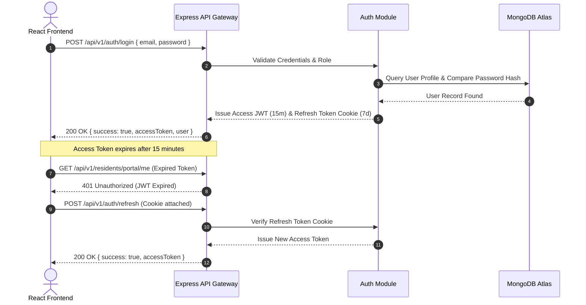
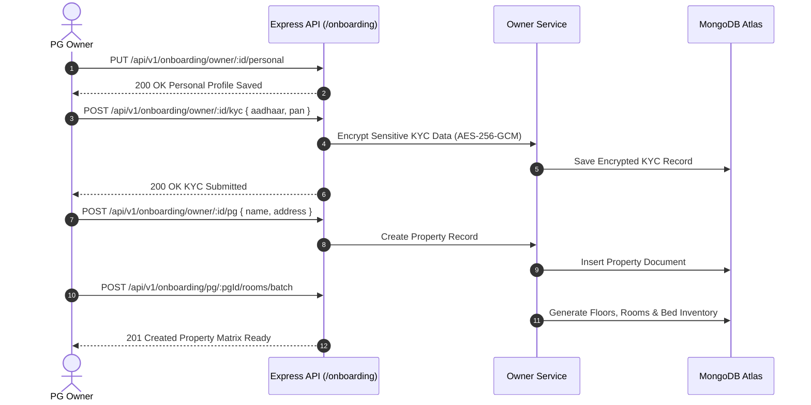
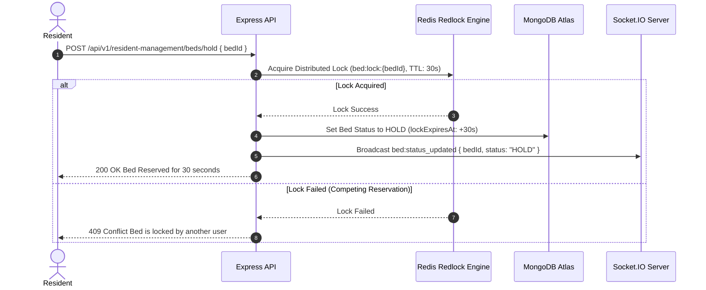
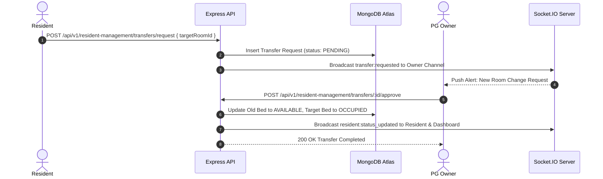
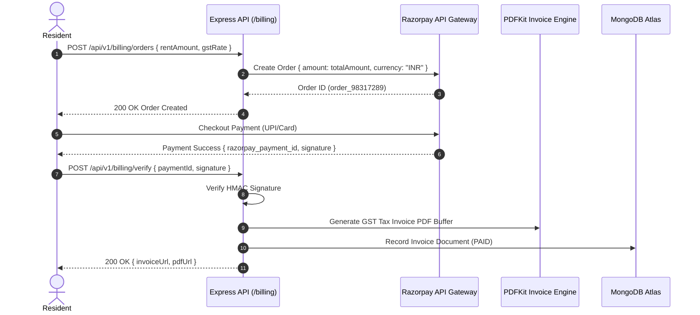

# 🔌 RoomBae API Architecture & Complete Endpoint Specification (`API_DESIGN.md`)

> **Comprehensive API Design & Architecture Document** covering REST v1 endpoints, GraphQL Apollo schemas, Socket.IO WebSockets events, request/response contracts, and Mermaid workflow sequence diagrams for RoomBae.

---

## 📡 1. Tri-Protocol API Architecture

RoomBae exposes three communication channels:

| Protocol | Base URL / Path | Transport / Format | Primary Purpose |
|---|---|---|---|
| **REST API** | `http://localhost:5000/api/v1` | HTTP / JSON | Core CRUD, Authentication, Onboarding, Invoicing, Complaints |
| **GraphQL Apollo** | `http://localhost:5000/graphql` | HTTP / GraphQL POST | Complex nested queries, analytics aggregation, schema introspection |
| **Socket.IO Realtime** | `ws://localhost:5000` | WebSockets / Engine.IO | Instant status changes, notification pushes, live bed hold updates |

---

## 🔒 2. Authentication & Response Contracts

### 2.1 Authorization Header
```http
Authorization: Bearer <accessToken>
```

### 2.2 Standard Response Envelopes

#### Success Envelope (`200 OK`, `201 Created`)
```json
{
  "success": true,
  "message": "Operation completed successfully",
  "data": { ... }
}
```

#### Error Envelope (`400 Bad Request`, `401 Unauthorized`, `409 Conflict`, `500 Server Error`)
```json
{
  "success": false,
  "message": "Bed 101-A is currently held by another reservation",
  "errors": [
    {
      "field": "bedId",
      "message": "Distributed lock active"
    }
  ]
}
```

---

## 🧜‍♂️ 3. Sequence Diagrams for Core Workflows

### 3.1 Authentication & JWT Token Refresh Flow


### 3.2 Owner Onboarding & Building Matrix Generation Workflow


### 3.3 Bed Concurrency Lock & Resident Booking Sequence


### 3.4 Room Transfer Request & Approval Sequence


### 3.5 Razorpay Payment & GST Invoice Flow


---

## 🛠️ 4. REST API Endpoint Catalog

### 4.1 Authentication (`/api/v1/auth`)
- `POST /auth/register`: Register new user account.
- `POST /auth/login`: Authenticate and issue Access Token & Refresh Token cookie.
- `POST /auth/send-otp`: Send mobile verification OTP code.
- `POST /auth/verify-otp`: Validate OTP code.
- `POST /auth/refresh`: Exchange refresh token cookie for a new Access Token.
- `POST /auth/logout`: Revoke active session cookies.

### 4.2 Owner Onboarding (`/api/v1/onboarding`)
- `PUT /onboarding/owner/:id/personal`: Save personal profile details.
- `POST /onboarding/owner/:id/kyc`: Save encrypted Aadhaar and PAN KYC.
- `POST /onboarding/owner/:id/business`: Save GSTIN and business info.
- `POST /onboarding/owner/:id/bank`: Save payout bank details.
- `POST /onboarding/owner/:id/pg`: Create PG property.
- `POST /onboarding/pg/:pgId/rooms/batch`: Generate building rooms & beds.

### 4.3 Resident Management (`/api/v1/residents` & `/api/v1/resident-management`)
- `GET /residents/directory`: Retrieve resident directory list with search params.
- `GET /residents/portal/me`: Fetch resident profile, active bed, and passes.
- `POST /resident-management/status`: Update resident operational status (`ACTIVE`, `HOME`, `ON_LEAVE`, `HOLD`, `LEAVING`, `CHECKED_OUT`).
- `GET /resident-management/status/history/:id`: Audit log of resident status changes.

### 4.4 Rooms & Beds (`/api/v1/rooms` & `/api/v1/beds`)
- `POST /resident-management/beds/status`: Update bed availability status.
- `POST /resident-management/beds/hold`: Reserve temporary Redlock hold.
- `POST /resident-management/transfers/request`: Submit room transfer request.
- `POST /resident-management/transfers/:id/approve`: Approve room transfer request.

### 4.5 Billing & Invoices (`/api/v1/billing`)
- `POST /billing/orders`: Initiate Razorpay payment order.
- `POST /billing/verify`: Verify Razorpay signature and generate invoice.
- `GET /billing/invoices/:id/pdf`: Stream generated GST tax invoice PDF.

### 4.6 Complaints & Gate Passes (`/api/v1/complaints` & `/api/v1/visitors`)
- `GET /complaints`: Retrieve ticket list.
- `POST /complaints`: Create maintenance complaint.
- `PUT /complaints/:id/status`: Update ticket status (`OPEN`, `IN_PROGRESS`, `RESOLVED`).
- `POST /visitors/pass`: Issue digital visitor pass with QR code payload.
- `POST /visitors/gate-pass`: Issue resident outing gate pass.

---

## ⚡ 5. Socket.IO Real-Time WebSockets Engine

### 5.1 Room Subscriptions
- `socket.emit('join_pg', pgId)`: Join property broadcast channel.
- `socket.emit('join_owner', ownerId)`: Join owner dashboard notification channel.
- `socket.emit('join_resident', residentId)`: Join resident portal alert channel.

### 5.2 Outbound Broadcast Payload Specifications
- `resident:status_updated`: `{ residentId, newStatus, timestamp }`
- `bed:status_updated`: `{ bedId, roomId, status, residentId }`
- `transfer:requested`: `{ requestId, residentName, currentRoom, targetRoom }`
- `notification:received`: `{ id, title, message, type, createdAt }`
