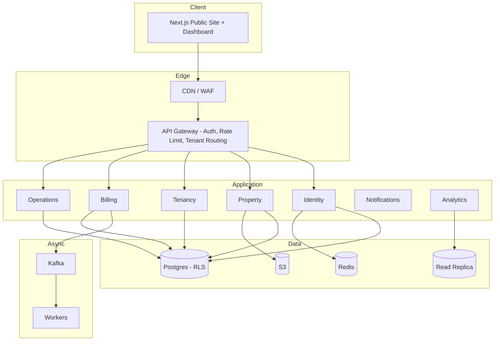

# PG Management System

A secure, multi-tenant SaaS platform for PG (Paying Guest) owners to manage properties, rooms, beds, residents, billing, and day-to-day operations — with a public discovery front-end for prospective residents.

Built as a one-stop solution: list every PG you own, onboard residents, collect rent online, handle complaints, and track occupancy and revenue — all from a single dashboard.

---

## Table of Contents

- [Features](#features)
- [Architecture](#architecture)
- [Tech Stack](#tech-stack)
- [System Design](#system-design)
- [Getting Started](#getting-started)
- [Environment Variables](#environment-variables)
- [API Documentation](#api-documentation)
- [Security](#security)
- [Project Structure](#project-structure)
- [Roadmap](#roadmap)
- [Contributing](#contributing)

---

## Features

### Core (Classic)

- Multi-PG, multi-floor, multi-room, multi-bed inventory management
- Resident onboarding with KYC upload and digital agreements
- Room/bed allocation with visual occupancy grid
- Rent collection with due-date tracking and automated late fees
- Complaint/maintenance ticketing
- Visitor log and notice board
- Staff attendance and duty scheduling
- Expense and utility bill tracking per PG

### Modern Differentiators

- Online rent payments via Razorpay/Stripe with auto-reconciliation
- WhatsApp Business API and SMS/email reminders and confirmations
- QR-based gate entry and attendance
- Public PG discovery pages with resident reviews (SEO-optimized)
- Owner analytics: occupancy rate, revenue per PG, churn trends
- Predictive late-payer risk scoring and vacancy forecasting
- Chatbot for FAQ and complaint triage
- Smooth, animated marketing site (GSAP, AOS, Lenis)

---

## Architecture

Modular monolith on Spring Boot — clean module boundaries (Identity, Property, Tenancy, Billing, Operations, Notification, Analytics), each owning its own tables, communicating only through service interfaces. This gives microservice-like separation without distributed-systems overhead, and allows individual modules (e.g., Billing) to be extracted into standalone services later if scale demands it.



**Multi-tenancy:** shared database, shared schema, `tenant_id` on every table, enforced at the database level via Postgres Row-Level Security — so a bug in application code can never leak one PG owner's data to another.

Full system design writeup: [`docs/system-design.md`](./docs/System.md)

---

## Tech Stack

| Layer                | Technology                                                  |
| -------------------- | ----------------------------------------------------------- |
| Backend              | Java 21, Spring Boot 3, Spring Security, Spring Data JPA    |
| Database             | PostgreSQL 16 (with Row-Level Security), Redis              |
| Messaging            | Kafka / RabbitMQ                                            |
| Frontend (marketing) | Next.js (App Router, SSR), GSAP, AOS, Lenis                 |
| Frontend (dashboard) | Next.js, Shadcn/UI, Tailwind CSS                            |
| Payments             | Razorpay (primary), Stripe (fallback)                       |
| Notifications        | WhatsApp Business API, SMS/Email provider                   |
| Storage              | AWS S3                                                      |
| Infra                | Docker, Kubernetes, GitHub Actions, Prometheus, Grafana     |
| Auth                 | JWT (access + refresh), TOTP 2FA, Argon2id password hashing |

---

## System Design

- **Modules:** Identity · Property · Tenancy · Billing · Operations · Notification · Analytics
- **Database:** shared Postgres instance, `tenant_id` scoping + RLS, read replica for analytics
- **Caching:** Redis for reads (occupancy, dashboards); writes always hit primary
- **Async:** Kafka for payment events, notification dispatch, and reconciliation
- **API:** REST, versioned (`/api/v1`), resource-nested, idempotency-key required on payment/booking writes

Entity relationships, full architecture diagram, and security model: [`docs/system-design.md`](./docs/System.md)

---

## Getting Started

### Prerequisites

- Java 21+
- Node.js 18+
- PostgreSQL 16+
- Redis
- Docker & Docker Compose (recommended for local dev)

### Local Setup

```bash
# clone the repo
git clone https://github.com/<your-username>/pg-management-system.git
cd pg-management-system

# start infra (Postgres, Redis, Kafka) via Docker Compose
docker-compose up -d

# backend
cd backend
./mvnw spring-boot:run

# frontend
cd frontend
npm install
npm run dev
```

The backend runs on `http://localhost:8080`, the frontend on `http://localhost:3000`.

---

## Environment Variables

Create a `.env` file in `backend/` and `frontend/` based on the examples below. **Never commit real secrets** — use a secrets manager (AWS KMS / Vault) in production.

```env
# Backend
DB_URL=jdbc:postgresql://localhost:5432/pgmanager
DB_USER=postgres
DB_PASSWORD=changeme
REDIS_HOST=localhost
JWT_SECRET=changeme
RAZORPAY_KEY_ID=your_key
RAZORPAY_KEY_SECRET=your_secret
WHATSAPP_API_TOKEN=your_token
S3_BUCKET=pgmanager-documents

# Frontend
NEXT_PUBLIC_API_BASE_URL=http://localhost:8080/api/v1
```

---

## API Documentation

Full OpenAPI 3.0 spec: [`docs/api-spec.yaml`](./docs/api-spec.yaml)

Sample endpoints:

| Method | Endpoint                           | Description                                        |
| ------ | ---------------------------------- | -------------------------------------------------- |
| POST   | `/api/v1/auth/login`               | Login, returns JWT + refresh token                 |
| GET    | `/api/v1/pgs`                      | List all PGs for the authenticated tenant          |
| POST   | `/api/v1/pgs/{id}/rooms/{id}/beds` | Add a bed to a room                                |
| POST   | `/api/v1/residents`                | Onboard a resident                                 |
| POST   | `/api/v1/invoices/{id}/pay`        | Initiate rent payment (requires `Idempotency-Key`) |
| POST   | `/api/v1/complaints`               | Raise a complaint                                  |
| GET    | `/api/v1/analytics/occupancy`      | Occupancy metrics per PG                           |

Import `docs/api-spec.yaml` into Postman or Swagger UI for the complete, interactive reference.

---

## Security

- TLS 1.3, HSTS, strict CSP headers
- Argon2id password hashing
- Mandatory TOTP 2FA for Owner/Admin accounts
- Field-level AES-256 encryption for sensitive data (Aadhar, PAN, bank details)
- Postgres Row-Level Security as the final tenant-isolation backstop
- Append-only audit log for all sensitive mutations
- WAF + per-user/per-key rate limiting
- Idempotency-key required on all payment and booking writes
- Automated dependency scanning (Dependabot/Snyk) and OWASP ZAP in CI

Found a vulnerability? Please report it privately — see [SECURITY.md](./Security.md) rather than opening a public issue.

---

## Project Structure

```
pg-management-system/
├── backend/
│   ├── src/main/java/com/pgmanager/
│   │   ├── identity/
│   │   ├── property/
│   │   ├── tenancy/
│   │   ├── billing/
│   │   ├── operations/
│   │   ├── notification/
│   │   └── analytics/
│   └── src/main/resources/
├── frontend/
│   ├── app/
│   ├── components/        # Shadcn/UI components
│   └── lib/
├── docs/
│   ├── system-design.md
│   ├── api-spec.yaml
│   └── roadmap.md
├── docker-compose.yml
└── README.md
```

---

## Roadmap

- **Phase 0:** Foundation — auth, multi-tenancy, CI/CD
- **Phase 1 (MVP):** Single-PG management, manual billing, owner dashboard
- **Phase 2 (v1):** Payment gateway, notifications, multi-PG, 2FA, audit logs
- **Phase 3 (Growth):** Resident self-service portal, e-sign agreements, public discovery + reviews
- **Phase 4 (Scale):** Predictive analytics, dynamic pricing, chatbot, module extraction

Full breakdown: [`docs/roadmap.md`](./docs/roadmap.md)

---

## Contributing

1. Fork the repo and create a feature branch: `git checkout -b feature/your-feature`
2. Commit with clear messages
3. Ensure tests pass and lint is clean before opening a PR
4. Open a pull request describing the change and why it's needed

---

Built by [Ayushman Saha](https://github.com/ayushman917) — feedback and contributions welcome.
