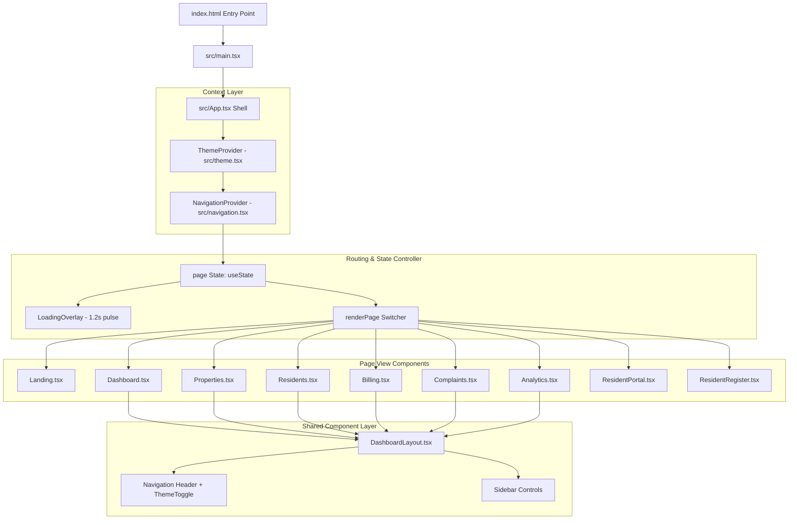

# 🏢 PG Management System ("Room Bae")

<div align="center">


### 🌟 Premium Multi-Tenant SaaS Platform for PG Hostels & Coliving Management

[🌐 **View Live Interactive Demo**](https://ayushman-glb.github.io/PG-Management-System/) • [📄 **IEEE 830 SRS Spec**](./docs/SRS.md) • [📖 **System Architecture**](./docs/System.md) • [🔒 **Security Policy**](./docs/Security.md) • [🗺️ **Project Roadmap**](./docs/roadmap.md)

</div>

---

## 📋 Table of Contents

- [✨ Overview](#-overview)
- [🌐 Live Preview](#-live-preview)
- [🎯 Software Requirements Specification (SRS)](#-software-requirements-specification-srs)
  - [Functional Requirements](#functional-requirements)
  - [Non-Functional Requirements](#non-functional-requirements)
- [🏗️ Frontend Architecture & Layering](#️-frontend-architecture--layering)
  - [Component Pipeline & Execution Flow](#component-pipeline--execution-flow)
  - [State & Navigation System](#state--navigation-system)
- [💎 Design System & Color Palette](#-design-system--color-palette)
- [⚡ Technology Stack & Justification](#-technology-stack--justification)
- [📂 Project Directory Pathway Structure](#-project-directory-pathway-structure)
- [🛠️ How to Recreate & Run From Scratch](#️-how-to-recreate--run-from-scratch)
  - [Prerequisites](#prerequisites)
  - [Installation & Setup](#installation--setup)
  - [Building for Production](#building-for-production)
- [🔗 API & Documentation Directory](#-api--documentation-directory)
- [🛡️ Security & Tenant Data Isolation](#️-security--tenant-data-isolation)
- [🤝 Contributing](#-contributing)

---

## ✨ Overview

The **PG Management System ("Room Bae")** is a state-of-the-art, multi-tenant SaaS application built to simplify room allocations, tenant onboarding, rent collection, complaint resolution, and revenue analytics for PG (Paying Guest) owners, hostel managers, and residents.

It features a dual-experience architecture:
1. **Public Discovery Portal**: For prospective residents to search, filter, and explore PG properties, check room amenities, view pricing, and register online.
2. **Management & Tenant Workspace**: An enterprise-grade dashboard for PG owners to monitor real-time occupancy rates, track pending dues, manage visitor logs, resolve support tickets, and review analytical trends.

---

## 🌐 Live Preview

The frontend web application is deployed live on GitHub Pages:

👉 **[https://ayushman-glb.github.io/PG-Management-System/](https://ayushman-glb.github.io/PG-Management-System/)**

---

## 🎯 Software Requirements Specification (SRS)

### Functional Requirements

| Module | Feature Capabilities | Target User |
| :--- | :--- | :--- |
| **Public PG Discovery** | City-based search, rent filtering, room-type filters, amenity tags, photo gallery. | Prospective Residents |
| **Resident Onboarding** | Digital application form ([ResidentRegister.tsx](file:///c:/Users/GLB-BLR-191/Documents/pg%20management/New%20folder/PG%20Management%20system2/src/pages/ResidentRegister.tsx)), KYC ID upload, emergency contact capture. | Applicants / New Tenants |
| **Owner Dashboard** | High-level metrics: Total Revenue, Occupancy Rate %, Pending Dues, Active Complaints. | PG Owners & Managers |
| **Inventory Management** | Multi-property, multi-floor, multi-room, and bed-level real-time allocation grids. | PG Owners & Managers |
| **Billing & Payments** | Automated rent invoicing, due-date tracking, late fee notifications, payment history. | Owners & Residents |
| **Helpdesk & Complaints** | Ticket submission, priority tagging (Low/Medium/High/Urgent), status workflow. | Residents & Staff |
| **Resident Portal** | Self-service tenant dashboard ([ResidentPortal.tsx](file:///c:/Users/GLB-BLR-191/Documents/pg%20management/New%20folder/PG%20Management%20system2/src/pages/ResidentPortal.tsx)) for rent payments & tickets. | Active Tenants |
| **Analytics Engine** | Financial breakdown, revenue trend charts, occupancy statistics ([Analytics.tsx](file:///c:/Users/GLB-BLR-191/Documents/pg%20management/New%20folder/PG%20Management%20system2/src/pages/Analytics.tsx)). | PG Owners |

### Non-Functional Requirements
- **Performance**: Sub-second page rendering and smooth 60fps animations.
- **Accessibility & Contrast**: Built-in support for both Light Warm luxury mode and Dark Gold mode with proper ARIA attributes.
- **Responsiveness**: Mobile-first design adapting seamlessly from 320px smartphones to 4K desktop displays.
- **Zero Heavy Dependencies**: Built with React + Vite native state and utility-first CSS for minimal bundle size (~260 kB gzipped).

---

## 🏗️ Frontend Architecture & Layering

The application follows a clean **Unidirectional Data Flow Architecture** wrapped inside custom React Context Providers:



### Component Pipeline & Execution Flow
1. **Entry Point**: `index.html` mounts React into `<div id="root"></div>` via `src/main.tsx`.
2. **Global Wrapper**: `App.tsx` wraps the application tree inside `ThemeProvider` (handles dark/light mode toggling) and `NavigationProvider` (handles smooth history stack navigation).
3. **State-Based Client Router**: Uses React's `useState<Page>` to drive client-side navigation without full-page refreshes.
4. **Layout Reusability**: All management screens inherit `DashboardLayout.tsx` for consistent sidebars, breadcrumbs, search bars, and theme switches.

---

## 💎 Design System & Color Palette

The visual identity combines **Warm Hospitality Palette** (Light) with a **Gold Luxury Palette** (Dark) engineered using Tailwind CSS v4 `@theme` design tokens in [index.css](file:///c:/Users/GLB-BLR-191/Documents/pg%20management/New%20folder/PG%20Management%20system2/src/index.css).

```
☀️ LIGHT LUXURY PALETTE                    🌙 DARK GOLD PALETTE
┌──────────────────────────────────┐      ┌──────────────────────────────────┐
│  Background: #FFF8F2 (Soft Cream)│      │  Background: #1D1B1A (Dark Warm) │
│  Surface:    #F8EEE5 (Warm Beige)│      │  Surface:    #2B2725 (Charcoal)  │
│  Card:       #FFFDFB (Pure Off)  │      │  Card:       #332D2B (Warm Dark) │
│  Accent:     #D9A87C (Bronze Gold│      │  Accent:     #C89A4B (Rich Gold) │
│  Accent2:    #C58B63 (Terracotta)│      │  Highlight:  #E8C98A (Light Gold)│
│  Text:       #3B2A24 (Deep Cocoa)│      │  Text:       #F7F3EE (Ivory Text)│
└──────────────────────────────────┘      └──────────────────────────────────┘
```

### Why This Color Palette?
Hostel and PG software is often associated with cold, utilitarian spreadsheets. "Room Bae" uses **warm hotel-like tones** to evoke comfort, cleanliness, and premium hospitality for tenants while providing clear visual hierarchy for property owners.

---

## ⚡ Technology Stack & Justification

| Technology | Role | Why Chosen? (Pros & Advantages) |
| :--- | :--- | :--- |
| **React 19** | Core UI Library | Component-based reusability, declarative state updates via `useState`, and fast DOM updates. |
| **Vite 6** | Build Tool & Dev Server | **Instant startup** using native browser ES Modules, sub-millisecond Hot Module Replacement (HMR), and efficient production bundling via Rollup. |
| **TypeScript 5.5** | Type Safety | Catch errors at compile-time, precise interfaces for `Resident`, `Property`, `Room`, `Payment`, and `Complaint` models. |
| **Tailwind CSS v4** | Styling Engine | Modern CSS-first architecture using `@import "tailwindcss";` and `@theme` variable declarations without PostCSS clutter. |
| **Google Fonts (Poppins)** | Typography | Modern, highly legible sans-serif typeface designed for numbers, tables, and dashboards. |

---

## 📂 Project Directory Pathway Structure

```
PG Management System/
├── 📄 index.html                      # HTML DOM Entry Point
├── 📄 package.json                    # Package metadata & build scripts
├── 📄 vite.config.ts                  # Vite configuration & plugins
├── 📄 tsconfig.json                   # TypeScript compiler rules
├── 📄 AGENTS.md                       # AI developer rules & context
├── 📄 README.md                       # Master SRS & Architecture Documentation
│
├── 📂 public/                         # Static assets (images, favicon, robots.txt)
│   └── 📂 images/                     # System logo & visual assets
│
├── 📂 docs/                           # 📖 Comprehensive Documentation Folder
│   ├── 📄 System.md                   # Full System Architecture Specification
│   ├── 📄 Security.md                 # Security & Data Isolation Policies
│   ├── 📄 roadmap.md                  # Project Milestones & Feature Roadmap
│   ├── 📄 api-spec.yaml               # OpenAPI 3.0 API Specification
│   ├── 📄 DESIGN_SYSTEM.md            # UX Design Rules & Color Tokens
│   ├── 📄 BUILD_VERIFICATION.md       # Build & Quality Audit Checklist
│   └── 📄 PRE_DEPLOYMENT_AUDIT.md     # Production Deployment Checklist
│
└── 📂 src/                            # 💻 Application Source Code
    ├── 📄 main.tsx                    # React Root Mounting Script
    ├── 📄 App.tsx                     # Main Router Shell & Page Renderer
    ├── 📄 theme.tsx                   # Theme Context (Dark/Light Provider & Switch)
    ├── 📄 navigation.tsx              # Custom History Stack Navigation Context
    ├── 📄 index.css                   # Tailwind CSS v4 Tokens & Dark Mode Overrides
    │
    ├── 📂 components/                 # Reusable UI Layouts
    │   └── 📄 DashboardLayout.tsx     # Master Layout for Dashboard & Admin Pages
    │
    └── 📂 pages/                      # 🖥️ View Page Components
        ├── 📄 Landing.tsx             # Home Page / Hero / Discovery Search
        ├── 📄 Dashboard.tsx           # Owner Overview & Quick Stats
        ├── 📄 Properties.tsx          # Property & Room Management Grid
        ├── 📄 Residents.tsx           # Resident Directory & Tenant Cards
        ├── 📄 Billing.tsx             # Payments, Invoices, Dues Tracker
        ├── 📄 Complaints.tsx          # Resident Helpdesk & Issue Tickets
        ├── 📄 Analytics.tsx           # Revenue & Occupancy Analytical Charts
        ├── 📄 PGListing.tsx           # Search Results & Filter Grid
        ├── 📄 PGDetails.tsx           # Individual PG Detail & Amenities Page
        ├── 📄 ResidentPortal.tsx      # Tenant Self-Service Workspace
        ├── 📄 ResidentRegister.tsx    # Online Resident Onboarding Form
        ├── 📄 Auth.tsx                # Login / Signup Modal Interfaces
        ├── 📄 Operations.tsx          # Visitor Logs, Rooms, Beds, Notifications
        └── 📄 ContentPage.tsx         # Legal Pages (Terms, Privacy, FAQs)
```

---

## 🛠️ How to Recreate & Run From Scratch

Follow these step-by-step terminal instructions to build or run this project locally:

### 1. Prerequisites
Ensure you have Node.js (v18 or higher) installed on your system:
```bash
node -v
npm -v
```

### 2. How to Initialize a New Project from Scratch (Optional)
If you want to recreate this exact setup from scratch:
```bash
# 1. Initialize Vite + React + TypeScript app
npm create vite@latest pg-management-system -- --template react-ts

# 2. Navigate to project folder
cd pg-management-system

# 3. Install Tailwind CSS v4
npm install tailwindcss @tailwindcss/vite
```

### 3. Installation & Local Development Setup
To clone and run **this existing codebase**:

```bash
# Step 1: Clone the Repository
git clone https://github.com/ayushman-glb/PG-Management-System.git

# Step 2: Navigate into the Project Folder
cd PG-Management-System

# Step 3: Install Dependencies
npm install

# Step 4: Start the Local Development Server
npm run dev
```

The application will launch locally at: `http://localhost:5173` (or the port specified by Vite).

### 4. Building for Production

To compile the application into static production assets:

```bash
# Type check and build bundle
npm run build

# Preview production build locally
npm run preview
```

The compiled output will be generated inside the `dist/` directory, ready to be deployed to GitHub Pages, Vercel, Netlify, or AWS S3.

---

## 🔗 API & Documentation Directory

Detailed specification documents are available inside the [docs/](./docs) directory:

- [📄 System Architecture Spec](./docs/System.md) - Deep dive into database schemas, modules, and scale options.
- [📄 OpenAPI Specification](./docs/api-spec.yaml) - Complete REST API spec (importable into Postman / Swagger).
- [📄 Security Policy](./docs/Security.md) - Tenant isolation rules, JWT authentication, and encryption standards.
- [📄 Product Roadmap](./docs/roadmap.md) - Development roadmap from Phase 0 to Phase 4.
- [📄 Design System](./docs/DESIGN_SYSTEM.md) - Detailed UX guidelines and color token definitions.

---

## 🛡️ Enterprise Security & Integrations Architecture

### 1. Authentication & Session Security
- **Identity Provider**: Secure JWT access & refresh token rotation with multi-factor authentication and Google OAuth 2.0.
- **Verification**: Cryptographic OTP verification for phone and email addresses.

### 2. Transactional Notifications & Communication
- **Notification Relay**: Standardized HTML email templates for OTP verification, Password Resets, Welcome Greetings, System Notifications, and Digital Agreements.

### 3. Cloudinary Media Storage & Security Pipeline
- **Upload Endpoint**: `POST /api/v1/upload/image` & `POST /api/v1/upload/document`.
- **Pipeline Execution Order**:
  ```
  Upload -> Multer -> Max Size Check -> Extension Check -> MIME Validation ->
  Magic-Number Byte Verification -> Virus Scan -> Sharp Compression/WebP ->
  PDF Structural Validation -> SHA-256 Checksum -> Cloudinary Upload -> Temp Cleanup
  ```
- **Folders**: `RoomBae/ProfileImages`, `RoomBae/Residents`, `RoomBae/Owners`, `RoomBae/Properties`, `RoomBae/Documents`, `RoomBae/Agreements`, `RoomBae/Complaints`.

### 4. Zero-Trust Security & Hashing
- **Sensitive Data Encryption**: AES-256-GCM authenticated encryption for bank accounts, IFSC, UPI ID, Aadhaar, and PAN.
- **Password Hashing**: Argon2id (`argon2` package) with bcrypt legacy verification fallback.

---

## 🔑 Environment Variables Reference

```env
# Frontend (.env)
VITE_API_BASE_URL
VITE_GOOGLE_CLIENT_ID
VITE_RAZORPAY_KEY_ID

# Backend (.env)
PORT=5000
NODE_ENV=production
DATABASE_URL
JWT_SECRET
JWT_REFRESH_SECRET
ENCRYPTION_KEY
EMAIL_FROM
CLOUDINARY_CLOUD_NAME
CLOUDINARY_API_KEY
CLOUDINARY_API_SECRET
REDIS_URL
```

---

## 🤝 Contributing

1. Fork the project repository.
2. Create your feature branch: `git checkout -b feature/AmazingFeature`
3. Commit your changes: `git commit -m 'Add some AmazingFeature'`
4. Push to the branch: `git push origin feature/AmazingFeature`
5. Open a Pull Request.

---

<div align="center">

Crafted with ❤️ by **Ayushman Saha** • Powered by **React + Vite**

[⬆ Back to Top](#-pg-management-system-room-bae)

</div>
