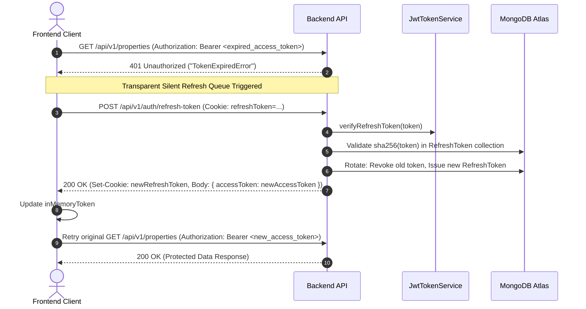

# RoomBae — Full-Stack Authentication, Multi-Step Signup & Onboarding System Architecture

This document serves as the exhaustive, production-grade specification for RoomBae's end-to-end **Authentication (AuthN)**, **Authorization (AuthZ)**, **Multi-Step Signup Wizard**, **KYC Onboarding**, **Session Management**, **Database Layer**, **System Design**, **Scalability**, **Resilience Fallbacks**, and **API Contracts**.

---

## 1. System Architecture Blueprint

RoomBae uses a **Zero-Trust, Microservice-Ready Architecture** built on TypeScript, React 18, Express, Prisma ORM, MongoDB Atlas, Redis, and Cloudinary.

```
┌────────────────────────────────────────────────────────────────────────────────────────┐
│                                 FRONTEND CLIENT (React 18 + Vite)                      │
│   - Multi-Step Registration Wizard (Zod + Framer Motion)                                │
│   - LocalStorage State Recovery Engine (`roombae_incomplete_signup`)                   │
│   - In-Memory Access Token Storage + Automatic 401 Silent Refresh Queue                │
│   - HTTP-Only Cookie Session Storage (Never accessible to JS / DOM)                   │
│   - Client-Side Device Fingerprinting (FingerprintJS Visitor ID)                       │
└───────────────────────────────────────────┬────────────────────────────────────────────┘
                                            │ HTTP / REST (/api/v1/auth/*)
                                            │ WebSocket (Socket.IO Real-Time Engine)
┌───────────────────────────────────────────▼────────────────────────────────────────────┐
│                             BACKEND API GATEWAY & CORE (Express 4 + TypeScript)         │
│   ├── Security Middleware: Helmet, CORS, HPP, XSS-Clean, Express-Mongo-Sanitize        │
│   ├── Distributed Rate Limiting: Atomic Redis Lua Script (`DistributedRedisStore`)    │
│   ├── Auth Guard Middleware: `authMiddleware.ts` + `tokenBlacklistService` (SHA-256)   │
│   ├── Route Cache Middleware: `cacheMiddleware.ts` (Non-blocking X-Cache telemetry)    │
│   └── Dependency Injection Container: `Container.authService`, `Container.tokenService`│
└───────────────────────┬───────────────────────────┬────────────────────────────────────┘
                        │                           │
         ┌──────────────▼──────────────┐   ┌────────▼────────────────┐
         │     MONGODB ATLAS (Prisma 6)│   │           REDIS (v6)    │
         │ - User & Profile Tables     │   │ - Route JSON Cache       │
         │ - RefreshToken Session Hash │   │ - Atomic Rate Limiters   │
         │ - Owner KYC & Bank Records  │   │ - SHA-256 Hashed OTPs    │
         │ - Device & Security Logs    │   │ - SHA-256 Token Blacklist│
         │ - Partial / Sparse Indexes  │   │ - Socket.IO Pub/Sub Bus  │
         └──────────────┬──────────────┘   └────────┬─────────────────┘
                        │                           │
                        └─────────────┬─────────────┘
                                      │
         ┌────────────────────────────▼─────────────────────────────┐
         │               EXTERNAL CLOUD INTEGRATIONS                │
         │ - Cloudinary: KYC Document & Avatar Storage (CDN)        │
         │ - Google OAuth 2.0: Single Sign-On (SSO)                 │
         │ - Nodemailer + Gmail OAuth2: Transactional Email OTP     │
         │ - Twilio / Mock SMS: Phone Number OTP Verification       │
         └──────────────────────────────────────────────────────────┘
```

---

## 2. Full-Stack Technology Stack

| Layer | Technologies & Libraries | Key Responsibilities |
| :--- | :--- | :--- |
| **Frontend UI** | React 18, TypeScript, Tailwind CSS, Lucide React, Framer Motion | Interactive multi-step wizard, responsive field validation, live age calculations, KYC drag-and-drop file uploaders |
| **Frontend State & Networking** | Custom `AuthService`, Native Fetch wrapper, LocalStorage draft engine | In-memory token management, transparent 401 retry queue, draft persistence |
| **Backend API** | Node.js (v20+), Express 4, TypeScript, Zod | Controller-Service-Repository architecture, request validation, cryptographic token handling |
| **Primary Database** | MongoDB Atlas, Prisma ORM (v6.19.3) | Relational modeling, partial/sparse indexes, atomic updates, audit event logs |
| **Cache & Real-Time** | Redis (v6), Socket.IO with Redis Adapter | Atomic rate limiting, sub-millisecond route caching, pub/sub multi-instance websocket sync |
| **Asset Storage** | Cloudinary SDK | Cloud storage for KYC Aadhaar, PAN, trade licenses, profile avatars |
| **Communication** | Twilio SMS API, Nodemailer with Gmail OAuth2 | Dual-channel OTP verification for Indian mobile numbers (`+91`) and email |

---

## 3. Multi-Step Signup & Onboarding Flow

```mermaid
sequenceDiagram
    autonumber
    actor User as User / Browser
    participant FE as React Frontend (Auth.tsx)
    participant LocalStore as Browser LocalStorage
    participant BE as Express Backend (/api/v1/auth)
    participant Redis as Redis Cache
    participant DB as MongoDB Atlas (Prisma)
    participant Cloudinary as Cloudinary CDN
    participant SMS as Twilio / Email Service

    Note over User,LocalStore: Step 1: Role Selection & Draft Init
    User->>FE: Select Role (RESIDENT or OWNER)
    FE->>LocalStore: Auto-save draft (roombae_incomplete_signup)

    Note over User,SMS: Step 2: Personal Info & Contact Verification
    User->>FE: Enter Name, DOB, Gender, City, Phone, Email, Password
    FE->>LocalStore: Debounce auto-save updated draft

    User->>FE: Click "Verify Phone"
    FE->>BE: POST /api/v1/auth/phone/send-otp (+91 Phone)
    BE->>Redis: SET otp:phone:<phone> sha256(otp) (EX 300s)
    BE->>SMS: Dispatch SMS OTP via Twilio
    SMS-->>User: 6-digit SMS Code received

    User->>FE: Submit 6-digit Phone OTP
    FE->>BE: POST /api/v1/auth/phone/verify-otp (phone, code)
    BE->>Redis: Compare stored sha256(otp) vs sha256(code)
    BE-->>FE: 200 OK (Phone Verified)
    FE->>FE: Render PhoneVerifiedBadge & Lock Input

    Note over User,Cloudinary: Step 3: KYC & Financial Onboarding
    alt Role == RESIDENT
        User->>FE: Upload Aadhaar Document & Signature
        FE->>Cloudinary: Upload File directly via signed upload preset
        Cloudinary-->>FE: Return Secure CDN URLs
        User->>FE: Enter Permanent Address & Emergency Contact
    else Role == OWNER
        User->>FE: Upload Aadhaar PDF, PAN PDF, Trade License
        FE->>Cloudinary: Upload Files via secure preset
        Cloudinary-->>FE: Return Secure CDN URLs
        User->>FE: Enter Bank Details (Account Number, IFSC, UPI ID)
    end
    FE->>LocalStore: Update complete draft with document URLs

    Note over User,DB: Step 4: Final Submission & Account Provisioning
    User->>FE: Accept Terms & Click "Complete Registration"
    FE->>BE: POST /api/v1/auth/register (Full Payload)
    BE->>BE: Hash password via Bcrypt (Cost 12)
    BE->>DB: Create User record + Profile (Owner/Resident)
    BE->>BE: Sign Access Token (15m) + Refresh Token (7d)
    BE->>DB: Store sha256(refreshToken) in RefreshToken collection
    BE->>Redis: Cache session metadata in refresh_token:<hash>
    BE-->>FE: 201 Created (Set-Cookie: refreshToken=...; HttpOnly; Secure, Body: { user, accessToken })
    FE->>LocalStore: Remove roombae_incomplete_signup draft
    FE->>User: Redirect to User Dashboard
```

### Detailed Wizard Steps Breakdown:

#### Step 1: Role Selection & OAuth Entrypoint
- **Account Type Selection:** User chooses their account role:
  - **`RESIDENT` (🏠 Resident):** Tenants seeking or occupying PG rooms/beds.
  - **`OWNER` (🏢 PG Owner):** Property managers, landlords, and hostel operators.
- **Alternative — Google OAuth 2.0 Single Sign-On:**
  - User clicks **"Continue with Google"**.
  - Initiates redirect to `GET /api/v1/auth/google?role=RESIDENT|OWNER`.
  - On callback, backend upserts user with `authProvider = "GOOGLE"`, marks `emailVerified = true`, and auto-creates their linked Owner or Resident profile.

#### Step 2: Personal Identity & Contact Verification
- **Demographic Fields:**
  - Full Name (validated against `^[a-zA-Z\s'.]+$`, minimum 2 chars)
  - Date of Birth (`dob`) with client-side live age calculation
  - Gender (`MALE`, `FEMALE`, `OTHER`)
  - Address (`City`, `State`, `Pincode` with 6-digit Indian PIN regex `/^\d{6}$/`)
- **Dual-Channel Verification:**
  - **Phone Number:** 10-digit Indian mobile number (`+91`).
    - Clicking **Verify** sends a 6-digit OTP via SMS (`POST /api/v1/auth/phone/send-otp`).
    - User enters code into modal (`POST /api/v1/auth/phone/verify-otp`).
    - Verified status locks the phone input and renders a `PhoneVerifiedBadge`.
  - **Email Address:** Standard RFC 5322 email string.
    - Transactional verification via Nodemailer (`POST /api/v1/auth/email/send-otp`).
    - User verifies via modal (`POST /api/v1/auth/email/verify-otp`).
- **Password Strength Contract:**
  - Minimum 8 characters, uppercase (`[A-Z]`), lowercase (`[a-z]`), digit (`[0-9]`), and special character (`[!@#$%^&*...]`).

#### Step 3: Role-Specific KYC & Financial Onboarding
- **For Residents (`RESIDENT`):**
  1. Aadhaar Document Upload (PDF or Image)
  2. Digital Signature Upload (Image scan for digital agreements)
  3. Permanent Address & Emergency Contact
- **For PG Owners (`OWNER`):**
  1. Aadhaar Scan (PDF)
  2. PAN Card Scan (PDF)
  3. Business Trade License / Property Tax Receipt (PDF)
  4. Settlement Bank Account Details (Encrypted Server-Side via AES-256-GCM):
     - Account Holder Name
     - Bank Name (e.g. HDFC, ICICI, SBI)
     - Account Number + Confirmation
     - IFSC Code (`/^[A-Z]{4}0[A-Z0-9]{6}$/`)
     - UPI ID (`owner@bank`)

---

## 4. Incomplete Signup Recovery Engine

To eliminate user drop-off from connectivity interruptions or accidental tab closures:

1. **Auto-Save Engine:**
   - Every keystroke and document upload in `Auth.tsx` is automatically debounced and persisted into `localStorage.setItem("roombae_incomplete_signup", JSON.stringify(draft))`.
2. **Draft Detection on Mount:**
   - When the user navigates to `/auth`, `useEffect` checks for `roombae_incomplete_signup`.
   - If an unsubmitted registration exists, a prominent **"Incomplete Signup Progress Found!"** banner appears.
3. **One-Click Actions:**
   - **Resume:** Restores role, wizard step, personal details, verified badges, uploaded Cloudinary file URLs, and bank info.
   - **Discard:** Purges the draft from `localStorage`.

---

## 5. Unified Login & Multi-Identifier Authentication

RoomBae provides a single, high-convenience login endpoint resolving multiple identifiers:

```mermaid
sequenceDiagram
    autonumber
    actor User as User / Client
    participant FE as Frontend AuthService
    participant BE as Backend AuthController
    participant Repo as AuthRepository
    participant DB as MongoDB Atlas
    participant Redis as Redis Cache

    User->>FE: Enter (Email, Phone, or Resident Code) + Password
    FE->>BE: POST /api/v1/auth/login { identifier, password, rememberMe, visitorId }
    BE->>Repo: findByIdentifier(identifier)
    Repo->>DB: Query User where email/phone/residentCode equals identifier
    DB-->>BE: User Document
    BE->>BE: Bcrypt.compare(password, user.passwordHash)
    
    alt Password Invalid
        BE-->>FE: 401 Unauthorized ("Invalid credentials")
    else Password Valid
        BE->>BE: Sign Access Token (15m) + Refresh Token (7d / 30d)
        BE->>DB: Store sha256(refreshToken) in RefreshToken collection
        BE->>Redis: Cache session in refresh_token:<hash>
        BE-->>FE: 200 OK (Set-Cookie: refreshToken=...; HttpOnly; Secure, Body: { user, accessToken })
        FE->>FE: Store accessToken in memory + Initialize Socket.IO connection
        FE->>User: Route to Dashboard
    end
```

### 1. Multi-Identifier Resolution
[`AuthRepository.findByIdentifier`](file:///c:/Users/GLB-BLR-191/Downloads/New%20folder/PG-Management-System/backend/src/modules/auth/auth.repository.ts#L18) executes a case-insensitive lookup across:
- **Email:** `user@domain.com`
- **10-Digit Mobile Phone:** `9876543210` or `+919876543210`
- **Resident Code:** `RES-BLR-1042`

### 2. Device Security & Fingerprinting
- Client passes `X-Visitor-Id` header (generated via FingerprintJS).
- Backend evaluates device trust in `UserDevice` collection:
  - `TRUSTED`: Standard login flow.
  - `NEW`: Logs security audit event, records first-seen IP and User-Agent.
  - `BLOCKED`: Rejects login with `403 Forbidden`.

---

## 6. Frontend Token Lifecycle & Silent 401 Refresh Queue

To prevent token theft via XSS, access tokens are kept **strictly in-memory** by the React client, while refresh tokens are stored in **HTTP-Only Cookies**.



---

## 7. Database Layer Architecture

RoomBae uses **MongoDB Atlas** as the primary persistent database and **Redis** for sub-millisecond caching and security primitives.

### MongoDB Atlas Collections (Prisma Schema)

```prisma
model User {
  id                 String          @id @default(auto()) @map("_id") @db.ObjectId
  email              String          @unique
  passwordHash       String?
  name               String
  residentCode       String?
  googleSubId        String?         
  avatarUrl          String?
  role               Role            @default(PUBLIC)
  phone              String?
  phoneVerified      Boolean         @default(false)
  emailVerified      Boolean         @default(false)
  accountStatus      String          @default("ACTIVE")
  tokenVersion       Int             @default(0)
  createdAt          DateTime        @default(now())
  updatedAt          DateTime        @updatedAt
  ownerProfile       Owner?
  residentProfile    Resident?
  refreshTokens      RefreshToken[]
  userDevices        UserDevice[]
  securityAuditEvents SecurityAuditEvent[]

  @@index([residentCode])
  @@index([phone])
}

model RefreshToken {
  id        String    @id @default(auto()) @map("_id") @db.ObjectId
  userId    String    @db.ObjectId
  user      User      @relation(fields: [userId], references: [id])
  tokenHash String    @unique
  expiresAt DateTime
  createdAt DateTime  @default(now())
  revokedAt DateTime?
  ipAddress String?
  userAgent String?

  @@index([userId])
}

model OtpToken {
  id        String   @id @default(auto()) @map("_id") @db.ObjectId
  phone     String?
  email     String?
  otp       String   // SHA-256 hashed
  purpose   String   // PHONE_VERIFICATION, EMAIL_VERIFICATION, PASSWORD_RESET
  attempts  Int      @default(0)
  verified  Boolean  @default(false)
  expiresAt DateTime
  createdAt DateTime @default(now())
}
```

### Redis Key Namespace & TTL Table

| Prefix | Type | Key Template | TTL | Purpose |
| :--- | :--- | :--- | :--- | :--- |
| `rl:` | String (Counter) | `rl:<limiter_name>:<ip>` | 60s – 3600s | Atomic distributed rate limiter |
| `otp:` | String (Hash) | `otp:<type>:<target>` | 300s | SHA-256 hashed OTPs |
| `otp:...:attempts` | String (Counter) | `otp:<type>:<target>:attempts` | 600s | Throttles failed OTP attempts (max 5) |
| `jwt:blacklist:` | String | `jwt:blacklist:<sha256(token)>` | Dynamic (`exp - now`) | Revoked access tokens on logout |
| `refresh_token:` | String (JSON) | `refresh_token:<sha256(token)>` | 7d – 30d | Fast active session metadata cache |
| `route:` | String (JSON) | `route:<scope>:<url>` | 60s – 300s | HTTP GET route response cache |
| `lock:` | String | `lock:<cache_key>` | 5s (PX 5000) | Cache stampede distributed mutex |

---

## 8. High-Availability, Scalability & System Design

```
                     ┌───────────────────────────────┐
                     │    Cloudflare / Render CDN    │
                     │   (SSL / DDoS / Edge Cache)   │
                     └───────────────┬───────────────┘
                                     │
                     ┌───────────────▼───────────────┐
                     │     Load Balancer / Nginx     │
                     └───────┬───────────────┬───────┘
                             │               │
            ┌────────────────▼───┐       ┌───▼────────────────┐
            │  Node.js Instance  │       │  Node.js Instance  │
            │  (Cluster Worker 1)│       │  (Cluster Worker 2)│
            └────────┬───────────┘       └───────────┬────────┘
                     │                               │
                     │   Socket.IO Redis Pub/Sub Bus │
                     │◄─────────────────────────────►│
                     │                               │
            ┌────────▼───────────────────────────────▼────────┐
            │             Managed Redis Cluster               │
            │     (Rate Limits, Caching, Token Blacklist)     │
            └────────────────────────┬────────────────────────┘
                                     │
            ┌────────────────────────▼────────────────────────┐
            │              MongoDB Atlas Replica Set          │
            │          (Primary + Secondary Replicas)         │
            └─────────────────────────────────────────────────┘
```

1. **Horizontal WebSocket Scaling:**
   - Socket.IO uses `@socket.io/redis-adapter` with duplicate Pub/Sub clients (`pubClient`, `subClient`) to broadcast real-time events across multiple server nodes seamlessly.
2. **Node.js Cluster Mode Support:**
   - [`backend/src/cluster.ts`](file:///c:/Users/GLB-BLR-191/Downloads/New%20folder/PG-Management-System/backend/src/cluster.ts) automatically forks workers across all available CPU cores.
3. **HTTP Connection Pooling:**
   - Standard keep-alive timeouts (`keepAliveTimeout = 65000ms`, `headersTimeout = 66000ms`) prevent socket churn behind reverse proxies.

---

## 9. Fault Tolerance & Fallback Matrix

```
┌───────────────────────┬───────────────────────────────────┬──────────────────────────────────────────┐
│ Component Failure     │ Fallback Mechanism                │ Behavior & Impact                        │
├───────────────────────┼───────────────────────────────────┼──────────────────────────────────────────┤
│ **Redis Down (Dev)**  │ In-Memory Map Fallback            │ `CacheService` and `DistributedRedisStore`│
│ (`REDIS_REQUIRED=0`)  │ (`cache.service.ts`)              │ operate in memory. Zero-setup developer  │
│                       │                                   │ experience.                              │
├───────────────────────┼───────────────────────────────────┼──────────────────────────────────────────┤
│ **Redis Down (Prod)** │ Fail-Closed Rate Limiter          │ Rate limiters throttle (fail closed) to  │
│ (`REDIS_REQUIRED=1`)  │ + MongoDB OTP Storage             │ protect backend; OTPs route to MongoDB   │
│                       │                                   │ `OtpToken` collection automatically.     │
├───────────────────────┼───────────────────────────────────┼──────────────────────────────────────────┤
│ **SMS API Outage**    │ Email OTP Fallback                │ If Twilio fails or phone is on trial,    │
│                       │ (`RedisOtpService.ts`)            │ OTP is dispatched to email on record.    │
├───────────────────────┼───────────────────────────────────┼──────────────────────────────────────────┤
│ **Client Disconnect** │ LocalStorage Draft Engine         │ Incomplete signup restored in 1-click on │
│                       │ (`roombae_incomplete_signup`)     │ next browser launch.                     │
└───────────────────────┴───────────────────────────────────┴──────────────────────────────────────────┘
```

---

## 10. API Specifications & Payload Contracts

All routes are prefixed with `/api/v1/auth`:

### 1. `POST /api/v1/auth/register`
- **Access Level:** Public
- **Request Body:**
  ```json
  {
    "name": "Ayushman Sharma",
    "email": "ayushman@example.com",
    "password": "SecurePassword@123",
    "role": "OWNER",
    "phone": "9876543210",
    "residentCode": null
  }
  ```
- **Response (`201 Created`):**
  - **Header:** `Set-Cookie: refreshToken=<token>; HttpOnly; Secure; SameSite=Lax; Max-Age=604800`
  - **Body:**
    ```json
    {
      "success": true,
      "message": "User registered successfully",
      "data": {
        "user": {
          "id": "67b5...",
          "name": "Ayushman Sharma",
          "email": "ayushman@example.com",
          "role": "OWNER",
          "phone": "9876543210"
        },
        "accessToken": "eyJhbGciOiJIUzI1NiIsInR5cCI6..."
      }
    }
    ```

### 2. `POST /api/v1/auth/login`
- **Access Level:** Public
- **Request Body:**
  ```json
  {
    "identifier": "ayushman@example.com",
    "password": "SecurePassword@123",
    "rememberMe": true,
    "visitorId": "fp_8a2d..."
  }
  ```
- **Response (`200 OK`):**
  - **Header:** `Set-Cookie: refreshToken=<token>; HttpOnly; Secure; SameSite=Lax; Max-Age=2592000`
  - **Body:**
    ```json
    {
      "success": true,
      "message": "Login successful",
      "data": {
        "user": {
          "id": "67b5...",
          "name": "Ayushman Sharma",
          "email": "ayushman@example.com",
          "role": "OWNER"
        },
        "accessToken": "eyJhbGciOiJIUzI1NiIsInR5cCI6..."
      }
    }
    ```

### 3. `POST /api/v1/auth/refresh-token`
- **Access Level:** Public (Requires `refreshToken` Cookie)
- **Response (`200 OK`):**
  - **Header:** `Set-Cookie: refreshToken=<new_token>; HttpOnly; Secure; SameSite=Lax`
  - **Body:**
    ```json
    {
      "success": true,
      "message": "Access token refreshed and rotated",
      "data": {
        "accessToken": "eyJhbGciOiJIUzI1NiIsInR5cCI6..."
      }
    }
    ```

### 4. `POST /api/v1/auth/logout`
- **Access Level:** Public (Requires Bearer token or Refresh Cookie)
- **Response (`200 OK`):**
  - **Header:** `Set-Cookie: refreshToken=; Max-Age=0; HttpOnly`
  - **Body:**
    ```json
    {
      "success": true,
      "message": "Logged out successfully"
    }
    ```

---

## 11. Security & Cryptography Standards

1. **Field-Level Encryption (AES-256-GCM):**
   - Bank account numbers, IFSC codes, Aadhaar, and PAN numbers are encrypted at rest using AES-256-GCM with dynamic initialization vectors (`iv:authTag:ciphertext`).
2. **Password Hashing:**
   - Passwords are hashed with **Bcrypt** (cost factor 12) or **Argon2id**.
3. **Secret Token Hashing:**
   - Refresh tokens and OTPs are **never stored raw in any database or cache**. Only `sha256(token)` is persisted.
4. **Header Security:**
   - `Helmet` sets strict HTTP headers (`X-Frame-Options: DENY`, `X-Content-Type-Options: nosniff`, `Strict-Transport-Security`).
   - `CORS` enforces strict whitelist validation.
