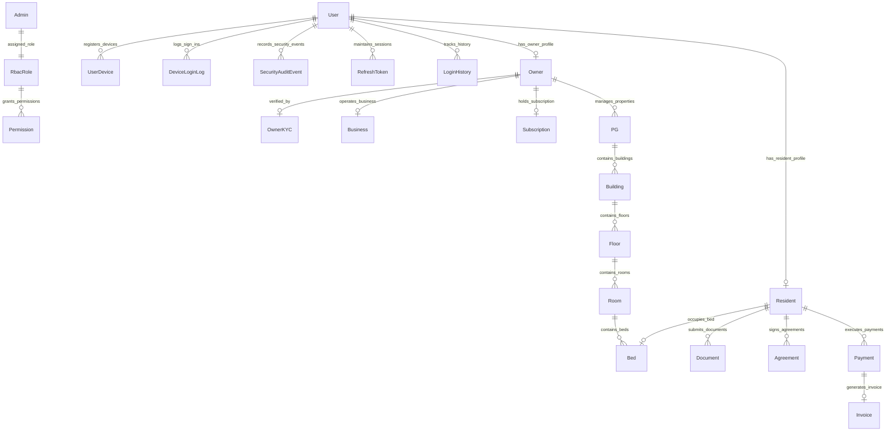

# RoomBae — Master Architecture & Complete Sign-Up & Sign-In Specification

This document is the definitive, production-grade technical specification for RoomBae's end-to-end **Authentication (AuthN)**, **Authorization (AuthZ)**, **Multi-Role Sign-In Flows**, **Multi-Step Sign-Up & Onboarding Wizards**, **Device Intelligence & FingerprintJS Alert Lifecycle**, **CORS & Gateway Middleware Pipeline**, **Database Architecture (MongoDB Atlas + Prisma ORM)**, and **UI Component & Button Action Matrix**.

---

# 1. Full-Stack Architecture, Server Layer & Network Protocols

RoomBae is built as an enterprise, zero-trust, distributed web platform engineered with **React 19**, **TypeScript 5**, **Express 4**, **Prisma ORM 6.19.3**, **MongoDB Atlas**, **Socket.IO v4.8.3**, **Cloudinary CDN**, **Twilio SMS**, and **Razorpay**.

```text
┌───────────────────────────────────────────────────────────────────────────────────────────────────────────────────┐
│                                       FRONTEND CLIENT (React 19 + Vite 8 + Tailwind CSS)                           │
│  ├── UI Shell: Dark/Light Theme Provider, Responsive Breakpoints, Custom Micro-Animations (Framer Motion v12)    │
│  ├── Auth Views: Unified Sign-In & Multi-Step Registration Portal (/auth), Resident Onboarding (/resident-register)│
│  ├── Device Telemetry: @fingerprintjs/fingerprintjs v5.2.0 (Canvas, WebGL, Audio, Screen Resolution, Hardware)    │
│  ├── Alert Modal: NewDeviceNotificationModal.tsx (Live IP, Region, Device, Resolution Telemetry, Accept/Deny)    │
│  ├── State & Networking: Zustand v5 Stores (useAuthStore, useUIStore) + Custom Fetch ApiClient Wrapper            │
│  ├── Dynamic Chunk Resilience: vite:preloadError & lazyWithRetry auto-reload listeners for deployment updates     │
│  └── Session Management: In-Memory RS256 Access Token + HttpOnly SameSite=None Secure Refresh Cookie              │
└────────────────────────────────────────────────────────┬──────────────────────────────────────────────────────────┘
                                                         │
                             HTTPS / REST (HTTP/2)       │ WebSocket (WSS)
                             JSON-RPC API Payloads       │ Real-Time Duplex / Live Eviction
                                                         │
┌────────────────────────────────────────────────────────▼──────────────────────────────────────────────────────────┐
│                               API GATEWAY & BACKEND SERVER (Node.js v20 + Express 4)                              │
│  ├── Trust Proxy: app.set("trust proxy", 1) for accurate client IP detection behind Render / Cloudflare CDN       │
│  ├── Dynamic CORS Shield: corsOrigins.ts with wildcard regex for *.onrender.com, *.github.io, *.vercel.app      │
│  ├── Security Stack: Helmet v8 (HSTS, CSP), Mongo-Sanitize, XSS Protection, JSON Body Parsers (10mb)             │
│  ├── Correlation & Tracing: correlationIdMiddleware (x-correlation-id, x-request-id)                             │
│  ├── CSRF Double Submit: csrfMiddleware validating x-csrf-token header against non-httpOnly cookie                │
│  ├── Service Discovery & Health: GET /api/v1 (Service Directory), GET /api/v1/health, GET /health                 │
│  ├── Interactive Documentation: Swagger UI mounted at /api/docs, /api/v1/docs, /api/docs.json                     │
│  ├── Public Cryptographic JWKS: GET /.well-known/jwks.json exposing active RSA public keys (RS256)                 │
│  ├── ERP Billing Interface: SOAP 1.2 XML WSDL Billing Service (/soap/billing?wsdl)                                 │
│  ├── Rate Limiters: Tiered express-rate-limit (loginLimiter: 5 req/15min, registerLimiter: 5 req/1hr, OTP: 3/10m)│
│  ├── Risk Engine: Multi-signal scoring with safe thresholds (Never hard-blocks legitimate credentials)            │
│  ├── Device Security Engine: Salted SHA-256 fingerprint hashing, idempotent upserts, pending alert log generator │
│  ├── Transactional Outbox: Event bus for asynchronous email alerts, SMS dispatch, and audit logging               │
│  └── Real-Time Pub/Sub: Socket.IO Server with per-packet token verification & immediate live session eviction     │
└────────────────────────────────────────────┬──────────────────────────────────┬───────────────────────────────────┘
                                             │                                  │
                      ┌──────────────────────▼──────┐                   ┌───────▼─────────────────────┐
                      │    MONGODB ATLAS (Replica)  │                   │     IN-MEMORY CACHE ENGINE  │
                      │   Prisma Client ORM 6.19.3  │                   │  Fast Key-Value Storage     │
                      ├─────────────────────────────┤                   ├─────────────────────────────┤
                      │ • User (Accounts & Roles)   │                   │ • Route Cache & Blacklist   │
                      │ • Admin & RbacRole Matrix   │                   │ • Active Session Tokens     │
                      │ • Owner & Resident Profiles │                   │ • Pre-Auth Step-Up Tokens   │
                      │ • UserDevice & DeviceLogin  │                   │ • Sliding-Window Rate Limits│
                      │ • RefreshToken & Families   │                   │ • Idempotency Replay Store  │
                      │ • SecurityAuditEvent        │                   │ • Token Version In-Memory   │
                      │ • PG, Room, Bed Hierarchy   │                   │ • Socket.IO Cluster Hub     │
                      │ • Agreement, Invoice, Pay   │                   │ • Temporary Hold Mutexes    │
                      └──────────────┬──────────────┘                   └──────────────┬──────────────┘
                                     │                                                 │
                                     └────────────────────────┬────────────────────────┘
                                                              │
                                 ┌────────────────────────────▼─────────────────────────────┐
                                 │             EXTERNAL CLOUD PLATFORMS & APIS              │
                                 ├──────────────────────────────────────────────────────────┤
                                 │ • Cloudinary CDN: Direct signed media & KYC storage      │
                                 │ • Twilio SMS API: Multi-factor phone OTP SMS delivery    │
                                 │ • Gmail / SMTP: New device alerts, OTPs, invoices        │
                                 │ • Razorpay Gateway: Payment orders & webhook HMAC verify │
                                 │ • Google Cloud OAuth 2.0: Single Sign-On authentication  │
                                 └──────────────────────────────────────────────────────────┘
```

---

# 2. CORS, Security Middleware & Gateway Pipeline

All incoming HTTP requests pass through an ordered, 11-stage middleware pipeline before invoking controller handlers:

```text
Incoming HTTP/HTTPS Request
  │
  ├─► 1. Trust Proxy (app.set("trust proxy", 1))
  │      Extracts client IP from x-forwarded-for headers across edge proxies (Render, Cloudflare).
  │
  ├─► 2. Security Headers (helmet())
  │      Enforces HSTS, X-Content-Type-Options: nosniff, FrameGuard, Referrer-Policy, and CSP.
  │
  ├─► 3. Dynamic CORS Shield (cors(corsOptions))
  │      Validates Origin header against:
  │      • Localhost ports: http://localhost:5173, http://localhost:3000, http://127.0.0.1:*
  │      • Production subdomains via regex: *.onrender.com, *.github.io, *.vercel.app, *.netlify.app
  │      • Configured environment origins: CLIENT_URL, FRONTEND_URL, CORS_ALLOWED_ORIGINS
  │      • Headers allowed: Content-Type, Authorization, X-Visitor-Id, X-Correlation-ID, X-CSRF-Token, Idempotency-Key
  │      • Credentials enabled: credentials: true (permits Set-Cookie and Cookie transmission).
  │
  ├─► 4. Tiered Rate Limiters
  │      • loginLimiter: 5 attempts per 15 minutes per IP
  │      • registerLimiter: 5 registrations per 1 hour per IP
  │      • sendOtpLimiter: 3 requests per 10 minutes per IP
  │      • verifyOtpLimiter: 10 attempts per 15 minutes per IP
  │      • generalLimiter: 300 requests per 15 minutes per IP
  │
  ├─► 5. Parsers & Sanitizers (express.json({ limit: "10mb" }), mongoSanitize(), cookieParser())
  │      Parses JSON payloads, parses HTTP cookies, and strips $, . characters to prevent NoSQL injection.
  │
  ├─► 6. Distributed Tracing (correlationIdMiddleware)
  │      Generates or propagates x-correlation-id and x-request-id across request logs and response headers.
  │
  ├─► 7. CSRF Double-Submit Guard (csrfMiddleware)
  │      Validates x-csrf-token header against the non-httpOnly csrf-token cookie on state-changing methods (POST, PUT, PATCH, DELETE).
  │
  ├─► 8. Tenant & Routing Dispatcher (app.use('/api/v1', apiRouter))
  │      Attaches tenant metadata and routes requests to modular feature routers.
  │
  ├─► 9. Authentication Guard (authMiddleware / authenticate)
  │      Verifies RS256 JWT access token, checks tokenVersion against MongoDB/Cache, validates blacklist, and attaches req.user.
  │
  ├─► 10. Authorization Guard (roleGuard / requireRole)
  │       Verifies user role (SUPER_ADMIN, ADMIN, OWNER, MANAGER, STAFF, RESIDENT) matches endpoint access controls.
  │
  └─► 11. Global Error Handler (errorHandler / catchAsync)
          Catches AppError, Prisma P2002 duplicate key conflicts (409), Zod validation errors (400), and unhandled exceptions (500).
```

---

# 3. Role-by-Role Deep Dive: Complete In-and-Out Breakdown

RoomBae supports **7 distinct roles** across its identity and access management hierarchy. Each role possesses specialized registration paths, login identifiers, verification protocols, security requirements, and destination portals.

| Role | Description & Scope | Sign-Up Method | Primary Login Identifiers | Post-Login Destination |
| :--- | :--- | :--- | :--- | :--- |
| **SUPER_ADMIN** | Platform owner with complete root control over platform configuration, database backups, audit logs, and global encryption rotation. | CLI Seed / Direct DB Provisioning | Email (`admin@roombae.com`) | `/admin-console` |
| **ADMIN** | Platform operations manager managing PG properties, owner verifications, tenant compliance, dispute resolutions, and KYC approvals. | Seed / Super Admin RBAC Assignment | Admin Email | `/admin-console` |
| **OWNER** | PG property owner / landlord who manages properties, rooms, beds, staff, pricing, tenant agreements, and bank settlements. | Self-Service Multi-Step Wizard or Google SSO | Business Email, Mobile Phone (+91) | `/dashboard` |
| **MANAGER** | Property manager appointed by an Owner to oversee daily check-ins, attendance, maintenance complaints, and staff task assignments. | Owner-Issued Staff Invitation | Email, Mobile Phone (+91) | `/dashboard` (Scoped) |
| **STAFF** | Facility staff (housekeeping, security, maintenance, cook) handling assigned maintenance tickets and visitor logs. | Owner-Issued Staff Invitation | Staff Mobile Phone, Email | `/dashboard` (Task Scoped) |
| **RESIDENT** | Student or working professional residing in a PG. Manages bed booking, rent payments, digital agreements, leave passes, and maintenance tickets. | Quick 3-Step Wizard, Full 7-Step Onboarding, or Google SSO | Email, Mobile Phone (+91), Resident Code (`RES-2024-001`) | `/resident-portal` |
| **PUBLIC** | Unauthenticated guest exploring public PG listings, amenities, rules, room pricing, and scheduling property visits/tours. | Anonymous / Guest Session | N/A (Browsing) | `/landing`, `/properties` |

---

## 3.1 SUPER_ADMIN Role

### A. Profile & Security Scope
- **Scope**: Platform-level master control. Universal read/write over all databases, encryption key rotations, security audit events, and tenant data.
- **2FA Requirement**: Mandatory Two-Factor Authentication (TOTP or Email OTP).
- **Session Duration**: 1 hour access token; refresh token bound to hardware fingerprint.

### B. Sign-Up & Provisioning Flow
- **Self-service registration disabled**: Super Admins cannot be created via public sign-up endpoints.
- **Provisioning**: Created via secure initialization seed script `backend/prisma/seed.ts` or database migration with pre-hashed Bcrypt 12 password.
- **Prisma Entity**: `User` (`role: SUPER_ADMIN`, `accountStatus: ACTIVE`, `verificationStatus: VERIFIED`, `emailVerified: true`, `phoneVerified: true`) + `Admin` record linked to `RbacRole` with universal permissions.

### C. Sign-In Flow
1. Super Admin navigates to `/auth` and selects the **Admin** tab.
2. Inputs Admin Email and Master Password.
3. Frontend captures hardware fingerprint (`visitorId`) and screen telemetry via `@fingerprintjs/fingerprintjs`.
4. Dispatches `POST /api/v1/auth/login` with `X-Visitor-Id` and `X-CSRF-Token` headers.
5. Backend verifies password hash, evaluates risk score (`RiskEngine`), checks 2FA requirement.
6. Returns `requiresTwoFactor: true` with a short-lived `preAuthToken` (5-minute TTL).
7. Super Admin enters 6-digit TOTP / OTP code via `POST /api/v1/auth/2fa/verify`.
8. Backend issues RS256 JWT access token and sets `refreshToken` HttpOnly cookie.
9. Frontend router redirects Super Admin to `/admin-console`.

---

## 3.2 ADMIN Role

### A. Profile & Security Scope
- **Scope**: Operational platform administration. Approves Owner KYC, audits property listings, resolves resident complaints, inspects billing disputes, and generates platform analytics.
- **2FA Requirement**: Enforced on high-risk logins or by policy.

### B. Sign-Up & Provisioning Flow
- **Provisioning**: Created by Super Admin through `/api/v1/admin/users` or initial setup scripts.
- **Prisma Entity**: `User` (`role: ADMIN`) linked to `Admin` and assigned specific `Permission` IDs in `RbacRole`.

### C. Sign-In Flow
1. Navigates to `/auth` -> **Admin** tab.
2. Enters Admin Email and Password.
3. Submits `POST /api/v1/auth/login`.
4. Passes device and risk evaluation.
5. Receives RS256 JWT access token and HttpOnly refresh cookie.
6. Frontend updates `useAuthStore` and redirects to `/admin-console`.

---

## 3.3 PG OWNER Role

### A. Profile & Security Scope
- **Scope**: Complete ownership of their PG facilities, staff accounts, room configurations, pricing, resident leases, and revenue analytics.
- **Security**: AES-256 encrypted banking records, automated new device login alerts, and phone/email verification.

### B. Sign-Up Flow (Two Pathways)

#### Pathway 1: Quick 3-Step Wizard (`/auth`)
1. **Step 1: Role Selection**: Owner selects **"PG Owner"** (`role: OWNER`).
2. **Step 2: Personal & Contact Details**: Enters Full Name, Business Email, 10-Digit Mobile Number, and strong password (min 8 chars, 3 of upper/lower/digit/special).
   - Click `[ Verify Phone ]` -> sends SMS OTP via Twilio (`POST /api/v1/auth/send-phone-otp`).
   - Click `[ Verify Email ]` -> sends 6-digit code via SMTP (`POST /api/v1/auth/email/send-otp`).
3. **Step 3: Document & Business Info**: Uploads Aadhaar PDF, PAN PDF, and enters Encrypted Bank Details (Account Number, IFSC, UPI ID).
4. Submits `POST /api/v1/auth/register` (`role: OWNER`).
5. Backend creates `User` (`role: OWNER`), initializes `Owner` profile, and issues JWT tokens.
6. Auto-redirects to `/dashboard`.

#### Pathway 2: Full 7-Step Owner Onboarding
```text
Step 1: Credentials (Name, Email, Mobile, Password)
  │
  ▼
Step 2: Multi-Factor OTP (SMS & Email Verification)
  │
  ▼
Step 3: Business & Bank Details (GSTIN, PAN, Bank AES-256, IFSC, UPI)
  │
  ▼
Step 4: Owner KYC Submission (Aadhaar, PAN, Owner Selfie via Cloudinary)
  │
  ▼
Step 5: Property Setup (PG Name, Address, Amenities, Rules, Photos)
  │
  ▼
Step 6: Building & Room Hierarchy (Floors, Rooms, Sharing Type, Beds)
  │
  ▼
Step 7: Subscription Plan (STARTER, PROFESSIONAL, ENTERPRISE via Razorpay)
  │
  ▼
Activation & Redirect to /dashboard
```

### C. Sign-In Flow
1. Navigates to `/auth` -> **PG Owner** tab.
2. Enters Business Email or 10-digit Mobile Phone and Password.
3. Dispatches `POST /api/v1/auth/login`.
4. Backend matches identifier via `userRepository.findByIdentifier(loginId)`.
5. Compares password hash (Bcrypt 12).
6. Executes `RiskEngine.evaluateLoginRisk()` and `deviceService.identifyAndEvaluateDevice()`.
7. If new device detected -> `requiresAlert: true`, sends email alert to Owner.
8. Returns 200 OK with `user`, `accessToken`, and `deviceSecurity`.
9. If `requiresAlert === true`, opens `NewDeviceNotificationModal.tsx`.
10. Routes Owner directly to `/dashboard`.

---

## 3.4 MANAGER Role

### A. Profile & Security Scope
- **Scope**: Scoped management access assigned by PG Owner. Handles resident check-ins/check-outs, daily attendance logs, food menus, visitor approvals, and resident maintenance tickets for assigned properties.
- **Restrictions**: Cannot view Owner bank credentials, cannot alter platform subscriptions, cannot delete PG properties.

### B. Sign-Up & Provisioning Flow
1. PG Owner adds Manager from `/dashboard` -> **Staff Management** (`POST /api/v1/owners/staff`).
2. Inputs Manager Name, Email, Mobile Phone, and Property Assignment.
3. Backend creates `User` (`role: MANAGER`, `accountStatus: ACTIVE`), sets temporary secure password, and sends welcome invite email/SMS.
4. Manager receives invitation link containing temporary activation credentials.

### C. Sign-In Flow
1. Navigates to `/auth` -> **PG Owner / Staff** tab.
2. Enters Email or Phone and Password.
3. Submits `POST /api/v1/auth/login`.
4. If first-time login with temporary password, system prompts for immediate password change (`POST /api/v1/auth/password/verify`).
5. On success, receives JWT and refresh cookie.
6. Frontend navigates to `/dashboard` with manager-level permissions applied.

---

## 3.5 STAFF Role

### A. Profile & Security Scope
- **Scope**: Task-based operational access for facility personnel (Housekeeping, Security Guard, Maintenance Plumber/Electrician, Kitchen Staff).
- **Permissions**: View assigned maintenance tickets, update cleaning schedules, scan visitor QR passes, log incoming parcels.

### B. Sign-Up & Provisioning Flow
1. PG Owner or Manager registers Staff member via `/api/v1/owners/staff` (`role: STAFF`).
2. Enters Name, Mobile Number, Staff Department (HOUSEKEEPING, SECURITY, MAINTENANCE, COOK).
3. Backend provisions `User` (`role: STAFF`) and dispatches login credentials via SMS OTP.

### C. Sign-In Flow
1. Navigates to `/auth` -> Enters registered Mobile Phone and Password/SMS OTP.
2. Submits `POST /api/v1/auth/login`.
3. Backend validates credentials, records `LoginHistory`, evaluates device.
4. Navigates to scoped task view at `/dashboard`.

---

## 3.6 RESIDENT Role

### A. Profile & Security Scope
- **Scope**: Personal tenant portal for PG residents. View room & bed details, sign digital tenancy contracts, pay monthly rent & security deposits via Razorpay, log maintenance complaints, request leave passes, and log food preferences.
- **Identifier Flexibility**: Can log in using Email, Mobile Phone (+91), or unique assigned `residentCode` (e.g. `RES-2024-001`).

### B. Sign-Up Flow (Two Pathways)

#### Pathway 1: Quick 3-Step Wizard (`/auth`)
1. **Step 1: Role Selection**: Selects **"Resident"** (`role: RESIDENT`).
2. **Step 2: Personal Details & Dual Verification**:
   - Enters Full Name, Email, 10-Digit Mobile, Gender, Date of Birth, City, State, Pincode.
   - Sets Password & Confirms Password.
   - Dual OTP Verification:
     - Phone SMS OTP verified via Twilio (`POST /api/v1/auth/verify-phone-otp`).
     - Email 6-Digit OTP verified via SMTP (`POST /api/v1/auth/email/verify-otp`).
3. **Step 3: Identity & Address Details**:
   - Uploads Aadhaar Card (PDF/Image) via signed Cloudinary CDN URL (`POST /api/v1/upload/sign-upload`).
   - Uploads Digital Signature image / stroke data.
   - Enters Permanent Address and Landmark.
4. Submits `POST /api/v1/auth/register` (`role: RESIDENT`).
5. Backend creates `User` (`role: RESIDENT`), creates linked `Resident` entity, sets `verificationStatus: VERIFIED`.
6. Issues RS256 JWT access token and HttpOnly refresh cookie; auto-redirects to `/resident-portal`.

#### Pathway 2: Full 7-Step Resident Onboarding (`/resident-register`)
```text
Step 1: Account Credentials (Name, Email, Mobile, Password, Emergency Contact)
  │
  ▼
Step 2: Identity Documents (Aadhaar, PAN, College/Work ID via Cloudinary)
  │
  ▼
Step 3: Address & Guardian Information (Permanent Address, Guardian Phone)
  │
  ▼
Step 4: Bed & Property Selection (PG Selection, Floor, Room, Bed Mutex Hold)
  │
  ▼
Step 5: Preferences & Food Menu (Veg/Non-Veg/Jain, Parking Requirements)
  │
  ▼
Step 6: Digital Tenancy Agreement (11-Month Contract, SVG Canvas E-Signature)
  │
  ▼
Step 7: Rent & Deposit Payment (₹14,500 + 18% GST Rent + ₹29,000 Deposit via Razorpay)
  │
  ▼
Bed Status Marked OCCUPIED & Resident Status Marked ACTIVE -> Redirect to /resident-portal
```

### C. Sign-In Flow
1. Navigates to `/auth` -> **Resident** tab.
2. Enters Email, 10-Digit Mobile Number, or **Resident Code** (`residentCode`, e.g. `RES-2024-001`) and Password.
3. Submits `POST /api/v1/auth/login`.
4. Backend `findByIdentifier` executes multi-field lookup:
   ```typescript
   // Handles email, raw phone, +91 prefixed phone, or residentCode
   where: {
     OR: [
       { email: cleanId },
       { phone: cleanId },
       { phone: `+91${cleanId}` },
       { residentCode: cleanId }
     ]
   }
   ```
5. Backend verifies password, records `LoginHistory`, checks device status.
6. Returns `user` object with `role: RESIDENT`, `residentCode`, `accessToken`, and `deviceSecurity`.
7. Frontend updates `useAuthStore` and redirects to `/resident-portal`.

---

## 3.7 PUBLIC (Guest) Role

### A. Profile & Security Scope
- **Scope**: Unauthenticated visitors browsing the public website.
- **Allowed Actions**: Search PG properties by city/pincode, view virtual 3D room tours, browse amenities, check public rent pricing, submit visitor contact forms, book property walk-through tours (`POST /api/v1/tours`).
- **Protected Actions**: Cannot book beds, cannot access tenant dashboards, cannot access billing without signing up.

---

# 4. Universal Sign-In Flow & Authentication State Machine

The unified Sign-In system guarantees high-security authentication across all platform roles with behavioral risk scoring, 2FA step-up challenges, device fingerprinting, and account lockout protection.

```text
                           ┌────────────────────────────────────────────────┐
                           │          USER NAVIGATES TO /auth (Sign In)     │
                           └───────────────────────┬────────────────────────┘
                                                   │
                   ┌───────────────────────────────┼───────────────────────────────┐
                   │                               │                               │
        ┌──────────▼──────────┐         ┌──────────▼──────────┐         ┌──────────▼──────────┐
        │   PG OWNER SIGN IN  │         │   RESIDENT SIGN IN  │         │    ADMIN SIGN IN    │
        │ • Business Email/Ph │         │ • Code/Email/Mobile │         │ • Admin Email       │
        │ • Password          │         │ • Password          │         │ • Admin Password    │
        └──────────┬──────────┘         └──────────┬──────────┘         └──────────┬──────────┘
                   │                               │                               │
                   └───────────────────────────────┼───────────────────────────────┘
                                                   │
                                     [ CLICK: "Sign In to RoomBae" ]
                                                   │
                                                   ▼
                                 Frontend Collects Device Telemetry:
                              • @fingerprintjs/fingerprintjs (visitorId)
                              • Screen Resolution (e.g. 1920x1080)
                              • Device Label (e.g. Chrome on Windows)
                                                   │
                                                   ▼
                                       POST /api/v1/auth/login
                                 Headers: X-Visitor-Id, X-CSRF-Token
                                 Body: { identifier, password, rememberMe, visitorId }
                                                   │
                                                   ▼
                                       Backend Authenticates:
                                1. Multi-field lookup (Email / Phone / ResidentCode)
                                2. Check failedLoginAttempts (Lock 15m if >= 10)
                                3. Compare Password Hash (Bcrypt 12 with salt)
                                4. Check Account Status (ACTIVE)
                                5. RiskEngine.evaluateLoginRisk()
                                                   │
                                ┌──────────────────┴──────────────────┐
                                │                                     │
                     [ Score < 70 (Normal) ]               [ 2FA Step-Up Required ]
                                │                                     │
                   1. Issue RS256 Access Token            1. Create PreAuth Challenge
                   2. Set HttpOnly Refresh Cookie         2. Send OTP via Twilio / Email
                   3. Identify Device via FingerprintJS   3. Return requiresTwoFactor: true
                   4. Generate PENDING_ALERT Log                      │
                   5. Send Alert Email if New Device                  │
                                │                                     ▼
                                │                           User Enters 6-Digit Code
                                │                           POST /api/v1/auth/2fa/verify
                                │                                     │
                                └──────────────────┬──────────────────┘
                                                   │
                                                   ▼
                                      Response 200 OK Returned:
                                  { user, accessToken, deviceSecurity }
                                                   │
                                ┌──────────────────┴──────────────────┐
                                │                                     │
                     [ requiresAlert === true ]            [ requiresAlert === false ]
                                │                                     │
                   NewDeviceNotificationModal Opens!         Navigate Directly to Dashboard:
                   Shows: IP, City, Device, Screen           • Owner / Manager: /dashboard
                   Buttons:                                  • Resident: /resident-portal
                   • [ Yes, It's Me (Accept & Trust) ]       • Super Admin / Admin: /admin-console
                   • [ Not Me (Deny & Log Out) ]
```

---

## 4.1 Account Lockout & Brute-Force Shield
To prevent automated credential stuffing and dictionary attacks:
1. Every failed password attempt increments `User.failedLoginAttempts` in MongoDB.
2. If `failedLoginAttempts >= 10`, `User.lockedUntil` is set to `now() + 15 minutes`.
3. Subsequent login attempts during the lockout window immediately reject with HTTP `429 Too Many Requests` (`ACCOUNT_LOCKED`).
4. A successful login immediately resets `failedLoginAttempts` to `0` and clears `lockedUntil`.

---

## 4.2 Single Sign-On (Google OAuth 2.0) Flow

```text
User clicks [ Continue with Google ]
  │
  ├─► 1. Frontend navigates to: GET /api/v1/auth/google?role=RESIDENT (or OWNER)
  │
  ├─► 2. Backend redirects browser to Google OAuth Consent Screen
  │
  ├─► 3. User grants access; Google redirects to: GET /api/v1/auth/google/callback?code=...
  │
  ├─► 4. Backend exchanges authorization code with Google for Access Token & Profile:
  │      • Fetches googleSubId, email, name, avatarUrl
  │
  ├─► 5. Backend calls userRepository.findOrCreateGoogleUser():
  │      • If user exists with email -> links googleSubId and sets emailVerified = true
  │      • If new user -> creates User with authProvider = "GOOGLE", role = requested role
  │      • Auto-ensures linked Owner or Resident profile record
  │
  ├─► 6. Generates RS256 JWT access token and sets HttpOnly refresh cookie
  │
  └─► 7. Redirects frontend to: /auth/callback?token=...&role=...
         Frontend stores token, initializes user state, and routes to role portal.
```

---

## 4.3 Password Reset & Recovery Workflow
1. User clicks **"Forgot password?"** on `/auth`.
2. Enters registered Email or Phone.
3. Submits `POST /api/v1/auth/password/send-reset`.
4. Backend generates a cryptographically random 6-digit numeric OTP with a 10-minute expiry and dispatches via Email / SMS.
5. User enters 6-digit OTP and new password (satisfying strength requirements).
6. Submits `POST /api/v1/auth/password/verify`.
7. Backend validates OTP, hashes new password with Bcrypt 12, updates `User.passwordHash`, clears OTP fields, increments `tokenVersion` (revoking all active sessions for security), and logs a `SecurityAuditEvent`.
8. User is prompted to log in with new password.

---

# 5. Device Intelligence & FingerprintJS Alert Lifecycle

RoomBae incorporates **FingerprintJS v5.2.0** as a non-intrusive **security alert and audit logging engine**. It guarantees that users receive immediate, actionable notifications whenever their account is accessed from an unfamiliar browser, operating system, or machine.

```text
┌────────────────────────────────────────────────────────────────────────┐
│ 🛡️  NEW DEVICE SIGN-IN DETECTED                                        │
│                                                                        │
│ We noticed a sign-in to your RoomBae account from an unverified device.│
│                                                                        │
│ 📱 Device:     Chrome 124 on Windows 11 (Desktop)                      │
│ 🖥️ Resolution: 1920x1080 (24-bit)                                      │
│ 🌐 IP Address: 203.0.113.50                                            │
│ 📍 Location:   Bengaluru, Karnataka, India                             │
│ ⏰ Time:       Today at 4:15 PM IST                                    │
│                                                                        │
│ Did you just log in from this device?                                  │
│                                                                        │
│   [ ❌ Not Me (Deny & Log Out) ]    [ ✅ Yes, It's Me (Accept & Trust) ]│
└────────────────────────────────────────────────────────────────────────┘
```

### 5.1 Telemetry Capture & Salted Hashing
1. **Client-Side**: `frontend/src/services/deviceIdentity.ts` captures hardware characteristics:
   ```typescript
   const fp = await FingerprintJS.load();
   const result = await fp.get();
   const visitorId = result.visitorId; // Probabilistic 32-char hardware hash
   const screenResolution = `${window.screen.width}x${window.screen.height} (${window.screen.colorDepth}-bit)`;
   const deviceLabel = parseDeviceLabel(navigator.userAgent);
   ```
2. **Backend Processing**: `visitorId` is hashed with a server salt:
   ```typescript
   const visitorIdHash = crypto
     .createHash("sha256")
     .update("roombae_visitor_salt_" + visitorId)
     .digest("hex");
   ```
3. **Lookup & Evaluation**:
   - `DeviceRepository.findByUserIdAndVisitorId(userId, visitorId)` checks if this hardware was previously authorized.
   - **If New, Revoked, or Untrusted**:
     - `requiresAlert = true` and `isNew = true`.
     - `prisma.userDevice.upsert` records device with `status: "NEW"`, `trustLevel: "UNTRUSTED"`.
     - `prisma.deviceLoginLog.create` logs `status: "PENDING_ALERT"`, `ipAddress`, `region`, `city`, `screenResolution`.
     - `emailService.sendNewDeviceLoginAlert` dispatches a security email to the user.
   - **If Already Trusted**:
     - `requiresAlert = false`.
     - `DeviceLoginLog` recorded with `status: "AUTO_TRUSTED"`. No modal is displayed.

---

### 5.2 Alert Decisions & Actions Matrix

#### Action A: User Clicks `[ Yes, It's Me (Accept & Trust) ]`
- **Frontend Handler**: `deviceService.sendAlertDecision({ deviceId, decision: "ACCEPT", visitorId })`
- **API Endpoint**: `POST /api/v1/security/devices/alert-decision`
- **Database Mutations**:
  1. `UserDevice.status = "TRUSTED"`, `UserDevice.trustLevel = "TRUSTED"`
  2. `DeviceLoginLog.status = "ACCEPTED"`, `DeviceLoginLog.actionTaken = "USER_ACCEPTED"`, `actionAt = new Date()`
  3. Writes `SecurityAuditEvent` (`eventType: "DEVICE_TRUSTED"`, `severity: "INFO"`)
- **UI Behavior**: Modal closes with a success toast notification (*"Device verified and added to trusted devices"*). Session continues seamlessly.

#### Action B: User Clicks `[ Not Me (Deny & Log Out) ]`
- **Frontend Handler**: `deviceService.sendAlertDecision({ deviceId, decision: "REJECT", visitorId })`
- **API Endpoint**: `POST /api/v1/security/devices/alert-decision`
- **Database Mutations & Universal Revocation**:
  1. `UserDevice.status = "REJECTED"`, `UserDevice.trustLevel = "UNTRUSTED"`
  2. `DeviceLoginLog.status = "REJECTED"`, `DeviceLoginLog.actionTaken = "USER_REJECTED"`
  3. **Universal Session Revocation** (`SessionRevocationService.revokeAllSessions`):
     - Marks all `RefreshToken` records for this user as `revokedAt: new Date()`
     - Increments `User.tokenVersion` in MongoDB to invalidate all in-flight JWT access tokens
     - Broadcasts `auth:revoked` via Socket.IO cluster to instantly terminate connected tabs
     - Clears the HttpOnly `refreshToken` cookie
  4. Writes `SecurityAuditEvent` (`eventType: "DEVICE_REVOKED"`, `severity: "WARNING"`)
- **UI Behavior**: Modal triggers immediate client logout, displays a high-priority security banner (*"Session terminated for security. Please reset your password immediately."*), and redirects to `/auth`.

---

# 6. UI Elements & Button Action Matrix

Every button across the authentication, registration, and security surfaces is mapped to its precise handler, API call, and error recovery:

| Screen / Modal | Element / Button | Frontend Handler | API Route Called | Database Mutation | Error / Fallback Handling |
| :--- | :--- | :--- | :--- | :--- | :--- |
| **Sign-In View** | `[ PG Owner ]` Tab | `setLoginRole("owner")` | None (Client state) | None | Switches validation and persona context for Owner login. |
| **Sign-In View** | `[ Resident ]` Tab | `setLoginRole("resident")` | None (Client state) | None | Switches placeholder to "Resident Code, Email or Mobile". |
| **Sign-In View** | `[ Admin ]` Tab | `setLoginRole("admin")` | None (Client state) | None | Adapts inputs for administrative console authentication. |
| **Sign-In View** | `[ Sign In to RoomBae ]` | `handleLoginSubmit()` | `POST /api/v1/auth/login` | Updates `User.lastLogin`, creates `LoginHistory`, registers `UserDevice`. | Displays red banner on invalid credentials; triggers 2FA modal if step-up required. |
| **Sign-In View** | `[ Continue with Google ]` | `handleGoogleSignUp()` | `GET /api/v1/auth/google` | Creates/links `User` with `googleSubId`, auto-ensures profile. | Redirects to Google consent screen; returns through `/auth/google/callback`. |
| **Sign-In View** | `[ Forgot password? ]` | `setMode("forgot")` | None (View switch) | None | Transitions view to password recovery form. |
| **Sign-In View** | `[ Sign Up ]` Link | `setMode("register")` | None (View switch) | None | Launches the multi-step registration wizard. |
| **Alert Modal** | `[ Accept & Trust ]` | `handleAcceptDevice()` | `POST /api/v1/security/devices/alert-decision` (`decision: "ACCEPT"`) | Sets `UserDevice.status = TRUSTED`, `DeviceLoginLog.status = ACCEPTED`. | Shows success toast, closes modal, persists trusted status. |
| **Alert Modal** | `[ Deny & Log Out ]` | `handleRejectDevice()` | `POST /api/v1/security/devices/alert-decision` (`decision: "REJECT"`) | Sets `UserDevice.status = REJECTED`, revokes all `RefreshToken`s, bumps `tokenVersion`. | Shows critical warning alert, calls `logout()`, redirects to `/auth`. |
| **Sign-Up Step 1** | `[ Resident / Owner ]` Radio | `setSelectedRole(role)` | None (Wizard state) | None | Dynamically reconfigures subsequent wizard steps for role. |
| **Sign-Up Step 2** | `[ Send Phone OTP ]` | `handleSendPhoneOtp()` | `POST /api/v1/auth/send-phone-otp` | Sets `User.phoneOtp` with 10-min expiration. | Opens `PhoneOtpModal.tsx`; displays Twilio trial mode guidance if applicable. |
| **Sign-Up Step 2** | `[ Verify Phone OTP ]` | `handleVerifyPhoneOtp()` | `POST /api/v1/auth/verify-phone-otp` | Sets `User.phoneVerified = true`, `phoneVerifiedAt = new Date()`. | Highlights input in red on incorrect OTP; enables resend after 30s timer. |
| **Sign-Up Step 2** | `[ Send Email OTP ]` | `handleSendEmailVerification()` | `POST /api/v1/auth/email/send-otp` | Sets `User.emailOtp` with 10-min expiration. | Opens `EmailOtpVerificationModal.tsx`; shows 60s cooldown timer. |
| **Sign-Up Step 2** | `[ Verify Email OTP ]` | `handleVerifyEmail()` | `POST /api/v1/auth/email/verify-otp` | Sets `User.emailVerified = true`. | Displays error toast on invalid code; re-enables submit on success. |
| **Sign-Up Step 3** | `[ Upload Aadhaar / PAN ]` | `handleFileUpload()` | `POST /api/v1/upload/sign-upload` | Creates `Document` / `OwnerKYC` record linked to user. | Retries upload on network glitch; enforces 10MB PDF/image file limits. |
| **Sign-Up Step 3** | `[ Complete Registration ]` | `handleRegisterSubmit()` | `POST /api/v1/auth/register` | Creates `User` with role, creates linked `Owner`/`Resident` record. | Clears local draft; displays success animation; navigates to target dashboard. |
| **Resident Wizard** | `[ Sign Agreement ]` | `handleSignatureSubmit()` | `POST /api/v1/agreements/sign` | Creates `Agreement` (`SIGNED_BY_RESIDENT`), generates PDF. | Validates signature canvas contains drawn strokes before submitting. |
| **Resident Wizard** | `[ Pay ₹17,110 with Razorpay ]`| `openRazorpayModal()` | `POST /api/v1/payments/create-order` | Creates `Payment` (`PAID`), `Invoice`, marks `Bed` as `OCCUPIED`. | Re-opens checkout on modal dismiss; verifies payment via backend webhook HMAC. |

---

# 7. Frontend State Management & Zero-Trust Autosave

RoomBae implements robust state persistence and zero-trust data protection across the client:

```typescript
// Auto-save registration draft to localStorage
// Zero-Trust Rule: Financial identifiers (accountNumber, IFSC, UPI) and sensitive PII (DOB, full address) are strictly EXCLUDED.
useEffect(() => {
  if (mode === "register" && (fullName || email || phone)) {
    const draft = {
      selectedRole,
      regStep,
      fullName,
      photoUrl,
      phone,
      email,
      city,
      state,
      pincode,
      isPhoneVerified,
      isEmailVerified,
      updatedAt: new Date().toISOString(),
    };
    localStorage.setItem("roombae_incomplete_signup", JSON.stringify(draft));
  }
}, [mode, selectedRole, regStep, fullName, photoUrl, phone, email, city, state, pincode, isPhoneVerified, isEmailVerified]);
```

### Incomplete Signup Recovery Banner
When an unauthenticated user returns to `/auth` with a saved draft, an animated amber recovery banner offers:
- **`[ Resume Application ]`**: Restores draft fields, sets wizard step, and requests re-entry of sensitive financial fields.
- **`[ Clear Draft ]`**: Wipes `roombae_incomplete_signup` from `localStorage`.

---

# 8. Complete Database Schema & Prisma Entity Relationships



### Core Prisma Schema Definitions

```prisma
enum Role {
  SUPER_ADMIN
  ADMIN
  OWNER
  MANAGER
  STAFF
  RESIDENT
  PUBLIC
}

model User {
  id                  String               @id @default(auto()) @map("_id") @db.ObjectId
  email               String               @unique
  passwordHash        String?
  name                String
  residentCode        String?
  googleSubId         String?         
  avatarUrl           String?
  role                Role                 @default(PUBLIC)
  phone               String?
  phoneVerified       Boolean              @default(false)
  isPhoneVerified     Boolean              @default(false)
  phoneVerifiedAt     DateTime?
  emailVerified       Boolean              @default(false)
  twoFactorEnabled    Boolean              @default(false)
  twoFactorMethod     String?              @default("NONE")
  authProvider        String?              @default("LOCAL")
  termsAccepted       Boolean              @default(true)
  accountStatus       String               @default("ACTIVE")
  verificationStatus  String               @default("VERIFIED")
  kycStatus           String               @default("PENDING_REVIEW")
  lastLogin           DateTime?
  phoneOtp            String?
  phoneOtpExpiresAt   DateTime?
  emailOtp            String?
  emailOtpExpiresAt   DateTime?
  twoFactorSecret     String?
  is2FAEnabled        Boolean              @default(false)
  otpSecret           String?
  otpExpiresAt        DateTime?
  tokenVersion        Int                  @default(0)
  failedLoginAttempts Int                  @default(0)
  lockedUntil         DateTime?
  deletedAt           DateTime?
  createdAt           DateTime             @default(now())
  updatedAt           DateTime             @updatedAt

  ownerProfile        Owner?
  residentProfile     Resident?
  userDevices         UserDevice[]
  deviceLoginLogs     DeviceLoginLog[]
  securityAuditEvents SecurityAuditEvent[]
  refreshTokens       RefreshToken[]
  loginHistories      LoginHistory[]
}

model UserDevice {
  id               String    @id @default(auto()) @map("_id") @db.ObjectId
  userId           String    @db.ObjectId
  user             User      @relation(fields: [userId], references: [id], onDelete: Cascade)
  visitorIdHash    String
  deviceLabel      String
  browser          String?
  os               String?
  deviceType       String?
  screenResolution String?
  status           String    @default("NEW") // NEW, TRUSTED, BLOCKED, REVOKED, REJECTED
  trustLevel       String    @default("UNTRUSTED")
  ipAddress        String?
  region           String?
  city             String?
  country          String?
  failedAttempts   Int       @default(0)
  firstSeenAt      DateTime  @default(now())
  lastSeenAt       DateTime  @default(now())
  lastLoginAt      DateTime?
  createdAt        DateTime  @default(now())
  updatedAt        DateTime  @updatedAt

  @@unique([userId, visitorIdHash])
  @@index([userId])
  @@index([status])
}

model DeviceLoginLog {
  id               String    @id @default(auto()) @map("_id") @db.ObjectId
  userId           String    @db.ObjectId
  user             User      @relation(fields: [userId], references: [id], onDelete: Cascade)
  deviceId         String?
  deviceLabel      String
  screenResolution String?
  ipAddress        String
  region           String?
  city             String?
  country          String?
  status           String    @default("PENDING_ALERT") // PENDING_ALERT, ACCEPTED, REJECTED, AUTO_TRUSTED
  actionTaken      String?   // USER_ACCEPTED, USER_REJECTED, AUTO_TRUSTED
  emailSent        Boolean   @default(false)
  userAgent        String?
  createdAt        DateTime  @default(now())
  actionAt         DateTime?

  @@index([userId])
  @@index([status])
}

model RefreshToken {
  id          String    @id @default(auto()) @map("_id") @db.ObjectId
  userId      String    @db.ObjectId
  user        User      @relation(fields: [userId], references: [id], onDelete: Cascade)
  tokenHash   String    @unique
  familyId    String?   @db.ObjectId
  ipAddress   String?
  userAgent   String?
  revokedAt   DateTime?
  expiresAt   DateTime
  createdAt   DateTime  @default(now())

  @@index([userId])
  @@index([tokenHash])
}

model SecurityAuditEvent {
  id          String    @id @default(auto()) @map("_id") @db.ObjectId
  userId      String?   @db.ObjectId
  user        User?     @relation(fields: [userId], references: [id], onDelete: SetNull)
  eventType   String    // LOGIN_SUCCESS, LOGIN_BLOCKED, DEVICE_TRUSTED, DEVICE_REVOKED, PASSWORD_CHANGED
  severity    String    @default("INFO") // INFO, WARNING, CRITICAL
  riskScore   Int?
  riskLevel   String?
  ipAddress   String?
  userAgent   String?
  metadata    Json?
  createdAt   DateTime  @default(now())

  @@index([userId])
  @@index([eventType])
  @@index([createdAt])
}
```

---

# 9. API Reference & Endpoint Specification

| Endpoint | Method | Auth Guard | Rate Limit | Request Body / Params | Purpose |
| :--- | :--- | :--- | :--- | :--- | :--- |
| `/api/v1/auth/csrf-token` | `GET` | Public | 300 / 15m | None | Issues `csrf-token` cookie and JSON token for anonymous clients. |
| `/api/v1/auth/login` | `POST` | Public | 5 / 15m | `{ identifier, password, rememberMe, visitorId, deviceLabel }` | Authenticates user across email/phone/residentCode; issues tokens & alerts. |
| `/api/v1/auth/register` | `POST` | Public | 5 / 1hr | `{ name, email, password, role, phone }` | Registers new Owner or Resident account with Bcrypt 12 password. |
| `/api/v1/auth/send-phone-otp` | `POST` | Public | 3 / 10m | `{ phone }` | Sends 6-digit phone SMS OTP via Twilio. |
| `/api/v1/auth/verify-phone-otp` | `POST` | Public | 10 / 15m | `{ phone, otp }` | Verifies phone SMS OTP; sets `phoneVerified = true`. |
| `/api/v1/auth/email/send-otp` | `POST` | Public | 3 / 10m | `{ email, name }` | Sends 6-digit email OTP via SMTP. |
| `/api/v1/auth/email/verify-otp` | `POST` | Public | 10 / 15m | `{ email, otp }` | Verifies email OTP; sets `emailVerified = true`. |
| `/api/v1/auth/2fa/verify` | `POST` | Public | 10 / 15m | `{ tokenOrUserId, code, rememberMe }` | Validates TOTP/OTP code against `preAuthToken`; issues access token. |
| `/api/v1/auth/refresh-token` | `POST` | Cookie | 60 / 15m | Refresh token from HttpOnly cookie | Rotates refresh token pair; detects token reuse. |
| `/api/v1/auth/logout` | `POST` | Cookie | None | Refresh token from cookie | Blacklists access token; revokes refresh token. |
| `/api/v1/auth/logout-all` | `POST` | JWT Bearer | None | None | Increments `tokenVersion`; revokes all active sessions for user. |
| `/api/v1/auth/password/send-reset` | `POST` | Public | 3 / 10m | `{ email, phone }` | Generates 10-minute password reset OTP. |
| `/api/v1/auth/password/verify` | `POST` | Public | 10 / 15m | `{ identifier, otp, newPassword }` | Validates OTP and updates password hash. |
| `/api/v1/auth/google` | `GET` | Public | None | Query: `role` (OWNER/RESIDENT) | Initiates Google OAuth 2.0 authorization redirect. |
| `/api/v1/auth/google/callback` | `GET` | Public | None | Query: `code`, `state` | Exchanges Google auth code; links/creates account; sets tokens. |
| `/api/v1/auth/me` | `GET` | JWT Bearer | None | None | Returns active authenticated user profile and roles. |
| `/api/v1/security/devices/alert-decision` | `POST` | Public/JWT | 10 / 15m | `{ deviceId, decision: "ACCEPT" \| "REJECT", visitorId }` | Handles user response to new device alert modal. |

---

# 10. Summary of Production Guarantees

1. **Zero False-Positive Account Lockouts**: Legitimate credentials with unrecognized hardware are never blocked outright; they seamlessly trigger the high-priority `NewDeviceNotificationModal`.
2. **Multi-Role First-Class Support**: Tailored authentication and registration journeys for `SUPER_ADMIN`, `ADMIN`, `OWNER`, `MANAGER`, `STAFF`, `RESIDENT`, and `PUBLIC` users.
3. **Deterministic Hardware Fingerprinting**: Browser hardware signatures are salted (`roombae_visitor_salt_`) and SHA-256 hashed, stored via idempotent database upserts.
4. **Immediate Threat Neutralization**: Denying an alert immediately revokes all refresh tokens, bumps `tokenVersion`, broadcasts Socket.IO WebSocket session eviction, and clears cookies.
5. **Zero-Trust PII Protection**: Client-side autosave strictly excludes bank details and sensitive government IDs from browser storage.
6. **Resilient Production Networking**: Dynamic CORS wildcard validation, rate-limiting guards, and automatic Vite chunk reload listeners (`lazyWithRetry`).
