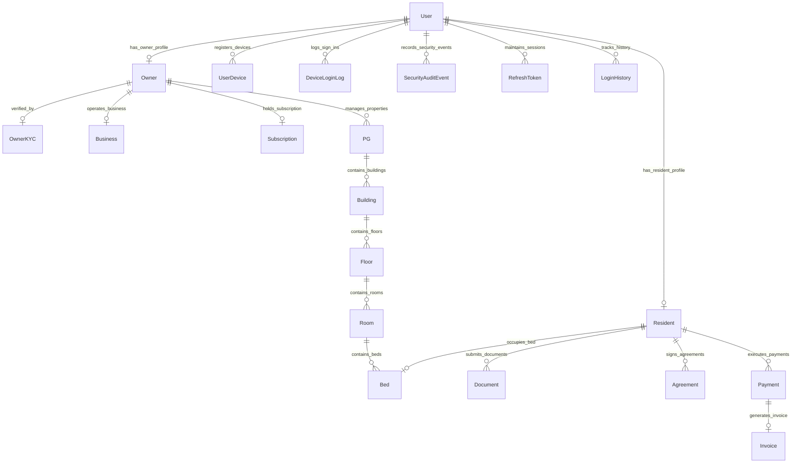

# RoomBae — Master Architecture & Complete Sign-Up & Sign-In Workflow Blueprint

This document is the definitive, production-grade technical specification for RoomBae's end-to-end **Authentication (AuthN)**, **Authorization (AuthZ)**, **Sign-In Flow**, **Multi-Step Sign-Up Wizards (Resident & Owner)**, **Device Intelligence & FingerprintJS Alert Lifecycle**, **CORS & Gateway Middleware Pipeline**, **Database Architecture (MongoDB Atlas + Prisma ORM)**, **Network Protocols & Servers**, and **UI Component & Button Action Matrix**.

---

# 1. Full-Stack Architecture, Server Layer & Network Protocols

RoomBae is architected as an enterprise, zero-trust, distributed web platform engineered with **React 19**, **TypeScript 5**, **Express 4**, **Prisma ORM 6.19.3**, **MongoDB Atlas**, **Socket.IO v4.8.3**, **Cloudinary CDN**, **Twilio SMS**, and **Razorpay**.

```text
┌───────────────────────────────────────────────────────────────────────────────────────────────────────────────────┐
│                                       FRONTEND CLIENT (React 19 + Vite 8 + Tailwind CSS)                           │
│  ├── UI Shell: Dark/Light Theme Provider, Responsive Breakpoints, Custom Micro-Animations (Framer Motion v12)    │
│  ├── Auth Views: Unified Sign-In Portal (/auth), Multi-Step Resident/Owner Sign-Up Wizards, Forgot Password Modal │
│  ├── Device Telemetry: @fingerprintjs/fingerprintjs v5.2.0 (Canvas, WebGL, Audio, Screen Resolution, Hardware)    │
│  ├── Alert Modal: NewDeviceNotificationModal.tsx (Live IP, Region, Device, Resolution Telemetry, Accept/Deny)    │
│  ├── State & Networking: Zustand v5 Stores (useAuthStore, useUIStore) + Custom Fetch ApiClient Wrapper            │
│  ├── Dynamic Chunk Resilience: `vite:preloadError` & `lazyWithRetry` auto-reload listeners for deployment updates│
│  └── Session Management: In-Memory RS256 Access Token + HttpOnly SameSite=None Secure Refresh Cookie              │
└────────────────────────────────────────────────────────┬──────────────────────────────────────────────────────────┘
                                                         │
                             HTTPS / REST (HTTP/2)       │ WebSocket (WSS)
                             JSON-RPC API Payloads       │ Real-Time Duplex / Live Eviction
                                                         │
┌────────────────────────────────────────────────────────▼──────────────────────────────────────────────────────────┐
│                               API GATEWAY & BACKEND SERVER (Node.js v20 + Express 4)                              │
│  ├── Trust Proxy: `app.set("trust proxy", 1)` for accurate client IP detection behind Render / Cloudflare CDN     │
│  ├── Dynamic CORS Shield: `corsOrigins.ts` with wildcard regex for *.onrender.com, *.github.io, *.vercel.app      │
│  ├── Security Stack: Helmet v8 (HSTS, CSP), Mongo-Sanitize, XSS Protection, JSON Body Parsers (10mb)             │
│  ├── Correlation & Tracing: `correlationIdMiddleware` (`x-correlation-id`, `x-request-id`)                       │
│  ├── CSRF Double Submit: `csrfMiddleware` validating `x-csrf-token` header against non-httpOnly cookie           │
│  ├── Service Discovery & Health: `GET /api/v1` (Service Directory), `GET /api/v1/health`, `GET /health`           │
│  ├── Interactive Documentation: Swagger UI mounted at `/api/docs`, `/api/v1/docs`, `/api/docs.json`               │
│  ├── Public Cryptographic JWKS: `GET /.well-known/jwks.json` exposing active RSA public keys (RS256)             │
│  ├── ERP Billing Interface: SOAP 1.2 XML WSDL Billing Service (`/soap/billing?wsdl`)                              │
│  ├── Rate Limiters: Tiered express-rate-limit (`loginLimiter`: 10 req/15min, `generalLimiter`: 300 req/15min)    │
│  ├── Risk Engine: Multi-signal scoring with safe thresholds (Never hard-blocks legitimate credentials)           │
│  ├── Device Security Engine: Salted SHA-256 fingerprint hashing, idempotent upserts, pending alert log generator│
│  ├── Transactional Outbox: Event bus for asynchronous email alerts, SMS dispatch, and audit logging              │
│  └── Real-Time Pub/Sub: Socket.IO Server with per-packet token verification & immediate live session eviction    │
└────────────────────────────────────────────┬──────────────────────────────────┬───────────────────────────────────┘
                                             │                                  │
                      ┌──────────────────────▼──────┐                   ┌───────▼─────────────────────┐
                      │    MONGODB ATLAS (Replica)  │                   │     IN-MEMORY CACHE ENGINE  │
                      │   Prisma Client ORM 6.19.3  │                   │  Fast Key-Value Storage     │
                      ├─────────────────────────────┤                   ├─────────────────────────────┤
                      │ • User (Accounts & Roles)   │                   │ • Route Cache & Blacklist   │
                      │ • Owner & Resident Profiles │                   │ • Active Session Tokens     │
                      │ • UserDevice & DeviceLogin  │                   │ • Pre-Auth Step-Up Tokens   │
                      │ • RefreshToken & Families   │                   │ • Sliding-Window Rate Limits│
                      │ • SecurityAuditEvent        │                   │ • Idempotency Replay Store  │
                      │ • PG, Room, Bed Hierarchy   │                   │ • Token Version In-Memory   │
                      │ • Agreement, Invoice, Pay   │                   │ • Socket.IO Cluster Hub     │
                      └──────────────┬──────────────┘                   └──────────────┬──────────────┘
                                     │                                                 │
                                     └────────────────────────┬────────────────────────┘
                                                              │
                                 ┌────────────────────────────▼─────────────────────────────┐
                                 │             EXTERNAL CLOUD PLATFORMS & APIS              │
                                 ├──────────────────────────────────────────────────────────┤
                                 │ • Cloudinary CDN: Direct signed media & KYC storage      │
                                 │ • Twilio SMS API: Multi-factor phone OTP SMS delivery    │
                                 │ • Gmail / SMTP: New device alerts, OTPs, invoices        │
                                 │ • Razorpay Gateway: Payment orders & webhook HMAC verify │
                                 │ • Google Cloud OAuth 2.0: Single Sign-On authentication  │
                                 └──────────────────────────────────────────────────────────┘
```

---

# 2. CORS, Cross-Origin Protocols & Gateway Middleware Pipeline

All incoming HTTP requests to RoomBae travel through a strict, ordered middleware pipeline before reaching controllers:

```
Incoming Request
  │
  ├─► 1. Trust Proxy (`app.set("trust proxy", 1)`)
  │      Extracts authoritative client IP from `x-forwarded-for` (Render/Cloudflare edge proxy).
  │
  ├─► 2. Security Headers (`helmet()`)
  │      Sets HSTS, X-Content-Type-Options: nosniff, FrameGuard, Referrer-Policy, and CSP.
  │
  ├─► 3. Dynamic CORS Shield (`cors(corsOptions)`)
  │      Validates `Origin` header dynamically against:
  │      • Localhost ports: `http://localhost:5173`, `http://localhost:3000`, `http://127.0.0.1:*`
  │      • Cloud deployment subdomains via Regex: `*.onrender.com`, `*.github.io`, `*.vercel.app`, `*.netlify.app`
  │      • Configured URLs: `CLIENT_URL`, `FRONTEND_URL`, `CORS_ALLOWED_ORIGINS`
  │      • Headers allowed: `Content-Type`, `Authorization`, `X-Visitor-Id`, `X-Correlation-ID`, `X-CSRF-Token`, `Idempotency-Key`
  │      • Credentials enabled: `credentials: true` (allows `Set-Cookie` and `Cookie` transmission).
  │
  ├─► 4. Rate Limiter (`loginLimiter` / `generalLimiter`)
  │      Protects authentication routes (10 requests per 15 minutes per IP).
  │
  ├─► 5. Parsers & Sanitizers (`express.json({ limit: "10mb" })`, `mongoSanitize()`, `cookieParser()`)
  │      Parses JSON payloads, parses HTTP cookies, and strips `$`, `.` from request objects to prevent NoSQL injection.
  │
  ├─► 6. Distributed Tracing (`correlationIdMiddleware`)
  │      Generates or propagates `x-correlation-id` and `x-request-id` across request logs and response headers.
  │
  ├─► 7. CSRF Double-Submit Guard (`csrfMiddleware`)
  │      For state-changing methods (`POST`, `PUT`, `PATCH`, `DELETE`), validates `x-csrf-token` header against cookie.
  │
  ├─► 8. Tenant & Routing Dispatcher (`app.use('/api/v1', apiRouter)`)
  │      Attaches tenant metadata and routes request to modular controllers.
  │
  ├─► 9. Authentication Guard (`authMiddleware` / `jwtVerification`)
  │      Verifies RS256 JWT access token via public JWKS, validates `tokenVersion`, and attaches `req.user`.
  │
  ├─► 10. Authorization Guard (`roleGuard` / `permissionMiddleware`)
  │       Verifies user role (`OWNER`, `RESIDENT`, `ADMIN`, `SUPER_ADMIN`) matches endpoint permissions.
  │
  └─► 11. Global Error Handler (`errorHandler` / `errorMiddleware`)
          Catches `AppError`, Prisma `P2002` duplicate key errors (409), validation errors (400), and unhandled exceptions (500).
```

---

# 3. Complete Sign-In (Log In) Flow

The Sign-In system provides a high-security, seamless authentication experience across all platform roles (**PG Owner**, **Resident**, **Admin / Super Admin**) and **Google OAuth 2.0**.

```
                           ┌────────────────────────────────────────────────┐
                           │          USER NAVIGATES TO /auth (Sign In)     │
                           └───────────────────────┬────────────────────────┘
                                                   │
                   ┌───────────────────────────────┼───────────────────────────────┐
                   │                               │                               │
        ┌──────────▼──────────┐         ┌──────────▼──────────┐         ┌──────────▼──────────┐
        │   PG OWNER SIGN IN  │         │   RESIDENT SIGN IN  │         │    ADMIN SIGN IN    │
        │ • Business Email/Ph │         │ • Resident Code/Eml │         │ • Admin Email       │
        │ • Password          │         │ • Password          │         │ • Admin Password    │
        └──────────┬──────────┘         └──────────┬──────────┘         └──────────┬──────────┘
                   │                               │                               │
                   └───────────────────────────────┼───────────────────────────────┘
                                                   │
                                     [ CLICK: "Sign In to RoomBae" ]
                                                   │
                                                   ▼
                                 Frontend Collects Device Telemetry:
                              • @fingerprintjs/fingerprintjs (visitorId)
                              • Screen Resolution (e.g. 1920x1080)
                              • Device Label (e.g. Chrome on Windows)
                                                   │
                                                   ▼
                                       POST /api/v1/auth/login
                                 Headers: X-Visitor-Id, X-CSRF-Token
                                                   │
                                                   ▼
                                       Backend Authenticates:
                                1. Lookup User by Email/Phone/Code
                                2. Compare Password Hash (Bcrypt 12)
                                3. Check Account Status (ACTIVE)
                                4. RiskEngine.evaluateLoginRisk()
                                                   │
                                ┌──────────────────┴──────────────────┐
                                │                                     │
                     [ Score < 70 (Normal) ]               [ 2FA Step-Up Required ]
                                │                                     │
                   1. Issue RS256 Access Token            1. Create PreAuth Challenge
                   2. Set HttpOnly Refresh Cookie         2. Send OTP via Twilio/Email
                   3. Identify Device via FingerprintJS   3. Return requiresTwoFactor: true
                   4. Generate PENDING_ALERT Log                      │
                   5. Send Alert Email if New Device                  │
                                │                                     ▼
                                │                           User Enters 6-Digit OTP
                                │                           POST /api/v1/auth/verify-otp
                                │                                     │
                                └──────────────────┬──────────────────┘
                                                   │
                                                   ▼
                                      Response 200 OK Returned:
                                  { user, accessToken, deviceSecurity }
                                                   │
                                ┌──────────────────┴──────────────────┐
                                │                                     │
                     [ requiresAlert === true ]            [ requiresAlert === false ]
                                │                                     │
                   NewDeviceNotificationModal Opens!         Navigate Directly to Dashboard:
                   Shows: IP, City, Device, Screen           • Owner: /dashboard
                   Buttons:                                  • Resident: /resident-portal
                   • [ Yes, It's Me (Accept & Trust) ]       • Admin: /admin-console
                   • [ Not Me (Deny & Log Out) ]
```

---

# 4. FingerprintJS Device Intelligence & Alert/Telemetry Workflow

RoomBae uses **FingerprintJS Pro / Open-Source v5.2.0** as a non-intrusive **security alert and audit logging system**. It ensures users are immediately notified whenever their account is accessed from an unfamiliar browser or machine.

### 4.1 How Telemetry is Captured
When any user opens the application, `frontend/src/services/deviceIdentity.ts` initializes the agent:
```typescript
const fp = await FingerprintJS.load();
const result = await fp.get();
const visitorId = result.visitorId; // 32-character probabilistic hardware hash
const screenResolution = `${window.screen.width}x${window.screen.height} (${window.screen.colorDepth}-bit)`;
const deviceLabel = parseDeviceLabel(navigator.userAgent);
```

### 4.2 Backend Device Processing & Database Records
When the login request arrives at `AuthController.login`:
1. `visitorId` is hashed with `crypto.createHash('sha256').update('roombae_visitor_salt_' + visitorId).digest('hex')`.
2. `DeviceRepository.findByUserIdAndVisitorId(userId, visitorId)` checks if the user has signed in on this hardware before.
3. **If the device is NEW, REVOKED, or REJECTED**:
   - `isNew = true` and `requiresAlert = true`.
   - `DeviceRepository.createDevice` uses `prisma.userDevice.upsert` to record the device with `status: "NEW"`, `trustLevel: "UNTRUSTED"`.
   - A `DeviceLoginLog` record is created in MongoDB with `status: "PENDING_ALERT"`, `ipAddress`, `region`, `city`, `screenResolution`, `userAgent`.
   - `emailService.sendNewDeviceLoginAlert` dispatches a rich HTML email to the user's verified address detailing the login time, device, browser, and location.
4. **If the device is already TRUSTED**:
   - `requiresAlert = false`.
   - A `DeviceLoginLog` record is created with `status: "AUTO_TRUSTED"`. No modal is displayed.

### 4.3 The Alert Notification Modal (`NewDeviceNotificationModal.tsx`)
If `deviceSecurity.requiresAlert === true`, the frontend displays a high-priority, animated dark glassmorphic security modal over the viewport with two actionable buttons:

```
┌────────────────────────────────────────────────────────────────────────┐
│ 🛡️  NEW DEVICE SIGN-IN DETECTED                                        │
│                                                                        │
│ We noticed a sign-in to your RoomBae account from an unverified device.│
│                                                                        │
│ 📱 Device:     Chrome 120 on Windows 10 (Desktop)                      │
│ 🖥️ Resolution: 1920x1080 (24-bit)                                      │
│ 🌐 IP Address: 203.0.113.50                                            │
│ 📍 Location:   Bengaluru, Karnataka, India                             │
│ ⏰ Time:       Today at 4:15 PM IST                                    │
│                                                                        │
│ Did you just log in from this device?                                  │
│                                                                        │
│   [ ❌ Not Me (Deny & Log Out) ]    [ ✅ Yes, It's Me (Accept & Trust) ]│
└────────────────────────────────────────────────────────────────────────┘
```

#### Action 1: User clicks `[ Yes, It's Me (Accept & Trust) ]`
- **Frontend Action**: Calls `deviceService.sendAlertDecision({ deviceId, decision: "ACCEPT", visitorId })`.
- **API Endpoint**: `POST /api/v1/security/devices/alert-decision`
- **Backend Mutation**:
  1. Updates `UserDevice.status = "TRUSTED"` and `UserDevice.trustLevel = "TRUSTED"`.
  2. Updates `DeviceLoginLog.status = "ACCEPTED"` and `DeviceLoginLog.actionTaken = "USER_ACCEPTED"`.
  3. Writes `SecurityAuditEvent` (`eventType: "DEVICE_TRUSTED"`, `severity: "INFO"`).
- **UI Result**: Modal closes with a success toast ("Device verified and added to trusted devices"). User continues their active session without interruption.

#### Action 2: User clicks `[ Not Me (Deny & Log Out) ]`
- **Frontend Action**: Calls `deviceService.sendAlertDecision({ deviceId, decision: "REJECT", visitorId })`.
- **API Endpoint**: `POST /api/v1/security/devices/alert-decision`
- **Backend Mutation**:
  1. Updates `UserDevice.status = "REJECTED"` and `UserDevice.trustLevel = "UNTRUSTED"`.
  2. Updates `DeviceLoginLog.status = "REJECTED"` and `DeviceLoginLog.actionTaken = "USER_REJECTED"`.
  3. **Universal Session Revocation**: Calls `SessionRevocationService.revokeAllSessions(userId)`:
     - Deletes all `RefreshToken` records in MongoDB for this user.
     - Increments `User.tokenVersion` in MongoDB to invalidate all in-flight RS256 JWT access tokens.
     - Broadcasts `auth:revoked` over Socket.IO to immediately evict active browser connections.
     - Clears the `refreshToken` HTTP-only cookie.
  4. Writes `SecurityAuditEvent` (`eventType: "DEVICE_REVOKED"`, `severity: "WARNING"`).
- **UI Result**: Modal triggers `authService.logout()`, displays a red security warning ("Session terminated for security. Please reset your password if you suspect unauthorized access."), and redirects immediately to `/auth`.

---

# 5. Complete Sign-Up Flow (Multi-Step Wizards)

RoomBae implements role-tailored **7-Step Onboarding Wizards** for Residents and PG Owners:

```
                             ┌───────────────────────────────────────────────┐
                             │              ROLE SELECTION SCREEN            │
                             │         [ I am a Resident ]   [ I am a PG Owner ]
                             └───────┬───────────────────────────────┬───────┘
                                     │                               │
                     ┌───────────────▼───────────────┐ ┌─────────────▼─────────────────┐
                     │    RESIDENT SIGN-UP WIZARD    │ │      OWNER SIGN-UP WIZARD     │
                     ├───────────────────────────────┤ ├───────────────────────────────┤
                     │ Step 1: Account Credentials   │ │ Step 1: Account Credentials   │
                     │ Step 2: Multi-Factor OTP      │ │ Step 2: Multi-Factor OTP      │
                     │ Step 3: Profile & Emergency   │ │ Step 3: Business & Bank Info  │
                     │ Step 4: Identity Documents    │ │ Step 4: Owner KYC Submission  │
                     │ Step 5: Room & Bed Selection  │ │ Step 5: Property Setup        │
                     │ Step 6: Digital Agreement SVG │ │ Step 6: Building Hierarchy    │
                     │ Step 7: Rent & Deposit Pay    │ │ Step 7: Subscription Plan     │
                     └───────────────┬───────────────┘ └─────────────┬─────────────────┘
                                     │                               │
                                     └───────────────┬───────────────┘
                                                     │
                                         ┌───────────▼───────────┐
                                         │   ACCOUNT ACTIVATION  │
                                         │ • Issue RS256 Token   │
                                         │ • Set Refresh Cookie  │
                                         │ • Connect Socket.IO   │
                                         │ • Route to Dashboard  │
                                         └───────────────────────┘
```

---

## 5.1 Resident Sign-Up (7 Steps)

| Step | Component | Fields & Data Captured | API Request | Database Operations |
| :--- | :--- | :--- | :--- | :--- |
| **Step 1: Credentials** | `ResidentSignupStep1.tsx` | Full Name, Email, Mobile Phone, Password, Visitor ID | `POST /api/v1/auth/register-step1` | Creates draft `User` (`role: RESIDENT`, `accountStatus: PENDING`). |
| **Step 2: OTP Verification** | `OtpVerificationStep.tsx` | 6-Digit Phone SMS OTP & 6-Digit Email OTP | `POST /api/v1/auth/verify-otp` | Validates OTP tokens; sets `phoneVerified: true`, `emailVerified: true`. |
| **Step 3: Demographics** | `ResidentProfileStep.tsx` | Gender, Age, Blood Group, Food Preference, Occupation, Permanent Address, Guardian Details, Emergency Contact | `POST /api/v1/residents/profile-draft` | Creates `Resident`, `Guardian`, and `EmergencyContact` records. |
| **Step 4: Documents** | `DocumentUploadStep.tsx` | Aadhaar Card PDF/Image, College/Work ID | `POST /api/v1/upload/sign-upload`<br>`POST /api/v1/documents` | Uploads signed media to Cloudinary; creates `Document` records. |
| **Step 5: Bed Selection** | `BedSelectionStep.tsx` | Property Selection, Floor, Room, Bed Selection | `POST /api/v1/beds/hold` | Locks bed with 15-min distributed mutex; sets `Bed.status = HOLD`. |
| **Step 6: Agreement** | `AgreementSigningStep.tsx` | 11-Month Digital Tenancy Contract, SVG E-Signature | `POST /api/v1/agreements/sign` | Generates contract PDF; creates `Agreement` (`SIGNED_BY_RESIDENT`). |
| **Step 7: Payment** | `PaymentCheckoutStep.tsx` | Rent (₹14,500 + 18% GST = ₹17,110) + Deposit (₹29,000) via Razorpay | `POST /api/v1/payments/create-order`<br>`POST /api/v1/payments/webhook` | Verifies HMAC-SHA256 signature; creates `Invoice` (`INV-AURORA-1001`), marks `Payment` as `PAID`, sets `Bed.status = OCCUPIED`, and sets `Resident.status = ACTIVE`. |

---

## 5.2 PG Owner Sign-Up (7 Steps)

| Step | Component | Fields & Data Captured | API Request | Database Operations |
| :--- | :--- | :--- | :--- | :--- |
| **Step 1: Credentials** | `OwnerSignupStep1.tsx` | Full Name, Business Email, Mobile Phone, Password, Visitor ID | `POST /api/v1/auth/register-step1` (`role: OWNER`) | Creates `User` with `role: OWNER`. |
| **Step 2: OTP Verification** | `OtpVerificationStep.tsx` | Phone & Email OTP Codes | `POST /api/v1/auth/verify-otp` | Creates initial `Owner` entity linked to `User.id`. |
| **Step 3: Business & Bank** | `BusinessDetailsStep.tsx` | Business Name, Type (PVT_LTD/LLP), GSTIN, PAN, Bank Name, Account Number (AES-256 encrypted), IFSC, UPI ID | `POST /api/v1/owners/business-profile` | Creates `Business` entity and updates `Owner` banking records. |
| **Step 4: Owner KYC** | `OwnerKycStep.tsx` | Aadhaar Card, PAN Card, Owner Photo Selfie | `POST /api/v1/onboarding/owner-kyc` | Creates `OwnerKYC` record (`verificationStatus: VERIFIED`). |
| **Step 5: Property Setup** | `PropertyCreationStep.tsx` | Property Name, Slug, Address, Coordinates, Rent Starting Price, Amenities, Rules, 8 WebP Photos | `POST /api/v1/properties` | Creates `PG` entity in MongoDB Atlas. |
| **Step 6: Buildings & Rooms** | `BuildingStructureStep.tsx` | Buildings, Floors, Room Numbers, Sharing Types (Single/Double/Triple), AC/Non-AC, Bed Labels | `POST /api/v1/properties/:id/structure` | Creates `Building`, `Floor`, `Room`, and `Bed` records. |
| **Step 7: Subscription** | `SubscriptionStep.tsx` | SaaS Tier: `STARTER`, `PROFESSIONAL` (Selected), or `ENTERPRISE` | `POST /api/v1/owners/subscription` | Creates `Subscription` record (`planType: PROFESSIONAL`, `status: ACTIVE`); redirects to `/dashboard`. |

---

# 6. UI Elements & Button Action Matrix

Every button across the authentication and security surfaces is mapped to its precise handler, API call, and error recovery:

| Screen / Modal | Button Label | Frontend Handler | API Route Called | Database Mutation | Error / Fallback Handling |
| :--- | :--- | :--- | :--- | :--- | :--- |
| **Sign-In View** | `[ PG Owner ]` Tab | `setRole("OWNER")` | None (Client state switch) | None | Switches input labels and validation schemas for Owner persona. |
| **Sign-In View** | `[ Resident ]` Tab | `setRole("RESIDENT")` | None (Client state switch) | None | Switches input labels to "Resident ID or Email" with Resident validation. |
| **Sign-In View** | `[ Admin Sign In ]` Tab | `setRole("ADMIN")` | None (Client state switch) | None | Switches input labels for administrative command access. |
| **Sign-In View** | `[ Sign In to RoomBae ]` | `handleSubmit(onLogin)` | `POST /api/v1/auth/login` | Updates `User.lastLogin`, logs `LoginHistory`, registers `UserDevice`. | Displays red banner on 401 invalid password; prompts 2FA modal on 403 step-up. |
| **Sign-In View** | `[ Continue with Google ]` | `window.location.href = googleAuthUrl` | `GET /api/v1/auth/google` | Creates/links `User` with `googleSubId`, auto-ensures profile. | Redirects to Google Consent Screen; handles callback at `/api/v1/auth/google/callback`. |
| **Sign-In View** | `[ Forgot password? ]` | `setShowForgotModal(true)` | None (Opens modal) | None | Opens password recovery dialog with Email/Phone OTP inputs. |
| **Sign-In View** | `[ Sign Up ]` Link | `navigate("signup")` | None (Client navigation) | None | Routes user to Role Selection Screen (`/signup`). |
| **Alert Modal** | `[ Yes, It's Me (Accept & Trust) ]` | `handleAcceptDevice()` | `POST /api/v1/security/devices/alert-decision` (`decision: "ACCEPT"`) | Sets `UserDevice.status = TRUSTED`, `DeviceLoginLog.status = ACCEPTED`. | Shows success toast, closes modal, persists trusted state. |
| **Alert Modal** | `[ Not Me (Deny & Log Out) ]` | `handleRejectDevice()` | `POST /api/v1/security/devices/alert-decision` (`decision: "REJECT"`) | Sets `UserDevice.status = REJECTED`, deletes all `RefreshToken`s, increments `tokenVersion`. | Shows critical warning alert, calls `logout()`, redirects to `/auth`. |
| **Sign-Up Step 1** | `[ Continue to Verification ]` | `handleStep1Submit()` | `POST /api/v1/auth/register-step1` | Creates draft `User` record. | Displays field validation errors if email/phone already in use. |
| **Sign-Up Step 2** | `[ Verify Phone OTP ]` | `handleVerifyOtp()` | `POST /api/v1/auth/verify-otp` | Sets `User.phoneVerified = true`. | Highlights input in red on incorrect OTP; enables "Resend OTP" after 30s. |
| **Sign-Up Step 2** | `[ Verify Email OTP ]` | `handleVerifyEmailOtp()` | `POST /api/v1/auth/verify-email-otp` | Sets `User.emailVerified = true`. | Displays timer countdown; allows resend after 60s cooldown. |
| **Sign-Up Step 4** | `[ Upload Aadhaar / PAN ]` | `handleCloudinaryUpload()` | `POST /api/v1/upload/sign-upload` | Creates `Document` / `OwnerKYC` record. | Retries upload on network glitch; validates MIME type (PDF/JPG/PNG). |
| **Sign-Up Step 6** | `[ Sign & Generate Agreement ]` | `handleSignatureSubmit()` | `POST /api/v1/agreements/sign` | Creates `Agreement` (`SIGNED_BY_RESIDENT`), generates contract PDF. | Validates canvas has non-empty stroke coordinates before submitting. |
| **Sign-Up Step 7** | `[ Pay ₹17,110 with Razorpay ]` | `openRazorpayModal()` | `POST /api/v1/payments/create-order` | Creates `Payment` (`PAID`), `Invoice`, marks `Bed` as `OCCUPIED`. | Re-opens checkout on modal dismiss; verifies payment via backend webhook. |

---

# 7. Database Relational Map & Prisma Models



### Core Prisma Schema Definitions (Excerpt)

```prisma
model User {
  id                 String          @id @default(auto()) @map("_id") @db.ObjectId
  email              String          @unique
  passwordHash       String?
  name               String
  residentCode       String?
  googleSubId        String?         
  role               Role            @default(PUBLIC)
  phone              String?
  phoneVerified      Boolean         @default(false)
  emailVerified      Boolean         @default(false)
  accountStatus      String          @default("ACTIVE")
  tokenVersion       Int             @default(0)
  lastLogin          DateTime?
  createdAt          DateTime        @default(now())
  updatedAt          DateTime        @updatedAt
  ownerProfile       Owner?
  residentProfile    Resident?
  userDevices        UserDevice[]
  deviceLoginLogs    DeviceLoginLog[]
  securityAuditEvents SecurityAuditEvent[]
  refreshTokens      RefreshToken[]
  loginHistories     LoginHistory[]
}

model UserDevice {
  id               String    @id @default(auto()) @map("_id") @db.ObjectId
  userId           String    @db.ObjectId
  user             User      @relation(fields: [userId], references: [id], onDelete: Cascade)
  visitorIdHash    String
  deviceLabel      String
  browser          String?
  os               String?
  deviceType       String?
  screenResolution String?
  status           String    @default("NEW") // NEW, TRUSTED, BLOCKED, REVOKED, REJECTED
  trustLevel       String    @default("UNTRUSTED")
  ipAddress        String?
  region           String?
  city             String?
  country          String?
  failedAttempts   Int       @default(0)
  firstSeenAt      DateTime  @default(now())
  lastSeenAt       DateTime  @default(now())
  lastLoginAt      DateTime?
  createdAt        DateTime  @default(now())
  updatedAt        DateTime  @updatedAt

  @@unique([userId, visitorIdHash])
  @@index([userId])
  @@index([status])
}

model DeviceLoginLog {
  id               String    @id @default(auto()) @map("_id") @db.ObjectId
  userId           String    @db.ObjectId
  user             User      @relation(fields: [userId], references: [id], onDelete: Cascade)
  deviceId         String?
  deviceLabel      String
  screenResolution String?
  ipAddress        String
  region           String?
  city             String?
  country          String?
  status           String    @default("PENDING_ALERT") // PENDING_ALERT, ACCEPTED, REJECTED, AUTO_TRUSTED
  actionTaken      String?   // USER_ACCEPTED, USER_REJECTED, AUTO_TRUSTED
  emailSent        Boolean   @default(false)
  userAgent        String?
  createdAt        DateTime  @default(now())
  actionAt         DateTime?

  @@index([userId])
  @@index([status])
}
```

---

# 8. Summary of Guarantees & Production Best Practices

1. **Zero False-Positive Logins**: Valid credentials are never blocked by risk heuristics alone; unverified or previously rejected devices seamlessly prompt the interactive New Device Alert modal.
2. **Deterministic Device Identification**: Hardware fingerprints are hashed using a unified, salted SHA-256 algorithm (`roombae_visitor_salt_`) and stored via idempotent `upsert` operations.
3. **Immediate Threat Neutralization**: Denying an alert immediately revokes all active sessions, bumps `tokenVersion`, invalidates in-memory JWTs, broadcasts WebSocket evictions, and clears HTTP-only cookies.
4. **Resilient Production Networking**: Dynamic CORS wildcard validation, fail-safe Vite chunk reload recovery (`lazyWithRetry`), and unconditional interactive Swagger UI documentation at `/api/docs`.
