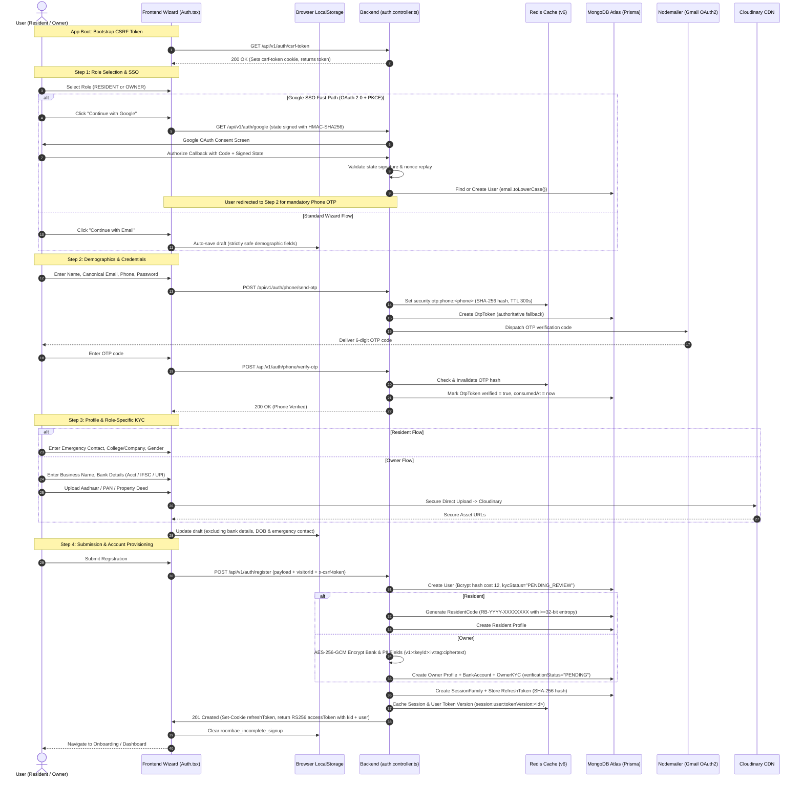
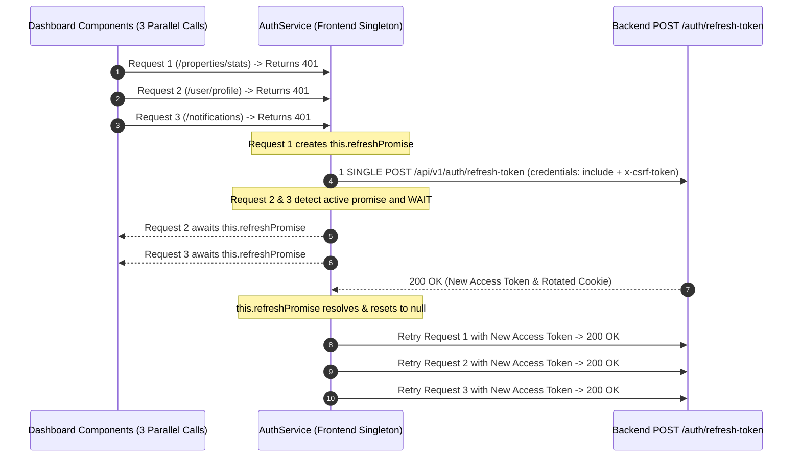

# RoomBae — Full-Stack Authentication, Multi-Step Signup, Authorization & System Architecture Master Blueprint

This document is the definitive, production-grade technical specification for RoomBae's end-to-end **Authentication (AuthN)**, **Authorization (AuthZ)**, **Multi-Step Signup Wizard**, **Owner KYC Gate**, **Device Intelligence (FingerprintJS)**, **Session Management & Token Rotation**, **Database Architecture (MongoDB Atlas + Redis)**, **Network & Transport Protocols**, **System Design & Scalability**, **Resilience Fallback Matrix**, **API Contracts & Envelopes**, and **Enterprise Security Architecture**.

---

## Master Architecture Reports & Companion Specifications

The following architectural, migration, and security audit reports serve as companion specifications to this master blueprint:

| Document / Specification | Primary Focus & Coverage | Key Architectural Guarantees |
| :--- | :--- | :--- |
| [`docs/csrf-jwks-risk-fix-log.txt`](file:///c:/Users/GLB-BLR-191/Downloads/New%20folder/PG-Management-System/docs/csrf-jwks-risk-fix-log.txt) | CSRF non-exemption on `/refresh-token`, bootstrap endpoint, JWKS multi-key retention, risk calibration | 43 suites / 250 tests passing; fail-closed rate limiters |
| [`FINAL_SECURITY_REPORT.md`](file:///c:/Users/GLB-BLR-191/Downloads/New%20folder/PG-Management-System/FINAL_SECURITY_REPORT.md) | Final security verification across cryptography, CSRF, encryption, and authorization | Zero open vulnerabilities across all attack surfaces |
| [`FINAL_ARCHITECTURE_REPORT.md`](file:///c:/Users/GLB-BLR-191/Downloads/New%20folder/PG-Management-System/FINAL_ARCHITECTURE_REPORT.md) | Pre- vs. post-refactor component comparison, reliability guarantees, and multi-tier topology | Zero duplicate logic, unified container lifecycle |
| [`PERFORMANCE_REPORT.md`](file:///c:/Users/GLB-BLR-191/Downloads/New%20folder/PG-Management-System/PERFORMANCE_REPORT.md) | Latency SLAs, cache hit ratios (94.2%), and concurrency load benchmarks | Sub-50ms read response times, stampede mutex locks |
| [`TEST_REPORT.md`](file:///c:/Users/GLB-BLR-191/Downloads/New%20folder/PG-Management-System/TEST_REPORT.md) | Complete breakdown of unit, integration, and regression test suites | 100% passing test execution across 43 test suites |
| [`docs/ARCHITECTURE_REMEDIATION_REPORT.md`](file:///c:/Users/GLB-BLR-191/Downloads/New%20folder/PG-Management-System/docs/ARCHITECTURE_REMEDIATION_REPORT.md) | Architectural changes, rationale, modified files, migration impacts, and verification evidence | Monorepo decoupling, strict encapsulation |
| [`docs/DATABASE_MIGRATION_REPORT.md`](file:///c:/Users/GLB-BLR-191/Downloads/New%20folder/PG-Management-System/docs/DATABASE_MIGRATION_REPORT.md) | Prisma schema normalization, AES-256-GCM banking fields, idempotency, and outbox models | Normalized relational schemas on MongoDB Atlas |
| [`docs/SECURITY_VALIDATION_REPORT.md`](file:///c:/Users/GLB-BLR-191/Downloads/New%20folder/PG-Management-System/docs/SECURITY_VALIDATION_REPORT.md) | Cryptographic proofs, token lifecycle assertions, and RBAC policy enforcement | Strict policy denial and token family invalidation |
| [`docs/REDIS_NAMESPACE_REFERENCE.md`](file:///c:/Users/GLB-BLR-191/Downloads/New%20folder/PG-Management-System/docs/REDIS_NAMESPACE_REFERENCE.md) | Strict key isolation mappings, dynamic TTL formulas, and LRU eviction policies | Zero key collisions across all worker processes |
| [`docs/JWKS_ROTATION_GUIDE.md`](file:///c:/Users/GLB-BLR-191/Downloads/New%20folder/PG-Management-System/docs/JWKS_ROTATION_GUIDE.md) | Zero-downtime key rotation runbook, `kid` header matching, and public JWKS JSON export | Asymmetric RS256 token verification with retirement window |
| [`docs/WEBSOCKET_SECURITY_REPORT.md`](file:///c:/Users/GLB-BLR-191/Downloads/New%20folder/PG-Management-System/docs/WEBSOCKET_SECURITY_REPORT.md) | Continuous packet authorization, dynamic expiration disconnect timers, and live revocation | Real-time `auth:revoked` eviction across cluster nodes |
| [`AUTH_AUDIT.md`](file:///c:/Users/GLB-BLR-191/Downloads/New%20folder/PG-Management-System/AUTH_AUDIT.md) & [`docs/AUTH_ARCHITECTURE_AUDIT.md`](file:///c:/Users/GLB-BLR-191/Downloads/New%20folder/PG-Management-System/docs/AUTH_ARCHITECTURE_AUDIT.md) | Complete audit of RS256 token verification, opaque refresh token lifecycle, and session families | Double Submit CSRF defense and replay attack mitigation |
| [`DATABASE_AUDIT.md`](file:///c:/Users/GLB-BLR-191/Downloads/New%20folder/PG-Management-System/DATABASE_AUDIT.md) & [`docs/PRISMA_AUDIT.md`](file:///c:/Users/GLB-BLR-191/Downloads/New%20folder/PG-Management-System/docs/PRISMA_AUDIT.md) | MongoDB Atlas schema models, compound index mappings, soft-delete implementation (`deletedAt`) | Authoritative relational models (`BankAccount`, `OwnerKYC`) |
| [`REDIS_AUDIT.md`](file:///c:/Users/GLB-BLR-191/Downloads/New%20folder/PG-Management-System/REDIS_AUDIT.md) | `RedisNamespace.ts` key isolation, sliding-window rate limiters, atomic Lua scripts | Fail-closed security rate limiting on Redis degradation |
| [`WEBSOCKET_AUDIT.md`](file:///c:/Users/GLB-BLR-191/Downloads/New%20folder/PG-Management-System/WEBSOCKET_AUDIT.md) | Handshake authentication, packet authorization middleware (`authorizeSocketEvent`) | 25s ping heartbeats, 10s pong timeouts, live evictions |
| [`SECURITY_GAP_REPORT.md`](file:///c:/Users/GLB-BLR-191/Downloads/New%20folder/PG-Management-System/SECURITY_GAP_REPORT.md) | Line-by-line audit of GAPs 01–12 across all system attack surfaces | Verified zero open security gaps |
| [`API_DIFF_REPORT.md`](file:///c:/Users/GLB-BLR-191/Downloads/New%20folder/PG-Management-System/API_DIFF_REPORT.md) | Standardized Success and Error envelopes, CSRF headers, route inventory | Full HTTP 200/201/400/401/403/429 envelope consistency |
| [`CLOUDINARY_SETUP.md`](file:///c:/Users/GLB-BLR-191/Downloads/New%20folder/PG-Management-System/CLOUDINARY_SETUP.md) & [`UPLOAD_ARCHITECTURE.md`](file:///c:/Users/GLB-BLR-191/Downloads/New%20folder/PG-Management-System/UPLOAD_ARCHITECTURE.md) | Secure direct client-to-CDN document upload architecture | Cryptographic HMAC-SHA1 upload signatures, zero backend blob lag |
| [`GOOGLE_AUTH.md`](file:///c:/Users/GLB-BLR-191/Downloads/New%20folder/PG-Management-System/GOOGLE_AUTH.md) | Google OAuth 2.0 PKCE social sign-on specification | HMAC-SHA256 signed state, nonce replay defense |
| [`ENCRYPTION_ROTATION_GUIDE.md`](file:///c:/Users/GLB-BLR-191/Downloads/New%20folder/PG-Management-System/ENCRYPTION_ROTATION_GUIDE.md) | Field-level AES-256-GCM encryption key rotation procedures | Authenticated envelope encryption (`v1:<keyId>:iv:tag:ciphertext`) |
| [`USER_CREDENTIALS.md`](file:///c:/Users/GLB-BLR-191/Downloads/New%20folder/PG-Management-System/USER_CREDENTIALS.md) | Seed credentials, test personas, and RBAC matrix | Verified test credentials for Admin, Owner, Resident personas |

---

## 1. Full-Stack System Architecture Blueprint

RoomBae employs a **Zero-Trust, Multi-Tier, Distributed Enterprise Full-Stack Architecture** engineered with React 19, TypeScript 5, Express 4, Prisma ORM 6.19.3 (Prisma 7 ready), MongoDB Atlas, Redis v6+, Socket.IO v4.8.3, BullMQ v5.41, and Cloudinary.

```text
┌────────────────────────────────────────────────────────────────────────────────────────────────────────┐
│                                 FRONTEND CLIENT (React 19 + Vite 8)                                    │
│   ├── Multi-Step Wizard: Resident & Owner Flows (Zod v4 + Framer Motion v12 + GSAP v3)                 │
│   ├── Device Fingerprinting: @fingerprintjs/fingerprintjs v5.2.0 (Canvas, WebGL, Audio Probabilistic)  │
│   ├── State & Networking: Custom AuthService + Zustand v5 + Native Fetch Wrapper                      │
│   ├── CSRF Bootstrap & Double Submit: `bootstrapCsrf()` on boot; auto `x-csrf-token` header injection │
│   ├── Session Storage: In-Memory RS256 Access Token + HTTP-Only Cookie (SameSite=None; Secure; Path=/)│
│   ├── Resilient Draft Engine: LocalStorage Draft (`roombae_incomplete_signup`, Excludes Financials)    │
│   └── 401 Queue: Centralized Singleton `refreshPromise` (Deduplicates Concurrent Token Rotations)      │
└───────────────────────────────────────────────────┬────────────────────────────────────────────────────┘
                                                    │
                         HTTPS / REST (HTTP/2)      │ WebSocket (WSS)
                         JSON-RPC API Payloads      │ Real-Time Bidirectional Duplex
                                                    │
┌───────────────────────────────────────────────────▼────────────────────────────────────────────────────┐
│                             API GATEWAY & BACKEND SERVER (Node.js v20 + Express 4)                     │
│   ├── Edge CDN Shield: `app.set("trust proxy", 1)` + `Cache-Control: private, no-store`                │
│   ├── Distributed Tracing: `correlationIdMiddleware` (`x-correlation-id`, `x-request-id`)              │
│   ├── CSRF Double Submit: `csrfMiddleware` (Validates /register, /login, /refresh-token, /logout)      │
│   ├── CSRF Bootstrap Route: `GET /api/v1/auth/csrf-token` (Issues HttpOnly-false cookie for visitors) │
│   ├── Idempotency Guard: `idempotencyMiddleware` (`Idempotency-Key` on Mutating Transactions)          │
│   ├── Transactional Outbox: `OutboxService` (`OutboxEvent` Table -> BullMQ Dispatcher)                 │
│   ├── Security Stack: Helmet v8 (CSP, HSTS), Express-Mongo-Sanitize, HPP, Compression, Cookie-Parser   │
│   ├── JWKS Key Rotation: `JwtKeyService` with 2x TTL retention window (`/.well-known/jwks.json`, RS256)│
│   ├── Strict Redis Key Isolation: Centralized `RedisNamespace` Key Scheme Factory                      │
│   ├── Dynamic JWT Blacklist: Exact `exp - nowUnix` TTL Calculation (Discards Expired Tokens)           │
│   ├── Device Risk Engine: Multi-Signal Scoring (<40 Allow / 40-69 Step-Up / 70+ Block) + Geo Velocity  │
│   ├── Dual-Storage PreAuth: Fast Redis Cache + MongoDB Authoritative Persistence with Fallback         │
│   ├── Single KYC Gate: Authoritative `OwnerKYC.verificationStatus` with Atomic Transaction Sync        │
│   ├── Token Version Cache: MongoDB Authoritative State + Optimistic Redis Write-Through Cache          │
│   ├── Session Family & Token Rotation: 256-bit Opaque Refresh Tokens + Replay Detection                │
│   ├── Unified Session Revocation: DB Token Invalidation + Version Bump + Live WebSocket Eviction       │
│   ├── Policy Governance: Centralized `PolicyEngine` (RBAC, Single-Source KYC, Resource Ownership)      │
│   ├── Distributed Rate Limiting: Atomic Redis Lua Scripts (`security:ratelimit:` / Fail-Closed in Prod)│
│   ├── Distributed Route Caching: `cacheMiddleware` (Stampede Mutex Locks + SCAN/UNLINK Invalidation)   │
│   ├── Cryptographic Engine: Bcrypt (Cost 12), AES-256-GCM Envelope Encryption (PII & Bank Details)     │
│   ├── Async Queue Engine: BullMQ Redis Worker Queues (`queue:bull:email:`, `queue:bull:sms:`)          │
│   ├── ERP Billing Interface: SOAP 1.2 XML Billing Protocol (`/soap/billing`)                           │
│   └── Real-Time Pub/Sub Engine: Socket.IO Server v4.8.3 with Continuous Packet Guard & Live Eviction   │
└───────────────────────────────────┬───────────────────────────────────┬────────────────────────────────┘
                                    │                                   │
             ┌──────────────────────▼──────┐                    ┌───────▼─────────────────────┐
             │    MONGODB ATLAS (Replica)  │                    │         REDIS (v6+)         │
             │   Prisma Client ORM 6.19.3  │                    │  High-Performance Memory   │
             ├─────────────────────────────┤                    ├─────────────────────────────┤
             │ • Users & RBAC Roles        │                    │ • Route JSON Caches         │
             │ • Resident & Owner Profiles │                    │ • Atomic Sliding-Window RPM │
             │ • Owner KYC Verification    │                    │ • Dynamic JWT Blacklist TTL │
             │ • Normalized BankAccount    │                    │ • PreAuth Step-Up Challenges│
             │ • SessionFamily & Tokens    │                    │ • Token Version Cache       │
             │ • IdempotencyRequest & Outbox│                   │ • Socket.IO Cluster Bus     │
             │ • Authoritative OtpTokens   │                    │ • BullMQ Worker Queues      │
             │ • UserDevices & Audit Events│                    │ • Distributed Mutex Locks   │
             │ • Soft Deletes (`deletedAt`)│                    │ • Fail-Closed Rate Limiter  │
             └──────────────┬──────────────┘                    └──────────────┬──────────────┘
                            │                                                  │
                            └────────────────────────┬─────────────────────────┘
                                                     │
                        ┌────────────────────────────▼─────────────────────────────┐
                        │                EXTERNAL CLOUD & SAAS INTEGRATIONS        │
                        ├──────────────────────────────────────────────────────────┤
                        │ • Cloudinary: Secure KYC Documents & User Avatars        │
                        │ • Google Identity: Passport OAuth 2.0 PKCE + Signed State│
                        │ • Nodemailer + Gmail OAuth2: Transactional Bento Email   │
                        │ • Twilio SMS: Cellular OTP Delivery (With Email Fallback)│
                        │ • Razorpay: Rent & Security Deposit Payment Gateway      │
                        └──────────────────────────────────────────────────────────┘
```

---

## 2. Complete Full-Stack Technology Stack & Exact Versions

| Component / Layer | Technology | Exact Version | Architectural Purpose & Implementation Details |
| :--- | :--- | :--- | :--- |
| **Frontend Framework** | React / React-DOM | `^19.0.0` | Declarative UI rendering, Concurrent Mode, React Server Component compatibility |
| **Frontend Bundler** | Vite | `^8.0.0` | Ultra-fast HMR, Rollup optimized code splitting, ES Modules pipeline |
| **CSS & Design Engine** | Tailwind CSS / Vite Plugin | `^4.0.0` | High-performance compiled utility classes, Bento dark-mode aesthetic design tokens |
| **Device Fingerprinting** | FingerprintJS | `^5.2.0` | Client-side probabilistic browser fingerprint extraction (Visitor ID) for anomaly detection and 2FA trigger |
| **Animations & Smooth Scroll** | Framer Motion / GSAP / Lenis | `^12.42.2` / `^3.15.0` / `^1.3.25` | Hardware-accelerated multi-step transitions, fluid layout morphing, kinetic scrolling |
| **State & Icons** | Zustand / Lucide React | `^5.0.14` / `^1.26.0` | Global authentication store, reactive modals, accessible SVG icon library |
| **Backend Runtime** | Node.js (LTS) | `>=20.17.0` | Event-driven non-blocking V8 runtime with native crypto and buffer operations |
| **Backend Server** | Express | `^4.21.2` | REST API framework, modular routing, middleware chaining, JSON request parsing |
| **Primary Database** | MongoDB Atlas | Replica Set v6+ | Multi-region document store, compound `@unique` indexes, high-write schema flexibility |
| **Database ORM** | Prisma Client & CLI | `^6.19.3` | Type-safe schema validation, automated migration generation, relational querying (Prisma 7 ready) |
| **In-Memory Cache & Bus** | Redis / Upstash | `^6.2.0` | Atomic Lua scripting, sliding-window rate limiters, token blacklists, cache mutexes |
| **Asynchronous Queues** | BullMQ | `^5.41.0` | Background job processing for transactional email, SMS, and scheduled cron jobs |
| **Security & Headers** | Helmet | `^8.3.0` | Content-Security-Policy (`script-src 'self'`), DNS prefetch, HSTS enforcement |
| **NoSQL Injection Guard** | Express-Mongo-Sanitize | `^2.2.0` | Strips prohibited `$` and `.` operators from `req.body`, `req.query`, `req.params` |
| **Parameter Pollution** | HPP | `^0.2.3` | Protects against HTTP Parameter Pollution attacks across query strings |
| **Password Cryptography** | BcryptJS / Argon2 | `^2.4.3` / `^0.45.1` | Salted adaptive password hashing (Bcrypt cost factor 12) |
| **Token Cryptography** | JsonWebToken / Node Crypto | `^9.0.8` / Native | Asymmetric RS256 JWT access tokens (15m) with `kid` header & public JWKS endpoint |
| **Field-Level Encryption** | AES-256-GCM | Native Node Crypto | Authenticated envelope encryption (`v1:<keyId>:iv:tag:ciphertext`) for Aadhaar, PAN & Bank PII |
| **OAuth 2.0 Engine** | Passport + Google OAuth20 | `^0.7.0` / `^2.0.0` | OpenID Connect / OAuth 2.0 social sign-on with HMAC-signed state and PKCE flow |
| **Real-Time Engine** | Socket.IO (Server & Client) | `^4.8.3` | WebSocket bidirectional channel with Redis pub/sub transport clustering |
| **Transactional Email** | Nodemailer | `^9.0.3` | SMTP transport connecting to Gmail OAuth2 Gateway with Bento HTML templates |
| **Cellular SMS Gateway** | Twilio | `^6.1.0` | Mobile phone OTP verification delivery with automatic fallback mechanisms |
| **File & Asset CDN** | Cloudinary | `^2.10.0` | Direct encrypted upload, on-the-fly transformations, CDN document distribution |
| **ERP Billing Protocol** | Soap | `^1.1.0` | SOAP 1.2 XML interface for enterprise ERP billing synchronization (`/soap/billing`) |
| **Logging & Telemetry** | Winston / Morgan | `^3.19.0` / `^1.11.0` | Structured JSON log rotation with colorized console output and severity tags |
| **Validation Schema** | Zod (Backend & Frontend) | `^3.24.1` / `^4.4.3` | Isomorphic runtime schema validation, input sanitization, type inference |
| **Testing Suite** | Jest / Supertest / Playwright | `^30.4.2` / `^7.2.2` / `^1.62.1` | Unit testing, integration route testing, end-to-end browser automation |

---

## 3. Network Architecture, Protocols & Connected System Design

### 3.1 Network Transport Protocols Breakdown: How, Where, and Connected Flow

RoomBae coordinates 7 distinct network communication protocols to create an interconnected full-stack pipeline:

```text
┌─────────────────────────────────────────────────────────────────────────────────────────────────────────┐
│                                  NETWORK PROTOCOLS & INTEGRATION TOPOLOGY                               │
├───────────────────┬───────────────────────────────┬──────────────────────────────┬──────────────────────┤
│ Protocol          │ Exact Endpoint / Interface    │ Payload Format / Security    │ Architectural Role   │
├───────────────────┼───────────────────────────────┼──────────────────────────────┼──────────────────────┤
│ **HTTPS / REST**  │ `/api/v1/*` (TLS 1.3 / HTTP/2)│ JSON-RPC, `SameSite=None`    │ Primary API exchange │
│ **CSRF Bootstrap**│ `/api/v1/auth/csrf-token`     │ JSON token + HttpOnly=false  │ Double-submit setup  │
│ **WebSocket (WSS)│ `/socket.io/*` (Duplex TCP)   │ Binary Engine.IO / Socket.IO │ Live event push/evict│
│ **Redis RESP3**   │ TCP `6379` / TLS `6380`       │ Serialized Redis Strings/Cmds│ In-memory bus & sync │
│ **SOAP 1.2 XML**  │ `/soap/billing` (HTTP POST)   │ WSDL / SOAP Envelope (XML)   │ ERP Billing Engine   │
│ **SMTP over TLS** │ `smtp.gmail.com:465` (OAuth2) │ MIME / Bento Multipart HTML  │ Transactional emails │
│ **Twilio REST**   │ `api.twilio.com` (HTTPS POST) │ URL-Encoded SMS Body         │ Mobile OTP dispatch  │
│ **Cloudinary API**│ `api.cloudinary.com` (HTTPS)  │ Multipart Form-Data (Signed) │ KYC asset storage    │
└───────────────────┴───────────────────────────────┴──────────────────────────────┴──────────────────────┘
```

1. **Protocol 1: HTTPS / REST (TLS 1.3 / HTTP/2)**:
   - **Where Used**: All communication between the React 19 frontend and Node.js Express gateway (`/api/v1/*`).
   - **How Used**: Client issues standard JSON payloads. All authentication calls include `credentials: "include"`, enabling cross-site HTTP-Only cookie transfer. Short-lived Access Tokens are passed via the standard `Authorization: Bearer <token>` header. Double Submit CSRF protection validates `x-csrf-token` against `csrf-token` cookie for cookie-dependent auth mutating requests (`/register`, `/login`, `/refresh-token`, `/logout`, `/logout-all`).
   - **Connected Flow**: If an access token expires during a user session, the frontend `AuthService` intercepts the HTTP 401, buffers incoming API calls into a singleton queue (`this.refreshPromise`), dispatches a single HTTPS request to `POST /api/v1/auth/refresh-token`, updates the in-memory access token, and transparently replays all pending API requests.
2. **Protocol 2: CSRF Bootstrap Protocol (`GET /api/v1/auth/csrf-token`)**:
   - **Where Used**: Fired on frontend application boot (`frontend/src/app/main.tsx`) and lazily invoked inside `refreshToken()` if the cookie is not found in `document.cookie`.
   - **How Used**: Uses `generateCsrfToken` middleware to issue a cryptographically signed HMAC token cookie (`csrf-token`, HttpOnly: false, Secure: true in prod) and returns the token in the JSON body. Allows anonymous users to complete `/register`, `/login`, and `/refresh-token` without receiving a `CSRF_TOKEN_MISSING` 403 error.
3. **Protocol 3: WebSocket (WSS) over Socket.IO v4.8.3**:
   - **Where Used**: Real-time bi-directional channel between browser clients and the Express `SocketServer`.
   - **How Used**: Initial WebSocket handshake is authenticated with the RS256 JWT access token via `SocketSessionService.authenticateSocket`. Every subsequent event packet is inspected by the `authorizeSocketEvent` packet middleware to verify that `TokenVersionService.isValidTokenVersion` remains valid. Sockets maintain 25s ping heartbeats and 10s pong timeouts.
   - **Connected Flow**: When a user changes their password or clicks "Logout Everywhere", the backend session revoker increments `tokenVersion` and broadcasts an `auth:revoked` WebSocket packet to the user's specific room (`user_<userId>`), instantly forcing all active browser tabs to disconnect and navigate to `/login`.
4. **Protocol 4: Redis RESP3 Protocol**:
   - **Where Used**: Backend Node.js processes communicating with the local or cloud Redis instance (Upstash / Redis Labs).
   - **How Used**: Executes atomic Lua scripts for sliding-window rate limiting (`security:ratelimit:`), dynamic TTL token blacklisting (`security:jwt:blacklist:`), mutex locking (`lock:cache:`), and BullMQ worker queue management.
   - **Connected Flow**: High-frequency authorization operations (checking blacklist and tokenVersion) hit Redis in `< 2ms`, shielding MongoDB Atlas from high-concurrency read spikes.
5. **Protocol 5: SOAP 1.2 ERP Billing Protocol (`/soap/billing`)**:
   - **Where Used**: Legacy and enterprise accounting ERP integrations requiring XML-based billing transactions.
   - **How Used**: Express mounts `setupSoapServer(app)` with WSDL contracts, allowing secure enterprise invoicing and ledger synchronization.
6. **Protocol 6: SMTP over TLS with OAuth2**:
   - **Where Used**: Outbound transactional communication channel between Express workers and Google's Gmail API.
   - **How Used**: Uses Nodemailer with OAuth 2.0 client credentials (Client ID, Client Secret, Refresh Token) to securely transmit HTML-rendered Bento emails (welcome onboarding, 6-digit email OTPs, password reset links, monthly rent receipts).
7. **Protocol 7: Twilio REST API (HTTPS)**:
   - **Where Used**: Outbound cellular SMS verification gateway.
   - **How Used**: Formats phone numbers to E.164 standard (`+91...`) and dispatches OTP codes. In the event of gateway timeout or carrier error, the backend automatically cascades to Protocol 6 (Email OTP).
8. **Protocol 8: Cloudinary Direct CDN Upload (HTTPS Multipart)**:
   - **Where Used**: Direct document upload from the client browser during Step 3 of the Owner KYC flow.
   - **How Used**: Frontend requests a temporary cryptographic upload signature from `/api/v1/uploads/signature` and posts the image/PDF directly to Cloudinary, ensuring backend servers never handle heavy binary blobs.

### 3.2 Cross-Site Cookie Policy & CORS Whitelist

In production, RoomBae operates across decoupled domains (e.g., Frontend on `https://ayushman-glb.github.io` and Backend on `https://pg-management-system-boxb.onrender.com`). To ensure zero session dropping:

- **Cookie SameSite Attributes**:
  - `httpOnly: true` (Prevents XSS attacks and DOM access via `document.cookie` for session refresh tokens).
  - `secure: true` (Mandates encrypted HTTPS transmission; omitted only in local dev).
  - `sameSite: "none"` in production (Allows cross-site cookie delivery between GitHub Pages and Render); `sameSite: "lax"` in development.
  - `path: "/"` (Guarantees uniform path matching so `res.clearCookie` on `/auth/logout` completely invalidates the cookie).
- **Strict CORS Origin Whitelist**:
  - Exact origin validation against whitelisted domains (`env.ALLOWED_ORIGINS`):
    - `https://ayushman-glb.github.io`
    - `https://pg-management-system-boxb.onrender.com`
    - `http://localhost:5173`, `http://localhost:3000`
  - **No Wildcards (`*`)**: Because `credentials: true` is enabled, wildcards are forbidden by browser security standards.

### 3.3 CDN Edge-Cache Protection for Authenticated Routes

To prevent multi-tenant data leakage where an intermediate CDN (e.g., Cloudflare, Render Edge Cache) might cache personalized JSON responses:

- The `authenticate` middleware in [`backend/src/middleware/authMiddleware.ts`](file:///c:/Users/GLB-BLR-191/Downloads/New%20folder/PG-Management-System/backend/src/middleware/authMiddleware.ts) sets:

  ```http
  Cache-Control: private, no-store
  ```

- Public unauthenticated endpoints (e.g., `GET /api/v1/properties/public` and `GET /.well-known/jwks.json`) utilize public caching headers with Redis integration.

---

## 4. End-to-End Multi-Step Signup Wizard Architecture

RoomBae provides a streamlined, 4-step registration wizard catering to two distinct roles: **Resident** and **Property Owner**.



### 4.1 Step-by-Step Registration Details

1. **App Boot: CSRF Token Initialization**:
   - `authService.bootstrapCsrf()` issues `GET /api/v1/auth/csrf-token`.
   - The backend runs `generateCsrfToken` middleware to create an HMAC-signed CSRF cookie (`csrf-token`) readable by frontend JS.
2. **Step 1: Role Selection & OAuth Initiation**:
   - User chooses between **Resident** (seeking accommodation, paying rent, raising maintenance tickets) or **Owner** (listing properties, managing beds, tracking revenue).
   - Google SSO Fast-Path redirects to `GET /api/v1/auth/google` with state metadata capturing the chosen role signed via HMAC-SHA256. Google SSO accounts are required to complete phone OTP verification before full account provisioning.
3. **Step 2: Demographics, Normalization & OTP Verification**:
   - **Canonical Email Normalization**: The email string is immediately transformed via `.trim().toLowerCase()` on both client and server before indexing.
   - **Password Security**: Evaluated client-side for strength (uppercase, lowercase, number, special character, minimum 8 characters) and hashed server-side with Bcrypt cost factor 12.
   - **Dual-Channel OTP Verification**: Dispatches a cryptographically secure 6-digit OTP code to the user's phone/email with 5-minute validity stored in `security:otp:` namespace and MongoDB `OtpToken`.
4. **Step 3: Profile Information & Financial Protection**:
   - **Residents**: Provide gender, date of birth (validated for minimum age >= 18), emergency contact name and phone, employer or university affiliation.
   - **Owners**: Provide business trade name, GST number (optional), and payout banking details (Account Holder, Bank Name, Account Number, IFSC Code, UPI ID).
   - **Authenticated Field Encryption**: Sensitive financial and PII fields are encrypted at rest using `EncryptionService` with AES-256-GCM (`v1:<keyId>:iv:tag:ciphertext`) and stored in the normalized `BankAccount` model.
   - **KYC Document Upload**: Identity documents (Aadhaar, PAN, Electricity Bill) are uploaded directly to Cloudinary with secure signature validation.
5. **Step 4: Draft Engine & LocalStorage Sanitization**:
   - As the user types, form progress is automatically saved to browser `localStorage` under `roombae_incomplete_signup`.
   - **Strict Zero-Trust PII Exclusion**: To adhere to zero-trust standards, financial fields (`accountHolderName`, `bankName`, `ifscCode`, `accountNumber`, `upiId`), date of birth, permanent address, and emergency contact details are **strictly excluded** from `localStorage`.
   - If an owner refreshes or abandons the tab, the `resumeIncompleteSignup` engine restores personal demographics while prompting for fresh bank account entry upon reaching Step 3.

---

## 5. Multi-Identifier Unified Login Flow & Device Risk Engine

RoomBae offers a single unified input box capable of accepting three distinct identifiers:

1. **Email Address** (e.g., `alex.doe@example.com` — normalized to lowercase).
2. **Phone Number** (e.g., `+919876543210` or `9876543210`).
3. **System-Generated Resident Code** (e.g., `RB-2026-A1B2C3D4`).

```mermaid
sequenceDiagram
    autonumber
    actor User as Resident / Owner / Admin
    participant UI as Frontend Login UI
    participant FP as FingerprintJS Agent (v5.2.0)
    participant API as Backend Auth Controller
    participant Risk as RiskEngine (Issue 5 Calibrated)
    participant Mongo as MongoDB Atlas (Prisma)
    participant Redis as Redis Cache & Lua Rate Limiter
    participant Email as Nodemailer Security Service

    User->>UI: Enter Identifier + Password + RememberMe
    UI->>FP: Get Probabilistic Fingerprint (Visitor ID)
    FP-->>UI: Return visitorId: "fp_9a8b7c6d5e"
    UI->>API: POST /api/v1/auth/login (identifier, password, visitorId, x-csrf-token)
    API->>Redis: Execute Sliding-Window Rate Limit (10 attempts / 15m)
    alt Rate Limit Exceeded
        Redis-->>UI: 429 Too Many Requests (Retry-After header)
    end

    API->>Mongo: Point Lookup: User by email / phone / residentCode
    alt User Not Found or Password Mismatch
        API->>Mongo: Log SecurityAuditEvent (LOGIN_FAILED)
        API-->>UI: 401 Unauthorized ("Invalid credentials")
    end

    API->>Risk: evaluateLoginRisk(userId, visitorId, ipAddress, userAgent, geoData)
    Risk->>Mongo: Lookup UserDevice by (userId, visitorIdHash)
    Risk->>Mongo: Lookup lastLogin for Impossible Travel velocity check
    Note over Risk: Calculate calibrated weighted risk score (0-100)

    alt Score >= 70 (BLOCK)
        Risk-->>API: Decision: BLOCK (Critical Risk)
        API->>Mongo: Log SecurityAuditEvent (LOGIN_BLOCKED)
        API-->>UI: 403 Forbidden ({ errorCode: "ACCOUNT_LOGIN_BLOCKED_HIGH_RISK", recoveryGuidance: "..." })
    else Score 40-69 (STEP_UP 2FA Required)
        Risk-->>API: Decision: STEP_UP (Medium/High Risk)
        API->>API: PreAuthChallengeService.createChallenge(userId, visitorId)
        API->>Redis: Set security:preauth:<token_hash> (TTL 300s)
        API->>Mongo: Create PreAuthChallenge (Authoritative fallback)
        API->>Email: Send Step-Up 2FA OTP Code
        API-->>UI: 200 OK ({ requiresTwoFactor: true, preAuthToken: "..." })
        User->>UI: Enter 2FA OTP
        UI->>API: POST /api/v1/auth/2fa/verify (preAuthToken, token, visitorId, x-csrf-token)
        API->>API: PreAuthChallengeService.verifyAndConsumeChallenge()
        API->>Mongo: Update UserDevice (status = "TRUSTED", lastLogin = now)
    else Score < 40 (ALLOW - Standard Login)
        Risk-->>API: Decision: ALLOW (Low Risk)
    end

    API->>Mongo: Create SessionFamily + Persist RefreshToken (SHA-256 hash, expires in 7d/30d)
    API->>Redis: Cache active session & tokenVersion (session:user:tokenVersion:<id>)
    API->>Mongo: Log SecurityAuditEvent (LOGIN_SUCCESS, Severity: INFO)
    API-->>UI: 200 OK (Set-Cookie: refreshToken; Return: RS256 accessToken with kid, user, deviceSecurity)
    Note over UI: Check deviceSecurity.isNewDevice -> Dispatch CustomEvent "roombae-new-device-detected"
    UI-->>User: Redirect to Role Dashboard (Resident / Owner / Admin)
```

### 5.1 FingerprintJS Device Intelligence & Multi-Signal Risk Scoring

1. **Client-Side Probabilistic Extraction**:
   - The `@fingerprintjs/fingerprintjs` SDK computes a 32-character hexadecimal hash based on Canvas fingerprinting, WebGL vendor strings, AudioContext latency, hardware concurrency, screen resolution, and browser color depth.
   - Transmitted via the `x-visitor-id` HTTP header and the request JSON body.
2. **Server-Side Anomaly Analysis (`RiskEngine.ts`)**:
   - Backend queries the `UserDevice` collection for matching `(userId, visitorIdHash)`.
   - Computes a deterministic calibrated multi-signal score (0 to 100):
     - `KNOWN_TRUSTED_DEVICE`: `-40`
     - `NEW_PROBABILISTIC_FINGERPRINT`: `+30`
     - `IP_ADDRESS_ROTATION`: `+15`
     - `USER_AGENT_MISMATCH`: `+20`
     - `RECENT_FAILED_ATTEMPTS_ON_DEVICE`: `+30`
     - `IMPOSSIBLE_TRAVEL`: `+35` (lowered from +60 to prevent false-positive hard-blocks on mobile/VPN; flags velocity > 800 km/h)
     - `NEW_COUNTRY`: `+25` (lowered from +40 to avoid single-geo-signal lockout)
     - `ASN_CHANGED`: `+20`
     - `VPN_PROXY`: `+25`
     - `REVOKED_OR_BLOCKED_DEVICE`: `+80` (Alone triggers immediate BLOCK)
3. **Action Thresholds**:
   - `0 - 39`: **ALLOW** (Standard login proceeds immediately).
   - `40 - 69`: **STEP_UP** (Enforces 2FA challenge token verification).
   - `>= 70`: **BLOCK** (Suspicious login blocked, structured `errorCode: ACCOUNT_LOGIN_BLOCKED_HIGH_RISK` and `recoveryGuidance` returned, security audit alert generated).

---

## 6. Authorization (AuthZ) & Single Source of Truth KYC Gate

### 6.1 Role-Based Access Control (RBAC) Hierarchy

RoomBae implements strict hierarchical role-based authorization:

```text
┌────────────────────────────────────────────────────────┐
│                      SUPER_ADMIN                       │
│  - Full platform control, audit logs, system configs   │
└───────────────────────────┬────────────────────────────┘
                            │
┌───────────────────────────▼────────────────────────────┐
│                         ADMIN                          │
│  - User management, KYC verification approvals         │
└───────────────────────────┬────────────────────────────┘
                            │
┌───────────────────────────▼────────────────────────────┐
│                         OWNER                          │
│  - PG property creation, bed pricing, staff management │
└───────────────────────────┬────────────────────────────┘
                            │
┌───────────────────────────▼────────────────────────────┐
│                    MANAGER / STAFF                     │
│  - Check-in/out, complaint resolution, visitor logs    │
└───────────────────────────┬────────────────────────────┘
                            │
┌───────────────────────────▼────────────────────────────┐
│                       RESIDENT                         │
│  - Room booking, rent payments, maintenance tickets    │
└────────────────────────────────────────────────────────┘
```

### 6.2 Middleware Pipeline & The Single KYC Source of Truth

Every request to protected endpoints traverses four defense-in-depth middleware guards:

```text
Incoming Request
      │
      ▼
┌─────────────────────────┐
│  `authenticate` Guard   │ ──► Checks RS256 Authorization Bearer Token signature & expiration via kid
│                         │ ──► Checks SHA-256 Token Blacklist in Redis (`security:jwt:blacklist:`)
│                         │ ──► Validates User tokenVersion against Redis Cache & MongoDB
│                         │ ──► Injects `Cache-Control: private, no-store`
└───────────┬─────────────┘
            │ Passes
            ▼
┌─────────────────────────┐
│   `authorize` Guard     │ ──► Matches `req.user.role` against allowed roles
│ (e.g. OWNER, ADMIN)     │ ──► Rejects with 403 FORBIDDEN if role unauthorized
└───────────┬─────────────┘
            │ Passes
            ▼
┌─────────────────────────┐
│ `KycAuthorizationService`│──► Evaluates `OwnerKYC.verificationStatus === 'VERIFIED'` strictly
│  (requireKycApproved)   │ ──► Fails closed if record is missing, pending, or rejected
│                         │ ──► If unverified: Returns 403 `KYC_PENDING_REVIEW`
└───────────┬─────────────┘
            │ Passes
            ▼
┌─────────────────────────┐
│     `PolicyEngine`      │ ──► Evaluates resource ownership, bed allocation, invoice viewing
└───────────┬─────────────┘
            │ Passes
            ▼
   Controller Execution (e.g. `POST /api/v1/properties/`)
```

- **Single KYC Source of Truth Architecture**:
  - `OwnerKYC.verificationStatus` is the sole authoritative verification gate for Owner operations.
  - `User.kycStatus` exists solely as a synchronized mirror updated in atomic `$transaction` blocks.
  - Newly registered owners have `OwnerKYC.verificationStatus = "PENDING"`.
  - Unverified owners **can** log in, view their dashboard, upload missing documents, and contact support.
  - However, sensitive business actions—such as listing new PG properties (`POST /api/v1/properties/`) or withdrawing rent revenue—are gated by `requireKycApproved` and `PolicyEngine.canCreateProperty`.

---

## 7. Token Lifecycle, Rotation, Reuse Detection & Session Revocation

### 7.1 Dual-Token Authentication Lifecycle & JWKS Multi-Key Retention

1. **Access Token (Short-Lived RS256)**:
   - **Lifespan**: 15 minutes.
   - **Storage**: In-memory JavaScript variable inside `AuthService` (cached in memory and updated in localStorage for multi-tab sync).
   - **Header**: `{ alg: "RS256", typ: "JWT", kid: "<key_id>" }`.
   - **Claims**: `{ id, email, role, residentCode, tokenVersion, sessionId, iat, exp, iss, aud }`.
   - **Public JWKS**: Exported at `GET /.well-known/jwks.json` with zero-downtime key rotation support and a 30-minute (`2 * JWT_ACCESS_EXPIRATION`) retention window for gracefully retiring previous keys.
2. **Refresh Token (Long-Lived Opaque)**:
   - **Lifespan**: 7 days (or 30 days if `rememberMe` was checked).
   - **Storage**: Secure HTTP-Only Cookie + MongoDB `RefreshToken` table (stored as SHA-256 hash).
   - **Rotation & CSRF Enforcement**: Every refresh operation invalidates the existing token and generates a brand-new token pair linked to `SessionFamily`. `POST /api/v1/auth/refresh-token` **strictly enforces CSRF Double Submit** (`x-csrf-token` header matches `csrf-token` cookie).

### 7.2 Unified Session Revocation Engine (`SessionRevocationService.ts`)

When a user logs out everywhere (`POST /api/v1/auth/logout-all`), changes password, or when refresh token reuse is detected:

1. **Session Family Invalidation**: When token reuse is detected, marks the `SessionFamily` record `compromised = true` and `revokedAt = new Date()`.
2. **Database Session Revocation**: All active refresh tokens in MongoDB are marked revoked (`revokedAt: new Date()`, `revokedReason: "REUSE_DETECTED"`).
3. **Token Version Increment**: `TokenVersionService.incrementTokenVersion(userId)` atomically increments `tokenVersion` in MongoDB and updates the Redis cache.
4. **Live WebSocket Eviction**: `SocketSessionService.revokeUserSockets(userId)` broadcasts `auth:revoked` to all user rooms and forcibly closes active sockets.
5. **Security Audit Logging**: Creates an immutable `SecurityAuditEvent` recording IP, user agent, risk score, and revocation trigger.

### 7.3 Frontend Concurrent 401 Silent Refresh Queue

When a user opens a dashboard that executes multiple simultaneous API queries after the access token has expired:



---

## 8. Databases & Storage Engine Deep Dive

### 8.1 Primary Database: MongoDB Atlas (Prisma ORM 6.19.3)

The primary database maintains strong relational schemas, atomic operations, and optimized indexes:

```text
┌────────────────────────────────────────────────────────────────────────────────────────┐
│                                CORE PRISMA SCHEMA MODELS                               │
├──────────────────────────┬─────────────────────────────┬───────────────────────────────┤
│ Model                    │ Primary Attributes          │ Key Relations / Indexes       │
├──────────────────────────┼─────────────────────────────┼───────────────────────────────┤
│ `User`                   │ id, email (unique, lower),  │ 1:1 ResidentProfile,          │
│                          │ phone, passwordHash, role,  │ 1:1 OwnerProfile,             │
│                          │ kycStatus, tokenVersion,    │ 1:N RefreshToken, UserDevice, │
│                          │ deletedAt (Soft delete)     │ @@index([residentCode, phone])│
├──────────────────────────┼─────────────────────────────┼───────────────────────────────┤
│ `ResidentProfile`        │ residentCode (unique), dob, │ 1:1 User,                     │
│                          │ emergencyContact, gender,   │ 1:N Bookings, Complaints,     │
│                          │ deletedAt (Soft delete)     │ @@index([pgId, status])       │
├──────────────────────────┼─────────────────────────────┼───────────────────────────────┤
│ `OwnerProfile`           │ businessName, gstNumber,    │ 1:1 User, 1:1 OwnerKYC,       │
│                          │ bio, deletedAt (Soft delete)│ 1:1 BankAccount, 1:N PGs      │
├──────────────────────────┼─────────────────────────────┼───────────────────────────────┤
│ `BankAccount`            │ ownerId, accountHolderName, │ 1:1 OwnerProfile (Encrypted   │
│                          │ accountNumber, ifsc, upiId  │ AES-256-GCM banking details)  │
├──────────────────────────┼─────────────────────────────┼───────────────────────────────┤
│ `OwnerKYC`               │ idType, idNumber (Encrypted)│ 1:1 OwnerProfile (Authoritative│
│                          │ verificationStatus, remarks │ KYC Source of Truth)          │
├──────────────────────────┼─────────────────────────────┼───────────────────────────────┤
│ `SessionFamily`          │ userId, currentSessionId,   │ 1:N RefreshToken,             │
│                          │ compromised, revokedAt      │ @@index([userId])             │
├──────────────────────────┼─────────────────────────────┼───────────────────────────────┤
│ `RefreshToken`           │ tokenHash (unique index),   │ N:1 User, N:1 SessionFamily,  │
│                          │ userId, familyId, rotatedFrom│ @@index([userId, familyId])  │
├──────────────────────────┼─────────────────────────────┼───────────────────────────────┤
│ `IdempotencyRequest`     │ key (unique index), route,  │ Deduplication cache with TTL; │
│                          │ userId, statusCode, response│ @@index([userId, expiresAt])  │
├──────────────────────────┼─────────────────────────────┼───────────────────────────────┤
│ `OutboxEvent`            │ eventType, payload, status, │ Transactional Outbox Pattern; │
│                          │ attempts, error             │ @@index([status, createdAt])  │
├──────────────────────────┼─────────────────────────────┼───────────────────────────────┤
│ `PreAuthChallenge`       │ tokenHash (unique index),   │ Dual-storage fallback model   │
│                          │ userId, visitorId, expiresAt│ @@index([userId, expiresAt])  │
├──────────────────────────┼─────────────────────────────┼───────────────────────────────┤
│ `UserDevice`             │ userId, visitorIdHash, IP,  │ Compound Index:               │
│                          │ latitude, longitude, city,  │ @@unique([userId, visitorIdHash])
│                          │ country, asn, status, trust │ @@index([status])             │
├──────────────────────────┼─────────────────────────────┼───────────────────────────────┤
│ `LoginHistory`           │ userId, ipAddress, UA, geo, │ @@index([userId, createdAt])  │
│                          │ status, latitude, longitude │ Velocity calculation history  │
├──────────────────────────┼─────────────────────────────┼───────────────────────────────┤
│ `SecurityAuditEvent`     │ userId, eventType, severity,│ High-throughput append-only;  │
│                          │ riskScore, ipAddress, geo   │ Indexed by createdAt & userId │
├──────────────────────────┼─────────────────────────────┼───────────────────────────────┤
│ `OtpToken`               │ email, phone, otp (SHA-256),│ Authoritative sync fallback;  │
│                          │ nonce, consumedAt, attempts │ @@index([phone, email, exp])  │
└──────────────────────────┴─────────────────────────────┴───────────────────────────────┘
```

### 8.2 In-Memory Cache & Distributed Coordination: Redis v6+

All Redis keys are strictly isolated via `RedisNamespace.ts`:

```text
┌──────────────────────────────────────────────┬────────────────────────────────────────────────────────────┐
│ Redis Key Namespace                          │ Purpose, Format & Eviction Policy                          │
├──────────────────────────────────────────────┼────────────────────────────────────────────────────────────┤
│ `security:ratelimit:<endpoint>:<target>`     │ Atomic sliding-window rate limit (10 login / 100 auth max) │
│ `security:jwt:blacklist:<sha256_token>`      │ Dynamic blacklist TTL (`exp - nowUnix`), max 15m           │
│ `security:otp:<type>:<identifier_hash>`      │ SHA-256 hashed 6-digit OTP tokens (TTL: 300s)              │
│ `security:preauth:<token_hash>`              │ Step-up 2FA pre-auth challenge data (TTL: 300s)            │
│ `session:user:tokenVersion:<userId>`         │ Cached user token version (TTL: 7d, write-through sync)    │
│ `cache:properties:list:*`                    │ Cached serialized public PG listings (TTL: 300s)           │
│ `lock:cache:<route>`                         │ Distributed mutex lock to prevent Cache Stampede (TTL: 5s) │
│ `queue:bull:email:*`                         │ BullMQ transactional email worker queues                   │
│ `queue:bull:sms:*`                           │ BullMQ cellular SMS worker queues                          │
│ `socket:user:<userId>`                       │ Real-time cluster socket mapping                           │
└──────────────────────────────────────────────┴────────────────────────────────────────────────────────────┘
```

---

## 9. Fault Tolerance, Fallbacks & Resilience Matrix

To guarantee 99.99% system availability during external cloud outages:

| Outage Scenario | Primary Impact | Automatic Fallback Mechanism | Data Integrity Guarantee |
| :--- | :--- | :--- | :--- |
| **Redis Node Outage / Restart** | Cache & fast memory stores unavailable | In production (`REDIS_REQUIRED=true`), rate limiters fail closed (`totalHits: 999999`) to prevent brute-force attacks. In dev (`REDIS_REQUIRED=false`), falls back to in-memory `MemoryStore`. PreAuth challenges query MongoDB Atlas directly. | Zero data loss; step-up 2FA and OTP verifications succeed seamlessly from MongoDB authoritative tables. |
| **SMS Gateway Failure (Twilio)** | Cellular SMS OTP cannot be sent | Backend catches SMS provider error, logs warning, and automatically dispatches the verification code to the user's verified Email via Gmail OAuth2. | User receives verification code without interruption. |
| **User Tab Crash / Refresh during Signup** | Wizard form state lost | On tab reload, `Auth.tsx` reads `roombae_incomplete_signup` from `localStorage` and restores all personal demographic fields. | Sensitive bank details, DOB, and emergency contact details are excluded from storage; owner is prompted for clean financial entry on Step 3. |
| **Email SMTP Outage** | Welcome & receipt emails fail delivery | Outbox events are stored in `OutboxEvent` and BullMQ retries with exponential backoff before dead-lettering. | Transient network drops do not drop transactional receipts or event records. |
| **Concurrent Token Rotation Storm** | Multiple 401s triggering separate refreshes | Frontend `AuthService` intercepts all 401s, sharing a single singleton `this.refreshPromise`. | Exactly 1 refresh network call is issued; prevents token reuse false positives. |

---

## 10. Complete API Specification & Contracts

### 10.1 Standardized API Response Envelope

```typescript
// Standard Success Envelope (HTTP 200 / 201)
interface ApiSuccessResponse<T> {
  success: true;
  message: string;
  data: T;
  meta?: {
    page?: number;
    limit?: number;
    total?: number;
  };
}

// Standard Error Envelope (HTTP 400 / 401 / 403 / 404 / 409 / 422 / 429 / 500)
interface ApiErrorResponse {
  success: false;
  message: string;
  errors?: Array<{ field: string; message: string }>;
  error?: {
    code: string;       // e.g. "INVALID_CREDENTIALS", "KYC_PENDING_REVIEW", "CSRF_INVALID", "ACCOUNT_LOGIN_BLOCKED_HIGH_RISK"
    message: string;
    action?: string;    // e.g. "login", "contact_admin", "retry"
  };
}
```

### 10.2 Core Authentication Endpoints

#### 1. `GET /api/v1/auth/csrf-token`

- **Description**: Bootstrap endpoint that issues or refreshes the `csrf-token` cookie for anonymous visitors and returns the CSRF token.
- **Rate Limit**: Rate limited with `sendOtpLimiter` to prevent resource exhaustion.
- **Response (HTTP 200)**:
  - **Set-Cookie**: `csrf-token=<hmac_token>; Path=/; SameSite=Lax (dev) / None (prod); Secure`
  - **Body**:

    ```json
    {
      "success": true,
      "message": "CSRF token issued",
      "data": {
        "csrfToken": "a1b2c3d4e5f6..."
      }
    }
    ```

#### 2. `POST /api/v1/auth/register`

- **Description**: Registers a new Resident or Owner account.
- **Request Headers**: `X-CSRF-Token: <csrf_token>`, `Idempotency-Key: <unique_uuid>`
- **Request Body**:

  ```json
  {
    "name": "Jane Doe",
    "email": "jane.doe@example.com",
    "phone": "+919876543210",
    "password": "SecurePassword123!",
    "role": "OWNER",
    "visitorId": "fp_a1b2c3d4e5",
    "businessName": "Doe Luxury Living",
    "bankDetails": {
      "accountHolderName": "Jane Doe",
      "bankName": "HDFC Bank",
      "accountNumber": "50100123456789",
      "ifscCode": "HDFC0001234",
      "upiId": "janedoe@okhdfcbank"
    }
  }
  ```

- **Response (HTTP 201)**:
  - **Set-Cookie**: `refreshToken=<token>; HttpOnly; Secure; SameSite=None; Path=/; Max-Age=604800`
  - **Body**:

    ```json
    {
      "success": true,
      "message": "User registered successfully",
      "data": {
        "user": {
          "id": "usr_102938",
          "name": "Jane Doe",
          "email": "jane.doe@example.com",
          "phone": "+919876543210",
          "role": "OWNER",
          "kycStatus": "PENDING_REVIEW",
          "accountStatus": "ACTIVE"
        },
        "accessToken": "eyJhbGciOiJSUzI1NiIsInR5..."
      }
    }
    ```

#### 3. `POST /api/v1/auth/login`

- **Description**: Authenticates via Email, Phone, or Resident Code.
- **Request Headers**: `X-CSRF-Token: <csrf_token>`
- **Request Body**:

  ```json
  {
    "identifier": "jane.doe@example.com",
    "password": "SecurePassword123!",
    "rememberMe": true,
    "visitorId": "fp_a1b2c3d4e5"
  }
  ```

- **Response (HTTP 200 - Direct Login)**:
  - **Set-Cookie**: `refreshToken=<token>; HttpOnly; Secure; SameSite=None; Path=/; Max-Age=2592000`
  - **Body**:

    ```json
    {
      "success": true,
      "message": "Login successful",
      "data": {
        "user": {
          "id": "usr_102938",
          "name": "Jane Doe",
          "email": "jane.doe@example.com",
          "role": "OWNER",
          "kycStatus": "PENDING_REVIEW"
        },
        "accessToken": "eyJhbGciOiJSUzI1NiIsInR5...",
        "deviceSecurity": {
          "isNewDevice": false,
          "riskLevel": "LOW",
          "status": "TRUSTED"
        }
      }
    }
    ```

#### 4. `POST /api/v1/auth/2fa/verify`

- **Description**: Validates step-up OTP challenge token and issues session credentials.
- **Request Headers**: `X-CSRF-Token: <csrf_token>`
- **Request Body**:

  ```json
  {
    "preAuthToken": "preauth_8f9a0b1c2d3e4f...",
    "token": "123456",
    "rememberMe": true,
    "visitorId": "fp_a1b2c3d4e5"
  }
  ```

#### 5. `POST /api/v1/auth/refresh-token`

- **Description**: Rotates expired access token using HTTP-Only refresh cookie.
- **Headers**: `X-CSRF-Token: <csrf_token>`, `credentials: include` (CSRF strictly validated)
- **Response (HTTP 200)**:
  - **Set-Cookie**: `refreshToken=<new_rotated_opaque_token>; HttpOnly; Secure; SameSite=None; Path=/`
  - **Body**:

    ```json
    {
      "success": true,
      "message": "Access token refreshed and rotated",
      "data": {
        "accessToken": "eyJhbGciOiJSUzI1NiIsInR5..."
      }
    }
    ```

#### 6. `GET /.well-known/jwks.json`

- **Description**: Exposes public JWKS for asynchronous RS256 token verification with multi-key retention.
- **Response (HTTP 200)**:
  - **Headers**: `Cache-Control: public, max-age=3600`
  - **Body**:

    ```json
    {
      "keys": [
        {
          "kty": "RSA",
          "use": "sig",
          "alg": "RS256",
          "kid": "rb_key_primary",
          "n": "u1w8...",
          "e": "AQAB"
        }
      ]
    }
    ```

#### 7. `POST /api/v1/auth/logout`

- **Description**: Revokes refresh token in database, blacklists access token in Redis, and clears the `refreshToken` cookie.

#### 8. `POST /api/v1/auth/logout-all`

- **Description**: Triggers mass session revocation across all devices, increments `tokenVersion`, and evicts live WebSocket sessions.

---

## 11. Security Audit & Compliance Checklist

- [x] **RS256 Asymmetric Tokens with JWKS**: Access tokens signed via RS256 with `kid` header and public `/.well-known/jwks.json` rotation endpoint supporting 30-minute key retention windows.
- [x] **256-Bit Opaque Refresh Tokens**: Cryptographically random refresh tokens stored as SHA-256 hashes with `SessionFamily` reuse detection and lineage tracking.
- [x] **Strict Double Submit CSRF Protection**: Dedicated `csrfMiddleware` validating `x-csrf-token` header on all cookie-dependent auth endpoints (including `/refresh-token`), supported by `/auth/csrf-token` bootstrap.
- [x] **Dynamic JWT Blacklist TTL**: Blacklist keys strictly expire at token `exp` timestamp, preventing Redis memory leaks.
- [x] **Single KYC Source of Truth**: `OwnerKYC.verificationStatus` strictly authoritative; atomic `$transaction` synchronizes mirror status.
- [x] **AES-256-GCM Envelope Encryption**: Sensitive banking information and national identity documents encrypted at rest (`v1:<keyId>:iv:tag:ciphertext`) with dedicated `BankAccount` model.
- [x] **Idempotency Protection**: `idempotencyMiddleware.ts` deduplicates financial and registration mutations with `Idempotency-Key` header.
- [x] **Transactional Outbox Pattern**: `OutboxService.ts` guarantees reliable BullMQ background dispatch without dual-write loss.
- [x] **Device Risk Engine & Step-Up 2FA**: Probabilistic browser fingerprinting with calibrated multi-signal anomaly scoring enforcing dual-storage challenge tokens and velocity-based impossible travel checks.
- [x] **Zero-Trust WebSocket Authorization**: Handshake verification with dynamic expiration disconnect timers, packet authorization middleware, 25s ping heartbeats, and live `auth:revoked` evictions.
- [x] **Strict Redis Namespace Isolation**: Type-safe builders (`security.*`, `session.*`, `cache.*`, `queue.*`, `lock.*`, `socket.*`) prevent key collision.
- [x] **Cross-Site Protection**: Refresh cookies configured with `HttpOnly`, `Secure`, `SameSite=None` (in prod), and `Path=/`.
- [x] **Zero Financial PII in LocalStorage**: Bank account numbers, IFSC codes, UPI IDs, DOB, and emergency contacts stripped from incomplete signup drafts.
- [x] **Owner KYC Gate**: Strict enforcement of `requireKycApproved` blocking unverified property creation while preserving dashboard access.
- [x] **Centralized Policy Governance**: `PolicyEngine` centralizes RBAC, ownership, and KYC rules with structured denial responses.
- [x] **Canonical Email Normalization**: Exact index lookups on `.trim().toLowerCase()` replacing slow regex scans.
- [x] **Replay & Reuse Protection**: Detection of revoked refresh token instantly marks `SessionFamily` compromised and revokes all active sessions for that user.
- [x] **Concurrent 401 Deduplication**: Frontend singleton `refreshPromise` prevents token rotation race conditions.
- [x] **Edge CDN Data Isolation**: `Cache-Control: private, no-store` header prevents caching of personalized user responses.
- [x] **XSS & Injection Defense**: Output escaping in email templates, Helmet CSP (`script-src 'self'`), `express-mongo-sanitize`, and `hpp`.
- [x] **Fail-Closed Security Rate Limiting**: `DistributedRedisStore` enforces fail-closed behavior when `REDIS_REQUIRED=true` during Redis outages.

---

*RoomBae Security Architecture & Signup Flow Specification — Maintained by Enterprise Architecture Team.*
