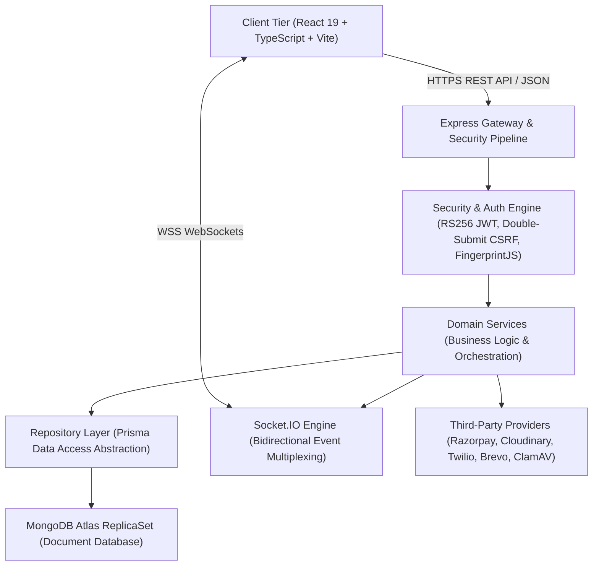
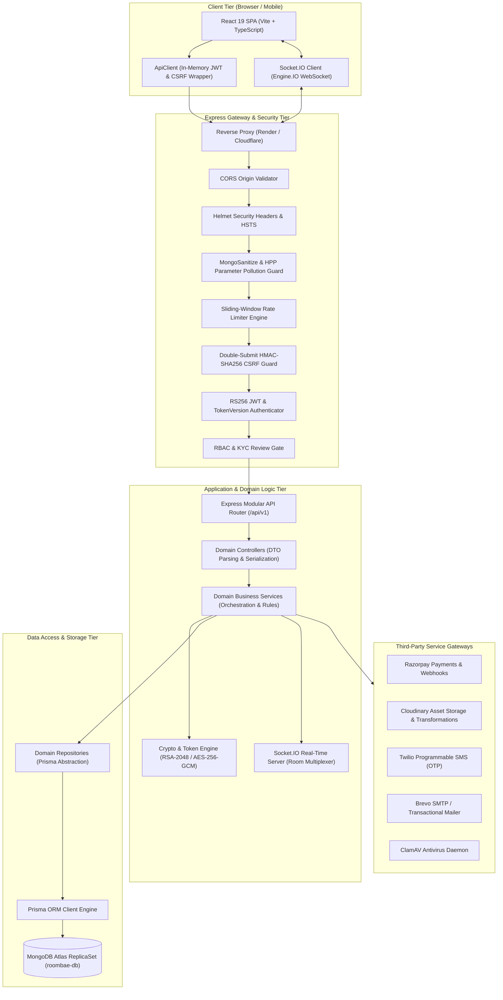
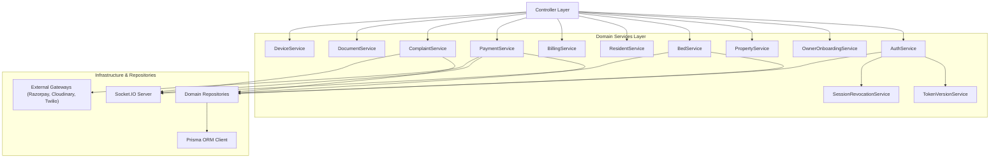
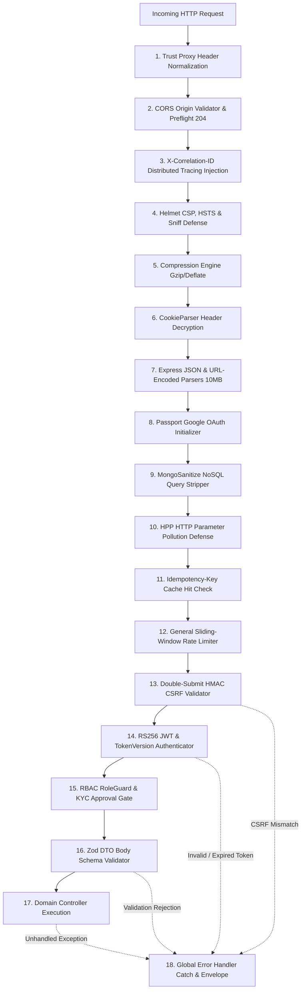
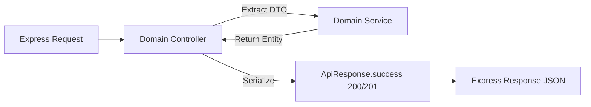
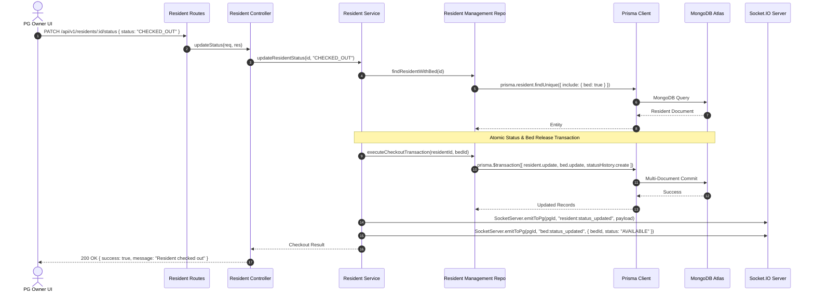
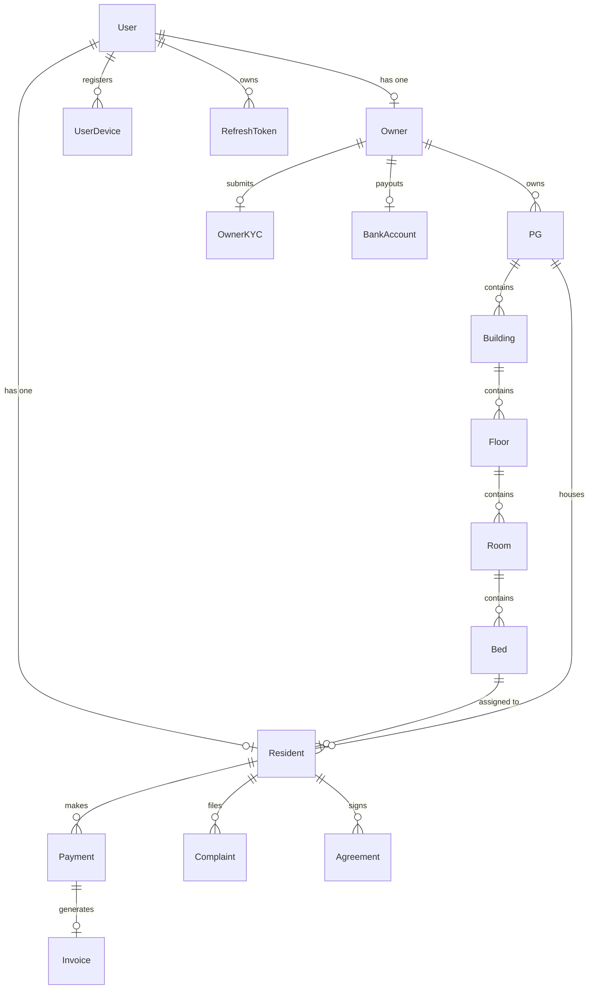
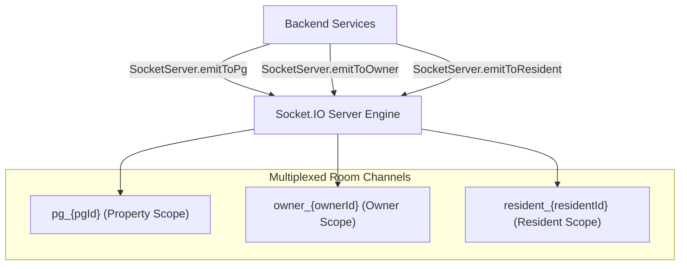
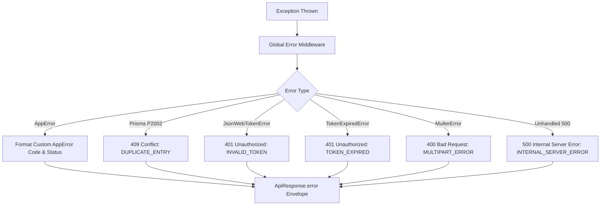
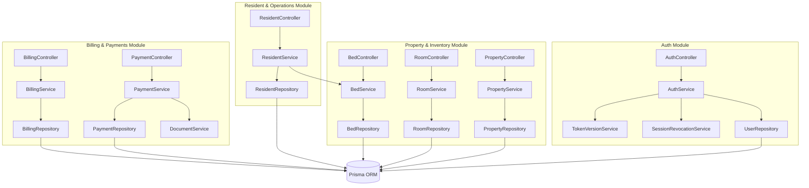

# 🏛️ RoomBae — Complete System, API, Services, Middleware & Communication Architecture (`SYSTEM.MD`)

> **Enterprise Technical Blueprint & Architecture Contract**  
> **Author**: Core Architecture & Security Engineering Team  
> **System**: RoomBae Enterprise PG & Coliving Automation Platform  
> **Target Audience**: Principal Architects, Backend Leads, DevOps Engineers, Senior Fullstack Engineers  
> **Revision**: `2.4.0-production`

---

## 📑 Table of Contents

1. [Introduction & Architectural Philosophy](#1-introduction--architectural-philosophy)
2. [Complete System Architecture](#2-complete-system-architecture)
3. [Frontend ↔ Backend Communication](#3-frontend--backend-communication)
4. [API Base URL Architecture](#4-api-base-url-architecture)
5. [CORS (Cross-Origin Resource Sharing) Architecture](#5-cors-cross-origin-resource-sharing-architecture)
6. [Backend Folder Architecture](#6-backend-folder-architecture)
7. [Services Layer Architecture](#7-services-layer-architecture)
8. [Middleware Layer Architecture](#8-middleware-layer-architecture)
9. [Controllers Layer Architecture](#9-controllers-layer-architecture)
10. [Complete REST API Documentation](#10-complete-rest-api-documentation)
11. [Frontend Pages → Backend Mapping](#11-frontend-pages--backend-mapping)
12. [CRUD Architecture & Operational Flows](#12-crud-architecture--operational-flows)
13. [Database Communication & Prisma ORM Layer](#13-database-communication--prisma-orm-layer)
14. [Request Lifecycle Pipeline](#14-request-lifecycle-pipeline)
15. [Response Lifecycle & Envelope Contracts](#15-response-lifecycle--envelope-contracts)
16. [Authentication & Authorization Architecture](#16-authentication--authorization-architecture)
17. [Socket.IO Real-Time Communication Architecture](#17-socketio-real-time-communication-architecture)
18. [External Service Integrations](#18-external-service-integrations)
19. [Environment Variable Architecture](#19-environment-variable-architecture)
20. [Error Handling Architecture](#20-error-handling-architecture)
21. [Module Dependency Architecture](#21-module-dependency-architecture)
22. [Complete API Inventory Master Catalog](#22-complete-api-inventory-master-catalog)
23. [Complete Project Repository Structure](#23-complete-project-repository-structure)

---

# 1. Introduction & Architectural Philosophy

RoomBae is architected as an **enterprise-grade, multi-tenant Coliving and Paying Guest (PG) property management ecosystem**. The platform automates property onboarding, building hierarchy management, room and bed allocations, resident lifecycle workflows, automated GST billing, Razorpay payments, KYC verifications, maintenance ticketing, and real-time operational notifications.

### 1.1 Architectural Paradigms



1. **Why REST API?**
   - REST over HTTPS provides a stateless, highly cacheable, deterministic interface for state-changing mutations and structured CRUD operations.
   - It facilitates standardized HTTP error semantics (`400`, `401`, `403`, `404`, `409`, `422`, `429`, `500`), idempotent request processing, and seamless client validation with Zod DTOs.

2. **Why Socket.IO Exists Alongside REST?**
   - While REST handles synchronous transactional execution (e.g., initiating payment orders or signing lease agreements), Socket.IO provides low-latency, bidirectional event distribution.
   - Real-time invalidation signals (e.g., `bed:status_updated`, `resident:status_updated`, `billing:payment_received`, `complaint:ticket_updated`) eliminate wasteful client polling and synchronize multi-tab / multi-user operational dashboards instantly.

3. **Why Service Layer Architecture?**
   - Controllers are strictly isolated from business logic; they only parse HTTP input parameters and return HTTP envelopes.
   - Domain services encapsulate pure business rules (e.g., fine calculation, GST tax split computation, double-booking race condition prevention, automated PDF document triggers), making the codebase modular, testable, and reusable across REST, WebSockets, and SOAP adapters.

4. **Why the Repository Pattern?**
   - The Repository Pattern decouples business logic from Prisma ORM query syntax.
   - It centralizes database aggregation pipelines, multi-document atomic transactions (`prisma.$transaction`), sorting criteria, and soft-delete filters behind strongly typed TypeScript interfaces.

5. **Prisma ORM & MongoDB Atlas Integration**
   - Prisma acts as a type-safe query engine generating deterministic MongoDB BSON queries while providing compile-time type safety.
   - MongoDB Atlas provides schema flexibility for complex nested models (such as building floors, bed histories, amenity tags, and dynamic metadata) combined with replica-set high availability and horizontal scalability.

6. **Scalability Philosophy (Redis-Free Authoritative Architecture)**
   - RoomBae avoids hard runtime dependencies on external caching clusters like Redis for session state.
   - Authoritative session versioning (`User.tokenVersion`), refresh token family chains, and bed hold locks are persisted directly in MongoDB Atlas with short-lived (10-second) in-memory fast-path caches in Node.js, guaranteeing zero stale authorization states across cluster restarts.

---

# 2. Complete System Architecture

### 2.1 Multi-Layered Component Diagram



### 2.2 Layer Responsibilities

1. **Client Tier (`frontend/src/`)**: Renders reactive user interfaces using Tailwind CSS and Lucide icons. Dispatches all network communication through a centralized `ApiClient` singleton. Never stores long-lived JWTs in `localStorage` to eliminate Cross-Site Scripting (XSS) token exfiltration vulnerabilities.
2. **Gateway Tier (`backend/src/middleware/`)**: Performs perimeter defense: validates CORS origins, enforces HTTP Strict Transport Security (HSTS), strips NoSQL query injections (`$`, `.`), enforces per-IP sliding rate limits, verifies signed double-submit CSRF cookies, and checks RS256 token validity against the user's live `tokenVersion`.
3. **Application & Domain Tier (`backend/src/modules/` & `backend/src/services/`)**: Enforces multi-tenant data isolation, executes financial pricing and tax calculations, coordinates atomic multi-document transactions, and broadcasts state updates to subscribed Socket.IO rooms.
4. **Data Access Tier (`backend/src/repositories/` & `backend/src/config/prisma.ts`)**: Encapsulates Prisma ORM queries, handles sparse index fallbacks, and executes atomic `$transaction` blocks across MongoDB collections.
5. **Integration Tier (`backend/src/services/`)**: Interfaces with Razorpay API (HMAC verification), Cloudinary (stream uploads), Twilio (SMS delivery), and Brevo (transactional email templates).

---

# 3. Frontend ↔ Backend Communication

### 3.1 Fetch Engine Architecture (`frontend/src/services/api.ts`)

The frontend uses a custom-built, resilient `ApiClient` wrapping the browser's native `fetch` API.

```typescript
class ApiClient {
  public async request<T = any>(endpoint: string, options: RequestInit = {}, isRetry: boolean = false): Promise<T> {
    const token = authService.getToken(); // In-memory JWT access
    const headers: Record<string, string> = {
      "Content-Type": "application/json",
      "Accept": "application/json",
      ...(options.headers as Record<string, string>),
    };

    if (token) {
      headers["Authorization"] = `Bearer ${token}`;
    }

    // Inject Device Identity from FingerprintJS
    try {
      const identity = await deviceIdentityProvider.getDeviceIdentity();
      if (identity?.visitorId) {
        headers["X-Visitor-Id"] = identity.visitorId;
      }
    } catch { /* graceful fallback */ }

    // Inject Double-Submit CSRF Token for State-Mutating Methods
    const method = (options.method || "GET").toUpperCase();
    if (["POST", "PUT", "PATCH", "DELETE"].includes(method)) {
      const csrfToken = authService.getCsrfToken();
      if (csrfToken) {
        headers["X-CSRF-Token"] = csrfToken;
      }
    }

    let res: Response = await fetch(`${API_CONFIG.BASE_URL}${endpoint}`, {
      ...options,
      headers,
      credentials: "include", // Transmits HttpOnly refreshToken cookie across origins
    });

    // Single-Flight 401 Refresh Queue Interceptor
    if (res.status === 401 && !isRetry && !endpoint.includes("/auth/login") && !endpoint.includes("/auth/refresh")) {
      try {
        const refreshed = await authService.refreshToken();
        if (refreshed?.accessToken) {
          authService.setToken(refreshed.accessToken);
          return this.request<T>(endpoint, options, true); // Replay original request
        }
      } catch {
        authService.clearToken();
      }
    }

    if (!res.ok) {
      const errorData = await res.json().catch(() => ({}));
      throw new Error(errorData.message || `HTTP ${res.status}`);
    }

    return await res.json();
  }
}
```

### 3.2 Key Communication Mechanisms

1. **In-Memory JWT Access Token**: Stored in a closure variable in `AuthService` (cleared on page reload or logout). Never written to `localStorage` or `sessionStorage`.
2. **HttpOnly Secure Refresh Token**: Issued by Express as a signed, HttpOnly, Secure, `SameSite=None` cookie (`refreshToken`), preventing JavaScript access.
3. **Double-Submit CSRF Protection**: A signed HMAC-SHA256 cookie (`csrf-token`) is read on boot via `GET /api/v1/auth/csrf-token` and attached as `X-CSRF-Token` header on all `POST`, `PUT`, `PATCH`, and `DELETE` requests.
4. **Single-Flight Refresh Token Queue**: When multiple parallel API requests encounter a `401 Unauthorized`, a mutex ensures only one refresh call is made to `/api/v1/auth/refresh-token`; all waiting requests are queued and replayed upon receipt of the new token.
5. **Cross-Tab Synchronization**: A native `BroadcastChannel('roombae-auth')` propagates `LOGIN`, `LOGOUT`, and `TOKEN_REFRESHED` events across all browser tabs without exposing raw token strings.
6. **Secure Multipart File Uploads**: Single file uploads use `multipart/form-data` with field name `file`; batch uploads use field name `files` (capped at 10 items, 10MB per file). Streamed directly through ClamAV virus scanning to Cloudinary.

---

# 4. API Base URL Architecture

RoomBae uses dynamic environment resolution in `frontend/src/config/env.ts` to determine the target API endpoint seamlessly between local development and production.

```typescript
// frontend/src/config/env.ts
const isDev = import.meta.env.DEV ?? import.meta.env.MODE === "development";
const isLocalhost = typeof window !== "undefined" && (window.location.hostname === "localhost" || window.location.hostname === "127.0.0.1");

const PROD_API_URL = "https://pg-management-system-boxb.onrender.com/api/v1";
const PROD_SOCKET_URL = "https://pg-management-system-boxb.onrender.com";

export const env = {
  API_URL:
    import.meta.env.VITE_API_URL ||
    import.meta.env.VITE_API_BASE_URL ||
    (isLocalhost || isDev ? "http://localhost:5000/api/v1" : PROD_API_URL),
  SOCKET_URL:
    import.meta.env.VITE_SOCKET_URL ||
    (isLocalhost || isDev ? "http://localhost:5000" : PROD_SOCKET_URL),
  MODE: import.meta.env.MODE ?? (isDev ? "development" : "production"),
  IS_DEV: isDev,
  IS_PROD: !isDev,
};
```

### Environment Comparison Matrix

| Environment Parameter | Local Development (`.env.development`) | Production Deployment (`.env.production`) |
| :--- | :--- | :--- |
| **Frontend URL** | `http://localhost:5173` | `https://ayushman-glb.github.io/PG-Management-System` |
| **Backend Root URL** | `http://localhost:5000` | `https://pg-management-system-boxb.onrender.com` |
| **REST API Base URL** | `http://localhost:5000/api/v1` | `https://pg-management-system-boxb.onrender.com/api/v1` |
| **Socket.IO Engine URL** | `ws://localhost:5000` | `wss://pg-management-system-boxb.onrender.com` |
| **SOAP ERP WSDL** | `http://localhost:5000/soap/billing?wsdl` | `https://pg-management-system-boxb.onrender.com/soap/billing?wsdl` |
| **Public JWKS URL** | `http://localhost:5000/.well-known/jwks.json`| `https://pg-management-system-boxb.onrender.com/.well-known/jwks.json` |
| **Cookie Security** | `SameSite=Lax; Secure=false; HttpOnly` | `SameSite=None; Secure=true; HttpOnly` |

---

# 5. CORS (Cross-Origin Resource Sharing) Architecture

### 5.1 Why CORS is Critical in RoomBae

Because the frontend is hosted on **GitHub Pages** (`https://ayushman-glb.github.io`) and the backend is deployed on **Render** (`https://pg-management-system-boxb.onrender.com`), all client requests cross top-level domain boundaries. The browser's Same-Origin Policy (SOP) blocks unauthorized cross-origin data reads unless explicitly permitted by backend CORS response headers.

### 5.2 Implementation Architecture (`backend/src/app.ts`)

```typescript
// Dynamic Origin Whitelisting & Normalization
const allowedOrigins = Array.from(
  new Set(
    [
      env.CLIENT_URL,
      env.FRONTEND_URL,
      "http://localhost:5173",
      "http://127.0.0.1:5173",
      "http://localhost:3000",
      "https://ayushman-glb.github.io",
      "https://ayushman-glb.github.io/PG-Management-System",
      "https://pg-management-system-boxb.onrender.com",
    ]
      .map((item) => {
        if (!item) return "";
        const trimmed = item.trim();
        try {
          if (trimmed.startsWith("http://") || trimmed.startsWith("https://")) {
            return new URL(trimmed).origin.toLowerCase();
          }
          return trimmed.replace(/\/$/, "").toLowerCase();
        } catch {
          return trimmed.replace(/\/$/, "").toLowerCase();
        }
      })
      .filter(Boolean)
  )
);

const corsMiddleware = cors({
  origin: (origin, callback) => {
    if (!origin) return callback(null, true); // Server-to-server or mobile app requests
    const cleanOrigin = origin.replace(/\/$/, "").toLowerCase();

    // In development mode, allow any localhost / 127.0.0.1 port
    const isLocalhost = /^https?:\/\/(localhost|127\.0\.0\.1)(:[0-9]+)?$/.test(cleanOrigin);
    if ((env.NODE_ENV || "development") === "development" && isLocalhost) {
      return callback(null, true);
    }

    const isAllowed = allowedOrigins.includes(cleanOrigin) || isLocalhost;
    if (isAllowed) {
      return callback(null, true);
    }
    // Return callback(null, false) without Error to avoid Express 500 crashes
    return callback(null, false);
  },
  credentials: true, // Allows HttpOnly cookies and authorization headers
  methods: ["GET", "POST", "PUT", "PATCH", "DELETE", "OPTIONS"],
  allowedHeaders: [
    "Content-Type", "Authorization", "X-Requested-With",
    "X-Visitor-Id", "X-Correlation-ID", "X-Request-ID", "X-CSRF-Token", "Accept"
  ],
  exposedHeaders: ["X-Correlation-ID", "X-Request-ID", "X-CSRF-Token", "Set-Cookie"],
  optionsSuccessStatus: 204, // Responds with 204 No Content on preflight OPTIONS
});

app.use(corsMiddleware);
app.options("*", corsMiddleware);
```

### 5.3 CORS Preflight Sequence Diagram

```mermaid
sequenceDiagram
    autonumber
    actor Browser as Client Browser (GitHub Pages)
    participant Gateway as Express Gateway (Render)
    participant Controller as Auth Controller

    Note over Browser, Gateway: Preflight Check (OPTIONS)
    Browser->>Gateway: OPTIONS /api/v1/auth/login<br/>Origin: https://ayushman-glb.github.io<br/>Access-Control-Request-Method: POST<br/>Access-Control-Request-Headers: Content-Type, Authorization, X-Visitor-Id, X-CSRF-Token
    Gateway->>Gateway: Matches Origin against allowedOrigins array
    Gateway-->>Browser: 204 No Content<br/>Access-Control-Allow-Origin: https://ayushman-glb.github.io<br/>Access-Control-Allow-Credentials: true<br/>Access-Control-Allow-Methods: GET,POST,PUT,PATCH,DELETE,OPTIONS<br/>Access-Control-Allow-Headers: Content-Type, Authorization, X-Visitor-Id, X-CSRF-Token

    Note over Browser, Gateway: Actual Request Execution
    Browser->>Gateway: POST /api/v1/auth/login (credentials: "include")<br/>Header: Authorization: Bearer <token><br/>Cookie: refreshToken=...; csrf-token=...
    Gateway->>Controller: Executes login pipeline
    Controller-->>Gateway: 200 OK Response Payload
    Gateway-->>Browser: 200 OK<br/>Access-Control-Allow-Origin: https://ayushman-glb.github.io<br/>Access-Control-Allow-Credentials: true<br/>Set-Cookie: refreshToken=...; SameSite=None; Secure; HttpOnly
```

---

# 6. Backend Folder Architecture

```text
backend/src/
├── app.ts                         # Core Express application assembly & security pipeline
├── server.ts                      # HTTP/HTTPS bootstrap, cluster manager, Socket.IO init
├── cluster.ts                     # Multi-core process cluster fork manager
├── config/                        # Configuration singletons (env, prisma, cloudinary, passport)
├── container/                     # Dependency Injection Container wiring services & repositories
├── controllers/                   # General controllers (Upload, Media, Dashboard, Residents)
├── infrastructure/                # Low-level infrastructure adapters (Crypto, PDF, OTP, SMS)
├── interfaces/                    # Domain interfaces & abstract contracts
├── jobs/                          # Scheduled cron jobs (Daily rent dues, auto-lock releases)
├── middleware/                    # HTTP interceptors (Auth, RBAC, KYC, RateLimit, CSRF, Idempotency)
├── modules/                       # Domain feature packages (Auth, Properties, Billing, etc.)
│   ├── agreements/                # Digital lease agreements & SVG signatures
│   ├── analytics/                 # Property occupancy & revenue intelligence
│   ├── applications/              # Tenant marketplace applications & vetting
│   ├── auth/                      # Primary authentication, sessions & 2FA
│   ├── beds/                      # Bed inventory slots & hold locks
│   ├── billing/                   # Invoicing, fine engines & tax split computations
│   ├── complaints/                # Maintenance tickets & Kanban tracking
│   ├── devices/                   # FingerprintJS device intelligence & trust scoring
│   ├── documents/                 # Centralized secure PDF streaming
│   ├── marketing/                 # Transactional email campaigns & templates
│   ├── messages/                  # Real-time tenant-owner chat messaging
│   ├── moveIn/                    # Move-in checklists & key handover guides
│   ├── notifications/             # In-app alerts & broadcast dispatchers
│   ├── owners/                    # 10-step owner onboarding wizard & bank info
│   ├── payments/                  # Razorpay orders, HMAC verification & webhooks
│   ├── phone-auth/                # Twilio SMS OTP authentication subsystem
│   ├── properties/                # PG properties & public marketplace search
│   ├── residents/                 # Resident directory & resident self-service portal
│   ├── rooms/                     # Room layouts & room transfer request workflows
│   ├── search/                    # Global full-text property & resident search
│   ├── settings/                  # Admin verification queue & account deletion
│   └── tours/                     # Property tour scheduling & shortlists
├── repositories/                  # Prisma data access abstractions
├── routes/                        # Central apiRouter.ts mounting all v1 domain modules
├── services/                      # Domain services & business logic orchestrators
│   ├── data/                      # Cascade update & data integrity services
│   ├── documents/                 # PDF generator & Cloudinary storage bridge
│   ├── email/                     # Brevo / SMTP transporter & HTML templates
│   ├── outbox/                    # Reliable transactional outbox event pattern
│   └── security/                  # RS256 JwtKeyService, TokenVersion, SessionRevocation
├── socket/                        # Socket.IO event handlers & room dispatchers
└── utils/                         # AppError, ApiResponse envelopes, Logger, Token Blacklist
```

### Folder Responsibilities Table

| Directory | Responsibility | Primary Dependents |
| :--- | :--- | :--- |
| `config/` | Validates environment schemas (Zod) and initializes Prisma & Cloudinary clients. | All modules & services |
| `container/` | IoC container; instantiates singletons and injects dependencies into controllers. | `routes/`, `app.ts` |
| `middleware/` | Executes cross-cutting security, authentication, and validation pipelines. | Express route definitions |
| `modules/` | Self-contained domain feature slices containing routes, controllers, services, and DTOs. | `apiRouter.ts`, `container/` |
| `repositories/`| Encapsulates Prisma ORM queries and multi-document transactions. | Domain services |
| `services/` | Executes business rules, pricing logic, calculations, and external API calls. | Controllers, Socket handlers |
| `socket/` | Manages real-time WebSockets, room subscriptions, and event broadcasts. | Domain services, UI clients |
| `infrastructure/`| Provides low-level crypto hashing, PDF generation (PDFKit), and SMS bridges. | Domain services |

---

# 7. Services Layer Architecture

Every business operation in RoomBae is orchestrated by a dedicated Domain Service.



### 7.1 Core Services Breakdown

#### 1. `AuthService` (`backend/src/modules/auth/auth.service.ts`)
- **Dependencies**: `IUserRepository`, `ITokenService`, `TokenVersionService`, `SessionRevocationService`, `EmailService`.
- **Key Methods**:
  - `register(dto)`: Validates email uniqueness, hashes password with Argon2/Bcrypt, creates User record, initializes SessionFamily, and returns tokens.
  - `login(identifier, password, rememberMe, ip, ua, visitorId)`: Validates credentials, verifies `accountStatus === 'ACTIVE'`, checks 2FA requirement, evaluates device risk, creates opaque refresh token, and returns RS256 access token.
  - `refreshToken(rawToken)`: Validates token family, detects token reuse (triggering immediate session compromise revocation), rotates refresh token, and issues fresh 15-minute RS256 access token.
  - `logoutAll(userId, ip, ua)`: Atomically increments `User.tokenVersion` in MongoDB and disconnects all active user WebSockets.

#### 2. `OwnerOnboardingService` (`backend/src/services/OwnerOnboardingService.ts`)
- **Dependencies**: `PrismaClient`, `EncryptionService`.
- **Key Methods**:
  - `onboard(dto)`: Executes a 10-step atomic `prisma.$transaction`: creates Owner, encrypts BankAccount and KYC data with AES-256-GCM, registers Business, provisions PG property, and builds Floor -> Room -> Bed inventory hierarchy.

#### 3. `BedService` (`backend/src/modules/beds/bed.service.ts`)
- **Dependencies**: `IBedRepository`, `SocketServer`.
- **Key Methods**:
  - `updateStatus(bedId, status)`: Transitions bed state (`AVAILABLE`, `OCCUPIED`, `MAINTENANCE`, `BLOCKED`), records `BedHistory`, and emits `bed:status_updated` to the property's Socket.IO room.
  - `createHold(bedId, reason, startDate)`: Acquires an optimistic hold lock on a bed, setting `lockExpiresAt` to prevent concurrent resident assignments.

#### 4. `PaymentService` (`backend/src/modules/payments/payment.service.ts`)
- **Dependencies**: `IPaymentRepository`, `BillingService`, `SocketServer`, `Razorpay`.
- **Key Methods**:
  - `createOrder(residentId, baseAmount, isInterstate)`: Computes GST split (CGST 9% + SGST 9% or IGST 18%), creates Razorpay order, generates draft `Payment` and `Invoice` records.
  - `verifyPayment(paymentId, orderId, paymentId, signature)`: Computes HMAC-SHA256 signature, validates authenticity against Razorpay secret, marks payment `PAID`, triggers asynchronous PDF invoice rendering, and emits `billing:payment_received`.

#### 5. `DocumentService` (`backend/src/modules/documents/documents.service.ts`)
- **Dependencies**: `PrismaClient`, `CloudinaryService`, `PdfKitInvoiceService`.
- **Key Methods**:
  - `downloadDocument(entityId, type, res)`: Streams pre-generated PDFs from Cloudinary CDN or compiles high-resolution PDFs on the fly using PDFKit, piping raw bytes directly to the HTTP response with `Content-Type: application/pdf`.

---

# 8. Middleware Layer Architecture

### 8.1 Complete Middleware Execution Pipeline



### 8.2 Detailed Middleware Specifications

| Middleware Name | File Location | Responsibility & Security Impact |
| :--- | :--- | :--- |
| `corsMiddleware` | `backend/src/app.ts` | Validates origin against whitelist, allows `credentials: true`, handles preflight with `204 No Content`. |
| `correlationIdMiddleware`| `backend/src/middleware/correlationIdMiddleware.ts` | Attaches unique UUID `req.correlationId` (`X-Correlation-ID`) for distributed log tracing. |
| `helmet` | `backend/src/app.ts` | Injects Content Security Policy, X-Frame-Options (`DENY`), X-Content-Type-Options (`nosniff`), and HSTS. |
| `mongoSanitize` | `backend/src/app.ts` | Strips prohibited characters (`$`, `.`) from request bodies to eliminate NoSQL injection attacks. |
| `hpp` | `backend/src/app.ts` | Prevents HTTP Parameter Pollution by rejecting duplicate query array injections. |
| `idempotencyMiddleware` | `backend/src/middleware/idempotencyMiddleware.ts` | Checks `Idempotency-Key` against `IdempotencyRequest` collection; returns cached response on replay. |
| `generalLimiter` | `backend/src/middleware/rateLimiter.ts` | Enforces 100 requests per 15 minutes per IP sliding-window threshold. |
| `validateCsrf` | `backend/src/middleware/csrfMiddleware.ts` | Compares `x-csrf-token` header against signed `csrf-token` cookie using `crypto.timingSafeEqual`. |
| `authenticate` | `backend/src/middleware/authMiddleware.ts` | Decodes RS256 JWT, checks token blacklist, and verifies user `tokenVersion` against MongoDB. |
| `authorize(roles...)` | `backend/src/middleware/authMiddleware.ts` | Enforces Role-Based Access Control (`SUPER_ADMIN`, `ADMIN`, `OWNER`, `RESIDENT`). |
| `requireKycApproved` | `backend/src/middleware/authMiddleware.ts` | Blocks unverified owners from listing public PGs or processing financial transactions. |
| `validate(Schema)` | `backend/src/middleware/validateMiddleware.ts` | Validates incoming JSON against Zod schemas; returns `400 Bad Request` with field error array. |
| `globalErrorHandler` | `backend/src/middleware/errorMiddleware.ts` | Catches unhandled errors, formats `ApiResponse.error`, masks production stack traces. |

---

# 9. Controllers Layer Architecture

Controllers act as lightweight HTTP adapters. They extract parameters (`req.body`, `req.params`, `req.query`), invoke Domain Services, and wrap results in standard `ApiResponse` envelopes.



### 9.1 Controllers Inventory

| Controller Name | File Location | Endpoints Handled | Injected Dependencies |
| :--- | :--- | :--- | :--- |
| `AuthController` | `backend/src/modules/auth/auth.controller.ts` | `/auth/*` (Login, Register, Refresh, Logout, 2FA, OAuth) | `IAuthService` |
| `PhoneAuthController` | `backend/src/modules/phone-auth/phoneAuth.controller.ts`| `/auth/phone/*` (SMS OTP, Resend, Verify) | `IPhoneAuthService` |
| `DeviceController` | `backend/src/modules/devices/device.controller.ts` | `/security/devices/*` (Identify, Trust, Revoke, Block) | `IDeviceService` |
| `OwnerController` | `backend/src/modules/owners/owner.controller.ts` | `/owners/*`, `/onboarding/*` (Full Onboarding, KYC, Bank) | `IOwnerService` |
| `PropertyController` | `backend/src/modules/properties/property.controller.ts` | `/properties/*` (Public Search, Add PG, Meal Plans) | `IPropertyService` |
| `RoomController` | `backend/src/modules/rooms/room.controller.ts` | `/rooms/*` (Convert Type, Room Transfers) | `IRoomService` |
| `BedController` | `backend/src/modules/beds/bed.controller.ts` | `/beds/*` (Status Updates, Bed Holds) | `IBedService` |
| `ResidentController` | `backend/src/modules/residents/resident.controller.ts` | `/residents/*` (Directory, Portal Me, Passes, Status) | `IResidentService` |
| `BillingController` | `backend/src/modules/billing/billing.controller.ts` | `/billing/*` (Fine Rules, Issue Fines, Waive Dues) | `IBillingService` |
| `PaymentController` | `backend/src/modules/payments/payment.controller.ts` | `/payments/*` (Create Order, Verify, Webhook, Refunds) | `IPaymentService` |
| `ComplaintController` | `backend/src/modules/complaints/complaint.controller.ts`| `/complaints/*` (File Ticket, Status Updates) | `IComplaintService` |
| `AgreementController` | `backend/src/modules/agreements/agreement.controller.ts`| `/agreements/*` (Generate Lease, SVG Sign, QR Verify) | `IAgreementService` |
| `DocumentController` | `backend/src/modules/documents/documents.controller.ts`| `/documents/*` (Invoice, Receipt, Agreement, KYC PDFs) | `IDocumentService` |
| `SearchController` | `backend/src/modules/search/search.controller.ts` | `/search` (Global Full-Text Multi-Entity Search) | `ISearchService` |
| `DashboardController` | `backend/src/controllers/dashboard.controller.ts` | `/dashboard/*` (Overview KPIs, Revenue, Occupancy) | `IDashboardService` |

---

# 10. Complete REST API Documentation

### 10.1 Authentication Endpoints

#### `POST /api/v1/auth/login`
- **Purpose**: Authenticates credentials, assesses device risk, and issues RS256 access token with HttpOnly refresh cookie.
- **Frontend Caller**: `frontend/src/features/auth/pages/Auth.tsx` (`LoginForm` component).
- **Route Handler**: `backend/src/modules/auth/auth.routes.ts` -> `AuthController.login`.
- **Middleware**: `loginLimiter` (10 req/15m), `validate(LoginSchema)`.
- **Request Payload**:
  ```json
  {
    "identifier": "owner@roombae.com",
    "password": "SecurePassword123!",
    "rememberMe": true,
    "visitorId": "f9028cb9e8172da0",
    "deviceLabel": "Chrome on Windows"
  }
  ```
- **Response Payload (`200 OK`)**:
  ```json
  {
    "success": true,
    "message": "Login successful",
    "data": {
      "user": {
        "id": "67b43a9b89c31e2b4f0011a1",
        "email": "owner@roombae.com",
        "name": "Vikram Malhotra",
        "role": "OWNER",
        "tokenVersion": 0
      },
      "accessToken": "eyJhbGciOiJSUzI1NiIsInR5cCI6IkpXVCJ9...",
      "deviceSecurity": {
        "isNewDevice": false,
        "status": "TRUSTED",
        "riskLevel": "LOW",
        "stepUpRequired": false
      }
    }
  }
  ```
- **Cookies Set**: `refreshToken` (`HttpOnly; Secure; SameSite=None; Max-Age=2592000`).

---

### 10.2 Financial & Payment Endpoints

#### `POST /api/v1/payments/create-order`
- **Purpose**: Generates a Razorpay payment order with automated GST tax split.
- **Frontend Caller**: `frontend/src/features/billing/components/PayRentModal.tsx`.
- **Route Handler**: `backend/src/modules/payments/payment.routes.ts` -> `PaymentController.createOrder`.
- **Middleware**: `authenticate`, `idempotencyMiddleware`, `validate(CreatePaymentOrderSchema)`.
- **Request Payload**:
  ```json
  {
    "residentId": "67b4450189c31e2b4f001401",
    "baseAmount": 12000,
    "isInterstate": false,
    "description": "Monthly Rent - August 2026"
  }
  ```
- **Response Payload (`201 Created`)**:
  ```json
  {
    "success": true,
    "message": "Payment order created",
    "data": {
      "paymentId": "67b4499089c31e2b4f001601",
      "invoiceNumber": "INV-2026-08-0089",
      "razorpayOrderId": "order_Qx91823kLm",
      "baseAmount": 12000,
      "cgstAmount": 1080,
      "sgstAmount": 1080,
      "totalAmount": 14160,
      "currency": "INR",
      "keyId": "rzp_test_TM4mpVud9kvppK"
    }
  }
  ```

---

# 11. Frontend Pages → Backend Mapping

| Frontend Route / Page | Component / Modal | Triggering Hook / Service | Target Endpoint | HTTP Method | Backend Controller |
| :--- | :--- | :--- | :--- | :--- | :--- |
| `/auth` | `LoginForm` | `useAuth().login()` | `/api/v1/auth/login` | `POST` | `AuthController.login` |
| `/auth` | `RegisterForm` | `useAuth().register()` | `/api/v1/auth/register` | `POST` | `AuthController.register` |
| `/auth` | `PhoneOtpModal` | `authService.sendPhoneOtp()` | `/api/v1/auth/phone/send-otp` | `POST` | `PhoneAuthController.sendOtp` |
| `/dashboard` | `BentoDashboard` | `api.getOwnerSummary()` | `/api/v1/dashboard/overview` | `GET` | `DashboardController.getOverview` |
| `/admin-console` | `AdminVerificationTable` | `api.getVerificationQueue()` | `/api/v1/settings/admin/verification-queue`| `GET` | `SettingsController.getVerificationQueue`|
| `/properties` | `PropertyGrid` | `api.getPublicProperties()` | `/api/v1/properties/public` | `GET` | `PropertyController.searchPublic` |
| `/residents` | `ResidentDirectoryTable` | `residentService.getDirectory()` | `/api/v1/residents/directory` | `GET` | `ResidentController.getDirectory` |
| `/resident-portal` | `PortalProfileHeader` | `residentService.getPortalMe()` | `/api/v1/residents/portal/me` | `GET` | `ResidentController.getPortalMe` |
| `/billing` | `PayRentModal` | `billingService.createOrder()` | `/api/v1/payments/create-order` | `POST` | `PaymentController.createOrder` |
| `/complaints` | `KanbanBoardView` | `api.getRoomTransferRequests()`| `/api/v1/rooms/transfer-requests` | `GET` | `RoomController.listTransferRequests` |
| `/operations` (Rooms) | `RoomConversionModal` | `api.convertRoomType()` | `/api/v1/rooms/:roomId/convert` | `PUT` | `RoomController.convertType` |
| `/operations` (Beds) | `BedHoldModal` | `bedService.createHold()` | `/api/v1/beds/holds` | `POST` | `BedController.createHold` |
| `/operations` (Settings)| `DeviceManagementSection`| `deviceService.getUserDevices()`| `/api/v1/security/devices` | `GET` | `DeviceController.getDevices` |

---

# 12. CRUD Architecture & Operational Flows

### 12.1 Resident Management CRUD Pipeline



---

# 13. Database Communication & Prisma ORM Layer

### 13.1 Schema Model Hierarchy (`backend/prisma/schema.prisma`)



### 13.2 Database Transaction Policies
- **Atomic Multi-Document Operations**: All compound actions (e.g. resident checkout, owner onboarding, room conversions) execute within `prisma.$transaction([ ... ])`.
- **Sparse Indexes**: Enforced via `ensureSparseIndexes.ts` on unique optional fields (`residentCode`, `googleSubId`, `aadhaarNumber`) to eliminate MongoDB duplicate `null` collisions.
- **Audit Trails**: Security actions write immutable logs to `security_audit_events` and `activity_logs`.

---

# 14. Request Lifecycle Pipeline

```text
[1. User Click / Form Submit]
      │
      ▼
[2. Zod Client Schema Validation]
      │
      ▼
[3. ApiClient Request Construction (Bearer JWT + X-Visitor-Id + X-CSRF-Token)]
      │
      ▼
[4. Reverse Proxy TLS Termination (Render Edge)]
      │
      ▼
[5. Express Gateway: CORS Check & Preflight 204]
      │
      ▼
[6. Helmet Security Headers & HSTS Enforcement]
      │
      ▼
[7. X-Correlation-ID Tracing UUID Injection]
      │
      ▼
[8. MongoSanitize NoSQL & HPP Sanitization]
      │
      ▼
[9. Sliding-Window Rate Limiter Evaluation]
      │
      ▼
[10. Double-Submit HMAC CSRF Verification]
      │
      ▼
[11. RS256 JWT Verification & TokenVersion Database Check]
      │
      ▼
[12. RBAC RoleGuard & KYC Status Authorization]
      │
      ▼
[13. Zod DTO Body Schema Validation]
      │
      ▼
[14. Domain Controller Parameter Extraction]
      │
      ▼
[15. Domain Service Business Logic Execution]
      │
      ▼
[16. Repository Prisma Query / Mongo Atomic Transaction]
      │
      ▼
[17. Socket.IO Real-Time Event Emission]
      │
      ▼
[18. Standard JSON Envelope Formatting (ApiResponse)]
      │
      ▼
[19. HTTP Response Dispatch]
      │
      ▼
[20. Frontend React State Update]
```

---

# 15. Response Lifecycle & Envelope Contracts

### 15.1 Unified Success Envelope

```json
{
  "success": true,
  "message": "Operation completed successfully",
  "data": {
    "id": "67b43a9b89c31e2b4f0011a1",
    "name": "Sunrise Luxury PG"
  },
  "meta": {
    "page": 1,
    "limit": 10,
    "total": 1
  }
}
```

### 15.2 Unified Error Envelope

```json
{
  "success": false,
  "message": "Authentication token has expired",
  "errors": [],
  "error": {
    "code": "TOKEN_EXPIRED",
    "message": "Authentication token has expired",
    "action": "refresh"
  }
}
```

---

# 16. Authentication & Authorization Architecture

### 16.1 RS256 Asymmetric Key Lifecycle

```mermaid
sequenceDiagram
    autonumber
    actor Client as Browser (React 19)
    participant Auth as Auth Controller
    participant KeyServ as JwtKeyService (RS256)
    participant DB as MongoDB Atlas

    Note over Client, DB: 1. Login Phase
    Client->>Auth: POST /api/v1/auth/login { identifier, password }
    Auth->>DB: Find User & Verify Hash
    Auth->>KeyServ: signAccessToken(payload, '15m')
    KeyServ-->>Auth: RS256 Signed JWT (Header: kid: rb_key_1)
    Auth->>DB: Create Opaque SHA-256 Refresh Token (SessionFamily)
    Auth-->>Client: Set-Cookie: refreshToken=...; HttpOnly; Secure<br/>Body: { accessToken: "eyJ..." }

    Note over Client, DB: 2. Authenticated Request
    Client->>Auth: GET /api/v1/residents/directory<br/>Header: Authorization: Bearer <accessToken>
    Auth->>KeyServ: verifyAccessToken(token) -> Verifies with RSA Public Key
    Auth->>DB: Check User.tokenVersion == decoded.tokenVersion
    Auth-->>Client: 200 OK Directory Data
```

---

# 17. Socket.IO Real-Time Communication Architecture

### 17.1 Room Partitioning & Event Channels



| Event Name | Scope / Target Room | Triggering Service | Client Consumer |
| :--- | :--- | :--- | :--- |
| `bed:status_updated` | `pg_{pgId}` | `BedService.updateStatus` | Bed Management Grid |
| `resident:status_updated`| `pg_{pgId}` | `ResidentService.updateStatus`| Residents Directory |
| `billing:payment_received`| `owner_{ownerId}` | `PaymentService.verifyPayment` | Billing Overview |
| `complaint:ticket_created`| `owner_{ownerId}` | `ComplaintService.create` | Maintenance Kanban |
| `complaint:ticket_updated`| `resident_{residentId}`| `ComplaintService.updateStatus`| Resident Portal |
| `room:transfer_request_updated`| `owner_{ownerId}` | `RoomService.createTransfer` | Room Transfer Board |

---

# 18. External Service Integrations

1. **Razorpay Payments**:
   - Order creation via REST API.
   - Cryptographic verification via HMAC-SHA256 signature calculation.
   - Webhook processor for asynchronous status capture.
2. **Cloudinary CDN**:
   - Streaming media buffer uploads with automatic quality and format optimization (`f_auto, q_auto`).
   - Secure PDF and KYC document storage.
3. **Twilio Programmable SMS**:
   - Dispatches 6-digit phone verification OTPs via Twilio REST API.
4. **Brevo SMTP / Nodemailer**:
   - Transports transactional verification emails, password resets, and GST invoices using HTML templates.
5. **ClamAV Antivirus Daemon**:
   - Streams multipart file buffers through ClamAV socket to block malware before Cloudinary storage.
6. **FingerprintJS Pro**:
   - Evaluates device visitor IDs and computes risk scores to prevent credential stuffing.

---

# 19. Environment Variable Architecture

*(All secret tokens and private keys are masked with `********` for security).*

| Variable Name | Local (`.env.development`) | Production (`.env.production`) | Purpose / Component |
| :--- | :--- | :--- | :--- |
| `PORT` | `5000` | `5000` | Express server port |
| `NODE_ENV` | `development` | `production` | Environment switch |
| `CLIENT_URL` | `http://localhost:5173` | `https://ayushman-glb.github.io/PG-Management-System` | CORS allowed origin |
| `API_BASE_URL` | `http://localhost:5000` | `https://pg-management-system-boxb.onrender.com` | Root API host |
| `DATABASE_URL` | `mongodb+srv://********@pgm.7dp53y4.mongodb.net/roombae-db?...` | `mongodb+srv://********@pgm.7dp53y4.mongodb.net/roombae-db?...` | MongoDB Atlas URI |
| `JWT_SECRET` | `********` *(64 hex)* | `********` *(64 hex)* | JWT fallback & OAuth signing |
| `JWT_REFRESH_SECRET` | `********` *(64 hex)* | `********` *(64 hex)* | Refresh token HMAC secret |
| `CSRF_SECRET` | `********` *(64 hex)* | `********` *(64 hex)* | Double-submit CSRF secret |
| `SOAP_BILLING_API_KEY`| `********` *(64 hex)* | `********` *(64 hex)* | SOAP `/soap/billing` API key |
| `CLOUDINARY_CLOUD_NAME`| `RoomBae` | `RoomBae` | Cloudinary account |
| `CLOUDINARY_API_KEY` | `********` | `********` | Cloudinary API Key |
| `CLOUDINARY_API_SECRET`| `********` | `********` | Cloudinary API Secret |
| `RAZORPAY_KEY_ID` | `rzp_test_TQlnZDKJSAnPV0` | `rzp_live_********` | Razorpay Client ID |
| `RAZORPAY_KEY_SECRET` | `********` | `********` | Razorpay API Secret |
| `TWILIO_ACCOUNT_SID` | `AC********` | `AC********` | Twilio SID |
| `TWILIO_AUTH_TOKEN` | `********` | `********` | Twilio Auth Token |
| `MAIL_HOST` | `smtp.gmail.com` | `smtp-relay.brevo.com` | SMTP Host |
| `MAIL_PORT` | `587` | `587` | SMTP Port |
| `MAIL_USER` | `ayushmansaha917@gmail.com` | `ayushman@globussoft.in` | SMTP Auth User |
| `MAIL_APP_PASSWORD` | `********` | `********` | SMTP Auth Password |

---

# 20. Error Handling Architecture

RoomBae uses a centralized `AppError` class and global error handler in `backend/src/middleware/errorMiddleware.ts`.



---

# 21. Module Dependency Architecture



---

# 22. Complete API Inventory Master Catalog

| Method | Endpoint | Primary Controller | Business Service | Middleware Applied | Authentication |
| :--- | :--- | :--- | :--- | :--- | :--- |
| `GET` | `/health` | Health Check | System Probe | None | Public |
| `GET` | `/.well-known/jwks.json` | `JwksService` | `JwtKeyService` | None | Public |
| `GET` | `/soap/billing?wsdl` | `setupSoapServer` | `BillingService` | None | Public |
| `POST` | `/soap/billing` | `soapServiceImplementation`| `BillingService` | `soapBillingLimiter`, `soapBillingAuth`, `soapXxePreFilter` | `X-API-Key` |
| `GET` | `/api/v1/auth/csrf-token` | CSRF Middleware | `createSignedCsrfToken` | `csrfBootstrapLimiter` | Public |
| `POST` | `/api/v1/auth/register` | `AuthController` | `AuthService` | `registerLimiter`, `validate(RegisterSchema)` | Public |
| `POST` | `/api/v1/auth/login` | `AuthController` | `AuthService` | `loginLimiter`, `validate(LoginSchema)` | Public |
| `POST` | `/api/v1/auth/refresh-token` | `AuthController` | `AuthService` | `refreshTokenLimiter`, `validateCsrf` | Cookie |
| `POST` | `/api/v1/auth/logout` | `AuthController` | `AuthService` | `validateCsrf` | Optional |
| `POST` | `/api/v1/auth/logout-all` | `AuthController` | `SessionRevocationService` | `authenticate`, `validateCsrf` | Bearer JWT |
| `GET` | `/api/v1/auth/me` | `AuthController` | `AuthService` | `authenticate` | Bearer JWT |
| `POST` | `/api/v1/auth/phone/send-otp` | `PhoneAuthController` | `PhoneAuthService` | `sendOtpLimiter`, `validate(SendOtpSchema)` | Public |
| `POST` | `/api/v1/auth/phone/verify-otp`| `PhoneAuthController` | `PhoneAuthService` | `verifyOtpLimiter`, `validate(VerifyOtpSchema)` | Public |
| `POST` | `/api/v1/security/devices/identify`| `DeviceController` | `DeviceService` | `authenticate` | Bearer JWT |
| `GET` | `/api/v1/security/devices` | `DeviceController` | `DeviceService` | `authenticate` | Bearer JWT |
| `PATCH` | `/api/v1/security/devices/:id/trust`| `DeviceController` | `DeviceService` | `authenticate` | Bearer JWT |
| `POST` | `/api/v1/security/devices/:id/revoke`| `DeviceController` | `DeviceService` | `authenticate` | Bearer JWT |
| `POST` | `/api/v1/owners/onboard` | `OwnerController` | `OwnerOnboardingService` | `authenticate`, `authorize(OWNER)` | Bearer JWT (Owner) |
| `GET` | `/api/v1/properties/public` | `PropertyController` | `PropertyService` | None | Public |
| `POST` | `/api/v1/properties` | `PropertyController` | `PropertyService` | `authenticate`, `authorize(OWNER)`, `requireKycApproved` | Bearer JWT (Owner) |
| `PUT` | `/api/v1/rooms/:id/convert` | `RoomController` | `RoomService` | `authenticate`, `authorize(OWNER)` | Bearer JWT (Owner) |
| `POST` | `/api/v1/rooms/transfer-requests`| `RoomController` | `RoomService` | `authenticate` | Bearer JWT |
| `PUT` | `/api/v1/beds/:id/status` | `BedController` | `BedService` | `authenticate`, `authorize(OWNER)` | Bearer JWT (Owner) |
| `POST` | `/api/v1/beds/holds` | `BedController` | `BedService` | `authenticate`, `authorize(OWNER)` | Bearer JWT (Owner) |
| `DELETE`| `/api/v1/beds/holds/:id` | `BedController` | `BedService` | `authenticate`, `authorize(OWNER)` | Bearer JWT (Owner) |
| `GET` | `/api/v1/residents/directory`| `ResidentController` | `ResidentService` | `authenticate`, `authorize(OWNER, ADMIN)` | Bearer JWT |
| `GET` | `/api/v1/residents/portal/me`| `ResidentController` | `ResidentService` | `authenticate`, `authorize(RESIDENT)` | Bearer JWT |
| `POST` | `/api/v1/residents/onboard` | `ResidentController` | `ResidentService` | `authenticate` | Bearer JWT |
| `PATCH` | `/api/v1/residents/:id/status`| `ResidentController` | `ResidentService` | `authenticate`, `authorize(OWNER)` | Bearer JWT (Owner) |
| `POST` | `/api/v1/payments/create-order`| `PaymentController` | `PaymentService` | `authenticate`, `idempotencyMiddleware` | Bearer JWT |
| `POST` | `/api/v1/payments/verify` | `PaymentController` | `PaymentService` | `authenticate`, `idempotencyMiddleware` | Bearer JWT |
| `POST` | `/api/v1/payments/webhook` | `PaymentController` | `PaymentService` | None (Webhook HMAC Verified) | Razorpay Sig |
| `GET` | `/api/v1/documents/invoice/:id`| `DocumentController` | `DocumentService` | `authenticate` | Bearer JWT |
| `GET` | `/api/v1/documents/agreement/:id`| `DocumentController` | `DocumentService` | `authenticate` | Bearer JWT |
| `POST` | `/api/v1/complaints` | `ComplaintController` | `ComplaintService` | `authenticate` | Bearer JWT |
| `PUT` | `/api/v1/complaints/:id/status`| `ComplaintController` | `ComplaintService` | `authenticate`, `authorize(OWNER)` | Bearer JWT (Owner) |
| `POST` | `/api/v1/media/upload/single`| `MediaController` | `CloudinaryService` | `authenticate`, `uploadLimiter`, `multer` | Bearer JWT |

---

# 23. Complete Project Repository Structure

```text
PG-Management-System/
├── .agents/                           # AI pair programming rules & developer profiles
├── .env.example                       # Environment template with dummy variables
├── api_design.md                      # Authoritative REST API catalog & design reference
├── SYSTEM.MD                          # Authoritative System & Communication Architecture (This file)
│
├── frontend/                          # Client Application (React 19 + TypeScript + Vite)
│   ├── index.html                     # HTML Entry Point
│   ├── package.json                   # Dependencies & Scripts
│   ├── tsconfig.json                  # TypeScript Compiler Configuration
│   ├── vite.config.ts                 # Vite Bundler & Path Alias Configuration
│   ├── .env.development               # Local Frontend Environment Variables
│   ├── .env.production                # Production Frontend Environment Variables
│   └── src/
│       ├── main.tsx                   # React DOM Root Injection
│       ├── app/                       # Application Core (App.tsx, routes.tsx, providers.tsx)
│       ├── components/                # Shared UI Components (Modals, Buttons, Skeletons, Layouts)
│       ├── config/                    # Environment & API Configurations (env.ts, api.ts)
│       ├── features/                  # Domain-Driven Feature Slices
│       │   ├── analytics/             # Revenue & Occupancy Intelligence Views
│       │   ├── auth/                  # Login, Register, 2FA, OTP Modals
│       │   ├── beds/                  # Bed Matrix & Bed Management Modals
│       │   ├── billing/               # Invoices, Payment History, PayRentModal
│       │   ├── complaints/            # Maintenance Tickets & Kanban Boards
│       │   ├── dashboard/             # Bento Dashboard & Admin Console
│       │   ├── operations/            # Room, Bed, Visitor, and Operations Management
│       │   ├── owners/                # 10-Step Owner Onboarding Wizard
│       │   ├── properties/            # Public Marketplace, PG Listing & Details
│       │   ├── residents/             # Resident Directory & Resident Self-Service Portal
│       │   ├── rooms/                 # Room Layouts & Transfer Modals
│       │   ├── search/                # Tours, Shortlists, Applications, Chat Messaging
│       │   └── settings/              # FingerprintJS Device Management & Security
│       ├── hooks/                     # Custom Hooks (useAuth, useDocumentDownload, useRealtime)
│       ├── services/                  # Typed API Client & Service Wrappers (api.ts, auth.service.ts)
│       └── theme/                     # Dark / Light Theme Context & CSS Design Tokens
│
└── backend/                           # Backend Application (Node.js + Express + Prisma + MongoDB)
    ├── package.json                   # Dependencies & Scripts
    ├── tsconfig.json                  # TypeScript Compiler Configuration
    ├── .env.development               # Local Backend Environment Variables
    ├── .env.production                # Production Backend Environment Variables
    ├── prisma/
    │   ├── schema.prisma              # Authoritative MongoDB Data Models & Collections
    │   └── seed.ts                    # Development Data Seeder
    └── src/
        ├── app.ts                     # Core Express App Assembly & Security Pipeline
        ├── server.ts                  # Server Bootstrap, DNS Validation & Socket.IO Init
        ├── cluster.ts                 # Multi-core Cluster Fork Manager
        ├── config/                    # Environment (Zod), Prisma, Cloudinary, Passport Configs
        ├── container/                 # Dependency Injection Container wiring services & repos
        ├── controllers/               # Dashboard, Media, Upload, Resident Controllers
        ├── infrastructure/            # Crypto, PDFKit, Twilio, Nodemailer Infrastructure
        ├── interfaces/                # TypeScript Contracts & Interfaces
        ├── jobs/                      # Background Cron Jobs (Rent dues, auto-lock releases)
        ├── middleware/                # Auth, RBAC, KYC, RateLimiter, CSRF, Idempotency Middlewares
        ├── modules/                   # 22+ Domain Feature Packages
        ├── repositories/              # Prisma Data Access Repositories
        ├── routes/                    # apiRouter.ts Central Route Registry
        ├── services/                  # Business Logic Domain Services
        ├── socket/                        # Socket.IO Real-Time Server & Room Handlers
        └── utils/                     # ApiResponse, AppError, Logger, Token Blacklist
```

---

> **End of Technical Blueprint** — Maintainer: RoomBae Core Architecture & Engineering Team (`v2.4.0`)
