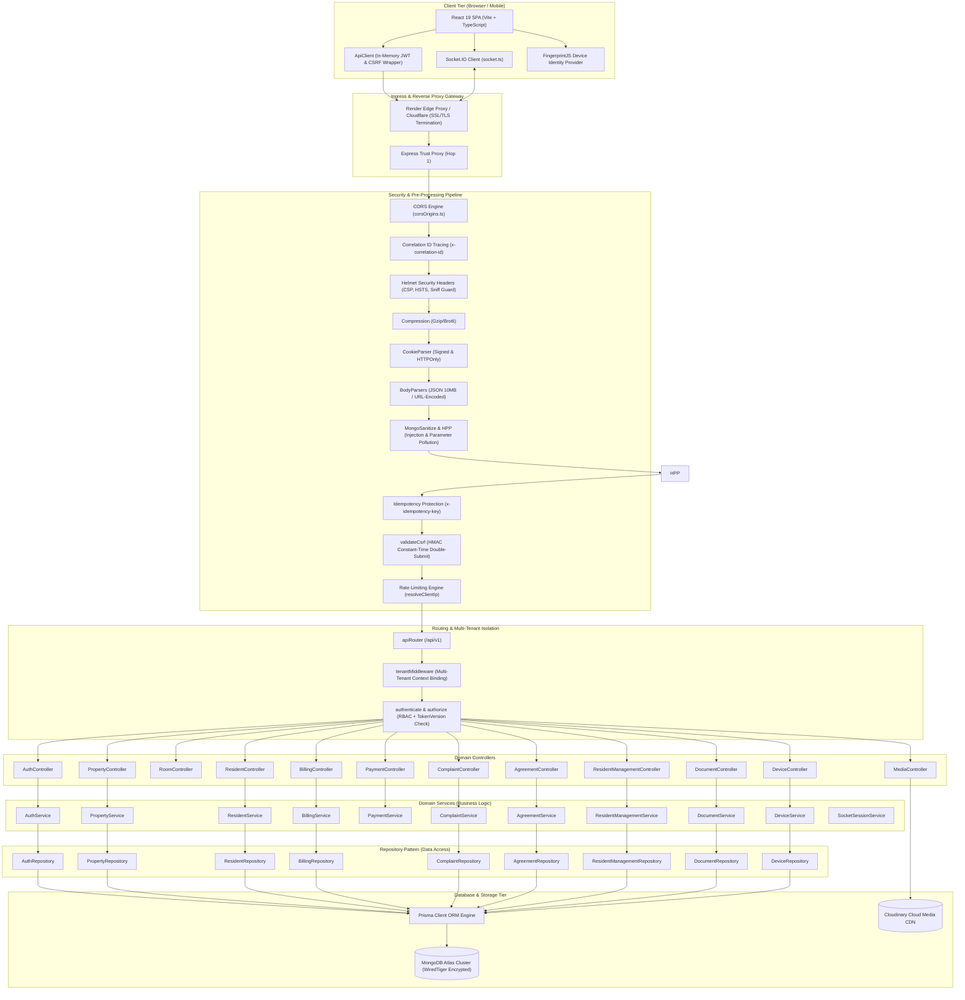
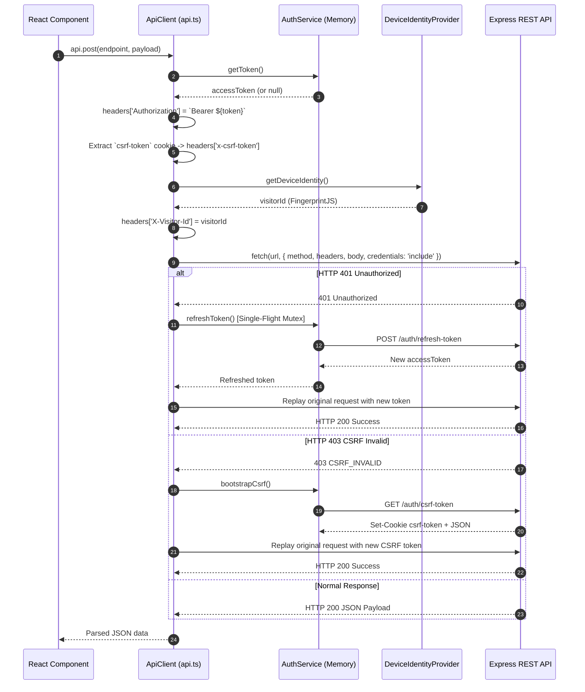
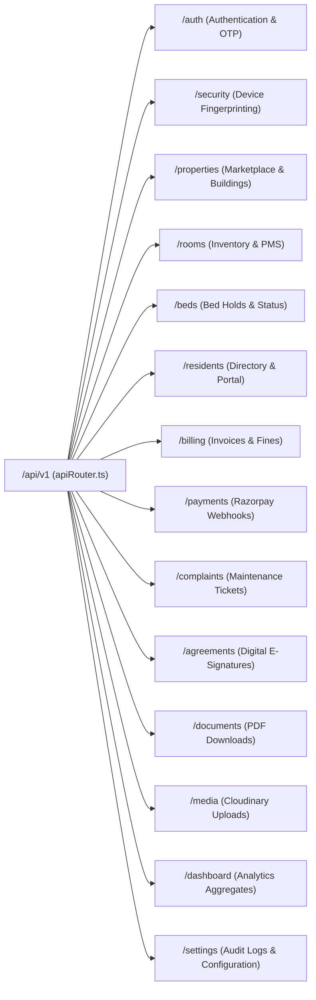
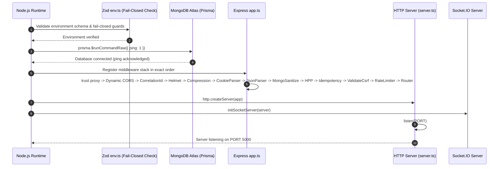
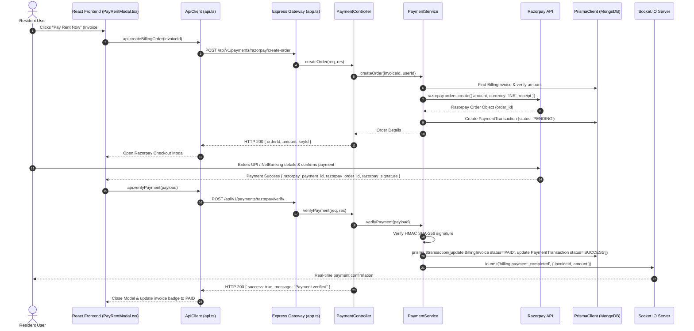
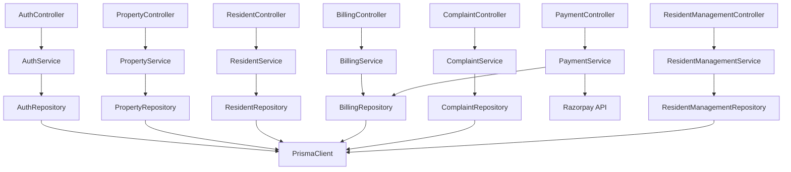

# 🏛️ RoomBae — Complete System, API, Services, Middleware & Communication Architecture (`SYSTEM.MD`)

> **Enterprise Technical Architecture Blueprint & Implementation Contract**  
> **Author**: Core Architecture & Security Engineering Team  
> **System**: RoomBae Enterprise PG & Coliving Automation Platform  
> **Target Audience**: Principal Architects, Backend Leads, DevOps Engineers, Senior Fullstack Engineers, Security Auditors  
> **Revision**: `3.0.0-production`

---

## 📑 Master Table of Contents

1. [Introduction & Architectural Philosophy](#1-introduction--architectural-philosophy)
2. [Complete System Architecture & Topological Diagrams](#2-complete-system-architecture--topological-diagrams)
3. [Frontend → Backend Communication Engine](#3-frontend--backend-communication-engine)
4. [Frontend Pages → Backend Feature Mapping Matrix](#4-frontend-pages--backend-feature-mapping-matrix)
5. [Complete API Architecture & Domain Boundaries](#5-complete-api-architecture--domain-boundaries)
6. [API URL & Environment Architecture](#6-api-url--environment-architecture)
7. [Enterprise CORS & Cross-Site Security Architecture](#7-enterprise-cors--cross-site-security-architecture)
8. [Server Initialization & Internal Lifecycle Pipeline](#8-server-initialization--internal-lifecycle-pipeline)
9. [Backend Directory & Modular Component Architecture](#9-backend-directory--modular-component-architecture)
10. [Middleware Architecture & Execution Pipeline](#10-middleware-architecture--execution-pipeline)
11. [Controller Layer Architecture](#11-controller-layer-architecture)
12. [Service Layer Architecture & Domain Logic](#12-service-layer-architecture--domain-logic)
13. [Repository Pattern & Data Access Layer](#13-repository-pattern--data-access-layer)
14. [Database Communication & MongoDB Atlas ReplicaSet Layer](#14-database-communication--mongodb-atlas-replicaset-layer)
15. [Complete CRUD Operational Communication Flows](#15-complete-crud-operational-communication-flows)
16. [End-to-End Request Lifecycle Pipelines](#16-end-to-end-request-lifecycle-pipelines)
17. [Response Lifecycle & Envelope Contracts](#17-response-lifecycle--envelope-contracts)
18. [Authentication, Authorization & Session Security Architecture](#18-authentication-authorization--session-security-architecture)
19. [Socket.IO & Real-Time Communication Architecture](#19-socketio--real-time-communication-architecture)
20. [External Third-Party Service Integrations](#20-external-third-party-service-integrations)
21. [Environment Variable Matrix & Configuration Contracts](#21-environment-variable-matrix--configuration-contracts)
22. [Enterprise Error Handling & Resilience Architecture](#22-enterprise-error-handling--resilience-architecture)
23. [Module Dependency Architecture](#23-module-dependency-architecture)
24. [Master API Route & Operational Inventory](#24-master-api-route--operational-inventory)

---

# 1. Introduction & Architectural Philosophy

RoomBae is an enterprise-grade multi-tenant Coliving and Paying Guest (PG) property management ecosystem. The platform automates property onboarding, building hierarchy management, room and bed allocations, resident lifecycle workflows, automated GST billing, Razorpay payments, KYC verifications, maintenance ticketing, and real-time operational notifications.

### 1.1 Architectural Paradigms


1. **Why REST API?**
   - REST over HTTPS provides a stateless, highly cacheable, deterministic interface for state-changing mutations and structured CRUD operations.
   - It facilitates standardized HTTP error semantics (`400`, `401`, `403`, `404`, `409`, `422`, `429`, `500`), idempotent request processing, and seamless client validation with Zod DTOs.
2. **Why Socket.IO Exists Alongside REST?**
   - While REST handles synchronous transactional execution (e.g., initiating payment orders or signing lease agreements), Socket.IO provides low-latency, bidirectional event distribution.
   - Real-time invalidation signals (e.g., `bed:status_updated`, `resident:status_updated`, `billing:payment_completed`, `complaint:status_updated`) eliminate wasteful client polling and synchronize multi-tab / multi-user operational dashboards instantly.
3. **Why Service Layer Architecture?**
   - Controllers are strictly isolated from business logic; they only parse HTTP input parameters and return HTTP envelopes.
   - Domain services encapsulate pure business rules (e.g., fine calculation, GST tax split computation, double-booking race condition prevention, automated PDF document triggers), making the codebase modular, testable, and reusable across REST, WebSockets, and SOAP adapters.
4. **Why the Repository Pattern?**
   - The Repository Pattern decouples business logic from Prisma ORM query syntax.
   - It centralizes database aggregation pipelines, multi-document atomic transactions (`prisma.$transaction`), sorting criteria, and soft-delete filters behind strongly typed TypeScript interfaces.
5. **Prisma ORM & MongoDB Atlas Integration**
   - Prisma acts as a type-safe query engine generating deterministic MongoDB BSON queries while providing compile-time type safety.
   - MongoDB Atlas provides schema flexibility for complex nested models (such as building floors, bed histories, amenity tags, and dynamic metadata) combined with replica-set high availability and horizontal scalability.
6. **Scalability Philosophy (Redis-Free Authoritative Architecture)**
   - RoomBae avoids hard runtime dependencies on external caching clusters like Redis for session state.
   - Authoritative session versioning (`User.tokenVersion`), refresh token family chains, and bed hold locks are persisted directly in MongoDB Atlas with short-lived (10-second) in-memory fast-path caches in Node.js, guaranteeing zero stale authorization states across cluster restarts.

---

# 2. Complete System Architecture & Topological Diagrams

### 2.1 Multi-Layered Component Diagram



---

# 3. Frontend → Backend Communication Engine

### 3.1 `ApiClient` Core Architecture (`frontend/src/services/api.ts`)

RoomBae frontend encapsulates all HTTP communication through a singleton `ApiClient` class providing:
1. **In-Memory JWT Injection**: Attaches `Authorization: Bearer <accessToken>` retrieved from `authService.getToken()`. Tokens are never read directly from `localStorage` in request headers, mitigating XSS token extraction.
2. **Double-Submit CSRF Attachment**: For all state-mutating methods (`POST`, `PUT`, `PATCH`, `DELETE`), automatically extracts `csrf-token` from `document.cookie` and attaches the `x-csrf-token` header.
3. **Single-Flight 401 Refresh Mutex**: If an API request returns HTTP 401 Unauthorized, `ApiClient` triggers `authService.refreshToken()`. Concurrent requests wait on the same `refreshPromise`, preventing race conditions during refresh token rotation. Once refreshed, the original request is automatically replayed with the new token.
4. **Automatic 403 CSRF Recovery**: If a request receives HTTP 403 with `CSRF_INVALID` or `CSRF_MISSING`, `ApiClient` automatically invokes `authService.bootstrapCsrf()`, obtains a fresh signed token, and replays the request once.
5. **Cross-Site Credentials**: Configures `credentials: "include"` on all fetch calls to ensure secure cookies (`refreshToken`, `csrf-token`) are passed across origins.
6. **Network Error Discrimination**: Differentiates between browser CORS/network connectivity blocks and structured application errors.

### 3.2 Request Interception & Transformation Flow



---

# 4. Frontend Pages → Backend Feature Mapping Matrix

| Frontend Page / Route | Triggering Component / Element | Custom Hook / Service Call | Frontend API Method | Backend Endpoint & Method | Controller & Service Invoked | Database Model / Collection |
|---|---|---|---|---|---|---|
| **Auth** (`/auth`) | `LoginForm.tsx` (Submit Button) | `useAuth()` | `api.login({ identifier, password })` | `POST /api/v1/auth/login` | `AuthController.login` → `AuthService.login` | `User`, `RefreshToken`, `UserDevice` |
| **Auth** (`/auth`) | `RegisterForm.tsx` (Submit Button) | `useAuth()` | `api.register(payload)` | `POST /api/v1/auth/register` | `AuthController.register` → `AuthService.register` | `User`, `OwnerProfile`, `RefreshToken` |
| **Auth** (`/auth`) | `OtpModal.tsx` (Send OTP) | `useAuth()` | `api.sendOtp({ phone })` | `POST /api/v1/auth/send-otp` | `AuthController.sendOtp` → `AuthService.sendOtp` | `OtpToken`, `User` |
| **Auth** (`/auth`) | `OtpModal.tsx` (Verify OTP) | `useAuth()` | `api.verifyOtp({ phone, otp })` | `POST /api/v1/auth/verify-otp` | `AuthController.verifyOtp` → `AuthService.verifyOtp` | `OtpToken`, `User`, `RefreshToken` |
| **Dashboard** (`/dashboard`) | `Dashboard.tsx` (Mount) | `useDashboard()` | `api.get('/dashboard/overview')` | `GET /api/v1/dashboard/overview` | `DashboardController.getOverview` → `PropertyService.getOverview` | `PGProperty`, `Room`, `Bed`, `Resident` |
| **Dashboard** (`/dashboard`) | `RevenueChart.tsx` (Mount) | `useAnalytics()` | `api.get('/dashboard/revenue')` | `GET /api/v1/dashboard/revenue` | `DashboardController.getRevenueAnalytics` → `BillingService.getRevenueAnalytics` | `BillingInvoice`, `PaymentTransaction` |
| **Dashboard** (`/dashboard`) | `OccupancyCard.tsx` (Mount) | `useAnalytics()` | `api.get('/dashboard/occupancy')` | `GET /api/v1/dashboard/occupancy` | `DashboardController.getOccupancyAnalytics` → `ResidentService.getOccupancy` | `Bed`, `Room`, `Resident` |
| **PG Listing** (`/explore`) | `PGListing.tsx` (Search Filters) | `usePublicProperties()` | `api.getPublicProperties(params)` | `GET /api/v1/properties/search` | `PropertyController.searchPublic` → `PropertyService.searchPublic` | `PGProperty`, `Room` |
| **PG Details** (`/pg/:id`) | `PGDetails.tsx` (Mount) | `usePropertyDetails(id)` | `api.getPropertyById(id)` | `GET /api/v1/properties/:id` | `PropertyController.getById` → `PropertyService.getById` | `PGProperty`, `Room`, `Bed`, `OwnerProfile` |
| **Properties** (`/properties`) | `AddPropertyModal.tsx` (Save) | `useProperties()` | `api.createProperty(formData)` | `POST /api/v1/properties` | `PropertyController.create` → `PropertyService.createProperty` | `PGProperty`, `OwnerProfile` |
| **Properties** (`/properties`) | `PropertiesTable.tsx` (Mount) | `useProperties()` | `api.getOwnerSummary()` | `GET /api/v1/properties/owner-summary` | `PropertyController.getOwnerSummary` → `PropertyService.getOwnerSummary` | `PGProperty`, `Room`, `Bed`, `Resident` |
| **Rooms** (`/rooms`) | `RoomsTable.tsx` (Mount) | `useRooms(pgId)` | `api.get('/rooms/pms')` | `GET /api/v1/rooms/pms` | `RoomController.list` → `RoomService.listRooms` | `Room`, `Bed`, `PGProperty` |
| **Rooms** (`/rooms`) | `RoomTransferModal.tsx` (Submit) | `useRoomTransfer()` | `api.createRoomTransferRequest(data)` | `POST /api/v1/rooms/transfers` | `ResidentManagementController.createRoomTransferRequest` → `ResidentManagementService.createRoomTransferRequest` | `RoomTransferRequest`, `Resident`, `Bed` |
| **Beds** (`/beds`) | `BedsGrid.tsx` (Hold Bed Button) | `useBeds()` | `api.createBedHold(data)` | `POST /api/v1/beds/hold` | `ResidentManagementController.createBedHold` → `ResidentManagementService.createBedHold` | `BedHold`, `Bed` |
| **Beds** (`/beds`) | `BedsGrid.tsx` (Release Hold) | `useBeds()` | `api.releaseBedHold(holdId)` | `POST /api/v1/beds/hold/:holdId/release` | `ResidentManagementController.releaseBedHold` → `ResidentManagementService.releaseBedHold` | `BedHold`, `Bed` |
| **Residents** (`/residents`) | `ResidentRegister.tsx` (Submit) | `useResidents()` | `api.onboardResident(data)` | `POST /api/v1/residents/onboard` | `ResidentController.onboard` → `ResidentService.onboardResident` | `Resident`, `User`, `Bed`, `RentalAgreement` |
| **Residents** (`/residents`) | `ResidentsTable.tsx` (Mount) | `useResidents()` | `api.getResidentDirectory(pgId)` | `GET /api/v1/residents/directory` | `ResidentController.getDirectory` → `ResidentService.getDirectory` | `Resident`, `User`, `Bed`, `Room` |
| **Resident Portal** (`/portal`) | `ResidentPortal.tsx` (Mount) | `useResidentPortal()` | `api.getPortalMe()` | `GET /api/v1/residents/me` | `ResidentController.getMe` → `ResidentService.getResidentProfile` | `Resident`, `User`, `Bed`, `Room`, `PGProperty` |
| **Billing** (`/billing`) | `InvoiceList.tsx` (Mount) | `useBilling()` | `api.get('/billing/invoices')` | `GET /api/v1/billing/invoices` | `BillingController.listInvoices` → `BillingService.listInvoices` | `BillingInvoice`, `Resident`, `PGProperty` |
| **Billing** (`/billing`) | `PayRentModal.tsx` (Initiate) | `usePayment()` | `api.createBillingOrder(invoiceId)` | `POST /api/v1/payments/razorpay/create-order` | `PaymentController.createOrder` → `PaymentService.createOrder` | `BillingInvoice`, `PaymentTransaction` |
| **Billing** (`/billing`) | `PayRentModal.tsx` (Verify) | `usePayment()` | `api.verifyPayment(payload)` | `POST /api/v1/payments/razorpay/verify` | `PaymentController.verifyPayment` → `PaymentService.verifyPayment` | `BillingInvoice`, `PaymentTransaction` |
| **Complaints** (`/complaints`) | `ComplaintForm.tsx` (Submit) | `useComplaints()` | `api.createComplaint(data)` | `POST /api/v1/complaints` | `ComplaintController.create` → `ComplaintService.createComplaint` | `Complaint`, `Resident`, `PGProperty` |
| **Complaints** (`/complaints`) | `ComplaintList.tsx` (Update) | `useComplaints()` | `api.updateComplaintStatus(id, st)`| `PATCH /api/v1/complaints/:id/status` | `ComplaintController.updateStatus` → `ComplaintService.updateStatus` | `Complaint`, `ComplaintComment` |
| **Agreements** (`/agreements`) | `SignAgreementModal.tsx` (Sign) | `useAgreements()` | `api.signAgreement(id, sigData)` | `POST /api/v1/agreements/:id/sign` | `AgreementController.sign` → `AgreementService.signAgreement` | `RentalAgreement`, `Resident` |
| **Agreements** (`/agreements`) | `AgreementViewer.tsx` (Download)| `useDocumentDownload()` | `api.get('/documents/agreement/:id')`| `GET /api/v1/documents/agreement/:id` | `DocumentController.downloadAgreement` → `DocumentService.getAgreementPdf` | `RentalAgreement`, `DocumentVault` |
| **Tours** (`/tours`) | `ScheduleTourModal.tsx` (Book) | `useTours()` | `api.requestTour(data)` | `POST /api/v1/tours` | `ToursController.createTour` → `ToursService.requestTour` | `TourBooking`, `PGProperty`, `User` |
| **Shortlist** (`/shortlist`) | `PropertyCard.tsx` (Heart Icon) | `useShortlist()` | `api.toggleShortlist(propId)` | `POST /api/v1/shortlist/:id` | `ToursController.toggleShortlist` → `ToursService.toggleShortlist` | `Shortlist`, `PGProperty`, `User` |
| **Applications** (`/apps`) | `ApplicationForm.tsx` (Submit) | `useApplications()` | `api.createApplication(data)` | `POST /api/v1/applications` | `ApplicationsController.create` → `ApplicationsService.createApplication` | `RentalApplication`, `PGProperty`, `User` |
| **Messages** (`/messages`) | `ChatWindow.tsx` (Send Message) | `useChat(threadId)` | `api.sendMessage({ threadId, msg })`| `POST /api/v1/messages` | `MessagesController.sendMessage` → `MessagesService.sendMessage` | `ChatMessage`, `MessageThread` |
| **Move-In** (`/move-in`) | `MoveInDashboard.tsx` (Mount) | `useMoveIn(propId)` | `api.getMoveInInfo(propertyId)` | `GET /api/v1/move-in/:propertyId` | `MoveInController.getInfo` → `MoveInService.getMoveInInfo` | `Resident`, `PGProperty`, `Room`, `Bed` |
| **Media Upload** (Various) | `ImageUpload.tsx` (File Pick) | `useUpload()` | `api.post('/media/upload/single', form)`| `POST /api/v1/media/upload/single` | `MediaController.uploadSingle` → `CloudinaryService.upload` | `Cloudinary Asset`, `DocumentVault` |
| **Notifications** (Global) | `NotificationBell.tsx` (Mount) | `useNotifications()` | `api.get('/notifications')` | `GET /api/v1/notifications` | `NotificationController.list` → `NotificationService.getForUser` | `Notification`, `User` |
| **Admin** (`/admin`) | `AdminConsole.tsx` (Mount) | `useAdmin()` | `api.get('/settings/audit-logs')` | `GET /api/v1/settings/audit-logs` | `ResidentManagementController.getAuditLogs` → `ResidentManagementService.getAuditLogs` | `AuditLog`, `SecurityAuditLog` |

---

# 5. Complete API Architecture & Domain Boundaries

RoomBae organizes all HTTP APIs under domain-specific modular boundaries prefixed with `/api/v1`:



---

# 6. API URL & Environment Architecture

### 6.1 Environment Topology

| Configuration Attribute | Local Development | Production Environment |
|---|---|---|
| **Frontend Web App** | `http://localhost:5173` | `https://ayushman-glb.github.io` (GitHub Pages) / Vercel Previews |
| **Backend REST API Base**| `http://localhost:5000/api/v1` | `https://pg-management-system.onrender.com/api/v1` (Render) |
| **WebSocket Engine (WSS)**| `ws://localhost:5000` | `wss://pg-management-system.onrender.com` |
| **SOAP ERP Billing WSDL** | `http://localhost:5000/soap/billing?wsdl` | `https://pg-management-system.onrender.com/soap/billing?wsdl` |
| **Cookie Security Flags** | `SameSite=Lax; HttpOnly` | `SameSite=None; Secure; HttpOnly` |
| **Media CDN Storage** | Cloudinary Dev Prefix | Cloudinary Production (`RoomBae-development` / `RoomBae-Production`) |

---

# 7. Enterprise CORS & Cross-Site Security Architecture

### 7.1 Cross-Origin Resource Sharing (CORS) Engine (`backend/src/config/corsOrigins.ts`)

RoomBae enforces a centralized, dynamic origin validation engine across both Express HTTP and Socket.IO engines supporting exact matches and RegExp patterns:

```typescript
// backend/src/config/corsOrigins.ts
export const allowedOriginPatterns: (string | RegExp)[] = [
  'https://ayushman-glb.github.io',
  /^https:\/\/.*\.vercel\.app$/, // Dynamic Vercel preview & production deployments
  'http://localhost:5173',
  'http://localhost:3000',
  'http://127.0.0.1:5173',
  'http://127.0.0.1:3000',
];

export const isOriginAllowed = (origin: string): boolean => {
  return allowedOriginPatterns.some((pattern) => {
    if (typeof pattern === 'string') return pattern === origin;
    if (pattern instanceof RegExp) return pattern.test(origin);
    return false;
  });
};
```

### 7.2 Preflight `OPTIONS` & Cross-Site Credentials
- **Credentials Support**: `Access-Control-Allow-Credentials: true` is explicitly enabled.
- **Allowed Headers**: `Content-Type, Authorization, x-csrf-token, x-correlation-id, x-idempotency-key, X-Visitor-Id`.
- **Preflight Handling**: Returns HTTP 204 No Content with strict origin reflection against the verified whitelist.

---

# 8. Server Initialization & Internal Lifecycle Pipeline

### 8.1 Fail-Closed Security Startup Guard (`backend/src/config/env.ts`)
During bootstrap, `env.ts` evaluates all configuration schemas using Zod. It enforces a strict **fail-closed security invariant**:
```typescript
if (env.NODE_ENV === "production" && (env.OTP_DEV_OVERRIDE === "true" || process.env.OTP_DEV_OVERRIDE === "true")) {
  const fatalMsg = "FATAL SECURITY ERROR: OTP_DEV_OVERRIDE is strictly forbidden in production mode!";
  console.error(`🚨 ${fatalMsg}`);
  throw new Error(fatalMsg);
}
```
If `OTP_DEV_OVERRIDE` is enabled in production, the server crashes immediately before opening network listeners.

### 8.2 Bootstrap Sequence (`backend/src/server.ts` & `backend/src/app.ts`)



---

# 9. Backend Directory & Modular Component Architecture

```
backend/
├── prisma/
│   └── schema.prisma           # Authoritative Prisma ORM data models and indexes
├── src/
│   ├── app.ts                  # Express application pipeline and middleware assembly
│   ├── server.ts               # HTTP and Socket.IO server bootstrap and graceful shutdown
│   ├── config/
│   │   ├── env.ts              # Zod-validated environment schema
│   │   ├── prisma.ts           # Prisma client singleton
│   │   ├── corsOrigins.ts      # Single source of truth for CORS whitelist
│   │   ├── cloudinary.ts       # Cloudinary SDK client configuration
│   │   ├── passport.ts         # Google OAuth 2.0 passport strategy
│   │   └── swagger.ts          # OpenAPI / Swagger specification
│   ├── container/
│   │   └── index.ts            # Dependency Injection (DI) Container
│   ├── controllers/            # Global & cross-domain controllers
│   ├── core/                   # Shared architectural patterns (TenantMiddleware, EventDispatcher)
│   ├── infrastructure/         # Crypto, PDF generation, Lock & OTP adapters
│   ├── middleware/             # Security, auth, rate limiting, and error handling middlewares
│   ├── modules/                # Feature-based modular domain vertical slices
│   │   ├── agreements/         # Rental agreement generation and signing
│   │   ├── analytics/          # Financial and occupancy analytics
│   │   ├── applications/       # Rental applications and screening
│   │   ├── auth/               # User authentication and JWT rotation
│   │   ├── beds/               # Bed inventory, locks, and room allocations
│   │   ├── billing/            # Invoices, GST calculations, and fines
│   │   ├── complaints/         # Maintenance ticketing and resolution
│   │   ├── devices/            # FingerprintJS hardware tracking
│   │   ├── documents/          # Secure PDF download vault
│   │   ├── email/              # SMTP and transactional notifications
│   │   ├── marketing/          # Email campaigns and broadcasts
│   │   ├── messages/           # Real-time chat messaging
│   │   ├── moveIn/             # Tenant onboarding and move-in checklist
│   │   ├── notifications/      # User alert notifications
│   │   ├── owners/             # Owner profile and KYC approval
│   │   ├── payments/           # Razorpay payment orders and webhooks
│   │   ├── phone-auth/         # Twilio SMS OTP authentication
│   │   ├── properties/         # PG property management and search
│   │   ├── residents/          # Resident directory and self-service portal
│   │   ├── rooms/              # Room configurations and transfers
│   │   ├── search/             # Marketplace property search filters
│   │   ├── settings/           # System settings and audit logs
│   │   └── tours/              # Schedule visit tours and shortlists
│   ├── repositories/           # Data access repository implementations
│   ├── routes/                 # Express API router definitions
│   ├── services/               # Core domain business logic services
│   ├── socket/                 # Socket.IO server engine and event handlers
│   └── utils/                  # Logger, ApiResponse, AppError, PathResolver
```

---

# 10. Middleware Architecture & Execution Pipeline

The Express middleware stack executes in a deterministic sequence:

| Order | Middleware | Source File | Purpose & Functionality |
|---|---|---|---|
| **1** | `trust proxy` | `backend/src/app.ts` | Configures single-hop reverse proxy awareness (`app.set("trust proxy", 1)`). |
| **2** | `cors` | `backend/src/config/corsOrigins.ts` | Enforces origin whitelist, preflight handling, and credentials. |
| **3** | `correlationIdMiddleware` | `backend/src/middleware/correlationMiddleware.ts` | Generates/preserves `x-correlation-id` for distributed request tracing. |
| **4** | `helmet` | `backend/src/app.ts` | Sets CSP, HSTS (`31536000s`), Sniff Guard, and X-Frame-Options. |
| **5** | `compression` | `backend/src/app.ts` | Compresses outbound HTTP response bodies using Gzip/Brotli. |
| **6** | `cookieParser` | `backend/src/app.ts` | Parses signed cookies (`refreshToken`, `csrf-token`). |
| **7** | `express.json` | `backend/src/app.ts` | Parses inbound JSON request bodies with a 10MB limit. |
| **8** | `mongoSanitize` | `backend/src/app.ts` | Strips NoSQL injection operators (`$`, `.`) from parameters and body. |
| **9** | `hpp` | `backend/src/app.ts` | Prevents HTTP Parameter Pollution attacks. |
| **10**| `idempotencyMiddleware` | `backend/src/middleware/idempotencyMiddleware.ts` | Deduplicates mutating operations based on `x-idempotency-key`. |
| **11**| `validateCsrf` | `backend/src/middleware/csrfMiddleware.ts` | Validates HMAC-signed Double-Submit CSRF tokens using `safeCompareCsrf`. |
| **12**| `generalLimiter` | `backend/src/middleware/rateLimiter.ts` | Enforces IP-based rate limiting via `resolveClientIp(req)`. |
| **13**| `tenantMiddleware` | `backend/src/core/middleware/tenantMiddleware.ts` | Extracts and binds tenant isolation context (`req.tenantContext`). |
| **14**| `authenticate` | `backend/src/middleware/authMiddleware.ts` | Validates JWT RS256 signature and authoritative `User.tokenVersion`. |
| **15**| `authorize` | `backend/src/middleware/authMiddleware.ts` | Verifies user's role against permitted endpoint roles. |
| **16**| `globalErrorHandler` | `backend/src/middleware/errorMiddleware.ts` | Catches exceptions and returns standardized `ApiResponse` error envelopes. |

---

# 11. Controller Layer Architecture

Controllers in RoomBae are lightweight HTTP adapters. They execute within the `catchAsync` wrapper and follow strict conventions:
1. **Request Unpacking**: Extract typed inputs from `req.body`, `req.params`, `req.query`, and authenticated user context (`req.user`).
2. **Service Invocation**: Delegate domain operations to the corresponding service obtained from the `Container` DI instance.
3. **Response Formatting**: Return standardized `ApiResponse.success(res, message, data, statusCode)` envelopes.
4. **Zero Raw 500s**: All unhandled rejections bubble automatically to `globalErrorHandler`.

---

# 12. Service Layer Architecture & Domain Logic

Domain services encapsulate business logic and invariants:
- **`AuthService`**: Handles password hashing, asymmetric JWT generation, refresh token family rotation, OTP verification, and session revocation.
- **`PropertyService`**: Manages property registration, owner association, amenity tags, meal schedule bindings, and public search filters.
- **`ResidentService`**: Orchestrates resident onboarding, bed occupancy tracking, tenancy history logging, and profile retrieval.
- **`BillingService`**: Computes monthly rental invoices, GST tax breakdowns, overdue late fines, and automated PDF invoice rendering.
- **`PaymentService`**: Generates Razorpay payment orders and verifies HMAC-SHA256 payment webhook signatures.
- **`ComplaintService`**: Manages maintenance ticket lifecycle, priority triage, staff assignment, and real-time status updates.
- **`AgreementService`**: Generates tenancy agreement PDFs, records cryptographic SHA-256 signatures, and verifies e-sign validity.
- **`ResidentManagementService`**: Manages bed reservation holds, room type conversions, room transfer approvals, and audit log streams.

---

# 13. Repository Pattern & Data Access Layer

Repositories isolate database logic from domain services:
- **`AuthRepository`**: User identity lookups, token family storage, and credential updates.
- **`PropertyRepository`**: Property queries, owner property summaries, and marketplace search aggregation.
- **`ResidentRepository`**: Resident directory lookups, tenancy status transitions, and bed occupancy binding.
- **`BillingRepository`**: Monthly invoice generation, payment transaction logging, and financial summaries.
- **`ComplaintRepository`**: Maintenance ticket filtering, comment threads, and status updates.
- **`AgreementRepository`**: Tenancy agreement persistence, signature verification, and renewal tracking.
- **`ResidentManagementRepository`**: Atomic bed holds, room transfer requests, and audit log persistence.

---

# 14. Database Communication & MongoDB Atlas ReplicaSet Layer

### 14.1 Query & Transaction Lifecycle
```
Node.js Express App
  ↓ (Prisma Client JS Engine)
MongoDB Node.js Driver
  ↓ (TLS 1.3 Encrypted Socket / mongodb+srv://)
MongoDB Atlas ReplicaSet (Primary Node)
  ↓ (Oplog Replication with w: "majority")
Secondary Replica Nodes
```

### 14.2 Multi-Document Atomic Transactions
All multi-collection mutations (e.g. resident checkout with bed release and deposit refund invoice creation) execute via `prisma.$transaction([...])`, guaranteeing ACID consistency across MongoDB collections.

---

# 15. Complete CRUD Operational Communication Flows

### 15.1 Resident Onboarding Flow
1. **Frontend Form Submission**: Admin/Owner submits resident details on `/residents` (`ResidentRegister.tsx`).
2. **API Request**: `api.onboardResident(payload)` → `POST /api/v1/residents/onboard`.
3. **Middleware**: `validateCsrf` → `authenticate` → `authorize(Role.OWNER, Role.STAFF)`.
4. **Controller**: `ResidentController.onboard` unpacks request and passes DTO to `ResidentService`.
5. **Service Transaction**:
   - Creates or verifies `User` account with default generated credentials.
   - Creates `Resident` record linked to PG property and room.
   - Atomically updates `Bed` status from `AVAILABLE` to `OCCUPIED`.
   - Generates initial security deposit and first month `BillingInvoice`.
   - Generates initial `RentalAgreement` document.
6. **Repository & Prisma**: Executes all 5 operations inside a single `prisma.$transaction`.
7. **Real-Time Broadcast**: `io.emit('resident:status_updated')` and `io.emit('bed:status_updated')`.
8. **Response**: HTTP 201 Created with populated `Resident` entity.

---

# 16. End-to-End Request Lifecycle Pipelines

### 16.1 Rent Payment Flow (Razorpay Integration)



---

# 17. Response Lifecycle & Envelope Contracts

### 17.1 Standard Success Envelope
```json
{
  "success": true,
  "message": "Operation completed successfully",
  "data": {
    "id": "usr_67123abcd",
    "name": "Ayushman",
    "email": "ayushman@roombae.com",
    "role": "OWNER"
  }
}
```

### 17.2 Standard Error Envelope
```json
{
  "success": false,
  "message": "Validation failed: Invalid request payload",
  "errors": [
    {
      "field": "phone",
      "message": "Phone number must be a valid 10-digit mobile number"
    }
  ],
  "error": {
    "code": "VALIDATION_ERROR",
    "message": "Validation failed: Invalid request payload",
    "action": "check_input"
  }
}
```

---

# 18. Authentication, Authorization & Session Security Architecture

### 18.1 Authoritative Seed Personas
The system incorporates three authoritative role representations:
1. **Super Admin ("GOD")**: `ayushman@globussoft.in` (`Role.SUPER_ADMIN`), password `987456`, phone OTP `123456`, email OTP `000000`.
2. **PG Owner (Ayushman Saha)**: `ayushmansaha917@gmail.com` (`Role.OWNER`), phone `+916297750585`, password `123456`, KYC `VERIFIED`, Subscription `PROFESSIONAL`, Company: *Ayushman Living Solutions Pvt Ltd*, Property: *RoomBae Aurora Residency*.
3. **Resident (Ankur Saha)**: `ankursaha985@gmail.com` (`Role.RESIDENT`), phone `+918653826643`, code `RES1001`, password `654123`, allocated to *Building A → Floor 1 → Room 101 → Bed 101-A*.

### 18.2 Multi-Factor OTP Subsystem
- **Phone OTP**: Dispatched via Twilio SMS. In local development with `OTP_DEV_OVERRIDE=true`, generates deterministic `123456` and accepts `123456`.
- **Email OTP**: Dispatched via Brevo / SMTP Nodemailer. In local development with `OTP_DEV_OVERRIDE=true`, generates deterministic `000000` and accepts `000000` or `123456`.
- **Fail-Closed Guard**: If `NODE_ENV === 'production'` and `OTP_DEV_OVERRIDE === 'true'`, the application process crashes at startup to prevent test code compromise.

### 18.3 Token Architecture
- **Access Tokens**: RS256 asymmetric JWTs signed with RSA-2048 private key (with HS256 fallback). Tokens expire in 15 minutes and contain claims: `{ id, email, role, tokenVersion }`.
- **Public JWKS**: Public keys are exposed at `GET /.well-known/jwks.json` for external service verification.
- **Refresh Tokens**: Opaque 256-bit cryptographic hex strings stored in `HttpOnly; Secure; SameSite=None` cookies. Stored in MongoDB as SHA-256 hashes with token family chains.
- **Family Reuse Detection**: If a previously consumed refresh token is presented, the system detects a token reuse attack, revokes all sessions in the family, increments `User.tokenVersion`, and logs a critical security audit event.

---

# 19. Socket.IO & Real-Time Communication Architecture

### 19.1 Event Distribution Matrix

| Event Name | Direction | Channels / Rooms | Description |
|---|---|---|---|
| `resident:status_updated` | Server → Client | `pg:${pgId}`, `user:${userId}` | Broadcasts resident lifecycle status changes. |
| `bed:status_updated` | Server → Client | `pg:${pgId}`, `role:OWNER` | Real-time bed availability updates. |
| `bed:hold_updated` | Server → Client | `pg:${pgId}`, `role:OWNER` | Bed hold lock or release notifications. |
| `transfer:requested` | Server → Client | `pg:${pgId}`, `role:OWNER` | Room transfer requests submitted by residents. |
| `transfer:status_updated` | Server → Client | `user:${residentId}` | Room transfer approval or rejection status. |
| `billing:payment_completed` | Server → Client | `pg:${pgId}`, `user:${residentId}` | Instant confirmation of rent payment settlement. |
| `complaint:created` | Server → Client | `pg:${pgId}`, `role:STAFF` | Alerts maintenance staff of new complaint tickets. |
| `complaint:status_updated` | Server → Client | `user:${residentId}` | Updates resident on maintenance resolution. |
| `message:new` | Server → Client | `thread:${threadId}` | Instant delivery of chat messages. |
| `notification:broadcast` | Server → Client | `user:${userId}`, `all` | System and operational alert broadcasts. |

---

# 20. External Third-Party Service Integrations

1. **MongoDB Atlas**: Primary persistent document database with WiredTiger encryption and automated replica failover.
2. **Cloudinary CDN**: Cloud asset storage and transformation pipeline for property photos, resident KYC IDs, and receipts.
3. **Razorpay**: Payment gateway integration for UPI, NetBanking, Debit/Credit cards, and automated webhook reconciliation.
4. **Twilio / Database OTP**: SMS gateway for phone authentication and login verification OTPs.
5. **Nodemailer / Brevo SMTP**: Transactional email relay for welcome emails, billing receipts, and password resets.
6. **FingerprintJS**: Hardware browser fingerprinting provider for impossible travel detection and trusted device tracking.
7. **Google OAuth 2.0**: OpenID Connect authentication strategy.

---

# 21. Environment Variable Matrix & Configuration Contracts

| Environment Variable | Required | Production Value / Description | Used In |
|---|---|---|---|
| `PORT` | Optional | `5000` (Listening port) | `server.ts` |
| `NODE_ENV` | Required | `production` \| `development` \| `test` | `env.ts` |
| `DATABASE_URL` | Required | `mongodb+srv://...` (MongoDB Atlas URI) | `prisma.ts` |
| `JWT_SECRET` | Required | RSA-2048 Private Key or 256-bit secret string | `JwtTokenService.ts` |
| `JWT_ACCESS_EXPIRATION` | Optional | `15m` (Access token TTL) | `JwtTokenService.ts` |
| `JWT_REFRESH_EXPIRATION` | Optional | `7d` (Refresh token TTL) | `JwtTokenService.ts` |
| `CSRF_SECRET` | Required | HMAC-SHA256 secret for CSRF double-submit | `csrfMiddleware.ts` |
| `CORS_ORIGIN` | Required | `https://ayushman-glb.github.io` | `corsOrigins.ts` |
| `CLOUDINARY_CLOUD_NAME` | Optional | Cloudinary cloud identifier | `cloudinary.ts` |
| `CLOUDINARY_API_KEY` | Optional | Cloudinary API Key | `cloudinary.ts` |
| `CLOUDINARY_API_SECRET` | Optional | Cloudinary API Secret | `cloudinary.ts` |
| `RAZORPAY_KEY_ID` | Optional | Razorpay Merchant Key | `payment.service.ts` |
| `RAZORPAY_KEY_SECRET` | Optional | Razorpay Merchant Secret | `payment.service.ts` |
| `TWILIO_ACCOUNT_SID` | Optional | Twilio Account SID | `twilio.service.ts` |
| `TWILIO_AUTH_TOKEN` | Optional | Twilio Auth Token | `twilio.service.ts` |
| `MAIL_HOST` / `MAIL_PORT`| Optional | SMTP Server host & port (`587`) | `email.service.ts` |

---

# 22. Enterprise Error Handling & Resilience Architecture

### 22.1 Error Mapping Table

| Error Type / Exception | HTTP Status | Error Code | Client Remediation Action |
|---|---|---|---|
| `ZodError` | `400 Bad Request` | `VALIDATION_ERROR` | `check_input` |
| `SyntaxError` (Malformed JSON) | `400 Bad Request` | `INVALID_JSON` | `check_payload_syntax` |
| `MulterError` (Upload Failure) | `400 Bad Request` | `FILE_UPLOAD_ERROR` | `check_file_format_and_size` |
| `JsonWebTokenError` | `401 Unauthorized` | `INVALID_TOKEN` | `re_authenticate` |
| `TokenExpiredError` | `401 Unauthorized` | `TOKEN_EXPIRED` | `refresh_token` |
| `CSRF_MISSING` / `CSRF_INVALID` | `403 Forbidden` | `CSRF_INVALID` | `retry` |
| `AppError(..., 403)` | `403 Forbidden` | `FORBIDDEN` | `contact_administrator` |
| `Prisma P2002` (Unique Constraint) | `409 Conflict` | `DUPLICATE_RESOURCE` | `use_unique_identifier` |
| `Prisma P2025` (Record Not Found) | `404 Not Found` | `RESOURCE_NOT_FOUND` | `verify_resource_id` |
| Unhandled Exceptions | `500 Server Error` | `INTERNAL_SERVER_ERROR` | `contact_support` |

---

# 23. Module Dependency Architecture



---

# 24. Master API Route & Operational Inventory

The following table inventories every route registered in `backend/src/routes/apiRouter.ts`:

| Method | Endpoint | Frontend Page | Controller Handler | Service Method | Middleware | Auth Required | Database Model |
|---|---|---|---|---|---|---|---|
| `GET` | `/health/pipeline-test` | Diagnostic | Inline Handler | N/A | None | Public | N/A |
| `GET` | `/auth/csrf-token` | Global | `generateCsrfToken` | `createSignedCsrfToken` | None | Public | N/A |
| `POST` | `/auth/register` | `/auth` | `AuthController.register` | `AuthService.register` | `validateCsrf` | Public | `User`, `OwnerProfile` |
| `POST` | `/auth/login` | `/auth` | `AuthController.login` | `AuthService.login` | `validateCsrf`, `authLimiter` | Public | `User`, `RefreshToken` |
| `POST` | `/auth/send-otp` | `/auth` | `AuthController.sendOtp` | `AuthService.sendOtp` | `validateCsrf`, `otpLimiter` | Public | `OtpToken` |
| `POST` | `/auth/verify-otp` | `/auth` | `AuthController.verifyOtp` | `AuthService.verifyOtp` | `validateCsrf`, `otpLimiter` | Public | `OtpToken`, `User` |
| `POST` | `/auth/refresh-token` | Global | `AuthController.refreshToken` | `AuthService.refreshToken` | `validateCsrf` | Public | `RefreshToken`, `User` |
| `POST` | `/auth/logout` | Global | `AuthController.logout` | `AuthService.logout` | `validateCsrf`, `authenticate` | Authenticated | `RefreshToken` |
| `GET` | `/auth/me` | Global | `AuthController.getMe` | `AuthService.getProfile` | `authenticate` | Authenticated | `User` |
| `GET` | `/security/devices` | `/profile` | `DeviceController.listDevices` | `DeviceService.listDevices` | `authenticate` | Authenticated | `UserDevice` |
| `DELETE`| `/security/devices/:id` | `/profile` | `DeviceController.revokeDevice` | `DeviceService.revokeDevice` | `validateCsrf`, `authenticate` | Authenticated | `UserDevice` |
| `GET` | `/properties/search` | `/explore` | `PropertyController.searchPublic` | `PropertyService.searchPublic` | None | Public | `PGProperty`, `Room` |
| `POST` | `/properties` | `/properties` | `PropertyController.create` | `PropertyService.createProperty` | `validateCsrf`, `authenticate`, `requireKycApproved` | `OWNER` | `PGProperty` |
| `GET` | `/properties/owner-summary`| `/properties`| `PropertyController.getOwnerSummary`| `PropertyService.getOwnerSummary`| `authenticate` | `OWNER`, `ADMIN` | `PGProperty`, `Bed` |
| `GET` | `/rooms/pms` | `/rooms` | `RoomController.list` | `RoomService.listRooms` | `authenticate` | `OWNER`, `STAFF` | `Room`, `Bed` |
| `POST` | `/beds/hold` | `/beds` | `ResidentManagementController.createBedHold`| `ResidentManagementService.createBedHold`| `validateCsrf`, `authenticate` | `OWNER`, `STAFF` | `BedHold`, `Bed` |
| `POST` | `/beds/hold/:holdId/release`| `/beds`| `ResidentManagementController.releaseBedHold`| `ResidentManagementService.releaseBedHold`| `validateCsrf`, `authenticate` | `OWNER`, `STAFF` | `BedHold`, `Bed` |
| `POST` | `/residents/onboard` | `/residents` | `ResidentController.onboard` | `ResidentService.onboardResident` | `validateCsrf`, `authenticate` | `OWNER`, `STAFF` | `Resident`, `Bed` |
| `GET` | `/residents/directory` | `/residents` | `ResidentController.getDirectory` | `ResidentService.getDirectory` | `authenticate` | `OWNER`, `STAFF` | `Resident`, `Room` |
| `GET` | `/residents/me` | `/portal` | `ResidentController.getMe` | `ResidentService.getResidentProfile` | `authenticate` | `RESIDENT` | `Resident`, `Bed` |
| `GET` | `/billing/invoices` | `/billing` | `BillingController.listInvoices` | `BillingService.listInvoices` | `authenticate` | Authenticated | `BillingInvoice` |
| `POST` | `/payments/razorpay/create-order`| `/billing`| `PaymentController.createOrder`| `PaymentService.createOrder`| `validateCsrf`, `authenticate` | `RESIDENT` | `PaymentTransaction`|
| `POST` | `/payments/razorpay/verify`| `/billing`| `PaymentController.verifyPayment`| `PaymentService.verifyPayment`| `validateCsrf`, `authenticate` | `RESIDENT` | `PaymentTransaction`|
| `POST` | `/complaints` | `/complaints`| `ComplaintController.create` | `ComplaintService.createComplaint` | `validateCsrf`, `authenticate` | `RESIDENT` | `Complaint` |
| `PATCH`| `/complaints/:id/status` | `/complaints`| `ComplaintController.updateStatus` | `ComplaintService.updateStatus` | `validateCsrf`, `authenticate` | `OWNER`, `STAFF` | `Complaint` |
| `POST` | `/agreements/:id/sign` | `/agreements`| `AgreementController.sign` | `AgreementService.signAgreement` | `validateCsrf`, `authenticate` | `RESIDENT`, `OWNER`| `RentalAgreement` |
| `GET` | `/documents/agreement/:id` | `/agreements`| `DocumentController.downloadAgreement`| `DocumentService.getAgreementPdf`| `authenticate` | Authenticated | `RentalAgreement` |
| `POST` | `/tours` | `/tours` | `ToursController.createTour` | `ToursService.requestTour` | `validateCsrf`, `authenticate` | `RESIDENT` | `TourBooking` |
| `POST` | `/shortlist/:id` | `/explore` | `ToursController.toggleShortlist` | `ToursService.toggleShortlist` | `validateCsrf`, `authenticate` | `RESIDENT` | `Shortlist` |
| `POST` | `/applications` | `/apps` | `ApplicationsController.create` | `ApplicationsService.createApplication`| `validateCsrf`, `authenticate` | `RESIDENT` | `RentalApplication`|
| `POST` | `/messages` | `/messages` | `MessagesController.sendMessage` | `MessagesService.sendMessage` | `validateCsrf`, `authenticate` | Authenticated | `ChatMessage` |
| `GET` | `/move-in/:propertyId` | `/move-in` | `MoveInController.getInfo` | `MoveInService.getMoveInInfo` | `authenticate` | `RESIDENT` | `Resident`, `Room` |
| `POST` | `/media/upload/single` | Global | `MediaController.uploadSingle` | `CloudinaryService.upload` | `validateCsrf`, `authenticate`, `uploadLimiter` | Authenticated | `Cloudinary Asset` |
| `GET` | `/dashboard/overview` | `/dashboard` | `DashboardController.getOverview` | `PropertyService.getOverview` | `authenticate` | `OWNER`, `ADMIN` | `PGProperty`, `Bed` |
| `GET` | `/settings/audit-logs` | `/admin` | `ResidentManagementController.getAuditLogs`| `ResidentManagementService.getAuditLogs`| `authenticate` | `OWNER`, `ADMIN` | `AuditLog` |
