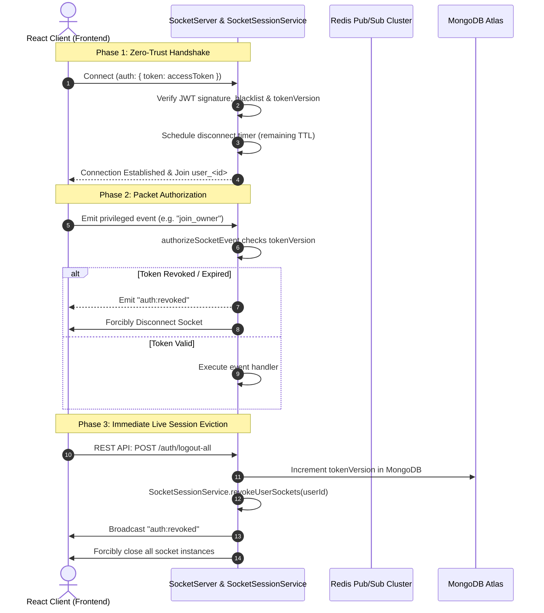

# RoomBae Real-Time WebSocket Security & Continuous Authorization Report

**Protocol**: WebSocket (WSS) over Socket.IO v4.8.3  
**Architecture**: Zero-Trust Handshake, Dynamic Expiry Eviction, Packet Middleware & Pub/Sub Clustering  

---

## 1. WebSocket Threat Model & Remediation Matrix

| Vector | Risk in Standard WebSockets | RoomBae Production Hardening |
| :--- | :--- | :--- |
| **Zombie Sockets** | Socket stays open indefinitely even after token expiration (15m). | Dynamic disconnect timer (`setTimeout`) scheduled for exact remaining token TTL; emits `auth:expired` and calls `socket.disconnect(true)`. |
| **Revoked Session Bypass** | User logs out on Web, but mobile app socket remains open. | `SocketSessionService.revokeUserSockets(userId)` broadcasts `auth:revoked` to `user_<id>`, `owner_<id>`, `resident_<id>` rooms and forcibly terminates all client connections. |
| **Stale Privileged Events** | Stale socket emits actions after password change. | `SocketSessionService.authorizeSocketEvent` middleware intercepts every packet, checking `TokenVersionService.isValidTokenVersion` before allowing execution. |
| **Multi-Node State Drift** | Socket on Node A unaware of logout on Node B. | Socket.IO `@socket.io/redis-adapter` synchronizes room broadcasts across all backend instances via Redis Pub/Sub. |
| **Unauthorized Room Joins** | Malicious client joining another owner's private room. | Strict authorization in `join_owner` requiring `user.role === 'ADMIN'` or `user.id === ownerId`. |

---

## 2. Event Lifecycle & Protocol Specification



---

## 3. Client Reconnection & Token Refresh Flow

When the access token approaches expiration, the frontend seamlessly refreshes via REST API (`POST /api/v1/auth/refresh-token`), then emits:

```typescript
socket.emit("auth_refresh", newAccessToken);
```

`socketServer.ts` verifies the new access token, updates `socket.data.exp` and `socket.data.tokenVersion`, reschedules the disconnect timer, and emits `auth_refresh_success`.
