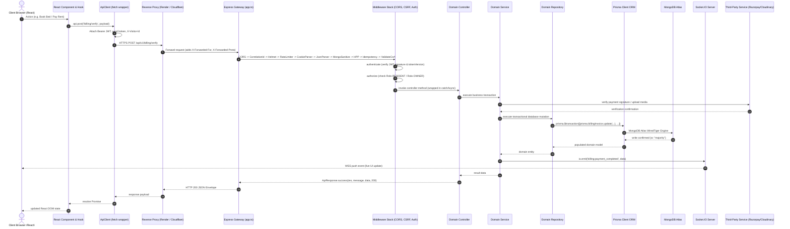
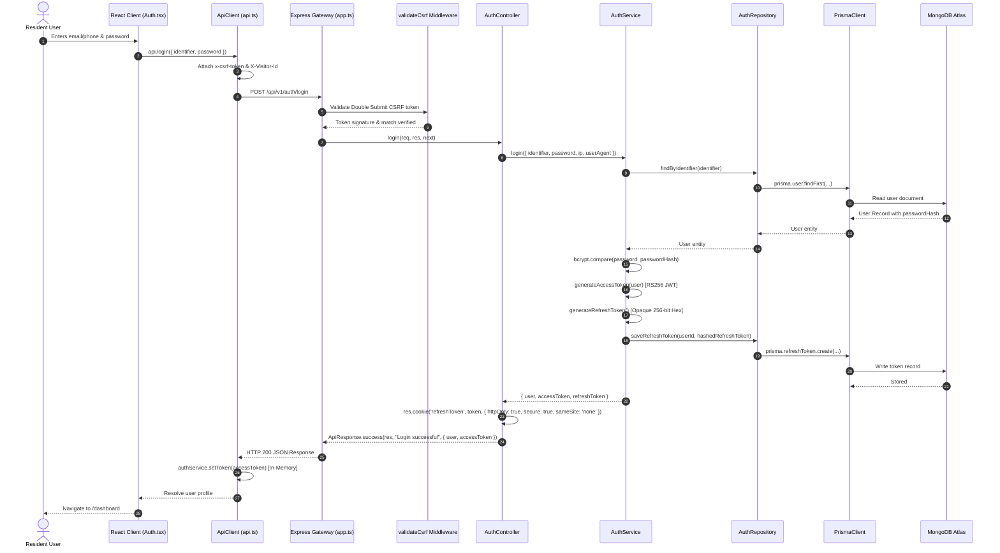
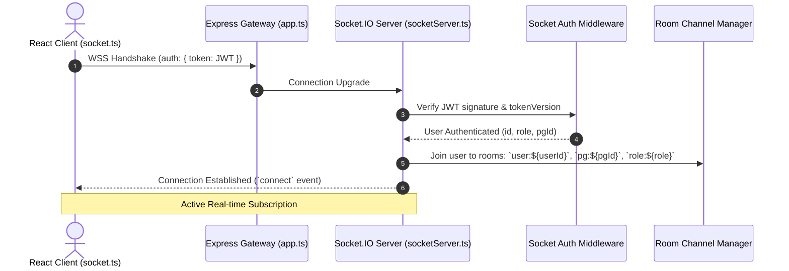
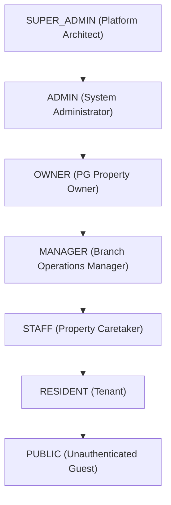
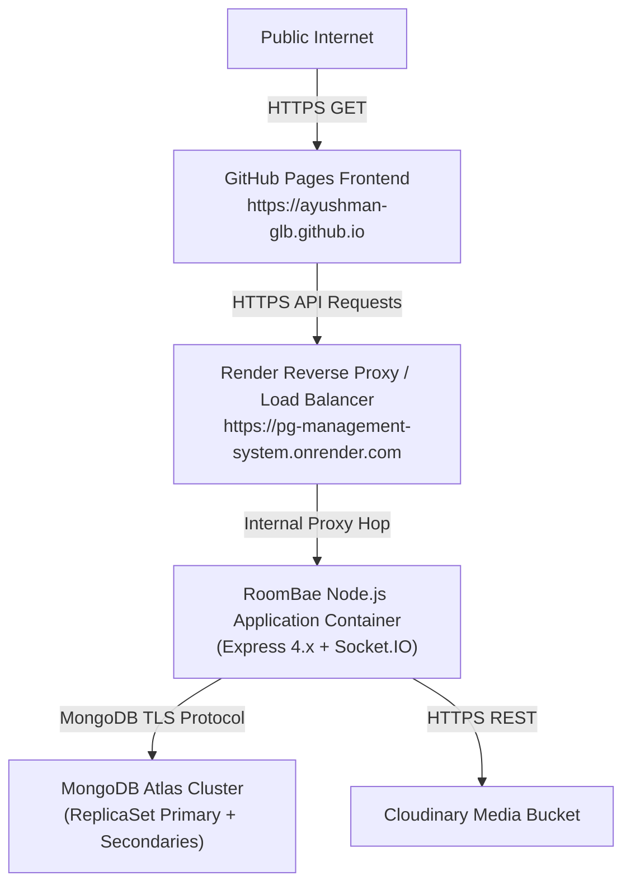

# 🔌 RoomBae Enterprise API Architecture & Communication Specification (`api_design.md`)

> **Authoritative Technical Architecture Blueprint** covering the end-to-end communication lifecycle, REST v1 API catalog, SOAP ERP billing engine, Socket.IO WebSockets real-time subsystem, Prisma ORM data layer, MongoDB Atlas schema, security pipelines, and complete frontend-to-backend mappings for **RoomBae**.

---

## 📑 Table of Contents

1. [API Architecture & Platform Overview](#1-api-architecture--platform-overview)
2. [Complete System Communication Topology](#2-complete-system-communication-topology)
3. [Local Development vs Production Communication Topology](#3-local-development-vs-production-communication-topology)
4. [API URL Structure & Client Configuration](#4-api-url-structure--client-configuration)
5. [Frontend-to-Backend Communication Mapping](#5-frontend-to-backend-communication-mapping)
6. [Complete Request & Response Lifecycle](#6-complete-request--response-lifecycle)
7. [Complete CRUD Flow Documentation by Module](#7-complete-crud-flow-documentation-by-module)
8. [Database Communication & MongoDB Atlas Architecture](#8-database-communication--mongodb-atlas-architecture)
9. [In-Memory & Caching Architecture (Redis-Free Architecture)](#9-in-memory--caching-architecture-redis-free-architecture)
10. [Prisma ORM Architecture Documentation](#10-prisma-orm-architecture-documentation)
11. [Socket.IO & Real-Time Subsystem Architecture](#11-socketio--real-time-subsystem-architecture)
12. [Server Communication & Lifecycle Pipeline](#12-server-communication--lifecycle-pipeline)
13. [Enterprise CORS & Cross-Site Security Architecture](#13-enterprise-cors--cross-site-security-architecture)
14. [Authentication & Authorization Communication Flow](#14-authentication--authorization-communication-flow)
15. [Third-Party External Services Communication](#15-third-party-external-services-communication)
16. [Enterprise Error Handling & Resilience Architecture](#16-enterprise-error-handling--resilience-architecture)
17. [Deployment & Infrastructure Communication Architecture](#17-deployment--infrastructure-communication-architecture)
18. [Master API Route & Communication Inventory](#18-master-api-route--communication-inventory)
19. [Environment Variable Matrix & API Contracts](#19-environment-variable-matrix--api-contracts)
20. [Appendix: Standards, Conventions & Formats](#20-appendix-standards-conventions--formats)

---

## 1. API Architecture & Platform Overview

RoomBae is an enterprise-grade multi-tenant PG & Coliving management ecosystem engineered with high-throughput REST APIs, bidirectional Socket.IO WebSockets, an enterprise SOAP ERP billing bridge, and a resilient data tier built on Prisma ORM and MongoDB Atlas.

### 1.1 Why APIs Are Used In This Project
- **Separation of Presentation and Business Logic**: The frontend is a high-performance Single Page Application (SPA) built with React 19, TypeScript, and Vite. All domain logic, financial calculations, room allocation invariants, and security controls execute strictly in the Node.js backend.
- **Multi-Tenant Data Isolation**: APIs enforce strict tenant scoping via `tenantMiddleware`, ensuring PG owners only access their properties and residents only access their assigned rooms, beds, and billing invoices.
- **Cross-Platform Readiness**: The backend exposes standardized REST endpoints supporting the web SPA, external ERP integrations via SOAP, and future mobile client applications.

### 1.2 Architectural Highlights


1. **REST Protocol Standard**: All transactional operations follow RESTful conventions over HTTPS, consuming and returning UTF-8 encoded JSON payloads wrapped in standardized `ApiResponse` envelopes.
2. **Stateless Asymmetric Authentication**: Core access tokens use asymmetric **RS256 (RSA-2048) JWTs** (with graceful HS256 fallback) validated via in-memory caching and public `/.well-known/jwks.json`. Refresh tokens are opaque 256-bit cryptographic strings stored in secure, `httpOnly`, `SameSite=None/Lax` cookies with SHA-256 hashed database verification and automatic family reuse detection.
3. **Double-Submit HMAC-Signed CSRF Protection**: State-mutating requests (`POST`, `PUT`, `PATCH`, `DELETE`) require a valid `x-csrf-token` header matching the `csrf-token` cookie verified with constant-time buffer comparison (`safeCompareCsrf`).
4. **Authoritative Consistency (Redis-Free)**: Token invalidation and session revocation operate on an authoritative `User.tokenVersion` stored in MongoDB Atlas, with an in-memory 10-second fast-path cache. Distributed holds use optimistic locking and database timestamps (`lockExpiresAt`).
5. **Strict Layered Separation**: Absolute separation of concerns: `Routes` → `Middleware` → `Controllers` → `Services` → `Repositories` → `Prisma Client` → `MongoDB`.

---

## 2. Complete System Communication Topology

Every user action flows through a deterministic multi-tier pipeline from user click to database write, and back through WebSocket broadcast.



---

## 3. Local Development vs Production Communication Topology

```mermaid
graph LR
    subgraph Local_Development ["Local Development Environment"]
        DevBrowser["Browser (React SPA)<br/>http://localhost:5173"]
        DevBackend["Node.js / Express Server<br/>http://localhost:5000"]
        DevDB["MongoDB Atlas Dev DB<br/>mongodb+srv://..."]
        DevWS["Socket.IO Dev Server<br/>ws://localhost:5000"]

        DevBrowser -->|HTTP REST (CORS / SameSite=Lax)| DevBackend
        DevBrowser <-->|WS Polling & WebSocket| DevWS
        DevBackend --> DevDB
    end

    subgraph Production ["Production Environment"]
        ProdBrowser["Browser (GitHub Pages)<br/>https://ayushman-glb.github.io"]
        ProdEdge["Render Edge Proxy<br/>(SSL/TLS Termination, Proxy Hop 1)"]
        ProdBackend["Production Node.js Cluster<br/>https://pg-management-system.onrender.com"]
        ProdDB["MongoDB Atlas ReplicaSet<br/>(WiredTiger Encrypted Storage)"]
        ProdWS["WSS Secure Socket.IO<br/>wss://pg-management-system.onrender.com"]
        CloudinaryCDN["Cloudinary Media CDN<br/>https://res.cloudinary.com"]

        ProdBrowser -->|HTTPS REST (CORS / SameSite=None; Secure)| ProdEdge
        ProdEdge --> ProdBackend
        ProdBrowser <-->|WSS WebSockets| ProdEdge
        ProdEdge <--> ProdWS
        ProdBackend --> ProdDB
        ProdBrowser -->|Fetch Images| CloudinaryCDN
        ProdBackend -->|Upload Assets| CloudinaryCDN
    end
```

---

## 4. API URL Structure & Client Configuration

### 4.1 Configuration Sources & File Locations

| Environment | Parameter | Target URL / Value | Configuration File |
|---|---|---|---|
| **Local Dev** | Frontend Web App | `http://localhost:5173` | `frontend/vite.config.ts` |
| **Local Dev** | Backend REST API | `http://localhost:5000/api/v1` | `frontend/src/config/api.ts` & `backend/src/config/env.ts` |
| **Local Dev** | Socket.IO WebSocket | `ws://localhost:5000` | `frontend/src/config/env.ts` & `frontend/src/services/socket.ts` |
| **Production** | Frontend Web App | `https://ayushman-glb.github.io` | `frontend/src/config/api.ts` (GitHub Pages) |
| **Production** | Backend REST API | `https://pg-management-system.onrender.com/api/v1` | `frontend/src/config/api.ts` & `backend/src/config/env.ts` |
| **Production** | Socket.IO WebSocket | `wss://pg-management-system.onrender.com` | `frontend/src/services/socket.ts` |
| **Production** | Cloudinary CDN | `https://res.cloudinary.com/roombae` | `backend/src/config/cloudinary.ts` |

### 4.2 Frontend `ApiClient` Architecture (`frontend/src/services/api.ts`)

The frontend encapsulates all HTTP communication through a singleton `ApiClient` class providing:
1. **In-Memory JWT Injection**: Attaches `Authorization: Bearer <accessToken>` retrieved from `authService.getToken()`. Tokens are never read directly from `localStorage` in request headers, mitigating XSS token extraction.
2. **Double-Submit CSRF Attachment**: For all state-mutating methods (`POST`, `PUT`, `PATCH`, `DELETE`), automatically extracts `csrf-token` from `document.cookie` and attaches the `x-csrf-token` header.
3. **Single-Flight 401 Refresh Mutex**: If an API request returns HTTP 401 Unauthorized, `ApiClient` triggers `authService.refreshToken()`. Concurrent requests wait on the same `refreshPromise`, preventing race conditions during refresh token rotation. Once refreshed, the original request is automatically replayed with the new token.
4. **Automatic 403 CSRF Recovery**: If a request receives HTTP 403 with `CSRF_INVALID` or `CSRF_MISSING`, `ApiClient` automatically invokes `authService.bootstrapCsrf()`, obtains a fresh signed token, and replays the request once.
5. **Cross-Site Credentials**: Configures `credentials: "include"` on all fetch calls to ensure secure cookies (`refreshToken`, `csrf-token`) are passed across origins.
6. **Network Error Discrimination**: Differentiates between browser CORS/network connectivity blocks and structured application errors.

---

## 5. Frontend-to-Backend Communication Mapping

The following matrix maps every frontend page, component, custom hook, API service call, and backend handler:

| Frontend Page / Route | Triggering Component / Element | Custom Hook / Service Call | Frontend API Method | Backend Endpoint & Method | Controller & Service Invoked |
|---|---|---|---|---|---|
| **Auth** (`/auth`) | `LoginForm.tsx` (Submit Button) | `useAuth()` | `api.login({ identifier, password })` | `POST /api/v1/auth/login` | `AuthController.login` → `AuthService.login` |
| **Auth** (`/auth`) | `RegisterForm.tsx` (Submit Button) | `useAuth()` | `api.register(payload)` | `POST /api/v1/auth/register` | `AuthController.register` → `AuthService.register` |
| **Auth** (`/auth`) | `OtpModal.tsx` (Send OTP) | `useAuth()` | `api.sendOtp({ phone })` | `POST /api/v1/auth/send-otp` | `AuthController.sendOtp` → `AuthService.sendOtp` |
| **Auth** (`/auth`) | `OtpModal.tsx` (Verify OTP) | `useAuth()` | `api.verifyOtp({ phone, otp })` | `POST /api/v1/auth/verify-otp` | `AuthController.verifyOtp` → `AuthService.verifyOtp` |
| **Auth** (`/auth`) | Background session refresh | `useAuth()` | `authService.refreshToken()` | `POST /api/v1/auth/refresh-token` | `AuthController.refreshToken` → `AuthService.refreshToken` |
| **Auth** (`/auth`) | Navigation / Logout Button | `useAuth()` | `api.logout()` | `POST /api/v1/auth/logout` | `AuthController.logout` → `AuthService.logout` |
| **Dashboard** (`/dashboard`) | `Dashboard.tsx` (Mount) | `useDashboard()` | `api.get('/dashboard/overview')` | `GET /api/v1/dashboard/overview` | `DashboardController.getOverview` → `PropertyService.getOverview` |
| **Dashboard** (`/dashboard`) | `RevenueChart.tsx` (Mount) | `useAnalytics()` | `api.get('/dashboard/revenue')` | `GET /api/v1/dashboard/revenue` | `DashboardController.getRevenueAnalytics` → `BillingService.getRevenueAnalytics` |
| **Dashboard** (`/dashboard`) | `OccupancyCard.tsx` (Mount) | `useAnalytics()` | `api.get('/dashboard/occupancy')` | `GET /api/v1/dashboard/occupancy` | `DashboardController.getOccupancyAnalytics` → `ResidentService.getOccupancy` |
| **PG Listing** (`/explore`) | `PGListing.tsx` (Search Filters) | `usePublicProperties()` | `api.getPublicProperties(params)` | `GET /api/v1/properties/search` | `PropertyController.searchPublic` → `PropertyService.searchPublic` |
| **PG Details** (`/pg/:id`) | `PGDetails.tsx` (Mount) | `usePropertyDetails(id)` | `api.getPropertyById(id)` | `GET /api/v1/properties/:id` | `PropertyController.getById` → `PropertyService.getById` |
| **Properties** (`/properties`) | `AddPropertyModal.tsx` (Save) | `useProperties()` | `api.createProperty(formData)` | `POST /api/v1/properties` | `PropertyController.create` → `PropertyService.createProperty` |
| **Properties** (`/properties`) | `PropertiesTable.tsx` (Mount) | `useProperties()` | `api.getOwnerSummary()` | `GET /api/v1/properties/owner-summary` | `PropertyController.getOwnerSummary` → `PropertyService.getOwnerSummary` |
| **Rooms** (`/rooms`) | `RoomsTable.tsx` (Mount) | `useRooms(pgId)` | `api.get('/rooms/pms')` | `GET /api/v1/rooms/pms` | `RoomController.list` → `RoomService.listRooms` |
| **Rooms** (`/rooms`) | `RoomTransferModal.tsx` (Submit) | `useRoomTransfer()` | `api.createRoomTransferRequest(data)` | `POST /api/v1/rooms/transfers` | `ResidentManagementController.createRoomTransferRequest` → `ResidentManagementService.createRoomTransferRequest` |
| **Beds** (`/beds`) | `BedsGrid.tsx` (Hold Bed Button) | `useBeds()` | `api.createBedHold(data)` | `POST /api/v1/beds/hold` | `ResidentManagementController.createBedHold` → `ResidentManagementService.createBedHold` |
| **Beds** (`/beds`) | `BedsGrid.tsx` (Release Hold) | `useBeds()` | `api.releaseBedHold(holdId)` | `POST /api/v1/beds/hold/:holdId/release` | `ResidentManagementController.releaseBedHold` → `ResidentManagementService.releaseBedHold` |
| **Residents** (`/residents`) | `ResidentRegister.tsx` (Submit) | `useResidents()` | `api.onboardResident(data)` | `POST /api/v1/residents/onboard` | `ResidentController.onboard` → `ResidentService.onboardResident` |
| **Residents** (`/residents`) | `ResidentsTable.tsx` (Mount) | `useResidents()` | `api.getResidentDirectory(pgId)` | `GET /api/v1/residents/directory` | `ResidentController.getDirectory` → `ResidentService.getDirectory` |
| **Resident Portal** (`/portal`) | `ResidentPortal.tsx` (Mount) | `useResidentPortal()` | `api.getPortalMe()` | `GET /api/v1/residents/me` | `ResidentController.getMe` → `ResidentService.getResidentProfile` |
| **Billing** (`/billing`) | `InvoiceList.tsx` (Mount) | `useBilling()` | `api.get('/billing/invoices')` | `GET /api/v1/billing/invoices` | `BillingController.listInvoices` → `BillingService.listInvoices` |
| **Billing** (`/billing`) | `PayRentModal.tsx` (Initiate) | `usePayment()` | `api.createBillingOrder(invoiceId)` | `POST /api/v1/payments/razorpay/create-order` | `PaymentController.createOrder` → `PaymentService.createOrder` |
| **Billing** (`/billing`) | `PayRentModal.tsx` (Verify) | `usePayment()` | `api.verifyPayment(payload)` | `POST /api/v1/payments/razorpay/verify` | `PaymentController.verifyPayment` → `PaymentService.verifyPayment` |
| **Complaints** (`/complaints`) | `ComplaintForm.tsx` (Submit) | `useComplaints()` | `api.createComplaint(data)` | `POST /api/v1/complaints` | `ComplaintController.create` → `ComplaintService.createComplaint` |
| **Complaints** (`/complaints`) | `ComplaintList.tsx` (Update) | `useComplaints()` | `api.updateComplaintStatus(id, st)`| `PATCH /api/v1/complaints/:id/status` | `ComplaintController.updateStatus` → `ComplaintService.updateStatus` |
| **Agreements** (`/agreements`) | `SignAgreementModal.tsx` (Sign) | `useAgreements()` | `api.signAgreement(id, sigData)` | `POST /api/v1/agreements/:id/sign` | `AgreementController.sign` → `AgreementService.signAgreement` |
| **Agreements** (`/agreements`) | `AgreementViewer.tsx` (Download)| `useDocumentDownload()` | `api.get('/documents/agreement/:id')`| `GET /api/v1/documents/agreement/:id` | `DocumentController.downloadAgreement` → `DocumentService.getAgreementPdf` |
| **Tours** (`/tours`) | `ScheduleTourModal.tsx` (Book) | `useTours()` | `api.requestTour(data)` | `POST /api/v1/tours` | `ToursController.createTour` → `ToursService.requestTour` |
| **Shortlist** (`/shortlist`) | `PropertyCard.tsx` (Heart Icon) | `useShortlist()` | `api.toggleShortlist(propId)` | `POST /api/v1/shortlist/:id` | `ToursController.toggleShortlist` → `ToursService.toggleShortlist` |
| **Applications** (`/apps`) | `ApplicationForm.tsx` (Submit) | `useApplications()` | `api.createApplication(data)` | `POST /api/v1/applications` | `ApplicationsController.create` → `ApplicationsService.createApplication` |
| **Messages** (`/messages`) | `ChatWindow.tsx` (Send Message) | `useChat(threadId)` | `api.sendMessage({ threadId, msg })`| `POST /api/v1/messages` | `MessagesController.sendMessage` → `MessagesService.sendMessage` |
| **Move-In** (`/move-in`) | `MoveInDashboard.tsx` (Mount) | `useMoveIn(propId)` | `api.getMoveInInfo(propertyId)` | `GET /api/v1/move-in/:propertyId` | `MoveInController.getInfo` → `MoveInService.getMoveInInfo` |
| **Media Upload** (Various) | `ImageUpload.tsx` (File Pick) | `useUpload()` | `api.post('/media/upload/single', form)`| `POST /api/v1/media/upload/single` | `MediaController.uploadSingle` → `CloudinaryService.upload` |
| **Notifications** (Global) | `NotificationBell.tsx` (Mount) | `useNotifications()` | `api.get('/notifications')` | `GET /api/v1/notifications` | `NotificationController.list` → `NotificationService.getForUser` |
| **Admin** (`/admin`) | `AdminConsole.tsx` (Mount) | `useAdmin()` | `api.get('/settings/audit-logs')` | `GET /api/v1/settings/audit-logs` | `ResidentManagementController.getAuditLogs` → `ResidentManagementService.getAuditLogs` |

---

## 6. Complete Request & Response Lifecycle

### 6.1 Authentication Lifecycle (Login Flow)



---

## 7. Complete CRUD Flow Documentation by Module

### 7.1 Properties & Marketplace Module (`/api/v1/properties`)
- **CREATE (`POST /properties`)**:
  - **Caller**: `AddPropertyModal.tsx`
  - **Auth**: `authenticate`, `authorize(Role.OWNER)`, `requireKycApproved`
  - **Validation**: `createPropertySchema` (Zod validation for name, address, rules, amenities, sharing configurations)
  - **Execution**: `PropertyController.create` → `PropertyService.createProperty` → `PropertyRepository.create` → `prisma.pGProperty.create(...)`
  - **Events**: Socket.IO broadcast `property:created`
  - **Response**: `201 Created` with `ApiResponse<PGProperty>`
- **READ (`GET /properties/search` & `GET /properties/:id`)**:
  - **Caller**: `PGListing.tsx`, `PGDetails.tsx`
  - **Auth**: Public access (bypasses JWT guard)
  - **Execution**: `PropertyController.searchPublic` → `PropertyService.searchPublic` → `prisma.pGProperty.findMany({ where: { status: 'ACTIVE' } })`
  - **Response**: `200 OK` with paginated property listings
- **UPDATE (`PUT /properties/:id`)**:
  - **Caller**: `EditPropertyModal.tsx`
  - **Auth**: `authenticate`, `authorize(Role.OWNER, Role.ADMIN)`
  - **Execution**: `PropertyController.update` → `PropertyService.updateProperty` → `prisma.pGProperty.update(...)`
  - **Events**: Socket.IO broadcast `property:updated`
- **DELETE (`DELETE /properties/:id`)**:
  - **Caller**: `PropertiesTable.tsx`
  - **Auth**: `authenticate`, `authorize(Role.OWNER, Role.ADMIN)`
  - **Execution**: Soft-delete or status transition to `INACTIVE`.

---

## 8. Database Communication & MongoDB Atlas Architecture

### 8.1 Connection & Driver Architecture
RoomBae communicates with MongoDB Atlas through the official Prisma ORM MongoDB connector running on Node.js:
```
Node.js Runtime
  ↓ (Native C++ Bindings)
Prisma Query Engine (prisma-client-js)
  ↓ (TLS 1.3 Encrypted Socket)
MongoDB Node.js Driver Engine
  ↓ (mongodb+srv:// URI Protocol)
MongoDB Atlas ReplicaSet (Primary / Secondary Nodes)
```

### 8.2 Database Configuration & Initialization (`backend/src/config/prisma.ts`)
- **Connection Singleton**: Initialized once during application bootstrap and reused across all request contexts.
- **Connection Pool Configuration**:
  ```typescript
  export const prisma = new PrismaClient({
    log: env.NODE_ENV === "development" ? ["query", "info", "warn", "error"] : ["error"],
    datasources: {
      db: {
        url: env.DATABASE_URL,
      },
    },
  });
  ```
- **Read & Write Concerns**:
  - **Writes**: Enforced with `w: "majority"` to guarantee durable replication across MongoDB Atlas replica set nodes before confirming mutations.
  - **Reads**: Directed to the primary node for transactional integrity and consistency.
- **Atomic Transactions**: All multi-document operations (e.g. resident checkout with bed release and deposit refund invoice creation) execute through `prisma.$transaction([...])`.

---

## 9. In-Memory & Caching Architecture (Redis-Free Architecture)

### 9.1 Redis-Free Authoritative Invalidation
RoomBae operates a high-performance **zero-Redis caching and session revocation architecture**:
1. **Authoritative `User.tokenVersion`**:
   - Every user record in MongoDB maintains an integer `tokenVersion` (default `0`).
   - When a user logs out, resets their password, or an admin revokes their session, `tokenVersion` is atomically incremented in MongoDB via `prisma.user.update({ data: { tokenVersion: { increment: 1 } } })`.
   - The auth middleware compares the `tokenVersion` claims in the incoming JWT with the authoritative `tokenVersion`. If the token version is stale, the request is immediately rejected with HTTP 401 `SESSION_EXPIRED`.
2. **In-Memory Fast-Path Cache (`TokenBlacklistService`)**:
   - Maintains an in-memory LRU cache of recently verified token versions with a 10-second TTL to avoid database lookups on every HTTP request while guaranteeing rapid revocation convergence.
3. **Optimistic Locking for Beds (`DatabaseLockService`)**:
   - Bed holds and reservation locks utilize atomic MongoDB timestamp comparisons (`lockExpiresAt: { gt: new Date() }`), removing the requirement for Redlock or external Redis distributed locks.

---

## 10. Prisma ORM Architecture Documentation

### 10.1 Core Data Models Summary

| Prisma Model | MongoDB Collection | Description & Domain Role | Key Indexes & Relations |
|---|---|---|---|
| `User` | `users` | Master identity model for Residents, Owners, Managers, and Admins. | `@unique(email)`, `@unique(phone)`, `@@index([role])`, `tokenVersion` |
| `RefreshToken` | `refresh_tokens` | Opaque SHA-256 hashed refresh tokens for session rotation. | `@@index([userId])`, `@@index([tokenHash])`, `expiresAt` |
| `UserDevice` | `user_devices` | Device fingerprinting and hardware trust status from FingerprintJS. | `@@unique([userId, visitorId])`, `isTrusted`, `lastActiveAt` |
| `PGProperty` | `pg_properties` | PG properties managed by owners with rules, amenities, and meal plans. | `@@index([ownerId])`, `@@index([city])`, `@@index([status])` |
| `Room` | `rooms` | Rooms within a PG property with floor number and sharing configuration. | `@@index([pgId])`, `@@unique([pgId, roomNumber])` |
| `Bed` | `beds` | Individual beds with real-time status (`AVAILABLE`, `OCCUPIED`, `HOLD`). | `@@index([roomId])`, `@@index([status])`, `lockExpiresAt` |
| `Resident` | `residents` | Active and archived resident tenancy records, KYC, and assigned bed. | `@@unique([userId])`, `@@index([pgId])`, `@@index([status])` |
| `BillingInvoice` | `billing_invoices` | Monthly rent invoices, maintenance dues, fines, and payment records. | `@@index([residentId])`, `@@index([pgId])`, `@@index([status])` |
| `PaymentTransaction` | `payment_transactions` | Razorpay payment orders, payment IDs, and webhook signatures. | `@@unique([razorpayOrderId])`, `@@index([invoiceId])` |
| `Complaint` | `complaints` | Maintenance tickets, issues, priority levels, and resolution timelines. | `@@index([residentId])`, `@@index([pgId])`, `@@index([status])` |
| `RentalAgreement` | `rental_agreements` | Digital tenancy agreements, e-signature logs, and generated PDF paths. | `@@unique([residentId])`, `@@index([status])` |
| `ChatMessage` | `chat_messages` | Real-time messages between residents, owners, and property staff. | `@@index([threadId])`, `@@index([createdAt])` |
| `Notification` | `notifications` | In-app alerts, push notifications, and broadcast messages. | `@@index([userId])`, `@@index([isRead])` |

---

## 11. Socket.IO & Real-Time Subsystem Architecture

### 11.1 Real-Time Connection Lifecycle


### 11.2 Real-Time Event Catalog

| Event Name | Direction | Payload Structure | Description |
|---|---|---|---|
| `resident:status_updated` | Server → Client | `{ residentId, status, pgId, reason, updatedAt }` | Broadcasts resident status changes (e.g. `ACTIVE`, `ON_LEAVE`, `CHECKED_OUT`). |
| `bed:status_updated` | Server → Client | `{ bedId, status, bedNumber, notes, updatedAt }` | Real-time bed status updates (`AVAILABLE`, `OCCUPIED`, `MAINTENANCE`). |
| `bed:hold_updated` | Server → Client | `{ action: 'CREATED'|'RELEASED', hold, bed }` | Real-time lock or release of a bed hold. |
| `transfer:requested` | Server → Client | `{ requestId, residentId, pgId, targetRoomNumber }` | Alerts property manager of a room transfer request. |
| `transfer:status_updated` | Server → Client | `{ action: 'APPROVED'|'REJECTED'|'COMPLETED', request }` | Updates resident on their transfer request status. |
| `billing:payment_completed` | Server → Client | `{ invoiceId, amount, paymentMethod, paidAt }` | Confirms payment settlement in real time. |
| `complaint:created` | Server → Client | `{ complaintId, title, priority, pgId }` | Alerts property staff of a newly filed complaint. |
| `complaint:status_updated` | Server → Client | `{ complaintId, status, resolvedBy, updatedAt }` | Updates resident on ticket resolution progress. |
| `message:new` | Server → Client | `{ messageId, threadId, senderId, content, timestamp }` | Pushes incoming chat messages to active thread participants. |
| `notification:broadcast` | Server → Client | `{ notificationId, title, message, type, createdAt }` | Delivers in-app system notifications. |

---

## 12. Server Communication & Lifecycle Pipeline

### 12.1 Server Bootstrap Sequence (`backend/src/server.ts` & `backend/src/app.ts`)
1. **Environment Validation**: Validates all configuration keys via Zod schema in `backend/src/config/env.ts`. Fails fast on startup if required secrets are missing.
2. **Database Verification**: Pings MongoDB Atlas via `prisma.$runCommandRaw({ ping: 1 })`.
3. **Middleware Initialization (Strict Order)**:
   1. `app.set("trust proxy", 1)` — Configures edge proxy hop.
   2. `cors(corsOptions)` — Validates cross-origin requests from `getAllowedOrigins()`.
   3. `correlationIdMiddleware` — Attaches unique `x-correlation-id` to every request.
   4. `helmet(...)` — Configures CSP, HSTS, and security headers.
   5. `compression()` — Gzip/Brotli payload compression.
   6. `cookieParser()` — Parses `refreshToken` and `csrf-token` cookies.
   7. `express.json({ limit: "10mb" })` & `express.urlencoded(...)` — Parses JSON bodies.
   8. `mongoSanitize(...)` — Strips NoSQL injection operators (`$`, `.`).
   9. `hpp()` — Prevents HTTP Parameter Pollution.
   10. `idempotencyMiddleware` — Ensures safe retry of mutating operations.
   11. `validateCsrf` — Enforces Double-Submit CSRF HMAC validation.
   12. `generalLimiter` — Rate limits requests per IP (`resolveClientIp`).
4. **Router Registration**: Mounts `apiRouter` at `/api/v1` with `tenantMiddleware`.
5. **SOAP Server Mount**: Initializes WSDL service at `/soap/billing?wsdl` with XXE protection and API-key guard.
6. **Socket.IO Initialization**: Attaches WebSocket server to the underlying HTTP server.
7. **Health & Telemetry Endpoints**: Exposes `/health`, `/ready`, `/live`, `/metrics`, and `/api/v1/health/pipeline-test`.
8. **Catch-All 404 & Global Error Middleware**: Standardizes unhandled routes and exceptions into unified JSON envelopes.

---

## 13. Enterprise CORS & Cross-Site Security Architecture

### 13.1 Single Source of Truth (`backend/src/config/corsOrigins.ts`)
Both Express REST and Socket.IO use identical origin normalization:
```typescript
export const getAllowedOrigins = (): string[] => {
  const allowed = new Set<string>();
  allowed.add("https://ayushman-glb.github.io");

  if (env.NODE_ENV !== "production") {
    allowed.add("http://localhost:5173");
    allowed.add("http://localhost:3000");
    allowed.add("http://127.0.0.1:5173");
    allowed.add("http://127.0.0.1:3000");
  }

  if (env.CORS_ORIGIN) {
    env.CORS_ORIGIN.split(",").forEach((origin) => {
      const trimmed = origin.trim();
      if (trimmed) {
        try {
          const parsed = new URL(trimmed);
          allowed.add(parsed.origin);
        } catch {
          allowed.add(trimmed.replace(/\/$/, ""));
        }
      }
    });
  }
  return Array.from(allowed);
};
```

### 13.2 Cross-Site Cookies & Preflight Handshake
- **Preflight `OPTIONS`**: Returns HTTP 204 with `Access-Control-Allow-Origin: <matching-origin>`, `Access-Control-Allow-Credentials: true`, and allowed headers (`Content-Type, Authorization, x-csrf-token, x-correlation-id, X-Visitor-Id`).
- **Production Cookies**:
  - `refreshToken`: `HttpOnly; Secure; SameSite=None; Path=/api/v1/auth`
  - `csrf-token`: `Secure; SameSite=None; Path=/`

---

## 14. Authentication & Authorization Communication Flow

### 14.1 Role-Based Access Control (RBAC) Hierarchy



- **`authenticate` Middleware**: Validates JWT signature, expiration, and checks that `tokenVersion` matches database state.
- **`authorize(...allowedRoles)` Middleware**: Verifies that `req.user.role` is included in the endpoint's permitted roles.
- **`requireKycApproved` Middleware**: Enforces that PG owners must have `OwnerProfile.kycStatus === 'APPROVED'` before creating properties or managing financial transactions.

---

## 15. Third-Party External Services Communication

```mermaid
graph LR
    subgraph RoomBae_Backend ["RoomBae Backend Engine"]
        MediaService["Media & Cloudinary Service"]
        PaymentService["Razorpay Payment Service"]
        SmsService["Twilio Phone Auth Service"]
        EmailService["Nodemailer / Brevo SMTP"]
        OAuthService["Google OAuth 2.0 Strategy"]
    end

    Cloudinary["Cloudinary CDN API<br/>(Image Transformation & Storage)"]
    Razorpay["Razorpay Gateway<br/>(Orders, Payments & Webhooks)"]
    Twilio["Twilio SMS Gateway<br/>(Transactional OTP SMS)"]
    SMTP["Brevo / SMTP Relay<br/>(Welcome, Invoices, Alerts)"]
    Google["Google Accounts API<br/>(OpenID Connect Profile)"]

    MediaService -->|HTTPS REST / Signatures| Cloudinary
    PaymentService -->|HTTPS REST / HMAC SHA-256| Razorpay
    SmsService -->|HTTPS REST API| Twilio
    EmailService -->|TLS SMTP (Port 587)| SMTP
    OAuthService -->|OAuth 2.0 PKCE / REST| Google
```

---

## 16. Enterprise Error Handling & Resilience Architecture

### 16.1 Standard Error Envelope Format
All error responses adhere to a consistent JSON structure:
```json
{
  "success": false,
  "message": "Human readable error description",
  "errors": [
    {
      "field": "email",
      "message": "Invalid email address format"
    }
  ],
  "error": {
    "code": "VALIDATION_ERROR",
    "message": "Validation failed: Invalid request payload",
    "action": "check_input"
  }
}
```

### 16.2 Error Mapping Matrix (`backend/src/middleware/errorMiddleware.ts`)

| Error Type / Exception | HTTP Status | Error Code | Client Remediation Action |
|---|---|---|---|
| `ZodError` | `400 Bad Request` | `VALIDATION_ERROR` | `check_input` |
| `SyntaxError` (Malformed JSON) | `400 Bad Request` | `INVALID_JSON` | `check_payload_syntax` |
| `MulterError` (Upload Failure) | `400 Bad Request` | `FILE_UPLOAD_ERROR` | `check_file_format_and_size` |
| `JsonWebTokenError` | `401 Unauthorized` | `INVALID_TOKEN` | `re_authenticate` |
| `TokenExpiredError` | `401 Unauthorized` | `TOKEN_EXPIRED` | `refresh_token` |
| `CSRF_MISSING` / `CSRF_INVALID` | `403 Forbidden` | `CSRF_INVALID` | `retry` |
| `AppError(..., 403)` | `403 Forbidden` | `FORBIDDEN` | `contact_administrator` |
| `Prisma P2002` (Unique Constraint) | `409 Conflict` | `DUPLICATE_RESOURCE` | `use_unique_identifier` |
| `Prisma P2025` (Record Not Found) | `404 Not Found` | `RESOURCE_NOT_FOUND` | `verify_resource_id` |
| Unhandled Exceptions | `500 Server Error` | `INTERNAL_SERVER_ERROR` | `contact_support` |

---

## 17. Deployment & Infrastructure Communication Architecture



---

## 18. Master API Route & Communication Inventory

The following table documents every route registered in `backend/src/routes/apiRouter.ts`:

| Route Path | HTTP Method | Auth Required | Permitted Roles | Controller Handler | Service Method | Description |
|---|---|---|---|---|---|---|
| `/health/pipeline-test` | GET | None | Public | Inline Handler | N/A | Full middleware pipeline diagnostic probe |
| `/auth/csrf-token` | GET | None | Public | `generateCsrfToken` | `createSignedCsrfToken` | Issues fresh CSRF cookie & header |
| `/auth/register` | POST | None | Public | `AuthController.register` | `AuthService.register` | Registers new user account |
| `/auth/login` | POST | None | Public | `AuthController.login` | `AuthService.login` | Authenticates credentials and issues JWT |
| `/auth/send-otp` | POST | None | Public | `AuthController.sendOtp` | `AuthService.sendOtp` | Sends SMS OTP via Twilio / DB service |
| `/auth/verify-otp` | POST | None | Public | `AuthController.verifyOtp` | `AuthService.verifyOtp` | Validates SMS OTP and logs user in |
| `/auth/refresh-token` | POST | None | Public | `AuthController.refreshToken` | `AuthService.refreshToken` | Rotates refresh token and issues new JWT |
| `/auth/logout` | POST | Bearer JWT | Authenticated | `AuthController.logout` | `AuthService.logout` | Invalidates active refresh token |
| `/auth/me` | GET | Bearer JWT | Authenticated | `AuthController.getMe` | `AuthService.getProfile` | Retrieves authenticated user profile |
| `/security/devices` | GET | Bearer JWT | Authenticated | `DeviceController.listDevices` | `DeviceService.listDevices` | Lists user's registered devices |
| `/security/devices/:id` | DELETE | Bearer JWT | Authenticated | `DeviceController.revokeDevice` | `DeviceService.revokeDevice` | Revokes trusted status of a device |
| `/properties/search` | GET | None | Public | `PropertyController.searchPublic`| `PropertyService.searchPublic` | Public marketplace property search |
| `/properties` | POST | Bearer JWT | `OWNER` | `PropertyController.create` | `PropertyService.createProperty`| Creates new PG property listing |
| `/properties/owner-summary` | GET | Bearer JWT | `OWNER`, `ADMIN` | `PropertyController.getOwnerSummary`| `PropertyService.getOwnerSummary`| Summarizes owner properties & occupancy |
| `/rooms/pms` | GET | Bearer JWT | `OWNER`, `STAFF` | `RoomController.list` | `RoomService.listRooms` | Lists rooms for property management |
| `/beds/hold` | POST | Bearer JWT | `OWNER`, `STAFF` | `ResidentManagementController.createBedHold`| `ResidentManagementService.createBedHold`| Creates temporary reservation hold on bed |
| `/beds/hold/:holdId/release`| POST | Bearer JWT | `OWNER`, `STAFF` | `ResidentManagementController.releaseBedHold`| `ResidentManagementService.releaseBedHold`| Releases active bed reservation hold |
| `/residents/onboard` | POST | Bearer JWT | `OWNER`, `STAFF` | `ResidentController.onboard` | `ResidentService.onboardResident`| Onboards new resident and assigns bed |
| `/residents/directory` | GET | Bearer JWT | `OWNER`, `STAFF` | `ResidentController.getDirectory`| `ResidentService.getDirectory`| Lists residents in a PG property |
| `/residents/me` | GET | Bearer JWT | `RESIDENT` | `ResidentController.getMe` | `ResidentService.getResidentProfile`| Resident self-service portal profile |
| `/billing/invoices` | GET | Bearer JWT | Authenticated | `BillingController.listInvoices` | `BillingService.listInvoices` | Lists billing invoices for user/property |
| `/payments/razorpay/create-order`| POST | Bearer JWT | `RESIDENT` | `PaymentController.createOrder` | `PaymentService.createOrder` | Creates Razorpay payment order |
| `/payments/razorpay/verify`| POST | Bearer JWT | `RESIDENT` | `PaymentController.verifyPayment` | `PaymentService.verifyPayment` | Verifies Razorpay payment signature |
| `/complaints` | POST | Bearer JWT | `RESIDENT` | `ComplaintController.create` | `ComplaintService.createComplaint`| Files maintenance ticket |
| `/complaints/:id/status` | PATCH | Bearer JWT | `OWNER`, `STAFF` | `ComplaintController.updateStatus` | `ComplaintService.updateStatus` | Updates maintenance complaint status |
| `/agreements/:id/sign` | POST | Bearer JWT | `RESIDENT`, `OWNER`| `AgreementController.sign` | `AgreementService.signAgreement` | Signs digital tenancy agreement |
| `/documents/agreement/:id` | GET | Bearer JWT | Authenticated | `DocumentController.downloadAgreement`| `DocumentService.getAgreementPdf`| Downloads rendered agreement PDF |
| `/tours` | POST | Bearer JWT | `RESIDENT` | `ToursController.createTour` | `ToursService.requestTour` | Books property visit tour slot |
| `/shortlist/:id` | POST | Bearer JWT | `RESIDENT` | `ToursController.toggleShortlist` | `ToursService.toggleShortlist` | Adds/removes property from shortlist |
| `/applications` | POST | Bearer JWT | `RESIDENT` | `ApplicationsController.create` | `ApplicationsService.createApplication`| Submits rental application |
| `/messages` | POST | Bearer JWT | Authenticated | `MessagesController.sendMessage` | `MessagesService.sendMessage` | Sends chat message in thread |
| `/move-in/:propertyId` | GET | Bearer JWT | `RESIDENT` | `MoveInController.getInfo` | `MoveInService.getMoveInInfo` | Fetches move-in coordination info |
| `/media/upload/single` | POST | Bearer JWT | Authenticated | `MediaController.uploadSingle` | `CloudinaryService.upload` | Uploads single media file to Cloudinary |
| `/dashboard/overview` | GET | Bearer JWT | `OWNER`, `ADMIN` | `DashboardController.getOverview`| `PropertyService.getOverview` | Aggregates dashboard analytics |
| `/settings/audit-logs` | GET | Bearer JWT | `OWNER`, `ADMIN` | `ResidentManagementController.getAuditLogs`| `ResidentManagementService.getAuditLogs`| Queries security and operational audit logs |

---

## 19. Environment Variable Matrix & API Contracts

| Environment Variable | Required | Production Value / Description | Used In Files |
|---|---|---|---|
| `PORT` | Optional | `5000` (Default HTTP listening port) | `backend/src/config/env.ts` |
| `NODE_ENV` | Required | `production` \| `development` \| `test` | `backend/src/config/env.ts` |
| `DATABASE_URL` | Required | `mongodb+srv://...` (MongoDB Atlas Connection URI) | `backend/src/config/prisma.ts` |
| `JWT_SECRET` | Required | RSA-2048 Private Key or 256-bit secret string | `backend/src/infrastructure/crypto/JwtTokenService.ts` |
| `JWT_ACCESS_EXPIRATION` | Optional | `15m` (Access token lifetime) | `backend/src/infrastructure/crypto/JwtTokenService.ts` |
| `JWT_REFRESH_EXPIRATION` | Optional | `7d` (Refresh token lifetime) | `backend/src/infrastructure/crypto/JwtTokenService.ts` |
| `CSRF_SECRET` | Required | HMAC-SHA256 signing secret for CSRF tokens | `backend/src/middleware/csrfMiddleware.ts` |
| `CORS_ORIGIN` | Required | `https://ayushman-glb.github.io` (Comma-separated origins) | `backend/src/config/corsOrigins.ts` |
| `CLOUDINARY_CLOUD_NAME` | Optional | Cloudinary cloud account identifier | `backend/src/config/cloudinary.ts` |
| `CLOUDINARY_API_KEY` | Optional | Cloudinary API Key | `backend/src/config/cloudinary.ts` |
| `CLOUDINARY_API_SECRET` | Optional | Cloudinary API Secret | `backend/src/config/cloudinary.ts` |
| `RAZORPAY_KEY_ID` | Optional | Razorpay Merchant Key ID | `backend/src/modules/payments/payment.service.ts` |
| `RAZORPAY_KEY_SECRET` | Optional | Razorpay Merchant Secret Key | `backend/src/modules/payments/payment.service.ts` |
| `TWILIO_ACCOUNT_SID` | Optional | Twilio Account SID for SMS OTP | `backend/src/modules/phone-auth/twilio.service.ts` |
| `TWILIO_AUTH_TOKEN` | Optional | Twilio Auth Token | `backend/src/modules/phone-auth/twilio.service.ts` |
| `MAIL_HOST` / `MAIL_PORT`| Optional | SMTP Server host and port (`587`) | `backend/src/modules/email/email.service.ts` |

---

## 20. Appendix: Standards, Conventions & Formats

1. **HTTP Status Codes**:
   - `200 OK`: Successful read or update operation.
   - `201 Created`: Successful creation of a new entity.
   - `204 No Content`: Successful preflight OPTIONS request.
   - `400 Bad Request`: Validation failure, malformed JSON, or invalid parameters.
   - `401 Unauthorized`: Missing, expired, or invalid authentication credentials.
   - `403 Forbidden`: Insufficient role permissions or CSRF validation failure.
   - `404 Not Found`: Requested route or resource does not exist.
   - `409 Conflict`: Unique constraint collision (e.g. duplicate email/phone).
   - `429 Too Many Requests`: Rate limiter quota exceeded.
   - `500 Internal Server Error`: Unhandled server-side operational exception.
2. **Standard Date & Timestamp Format**: Strict ISO-8601 UTC (`YYYY-MM-DDTHH:mm:ss.sssZ`).
3. **Monetary Values**: Transacted in INR paise or rupees as integer/fixed numeric types to prevent floating-point inaccuracies.
