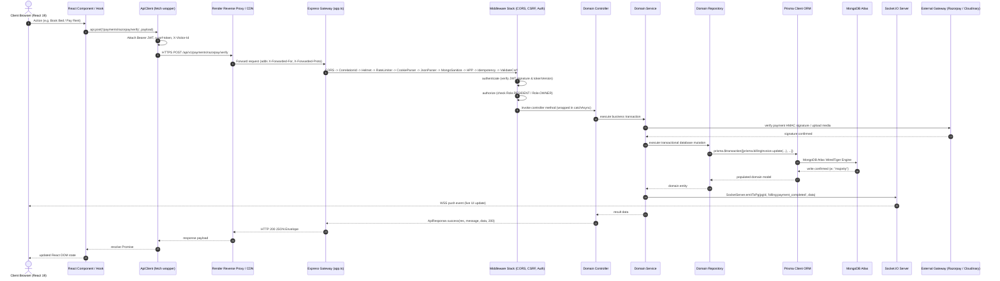
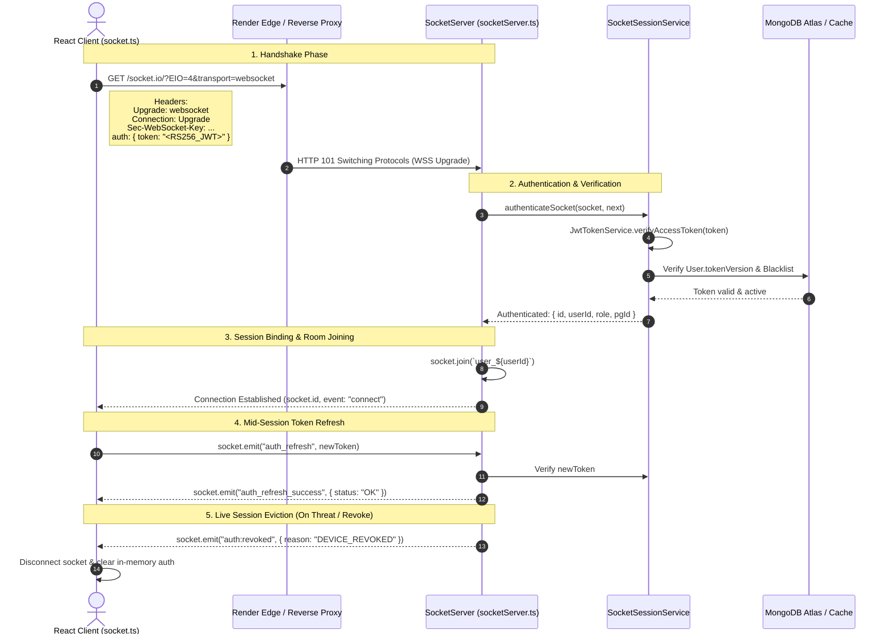

# 🔌 RoomBae Enterprise API Architecture, Connection & WebSocket Handshake Specification (`api_design.md`)

> **Authoritative Technical Architecture Blueprint** covering the complete communication lifecycle, REST v1 API catalog, SOAP ERP billing engine, Socket.IO WebSockets handshake protocol, real-time event multiplexing, Prisma ORM data layer, MongoDB Atlas replica set schema, production URLs, and end-to-end frontend-to-backend mappings for **RoomBae**.

---

## 📑 Table of Contents

1. [API Architecture & Platform Overview](#1-api-architecture--platform-overview)
2. [Complete System Communication Topology & Network Protocols](#2-complete-system-communication-topology--network-protocols)
3. [Local Development vs Production Environments & Hostnames](#3-local-development-vs-production-environments--hostnames)
4. [API URL Structure & Production Endpoints](#4-api-url-structure--production-endpoints)
5. [Frontend ApiClient Architecture & Interceptor Pipeline](#5-frontend-apiclient-architecture--interceptor-pipeline)
6. [WebSocket (Socket.IO) Real-Time Architecture & Handshake Protocol](#6-websocket-socketio-real-time-architecture--handshake-protocol)
7. [WebSocket Event Catalog & Channel Multiplexing](#7-websocket-event-catalog--channel-multiplexing)
8. [Edge Proxy, CORS & Security Middleware Pipeline](#8-edge-proxy-cors--security-middleware-pipeline)
9. [Database Communication & MongoDB Atlas ReplicaSet Architecture](#9-database-communication--mongodb-atlas-replicaset-architecture)
10. [In-Memory Session Caching & Redis-Free Invalidation](#10-in-memory-session-caching--redis-free-invalidation)
11. [Master API Route & Connection Inventory (All 25 Modules)](#11-master-api-route--connection-inventory-all-25-modules)
12. [SOAP 1.2 XML ERP Billing Interface](#12-soap-12-xml-erp-billing-interface)
13. [Third-Party Cloud Platform Connections](#13-third-party-cloud-platform-connections)
14. [Enterprise Error Handling & Resilience Matrix](#14-enterprise-error-handling--resilience-matrix)
15. [Environment Variable Matrix & API Contracts](#15-environment-variable-matrix--api-contracts)

---

## 1. API Architecture & Platform Overview

RoomBae is an enterprise multi-tenant PG & Co-living management platform engineered with high-throughput RESTful APIs, bidirectional Socket.IO WebSockets, an enterprise SOAP ERP billing bridge, and a resilient data tier built on Prisma ORM and MongoDB Atlas.

### 1.1 Why APIs Are Used In This Project
- **Separation of Presentation and Business Logic**: The frontend is a high-performance Single Page Application (SPA) built with React 19, TypeScript, and Vite. All domain logic, financial calculations, room allocation invariants, and security controls execute strictly in the Node.js backend.
- **Multi-Tenant Data Isolation**: APIs enforce strict tenant scoping via `tenantMiddleware`, ensuring PG owners only access their properties and residents only access their assigned rooms, beds, and billing invoices.
- **Cross-Platform & ERP Readiness**: The backend exposes standardized REST endpoints for the web SPA, SOAP 1.2 WSDL endpoints for enterprise accounting systems, and bidirectional WebSockets for instant state synchronization.

### 1.2 Architectural Topology

```mermaid
graph TD
    Client["Client Tier<br/>(React 19 + TypeScript + Vite)"]
    Gateway["Express Gateway & Security Pipeline<br/>(CORS, Helmet, RateLimiter, MongoSanitize, HPP)"]
    AuthModule["Security & Auth Engine<br/>(RS256 JWT, Double-Submit CSRF, FingerprintJS, TokenVersion)"]
    ServiceLayer["Modular Domain Services<br/>(Auth, Billing, Residents, Properties, Documents)"]
    RepoLayer["Repository Pattern Layer<br/>(Prisma Data Access Abstraction)"]
    Database["MongoDB Atlas ReplicaSet<br/>(WiredTiger Encrypted Document Storage)"]
    Realtime["Socket.IO Server<br/>(Engine.IO Transport, Redis-Free Channel Multiplexing)"]
    ThirdParty["External Cloud Providers<br/>(Razorpay, Cloudinary, Twilio, Brevo, Google OAuth)"]

    Client -->|HTTPS REST API / JSON| Gateway
    Client <-->|WSS WebSockets (Duplex)| Realtime
    Gateway --> AuthModule
    AuthModule --> ServiceLayer
    ServiceLayer --> RepoLayer
    RepoLayer --> Database
    ServiceLayer --> Realtime
    ServiceLayer --> ThirdParty
```

1. **REST Protocol Standard**: All transactional operations follow RESTful conventions over HTTPS, consuming and returning UTF-8 encoded JSON payloads wrapped in standardized `ApiResponse` envelopes.
2. **Stateless Asymmetric Authentication**: Core access tokens use asymmetric **RS256 (RSA-2048) JWTs** validated via in-memory caching and public `/.well-known/jwks.json`. Refresh tokens are opaque 256-bit cryptographic strings stored in secure, `HttpOnly`, `SameSite=None/Lax` cookies with SHA-256 hashed database verification and automatic family reuse detection.
3. **Double-Submit HMAC-Signed CSRF Protection**: State-mutating requests (`POST`, `PUT`, `PATCH`, `DELETE`) require a valid `x-csrf-token` header matching the `csrf-token` cookie verified with constant-time buffer comparison (`safeCompareCsrf`).
4. **Authoritative Consistency (Redis-Free)**: Token invalidation and session revocation operate on an authoritative `User.tokenVersion` stored in MongoDB Atlas, with an in-memory 10-second fast-path cache. Distributed holds use optimistic locking and database timestamps (`lockExpiresAt`).

---

## 2. Complete System Communication Topology & Network Protocols

Every user action flows through a deterministic multi-tier pipeline from user click to database write, and back through WebSocket broadcast.



---

## 3. Local Development vs Production Environments & Hostnames

```mermaid
graph LR
    subgraph Local_Development ["Local Development Environment"]
        DevBrowser["Browser (React SPA)<br/>http://localhost:5173"]
        DevBackend["Node.js / Express Server<br/>http://localhost:5000"]
        DevDB["MongoDB Atlas Dev DB<br/>mongodb+srv://..."]
        DevWS["Socket.IO Dev Server<br/>ws://localhost:5000"]

        DevBrowser -->|HTTP REST (CORS / SameSite=Lax)| DevBackend
        DevBrowser <-->|WS Polling & WebSocket| DevWS
        DevBackend --> DevDB
    end

    subgraph Production ["Production Environment"]
        ProdBrowser["Browser (GitHub Pages)<br/>https://ayushman-glb.github.io/PG-Management-System"]
        ProdEdge["Render Edge Proxy / CDN<br/>(SSL/TLS Termination, Proxy Hop 1)"]
        ProdBackend["Production Node.js Cluster<br/>https://pg-management-system-boxb.onrender.com"]
        ProdDB["MongoDB Atlas ReplicaSet<br/>(WiredTiger Encrypted Storage)"]
        ProdWS["WSS Secure Socket.IO<br/>wss://pg-management-system-boxb.onrender.com"]
        CloudinaryCDN["Cloudinary Media CDN<br/>https://res.cloudinary.com"]

        ProdBrowser -->|HTTPS REST (CORS / SameSite=None; Secure)| ProdEdge
        ProdEdge --> ProdBackend
        ProdBrowser <-->|WSS WebSockets| ProdEdge
        ProdEdge <--> ProdWS
        ProdBackend --> ProdDB
        ProdBrowser -->|Fetch Images| CloudinaryCDN
        ProdBackend -->|Upload Assets| CloudinaryCDN
    end
```

---

## 4. API URL Structure & Production Endpoints

### 4.1 Production & Local URL Matrix

| Environment | Component | URL | Configuration Location |
| :--- | :--- | :--- | :--- |
| **Production** | **Frontend Web Application** | `https://ayushman-glb.github.io/PG-Management-System` | `frontend/vite.config.ts` (`base: "/PG-Management-System/"`) |
| **Production** | **Backend REST API Base** | `https://pg-management-system-boxb.onrender.com/api/v1` | `frontend/src/config/env.ts` & `backend/src/config/env.ts` |
| **Production** | **WebSocket (WSS) Gateway** | `wss://pg-management-system-boxb.onrender.com` | `frontend/src/services/socket.ts` |
| **Production** | **Swagger UI Documentation** | `https://pg-management-system-boxb.onrender.com/api/docs` | Mounted at `/api/docs` and `/api/v1/docs` |
| **Production** | **Public Cryptographic JWKS** | `https://pg-management-system-boxb.onrender.com/.well-known/jwks.json` | `backend/src/app.ts` |
| **Production** | **SOAP 1.2 ERP Billing WSDL** | `https://pg-management-system-boxb.onrender.com/soap/billing?wsdl` | `backend/src/app.ts` |
| **Production** | **Cloudinary Media Storage** | `https://res.cloudinary.com/roombae` | `backend/src/config/cloudinary.ts` |
| **Local Dev** | **Frontend Web Application** | `http://localhost:5173` | `frontend/vite.config.ts` |
| **Local Dev** | **Backend REST API Base** | `http://localhost:5000/api/v1` | `frontend/src/config/env.ts` |
| **Local Dev** | **WebSocket (WS) Gateway** | `ws://localhost:5000` | `frontend/src/services/socket.ts` |

---

## 5. Frontend ApiClient Architecture & Interceptor Pipeline

The frontend encapsulates all HTTP communication through a singleton `ApiClient` class (`frontend/src/services/api.ts`):

```typescript
// frontend/src/services/api.ts
class ApiClient {
  private static instance: ApiClient;
  private refreshPromise: Promise<string> | null = null;

  private async request<T>(endpoint: string, options: RequestInit = {}): Promise<T> {
    const token = authService.getToken();
    const headers = new Headers(options.headers || {});

    // 1. In-Memory JWT Injection
    if (token && !headers.has("Authorization")) {
      headers.set("Authorization", `Bearer ${token}`);
    }

    // 2. Double-Submit CSRF Attachment for Mutating Requests
    const isMutating = ["POST", "PUT", "PATCH", "DELETE"].includes((options.method || "GET").toUpperCase());
    if (isMutating) {
      const csrfToken = getCookie("csrf-token");
      if (csrfToken) headers.set("x-csrf-token", csrfToken);
    }

    // 3. Hardware Fingerprint Telemetry
    const visitorId = getStoredVisitorId();
    if (visitorId) headers.set("X-Visitor-Id", visitorId);

    // 4. Cross-Origin Credentials (Cookies)
    const config: RequestInit = {
      ...options,
      headers,
      credentials: "include",
    };

    const res = await fetch(getApiUrl(endpoint), config);

    // 5. Single-Flight 401 Refresh Mutex
    if (res.status === 401 && !endpoint.includes("/auth/login") && !endpoint.includes("/auth/refresh-token")) {
      if (!this.refreshPromise) {
        this.refreshPromise = authService.refreshToken().finally(() => {
          this.refreshPromise = null;
        });
      }
      const newToken = await this.refreshPromise;
      headers.set("Authorization", `Bearer ${newToken}`);
      return this.request<T>(endpoint, { ...options, headers });
    }

    // 6. Automatic 403 CSRF Recovery
    if (res.status === 403 && isMutating) {
      const body = await res.clone().json().catch(() => ({}));
      if (body?.error?.code === "CSRF_INVALID" || body?.error?.code === "CSRF_MISSING") {
        await authService.bootstrapCsrf();
        const freshCsrf = getCookie("csrf-token");
        if (freshCsrf) headers.set("x-csrf-token", freshCsrf);
        return this.request<T>(endpoint, { ...options, headers });
      }
    }

    const data = await res.json();
    if (!res.ok) throw new ApiError(data.message || "Request failed", res.status, data.error?.code);
    return data.data;
  }
}
```

---

## 6. WebSocket (Socket.IO) Real-Time Architecture & Handshake Protocol

RoomBae uses **Socket.IO v4.8.3** over HTTP/2 WebSocket (WSS) for zero-latency, bidirectional state synchronization across residents, owners, and administrative staff.



### 6.1 Handshake Configuration & Security Parameters

```typescript
// backend/src/socket/socketServer.ts
SocketServer.io = new SocketIOServer(server, {
  cors: {
    origin: (origin, callback) => {
      if (isOriginAllowed(origin)) return callback(null, true);
      logger.warn(`🔌 Socket connection rejected [CORS]: Origin ${origin} not permitted`);
      return callback(new Error(`Origin ${origin} not allowed by CORS`));
    },
    credentials: true,
  },
  pingInterval: 25000, // Heartbeat sent every 25 seconds
  pingTimeout: 10000,  // Drop connection if no pong within 10 seconds
  transports: ["websocket", "polling"],
});
```

### 6.2 Packet-Level Continuous Authorization Guard
Every incoming event on an active socket is intercepted by `SocketSessionService.authorizeSocketEvent` to verify that the session has not been revoked mid-stream:

```typescript
// backend/src/socket/socketServer.ts
socket.use((packet, next) => {
  SocketSessionService.authorizeSocketEvent(socket, packet, next);
});
```

### 6.3 Room Subscription & Multiplexing Architecture

| Room Name Pattern | Description & Access Criteria | Allowed Roles |
| :--- | :--- | :--- |
| `user_${userId}` | Private channel for targeted user notifications, new device alerts, and payment invoices. | Any authenticated user (`user.id === userId`) |
| `owner_${ownerId}` | Private channel for PG Owners to receive real-time booking requests, maintenance alerts, and occupancy changes. | `OWNER`, `SUPER_ADMIN`, `ADMIN` |
| `resident_${residentId}`| Private channel for individual resident tenancy updates, agreement status, and receipt delivery. | `RESIDENT` (`user.id === residentId`) |
| `pg_${pgId}` | Facility-wide broadcast channel for PG-specific maintenance notices, food menu updates, and emergency broadcasts. | Residents, Owners, and Staff assigned to `pgId` |

---

## 7. WebSocket Event Catalog & Channel Multiplexing

The following table catalogs all real-time events supported across the Socket.IO cluster:

| Event Name | Direction | Payload Structure | Triggering Action & Description |
| :--- | :--- | :--- | :--- |
| `auth_refresh` | Client → Server | `(newToken: string)` | Dispatched by client after rotating access token to update socket credentials without disconnecting. |
| `auth_refresh_success`| Server → Client | `{ status: "OK", userId: string }` | Confirms socket credentials successfully updated. |
| `auth:revoked` | Server → Client | `{ userId: string, reason: string }` | **Universal Session Eviction**: Kicks connected clients immediately when a device is revoked or password changed. |
| `join_pg` | Client → Server | `(pgId: string)` | Joins the authenticated client to property room `pg_${pgId}`. |
| `join_owner` | Client → Server | `(ownerId: string)` | Joins owner to private room `owner_${ownerId}`. |
| `join_resident` | Client → Server | `(residentId: string)` | Joins resident to private room `resident_${residentId}`. |
| `resident:status_updated`| Server → Client | `{ residentId, status, pgId, reason, updatedAt }` | Emitted when a resident checks in, goes on leave, or checks out. |
| `bed:status_updated` | Server → Client | `{ bedId, status, bedNumber, notes, updatedAt }` | Real-time bed status updates (`AVAILABLE`, `OCCUPIED`, `MAINTENANCE`). |
| `bed:hold_updated` | Server → Client | `{ action: 'CREATED'\|'RELEASED', hold, bed }` | Broadcasts bed hold lock creation or expiry. |
| `transfer:requested` | Server → Client | `{ requestId, residentId, pgId, targetRoomNumber }` | Alerts property manager of a room transfer request. |
| `transfer:status_updated`| Server → Client| `{ action: 'APPROVED'\|'REJECTED', request }` | Updates resident on transfer approval/rejection. |
| `billing:payment_completed`| Server → Client| `{ invoiceId, amount, paymentMethod, paidAt }` | Confirms payment settlement in real time. |
| `complaint:created` | Server → Client | `{ complaintId, title, priority, pgId }` | Alerts property staff of a newly logged maintenance ticket. |
| `complaint:status_updated`| Server → Client| `{ complaintId, status, resolvedBy, updatedAt }` | Updates resident on maintenance progress. |
| `message:new` | Server → Client | `{ messageId, threadId, senderId, content, timestamp }` | Pushes incoming chat messages to active thread participants. |
| `notification:broadcast` | Server → Client | `{ notificationId, title, message, type, createdAt }` | In-app push notifications and broadcast alerts. |

---

## 8. Edge Proxy, CORS & Security Middleware Pipeline

All incoming HTTP requests travel through an ordered, 11-stage middleware pipeline before reaching domain controllers:

```text
Incoming Request
  │
  ├─► 1. Trust Proxy (app.set("trust proxy", 1))
  │      Extracts client IP from x-forwarded-for header across edge proxies (Render, Cloudflare).
  │
  ├─► 2. Security Headers (helmet())
  │      Sets HSTS, X-Content-Type-Options: nosniff, FrameGuard, Referrer-Policy, and CSP.
  │
  ├─► 3. Dynamic CORS Shield (cors(corsOptions))
  │      Validates Origin dynamically against:
  │      • Localhost ports: http://localhost:5173, http://localhost:3000, http://127.0.0.1:*
  │      • Production subdomains via regex: *.onrender.com, *.github.io, *.vercel.app
  │      • Configured URLs: CLIENT_URL, FRONTEND_URL, CORS_ALLOWED_ORIGINS
  │      • Headers allowed: Content-Type, Authorization, X-Visitor-Id, X-Correlation-ID, X-CSRF-Token, Idempotency-Key
  │      • Credentials enabled: credentials: true
  │
  ├─► 4. Tiered Rate Limiters
  │      • loginLimiter: 5 req/15min per IP
  │      • registerLimiter: 5 req/1hr per IP
  │      • sendOtpLimiter: 3 req/10min per IP
  │      • verifyOtpLimiter: 10 req/15min per IP
  │      • generalLimiter: 300 req/15min per IP
  │
  ├─► 5. Parsers & Sanitizers (express.json({ limit: "10mb" }), mongoSanitize(), cookieParser())
  │      Parses JSON bodies, cookies, and strips $, . to prevent NoSQL injection.
  │
  ├─► 6. Distributed Tracing (correlationIdMiddleware)
  │      Generates or propagates x-correlation-id and x-request-id across request logs.
  │
  ├─► 7. CSRF Double-Submit Guard (csrfMiddleware)
  │      Validates x-csrf-token header against non-httpOnly cookie on POST, PUT, PATCH, DELETE.
  │
  ├─► 8. Tenant & Routing Dispatcher (app.use('/api/v1', apiRouter))
  │      Attaches tenant metadata and routes request to modular controllers.
  │
  ├─► 9. Authentication Guard (authenticate)
  │      Verifies RS256 JWT access token, checks tokenVersion, and attaches req.user.
  │
  ├─► 10. Authorization Guard (authorize / requireRole)
  │       Verifies user role (OWNER, RESIDENT, ADMIN, SUPER_ADMIN) matches endpoint permissions.
  │
  └─► 11. Global Error Handler (errorHandler / errorMiddleware)
          Catches AppError, Prisma P2002 duplicate key errors (409), validation errors (400), and unhandled exceptions (500).
```

---

## 9. Database Communication & MongoDB Atlas ReplicaSet Architecture

### 9.1 Connection & Driver Engine
```text
Node.js Runtime (v20 LTS)
  ↓ (Native C++ Bindings)
Prisma Query Engine (prisma-client-js 6.19.3)
  ↓ (TLS 1.3 Encrypted Socket)
MongoDB Node.js Driver Engine
  ↓ (mongodb+srv:// URI Protocol)
MongoDB Atlas ReplicaSet (Primary / Secondary Nodes)
```

- **Connection Pool Configuration**:
  - `DATABASE_URL`: `mongodb+srv://<user>:<password>@cluster.mongodb.net/roombae?retryWrites=true&w=majority`
  - **Write Concern**: `w: "majority"` ensures durable replication across Atlas nodes before returning success.
  - **Read Concern**: Directed to primary node for transactional consistency.
  - **Atomic Transactions**: Multi-document operations (bed allocations, checkouts, payment settlements) execute inside `prisma.$transaction([...])`.

---

## 10. In-Memory Session Caching & Redis-Free Invalidation

RoomBae operates an authoritative **zero-Redis caching and session revocation architecture**:
1. **Authoritative `User.tokenVersion`**:
   - Every `User` document in MongoDB maintains an integer `tokenVersion` (default `0`).
   - Logging out from all devices, changing passwords, or admin revocation atomically increments `tokenVersion` in MongoDB.
   - JWT tokens embed `tokenVersion` in their claims. Any token containing a stale `tokenVersion` is immediately rejected.
2. **In-Memory Fast-Path Cache (`TokenBlacklistService`)**:
   - Maintains an in-memory LRU cache of recently verified token versions with a 10-second TTL to avoid database hits on every request while ensuring sub-10s revocation convergence.
3. **Optimistic Locking for Beds**:
   - Bed holds and reservation mutexes utilize atomic MongoDB timestamp comparisons (`lockExpiresAt: { gt: new Date() }`).

---

## 11. Master API Route & Connection Inventory (All 25 Modules)

The following table lists all REST API endpoints mounted in `backend/src/routes/apiRouter.ts`:

| Route Path | HTTP Method | Auth Guard | Permitted Roles | Controller Handler | Service Method | Description |
| :--- | :--- | :--- | :--- | :--- | :--- | :--- |
| **System & Health** | | | | | | |
| `/` | `GET` | Public | Public | `apiRouter` Inline | N/A | Root REST API v1 Service Discovery Directory |
| `/health` | `GET` | Public | Public | `apiRouter` Inline | N/A | REST API health check probe |
| `/health/pipeline-test` | `GET` | Public | Public | `apiRouter` Inline | N/A | Full middleware pipeline diagnostic probe |
| **Authentication & Security** | | | | | | |
| `/auth/csrf-token` | `GET` | Public | Public | `generateCsrfToken` | `createSignedCsrfToken` | Issues fresh CSRF cookie & header |
| `/auth/login` | `POST` | Public | Public | `AuthController.login` | `AuthService.login` | Authenticates email/phone/residentCode |
| `/auth/register` | `POST` | Public | Public | `AuthController.register` | `AuthService.register` | Registers new Owner or Resident account |
| `/auth/send-otp` | `POST` | Public | Public | `AuthController.sendOtp` | `AuthService.sendOtp` | Dispatches verification OTP |
| `/auth/verify-otp` | `POST` | Public | Public | `AuthController.verifyOtp` | `AuthService.verifyOtp` | Validates OTP and issues session tokens |
| `/auth/send-phone-otp` | `POST` | Public | Public | `PhoneAuthController.sendOtp` | `TwilioService.sendOtp` | Sends SMS OTP via Twilio |
| `/auth/verify-phone-otp`| `POST` | Public | Public | `PhoneAuthController.verifyOtp`| `TwilioService.verifyOtp` | Validates Twilio phone SMS OTP |
| `/auth/email/send-otp` | `POST` | Public | Public | `AuthController.sendEmailOtp` | `EmailService.sendOtp` | Sends 6-digit email verification OTP |
| `/auth/email/verify-otp`| `POST` | Public | Public | `AuthController.verifyEmailOtp`| `AuthService.verifyEmailOtp` | Verifies email OTP |
| `/auth/password/send-reset`| `POST` | Public | Public | `AuthController.sendPasswordReset`| `AuthService.sendPasswordReset`| Dispatches password recovery OTP |
| `/auth/password/verify` | `POST` | Public | Public | `AuthController.verifyPasswordReset`| `AuthService.verifyPasswordReset`| Resets password and revokes all sessions |
| `/auth/2fa/verify` | `POST` | Public | Public | `AuthController.verifyTwoFactor`| `AuthService.verifyTwoFactor` | Validates 2FA TOTP code |
| `/auth/refresh-token` | `POST` | Cookie | Public | `AuthController.refreshToken` | `AuthService.refreshToken` | Rotates refresh token and issues new JWT |
| `/auth/logout` | `POST` | Cookie | Authenticated | `AuthController.logout` | `AuthService.logout` | Revokes current device session |
| `/auth/logout-all` | `POST` | Bearer JWT | Authenticated | `AuthController.logoutAll` | `AuthService.logoutAll` | Increments tokenVersion; revokes all devices |
| `/auth/me` | `GET` | Bearer JWT | Authenticated | `AuthController.me` | `AuthService.getProfile` | Retrieves active authenticated user profile |
| `/auth/google` | `GET` | Public | Public | `AuthController.googleLogin` | `AuthService.googleAuth` | Initiates Google OAuth 2.0 redirect |
| `/auth/google/callback`| `GET` | Public | Public | `AuthController.googleCallback` | `AuthService.googleAuth` | Exchanges Google auth code for tokens |
| `/security/devices` | `GET` | Bearer JWT | Authenticated | `DeviceController.listDevices` | `DeviceService.listDevices` | Lists user's registered devices |
| `/security/devices/alert-decision`| `POST` | Public/JWT | Public | `DeviceController.handleAlertDecision`| `DeviceService.handleAlertDecision`| Handles Accept/Deny on device alert modal |
| `/security/devices/:id` | `DELETE` | Bearer JWT | Authenticated | `DeviceController.revokeDevice` | `DeviceService.revokeDevice` | Revokes a specific registered device |
| **Properties & Marketplace** | | | | | | |
| `/properties/search` | `GET` | Public | Public | `PropertyController.searchPublic` | `PropertyService.searchPublic` | Public marketplace property search |
| `/properties` | `POST` | Bearer JWT | `OWNER` | `PropertyController.create` | `PropertyService.createProperty` | Creates new PG property listing |
| `/properties/:id` | `GET` | Public | Public | `PropertyController.getById` | `PropertyService.getById` | Retrieves detailed property info |
| `/properties/:id` | `PUT` | Bearer JWT | `OWNER`, `ADMIN` | `PropertyController.update` | `PropertyService.updateProperty` | Updates property metadata and rules |
| `/properties/owner-summary`| `GET` | Bearer JWT | `OWNER`, `ADMIN` | `PropertyController.getOwnerSummary`| `PropertyService.getOwnerSummary` | Summarizes owner properties & occupancy |
| **Rooms & Beds Management** | | | | | | |
| `/rooms/pms` | `GET` | Bearer JWT | `OWNER`, `STAFF` | `RoomController.list` | `RoomService.listRooms` | Lists rooms for property management |
| `/rooms` | `POST` | Bearer JWT | `OWNER` | `RoomController.create` | `RoomService.createRoom` | Adds new room to a property |
| `/rooms/transfers` | `POST` | Bearer JWT | `RESIDENT` | `ResidentManagementController.createRoomTransferRequest` | `ResidentManagementService.createRoomTransferRequest` | Submits room transfer request |
| `/beds/hold` | `POST` | Bearer JWT | `OWNER`, `STAFF` | `ResidentManagementController.createBedHold` | `ResidentManagementService.createBedHold` | Locks bed with temporary hold mutex |
| `/beds/hold/:holdId/release`| `POST` | Bearer JWT | `OWNER`, `STAFF` | `ResidentManagementController.releaseBedHold` | `ResidentManagementService.releaseBedHold` | Releases active bed hold mutex |
| **Residents & Tenancy** | | | | | | |
| `/residents/onboard` | `POST` | Bearer JWT | `OWNER`, `STAFF` | `ResidentController.onboard` | `ResidentService.onboardResident` | Onboards new resident and assigns bed |
| `/residents/directory` | `GET` | Bearer JWT | `OWNER`, `STAFF` | `ResidentController.getDirectory` | `ResidentService.getDirectory` | Lists residents in a PG property |
| `/residents/me` | `GET` | Bearer JWT | `RESIDENT` | `ResidentController.getMe` | `ResidentService.getResidentProfile` | Resident self-service portal profile |
| `/residents/me/profile`| `PUT` | Bearer JWT | `RESIDENT` | `ResidentController.updateProfile` | `ResidentService.updateProfile` | Updates resident personal profile |
| **Billing & Payments** | | | | | | |
| `/billing/invoices` | `GET` | Bearer JWT | Authenticated | `BillingController.listInvoices` | `BillingService.listInvoices` | Lists billing invoices for user/property |
| `/billing/invoices/:id`| `GET` | Bearer JWT | Authenticated | `BillingController.getInvoice` | `BillingService.getInvoice` | Retrieves detailed invoice breakdown |
| `/payments/razorpay/create-order`| `POST`| Bearer JWT | `RESIDENT` | `PaymentController.createOrder` | `PaymentService.createOrder` | Creates Razorpay payment order |
| `/payments/razorpay/verify`| `POST` | Bearer JWT | `RESIDENT` | `PaymentController.verifyPayment` | `PaymentService.verifyPayment` | Verifies Razorpay payment HMAC signature |
| `/payments/webhook` | `POST` | Public (HMAC) | Public | `PaymentController.handleWebhook` | `PaymentService.handleWebhook` | Razorpay webhook settlement handler |
| **Agreements & Documents** | | | | | | |
| `/agreements/:id/sign` | `POST` | Bearer JWT | `RESIDENT`, `OWNER`| `AgreementController.sign` | `AgreementService.signAgreement` | Signs digital tenancy agreement |
| `/documents/agreement/:id`| `GET` | Bearer JWT | Authenticated | `DocumentController.downloadAgreement`| `DocumentService.getAgreementPdf`| Downloads rendered agreement PDF |
| `/upload/sign-upload` | `POST` | Bearer JWT | Authenticated | `UploadController.signUpload` | `CloudinaryService.getSignedUploadParams` | Generates signed Cloudinary upload params |
| `/media/upload/single` | `POST` | Bearer JWT | Authenticated | `MediaController.uploadSingle` | `CloudinaryService.upload` | Uploads single media file |
| **Complaints & Maintenance** | | | | | | |
| `/complaints` | `POST` | Bearer JWT | `RESIDENT` | `ComplaintController.create` | `ComplaintService.createComplaint` | Files maintenance ticket |
| `/complaints` | `GET` | Bearer JWT | Authenticated | `ComplaintController.list` | `ComplaintService.listComplaints` | Lists maintenance complaints |
| `/complaints/:id/status`| `PATCH` | Bearer JWT | `OWNER`, `STAFF` | `ComplaintController.updateStatus` | `ComplaintService.updateStatus` | Updates maintenance complaint status |
| **Tours, Applications & Shortlist** | | | | | | |
| `/tours` | `POST` | Bearer JWT | `RESIDENT` | `ToursController.createTour` | `ToursService.requestTour` | Books property visit tour slot |
| `/shortlist/:id` | `POST` | Bearer JWT | `RESIDENT` | `ToursController.toggleShortlist` | `ToursService.toggleShortlist` | Adds/removes property from shortlist |
| `/applications` | `POST` | Bearer JWT | `RESIDENT` | `ApplicationsController.create` | `ApplicationsService.createApplication` | Submits rental application |
| **Messages & Communications** | | | | | | |
| `/messages` | `POST` | Bearer JWT | Authenticated | `MessagesController.sendMessage` | `MessagesService.sendMessage` | Sends chat message in thread |
| `/messages/:threadId` | `GET` | Bearer JWT | Authenticated | `MessagesController.getMessages` | `MessagesService.getMessages` | Retrieves message history for thread |
| **Move-In & Operations** | | | | | | |
| `/move-in/:propertyId` | `GET` | Bearer JWT | `RESIDENT` | `MoveInController.getInfo` | `MoveInService.getMoveInInfo` | Fetches move-in coordination info |
| `/move-in/:propertyId/checklist`| `POST`| Bearer JWT | `RESIDENT` | `MoveInController.submitChecklist`| `MoveInService.submitChecklist` | Submits move-in room checklist |
| **Marketing & Analytics** | | | | | | |
| `/marketing/campaigns` | `GET` | Bearer JWT | `OWNER`, `ADMIN` | `MarketingController.listCampaigns`| `MarketingService.listCampaigns` | Lists marketing campaigns |
| `/analytics/revenue` | `GET` | Bearer JWT | `OWNER`, `ADMIN` | `AnalyticsController.getRevenue` | `AnalyticsService.getRevenue` | Aggregates revenue trends |
| `/analytics/occupancy` | `GET` | Bearer JWT | `OWNER`, `ADMIN` | `AnalyticsController.getOccupancy` | `AnalyticsService.getOccupancy` | Aggregates bed occupancy metrics |
| **Dashboard & Settings** | | | | | | |
| `/dashboard/overview` | `GET` | Bearer JWT | `OWNER`, `ADMIN` | `DashboardController.getOverview` | `PropertyService.getOverview` | Aggregates dashboard analytics |
| `/notifications` | `GET` | Bearer JWT | Authenticated | `NotificationController.list` | `NotificationService.getForUser` | Lists in-app notifications |
| `/settings/audit-logs` | `GET` | Bearer JWT | `OWNER`, `ADMIN` | `ResidentManagementController.getAuditLogs` | `ResidentManagementService.getAuditLogs` | Queries security and audit logs |

---

## 12. SOAP 1.2 XML ERP Billing Interface

For enterprise accounting systems (SAP, Tally, Oracle ERP), RoomBae exposes a dedicated SOAP 1.2 Web Service mounted at `/soap/billing?wsdl`:

```text
Enterprise ERP (SAP / Tally)
  ↓ (HTTPS POST /soap/billing)
XML Body: <soap12:Envelope> ... <GetInvoicesRequest>
  ↓ (XXE-Protected XML Parser)
Express SOAP Handler (WSDL Service Definition)
  ↓ (API-Key Guard)
BillingService.listInvoices(...)
  ↓ (Prisma Query Engine)
MongoDB Atlas Billing Collection
```

- **WSDL Endpoint**: `https://pg-management-system-boxb.onrender.com/soap/billing?wsdl`
- **Security Controls**: Protected against XML External Entity (XXE) injection and Billion Laughs entity expansion attacks; guarded by `X-ERP-API-Key` headers.

---

## 13. Third-Party Cloud Platform Connections

```mermaid
graph LR
    subgraph RoomBae_Backend ["RoomBae Backend Engine"]
        MediaService["Media & Upload Service"]
        PaymentService["Razorpay Payment Engine"]
        SmsService["Twilio Phone Auth Engine"]
        EmailService["SMTP / Brevo Email Engine"]
        OAuthService["Google OAuth 2.0 Strategy"]
    end

    Cloudinary["Cloudinary CDN API<br/>(Signed Uploads & WebP Delivery)"]
    Razorpay["Razorpay Gateway<br/>(Order Creation & Webhook HMAC)"]
    Twilio["Twilio SMS Gateway<br/>(Multi-Factor Phone OTP Delivery)"]
    SMTP["SMTP / Brevo Relay<br/>(Device Alerts & Invoices)"]
    Google["Google Accounts API<br/>(OpenID Connect Profile)"]

    MediaService -->|HTTPS REST / Signatures| Cloudinary
    PaymentService -->|HTTPS REST / HMAC SHA-256| Razorpay
    SmsService -->|HTTPS REST API| Twilio
    EmailService -->|TLS SMTP (Port 587)| SMTP
    OAuthService -->|OAuth 2.0 PKCE / REST| Google
```

---

## 14. Enterprise Error Handling & Resilience Matrix

All REST API errors return a standard JSON envelope:

```json
{
  "success": false,
  "message": "Human-readable error explanation",
  "errors": [
    {
      "field": "password",
      "message": "Password must be at least 8 characters long"
    }
  ],
  "error": {
    "code": "WEAK_PASSWORD",
    "message": "Password does not meet complexity requirements",
    "action": "check_input"
  }
}
```

| Exception / Error Cause | HTTP Status | Error Code | Client Remediation Action |
| :--- | :--- | :--- | :--- |
| `ZodError` (Validation Failure) | `400 Bad Request` | `VALIDATION_ERROR` | `check_input` |
| `SyntaxError` (Malformed JSON Body) | `400 Bad Request` | `INVALID_JSON` | `check_payload_syntax` |
| `MulterError` (Upload Failure / Size) | `400 Bad Request` | `FILE_UPLOAD_ERROR` | `check_file_format_and_size` |
| `JsonWebTokenError` / Invalid Signature | `401 Unauthorized` | `INVALID_TOKEN` | `re_authenticate` |
| `TokenExpiredError` (JWT Expired) | `401 Unauthorized` | `TOKEN_EXPIRED` | `refresh_token` |
| `CSRF_MISSING` / `CSRF_INVALID` | `403 Forbidden` | `CSRF_INVALID` | `retry` (Auto-rebootstrapped by `ApiClient`) |
| Insufficient Permissions / Role Mismatch | `403 Forbidden` | `FORBIDDEN` | `contact_administrator` |
| `Prisma P2002` (Duplicate Key Collision) | `409 Conflict` | `DUPLICATE_RESOURCE` | `use_unique_identifier` |
| Rate Limit Quota Exceeded | `429 Too Many Requests`| `RATE_LIMIT_EXCEEDED`| `wait_and_retry` |
| Unhandled Exceptions | `500 Server Error` | `INTERNAL_SERVER_ERROR`| `contact_support` |

---

## 15. GOD Platform Operations & Multi-Tenant Analytics API

The `GOD` role has dedicated platform-level operational endpoints under `/api/v1/god/*` guarded by `authenticate` and `authorize(Role.GOD)`:

| Method | Endpoint | Description | Query / Body Parameters | Response |
| :--- | :--- | :--- | :--- | :--- |
| `GET` | `/api/v1/god/overview` | Platform-wide KPIs: Total PG Owners, Residents, Beds, Occupancy %, MRR, ARR, Subscriptions by Tier | None | `{ success: true, data: GodOverviewMetrics }` |
| `GET` | `/api/v1/god/owners` | Paginated PG owner directory with capacities, tiers, and occupancy | `page`, `limit`, `search`, `city`, `kycStatus` | `{ success: true, data: GodOwnerItem[], pagination }` |
| `GET` | `/api/v1/god/owners/:id` | Full owner drilldown: Entity info, masked PII, properties list, and tenant roster | `id` (path param) | `{ success: true, data: GodOwnerDetail }` |
| `GET` | `/api/v1/god/residents` | Platform-wide resident registry across all PG facilities | `page`, `limit`, `search`, `status`, `pgId` | `{ success: true, data: GodResidentItem[], pagination }` |
| `GET` | `/api/v1/god/revenue` | SaaS platform revenue breakdown, MRR velocity, and ARR curves | `timeframe` (`monthly` \| `quarterly` \| `yearly`) | `{ success: true, data: GodRevenueMetrics }` |

---

## 16. Authoritative Reference & Standards Compliance

- **OpenAPI 3.0 Live Documentation**: [http://localhost:5000/api/docs](http://localhost:5000/api/docs) or [https://roombae-backend.onrender.com/api/docs](https://roombae-backend.onrender.com/api/docs)
- **Zero-Trust Specification**: Complete cryptographic isolation, RS256 token verification, double-submit CSRF, and strict role guards.

---

## 15. Environment Variable Matrix & API Contracts

| Environment Variable | Required | Production Value / Description | Used In Files |
| :--- | :--- | :--- | :--- |
| `PORT` | Optional | `5000` (Default HTTP listening port) | `backend/src/config/env.ts` |
| `NODE_ENV` | Required | `production` \| `development` \| `test` | `backend/src/config/env.ts` |
| `DATABASE_URL` | Required | `mongodb+srv://...` (MongoDB Atlas Connection URI) | `backend/src/config/prisma.ts` |
| `JWT_SECRET` | Required | RSA-2048 Private Key or 256-bit secret string | `backend/src/infrastructure/crypto/JwtTokenService.ts` |
| `JWT_ACCESS_EXPIRATION` | Optional | `15m` (Access token lifetime) | `backend/src/infrastructure/crypto/JwtTokenService.ts` |
| `JWT_REFRESH_EXPIRATION`| Optional | `7d` (Refresh token lifetime) | `backend/src/infrastructure/crypto/JwtTokenService.ts` |
| `CSRF_SECRET` | Required | HMAC-SHA256 signing secret for CSRF tokens | `backend/src/middleware/csrfMiddleware.ts` |
| `CLIENT_URL` / `FRONTEND_URL` | Required | `https://ayushman-glb.github.io/PG-Management-System` | `backend/src/config/corsOrigins.ts` |
| `CORS_ALLOWED_ORIGINS` | Optional | Comma-separated allowlist of custom client domains | `backend/src/config/corsOrigins.ts` |
| `CLOUDINARY_CLOUD_NAME` | Optional | Cloudinary cloud account identifier | `backend/src/config/cloudinary.ts` |
| `CLOUDINARY_API_KEY` | Optional | Cloudinary API Key | `backend/src/config/cloudinary.ts` |
| `CLOUDINARY_API_SECRET` | Optional | Cloudinary API Secret | `backend/src/config/cloudinary.ts` |
| `RAZORPAY_KEY_ID` | Optional | Razorpay Merchant Key ID | `backend/src/modules/payments/payment.service.ts` |
| `RAZORPAY_KEY_SECRET` | Optional | Razorpay Merchant Secret Key | `backend/src/modules/payments/payment.service.ts` |
| `TWILIO_ACCOUNT_SID` | Optional | Twilio Account SID for SMS OTP | `backend/src/modules/phone-auth/twilio.service.ts` |
| `TWILIO_AUTH_TOKEN` | Optional | Twilio Auth Token | `backend/src/modules/phone-auth/twilio.service.ts` |
| `MAIL_HOST` / `MAIL_PORT`| Optional | SMTP Server host and port (`587`) | `backend/src/modules/email/email.service.ts` |
