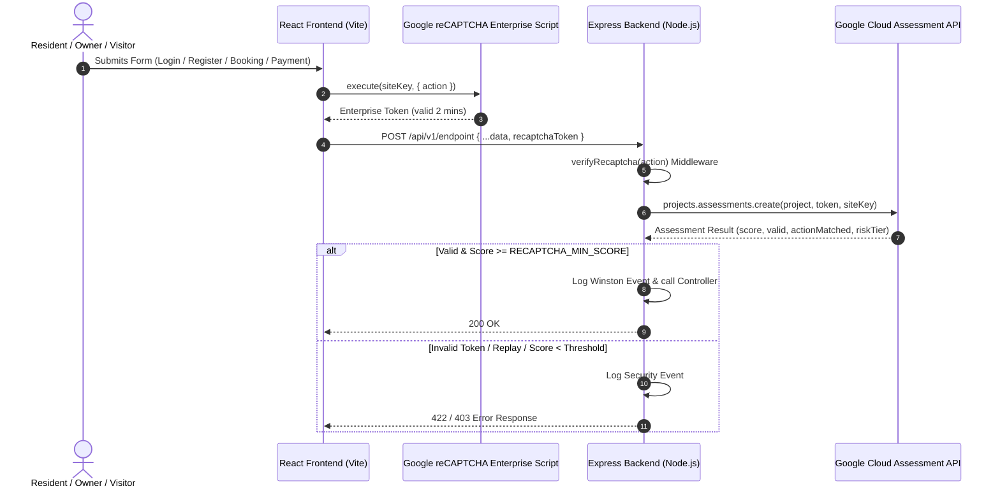

# 🛡️ Google reCAPTCHA Enterprise Integration Guide (RoomBae)

Comprehensive documentation for Google reCAPTCHA Enterprise bot protection across the RoomBae MERN platform.

---

## 🏗️ Architecture Overview

RoomBae uses **Google reCAPTCHA Enterprise** to evaluate user interactions and protect high-risk endpoints (authentication, registration, payments, ticket submissions, onboarding) against bot attacks, credential stuffing, and spamming without friction for human users.



---

## 🔑 Environment Variables Setup

### 1. Frontend (`frontend/.env`)

```env
VITE_RECAPTCHA_SITE_KEY=6LfgNnYtAAAAAABdvCLaqfA6ucDLdBKTxy8sLCwfn
```

### 2. Backend (`backend/.env`)

```env
GOOGLE_CLOUD_PROJECT_ID=roombae-cff13
GOOGLE_APPLICATION_CREDENTIALS=/path/to/service-account.json
RECAPTCHA_SITE_KEY=6LfgNnYtAAAAAABdvCLaqfA6ucDLdBKTxy8sLCwfn
RECAPTCHA_MIN_SCORE=0.5
RECAPTCHA_ENABLED=true
```

---

## 🎯 Protected Actions & Threshold Tiers

### Actions Union

- `signup`
- `login`
- `forgot_password`
- `send_otp`
- `verify_otp`
- `contact`
- `booking`
- `payment`
- `complaint`
- `review`
- `visitor`
- `owner_registration`
- `property_creation`

### Risk Classification Tiers

- **`>= 0.9` (TRUSTED)**: Highly confident human user.
- **`>= 0.7` (NORMAL)**: Standard legitimate traffic.
- **`>= 0.5` (ELEVATED)**: Acceptable threshold for form processing.
- **`< 0.5` (HIGH_RISK / BOT)**: Request rejected with HTTP 422 or 403.

---

## 🚀 Deployment Guide

### GitHub Pages (Frontend)

Set the repository secret or environment variable:
`VITE_RECAPTCHA_SITE_KEY=6LfgNnYtAAAAAABdvCLaqfA6ucDLdBKTxy8sLCwfn` in GitHub Actions.

### Render (Backend)

Configure environment variables in Render Dashboard:

- `GOOGLE_CLOUD_PROJECT_ID`: `roombae-cff13`
- `RECAPTCHA_SITE_KEY`: `6LfgNnYtAAAAAABdvCLaqfA6ucDLdBKTxy8sLCwfn`
- `RECAPTCHA_MIN_SCORE`: `0.5`
- `RECAPTCHA_ENABLED`: `true`

---

## 🧪 Local Development & Graceful Fallback Mode

When developing locally without active Google Cloud Application Credentials:

- Set `RECAPTCHA_ENABLED=true` in `backend/.env`.
- The `RecaptchaService` automatically runs in **fallback mode**, returning a synthetic score of `1.0` and logging assessment events to Winston without breaking local offline workflows.
