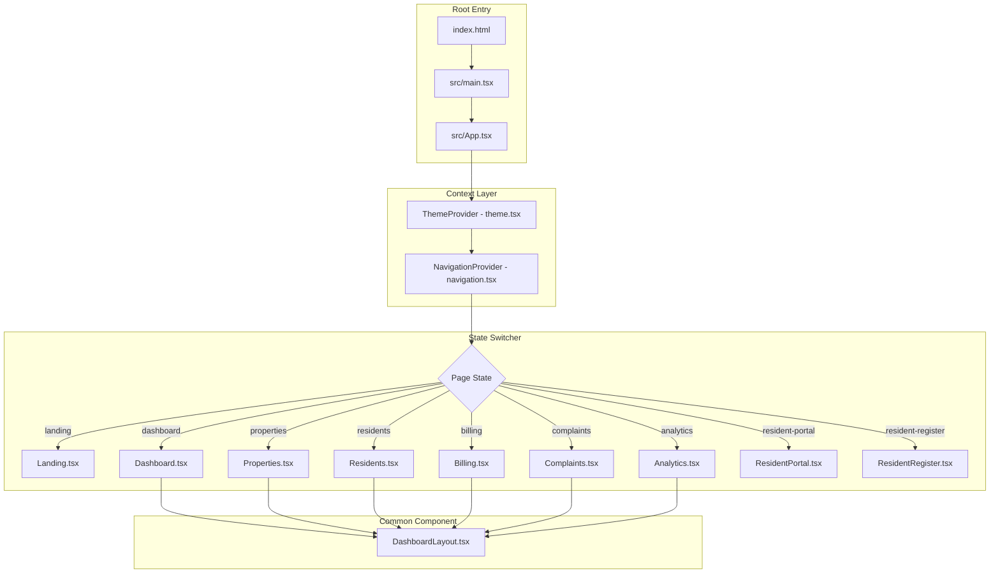

# 📄 Software Requirements Specification (SRS)
## For PG Management System ("Room Bae")

**IEEE Standard 830-1998 Format**

---

### Document Control & Metadata

| Metadata Field | Document Detail |
| :--- | :--- |
| **Document Title** | Software Requirements Specification for PG Management System ("Room Bae") |
| **Standard Baseline** | IEEE Std 830-1998 / IEEE/ISO/IEC 29148:2018 |
| **Version** | 1.0.0 |
| **Date** | July 28, 2026 |
| **Author** | Ayushman Saha ([@ayushman-glb](https://github.com/ayushman-glb)) |
| **Project Status** | Production / Active Deployment |
| **Live Web App URL** | [https://ayushman-glb.github.io/PG-Management-System/](https://ayushman-glb.github.io/PG-Management-System/) |

---

## Table of Contents

- [1. Introduction](#1-introduction)
  - [1.1 Purpose](#11-purpose)
  - [1.2 Scope](#12-scope)
  - [1.3 Definitions, Acronyms, and Abbreviations](#13-definitions-acronyms-and-abbreviations)
  - [1.4 References](#14-references)
  - [1.5 Document Overview](#15-document-overview)
- [2. Overall Description](#2-overall-description)
  - [2.1 Product Perspective](#21-product-perspective)
  - [2.2 Product Functions](#22-product-functions)
  - [2.3 User Classes and Characteristics](#23-user-classes-and-characteristics)
  - [2.4 Operating Environment](#24-operating-environment)
  - [2.5 Design and Implementation Constraints](#25-design-and-implementation-constraints)
  - [2.6 User Documentation](#26-user-documentation)
  - [2.7 Assumptions and Dependencies](#27-assumptions-and-dependencies)
- [3. Specific Requirements](#3-specific-requirements)
  - [3.1 External Interface Requirements](#31-external-interface-requirements)
  - [3.2 System Functional Requirements](#32-system-functional-requirements)
  - [3.3 Non-Functional Requirements](#33-non-functional-requirements)
- [4. System Architecture & Data Modeling](#4-system-architecture--data-modeling)
  - [4.1 Component Flow Diagram](#41-component-flow-diagram)
  - [4.2 Navigation & Routing State Machine](#42-navigation--routing-state-machine)
- [5. Requirements Traceability Matrix (RTM)](#5-requirements-traceability-matrix-rtm)

---

## 1. Introduction

### 1.1 Purpose
This Software Requirements Specification (SRS) document defines the complete functional, non-functional, interface, and behavioral requirements for the **PG Management System ("Room Bae")**. This document serves as the authoritative technical reference for developers, software architects, QA engineers, and project stakeholders.

### 1.2 Scope
The **PG Management System** is a web-based, multi-tenant SaaS application designed to streamline Paying Guest (PG) hostel operations. The system encompasses:
- A public discovery portal for prospective tenants to view, search, and register for PG accommodations.
- An owner dashboard for PG property owners to manage inventory (properties, rooms, beds), track rent payments, handle complaint tickets, and view financial analytics.
- A tenant self-service portal for active residents to view payment history, pay rent dues, and lodge maintenance complaints.

### 1.3 Definitions, Acronyms, and Abbreviations

| Term / Abbreviation | Definition |
| :--- | :--- |
| **PG** | Paying Guest (Hostel / Coliving accommodation facility). |
| **SaaS** | Software as a Service. |
| **SRS** | Software Requirements Specification. |
| **IEEE** | Institute of Electrical and Electronics Engineers. |
| **DOM** | Document Object Model. |
| **HMR** | Hot Module Replacement (Vite feature for instant UI refresh). |
| **KYC** | Know Your Customer (Identity verification process for tenants). |
| **RBAC** | Role-Based Access Control. |
| **JWT** | JSON Web Token (used for stateless authentication). |
| **UI / UX** | User Interface / User Experience. |

### 1.4 References
1. IEEE Std 830-1998, *IEEE Recommended Practice for Software Requirements Specifications*.
2. React 19 Documentation: [https://react.dev/](https://react.dev/)
3. Vite 6 Documentation: [https://vite.dev/](https://vite.dev/)
4. Project Repository: [https://github.com/ayushman-glb/PG-Management-System](https://github.com/ayushman-glb/PG-Management-System)
5. System Architecture Spec: [docs/System.md](file:///c:/Users/GLB-BLR-191/Documents/pg%20management/New%20folder/PG%20Management%20system2/docs/System.md)

### 1.5 Document Overview
The remainder of this document follows the IEEE Std 830-1998 outline:
- **Section 2** describes the high-level system perspective, user classes, and operating constraints.
- **Section 3** specifies detailed functional and non-functional requirements.
- **Section 4** provides architectural and data flow diagrams.
- **Section 5** contains the Requirements Traceability Matrix (RTM).

---

## 2. Overall Description

### 2.1 Product Perspective
The system is an autonomous, self-contained single-page frontend web application (SPA) designed to communicate with a modular Spring Boot backend via REST / GraphQL / SOAP protocols.

```
┌────────────────────────────────────────────────────────────────────────┐
│                      CLIENT BROWSER ENVIRONMENT                        │
│                                                                        │
│  React 19 + Vite 6 Single Page Application                             │
│  ├── ThemeProvider (Dark / Light Luxury Tokens)                        │
│  ├── NavigationProvider (State-Based Routing)                          │
│  └── Pages (Landing, Dashboard, Properties, Billing, Complaints, etc.) │
└───────────────────────────────────┬────────────────────────────────────┘
                                    │
                        HTTP / REST / GraphQL / SOAP
                                    │
┌───────────────────────────────────▼────────────────────────────────────┐
│                       BACKEND API & DATABASE                           │
│  Java 21 Spring Boot + PostgreSQL (RLS) + Redis Caching                │
└────────────────────────────────────────────────────────────────────────┘
```

### 2.2 Product Functions
1. **Public Property Discovery**: Browse PG listings by city, rent range, room types, and amenities.
2. **Digital Tenant Onboarding**: Online application submission with KYC document upload.
3. **Inventory Management**: Property, floor, room, and bed-level allocation tracking.
4. **Automated Billing & Dues**: Invoicing, payment status tracking, and payment history logs.
5. **Helpdesk & Ticket Resolution**: Complaint registration, priority sorting, and resolution tracking.
6. **Financial & Occupancy Analytics**: Visual charts for revenue trends, occupancy %, and pending dues.
7. **Multi-Theme Support**: Instant switching between Light Warm Luxury and Dark Gold themes.

### 2.3 User Classes and Characteristics

| User Class | Description & Technical Skill Level | System Rights |
| :--- | :--- | :--- |
| **Public Prospect** | Prospective tenant seeking accommodation. Low technical skill. | Read-only access to PG listings, read PG details, access registration form. |
| **Active Resident** | Tenant living in a PG. Low-to-medium technical skill. | Access Tenant Portal, view assigned bed, view invoices, submit complaints. |
| **PG Owner / Manager** | Property manager operating one or more PGs. Medium technical skill. | Full access to Dashboard, Properties, Rooms, Beds, Residents, Billing, Analytics. |
| **System Admin** | System administrator managing multi-tenant platform. High technical skill. | Global platform configuration and monitoring. |

### 2.4 Operating Environment
- **Client Web Browsers**: Google Chrome (v100+), Mozilla Firefox (v100+), Apple Safari (v15+), Microsoft Edge (v100+).
- **Supported Devices**: Mobile smartphones (320px+), tablets, laptops, and desktop displays up to 4K resolution.
- **Development Environment**: Node.js v18+, Vite 6, npm v9+.

### 2.5 Design and Implementation Constraints
1. **Framework Constraint**: Must use React 19 with Vite 6 and TypeScript for all frontend logic.
2. **Styling Constraint**: Utility-first CSS using Tailwind CSS v4 design tokens without heavy third-party UI framework lock-in.
3. **Performance Constraint**: Total initial gzipped JavaScript bundle size must not exceed 300 kB.
4. **State Routing Constraint**: Client-side navigation must run smoothly without full browser reloads.

### 2.6 User Documentation
The software includes inline interactive visual indicators, loading overlays, tooltips, and built-in help center documentation pages ([ContentPage.tsx](file:///c:/Users/GLB-BLR-191/Documents/pg%20management/New%20folder/PG%20Management%20system2/src/pages/ContentPage.tsx)).

### 2.7 Assumptions and Dependencies
- The user's web browser has JavaScript enabled.
- The user has an active internet connection for fetching external media assets and fonts.

---

## 3. Specific Requirements

### 3.1 External Interface Requirements

#### 3.1.1 User Interfaces
- **Header & Navigation**: Fixed top bar containing branding, active route indicators, and `<ThemeToggle />`.
- **Sidebar Navigation**: Dashboard layout sidebar providing one-click access to Dashboard, Properties, Residents, Billing, Complaints, and Analytics screens ([DashboardLayout.tsx](file:///c:/Users/GLB-BLR-191/Documents/pg%20management/New%20folder/PG%20Management%20system2/src/components/DashboardLayout.tsx)).
- **Responsive Layout**: Fluid grid layout converting 4-column cards into 1-column layouts on viewport widths < 768px.

#### 3.1.2 Hardware Interfaces
No dedicated hardware interface required beyond standard client display screen, keyboard, and touch/mouse input devices.

#### 3.1.3 Software Interfaces
- **Browser LocalStorage**: Key `pg-manager-theme` stores user theme preference (`"dark"` or `"light"`).
- **Web APIs**: Uses Browser `window.matchMedia` API to detect system dark mode preference.

---

### 3.2 System Functional Requirements

#### Module 1: Public Discovery & PG Listing

##### FR-1.1: PG Search & Filter
- **Input**: Search query (city/location), minimum rent, maximum rent, room type filter.
- **Processing**: Filters property array in real time based on user inputs.
- **Output**: Rendered grid of matching PG cards with image, price, location, rating, and amenity badges ([PGListing.tsx](file:///c:/Users/GLB-BLR-191/Documents/pg%20management/New%20folder/PG%20Management%20system2/src/pages/PGListing.tsx)).

##### FR-1.2: PG Property Details View
- **Input**: User clicks on a specific PG card.
- **Processing**: Navigates state to `"pg-details"`.
- **Output**: Displays full gallery, owner contact info, room availability grid, rules, and address map ([PGDetails.tsx](file:///c:/Users/GLB-BLR-191/Documents/pg%20management/New%20folder/PG%20Management%20system2/src/pages/PGDetails.tsx)).

---

#### Module 2: Resident Registration & Onboarding

##### FR-2.1: Digital Application Form
- **Input**: Tenant personal info, emergency contact, ID proof number, move-in date selection.
- **Processing**: Validates input fields and submits registration state.
- **Output**: Confirmation banner and redirect to applicant summary ([ResidentRegister.tsx](file:///c:/Users/GLB-BLR-191/Documents/pg%20management/New%20folder/PG%20Management%20system2/src/pages/ResidentRegister.tsx)).

---

#### Module 3: Owner Dashboard & Analytics

##### FR-3.1: High-Level Operational Summary
- **Input**: App state load.
- **Processing**: Calculates total revenue, occupancy %, pending dues total, and active ticket counts.
- **Output**: Displays 4 metric summary cards with trend indicators (+12%, -3%, etc.) ([Dashboard.tsx](file:///c:/Users/GLB-BLR-191/Documents/pg%20management/New%20folder/PG%20Management%20system2/src/pages/Dashboard.tsx)).

##### FR-3.2: Analytics & Revenue Reports
- **Input**: Date range selection or metric dropdown.
- **Processing**: Aggregates payment collection data and room occupancy metrics.
- **Output**: Renders visual bar charts, line graphs, and distribution breakdowns ([Analytics.tsx](file:///c:/Users/GLB-BLR-191/Documents/pg%20management/New%20folder/PG%20Management%20system2/src/pages/Analytics.tsx)).

---

#### Module 4: Property & Inventory Management

##### FR-4.1: Room & Bed Allocation Grid
- **Input**: Property selection.
- **Processing**: Maps rooms and child bed records with occupied/available status flags.
- **Output**: Color-coded visual bed allocation grid (Green = Available, Red = Occupied, Yellow = Maintenance) ([Properties.tsx](file:///c:/Users/GLB-BLR-191/Documents/pg%20management/New%20folder/PG%20Management%20system2/src/pages/Properties.tsx)).

---

#### Module 5: Billing & Rent Collection

##### FR-5.1: Payment & Invoice Tracker
- **Input**: Status filter (All, Paid, Pending, Overdue).
- **Processing**: Filters transaction records by selected status.
- **Output**: Rendered table listing tenant name, room #, rent amount, due date, payment method, and status badge ([Billing.tsx](file:///c:/Users/GLB-BLR-191/Documents/pg%20management/New%20folder/PG%20Management%20system2/src/pages/Billing.tsx)).

---

#### Module 6: Complaint & Helpdesk Ticketing

##### FR-6.1: Complaint Resolution Workflow
- **Input**: Complaint ticket selection, status update trigger.
- **Processing**: Updates ticket status (`OPEN` → `IN_PROGRESS` → `RESOLVED`).
- **Output**: Instant status badge update and timestamp reflection ([Complaints.tsx](file:///c:/Users/GLB-BLR-191/Documents/pg%20management/New%20folder/PG%20Management%20system2/src/pages/Complaints.tsx)).

---

### 3.3 Non-Functional Requirements

#### 3.3.1 Performance Requirements
- **NFR-PERF-1**: Initial page load time under 1.5 seconds on standard 4G connections.
- **NFR-PERF-2**: Local development HMR update time under 50 milliseconds via Vite 6.
- **NFR-PERF-3**: Total gzipped production JS asset size <= 265 kB.

#### 3.3.2 Security & Safety Requirements
- **NFR-SEC-1**: All input forms must sanitize raw string inputs against Cross-Site Scripting (XSS).
- **NFR-SEC-2**: No sensitive API keys or database passwords committed to source control.
- **NFR-SEC-3**: Theme preferences saved strictly within client domain `localStorage`.

#### 3.3.3 Software Quality Attributes
- **Availability**: 99.9% uptime when deployed to static CDN hosting (GitHub Pages).
- **Maintainability**: Fully typed codebase using TypeScript 5.5 interfaces to prevent regression bugs.
- **Accessibility**: Compliant with WCAG 2.1 Level AA color contrast ratios in both Light and Dark modes.

---

## 4. System Architecture & Data Modeling

### 4.1 Component Flow Diagram



---

## 5. Requirements Traceability Matrix (RTM)

| Requirement ID | Requirement Description | Implementation File | Verification Method | Status |
| :--- | :--- | :--- | :--- | :--- |
| **FR-1.1** | PG Search & Filtering | [src/pages/PGListing.tsx](file:///c:/Users/GLB-BLR-191/Documents/pg%20management/New%20folder/PG%20Management%20system2/src/pages/PGListing.tsx) | Manual UI test & filter check | **VERIFIED** |
| **FR-1.2** | Property Details View | [src/pages/PGDetails.tsx](file:///c:/Users/GLB-BLR-191/Documents/pg%20management/New%20folder/PG%20Management%20system2/src/pages/PGDetails.tsx) | Inspection of amenities & gallery | **VERIFIED** |
| **FR-2.1** | Resident Onboarding Form | [src/pages/ResidentRegister.tsx](file:///c:/Users/GLB-BLR-191/Documents/pg%20management/New%20folder/PG%20Management%20system2/src/pages/ResidentRegister.tsx) | Form submission test | **VERIFIED** |
| **FR-3.1** | Owner Dashboard Metrics | [src/pages/Dashboard.tsx](file:///c:/Users/GLB-BLR-191/Documents/pg%20management/New%20folder/PG%20Management%20system2/src/pages/Dashboard.tsx) | Verification of metric cards | **VERIFIED** |
| **FR-3.2** | Revenue Analytics Charts | [src/pages/Analytics.tsx](file:///c:/Users/GLB-BLR-191/Documents/pg%20management/New%20folder/PG%20Management%20system2/src/pages/Analytics.tsx) | Analytical graph render check | **VERIFIED** |
| **FR-4.1** | Room & Bed Allocation Grid | [src/pages/Properties.tsx](file:///c:/Users/GLB-BLR-191/Documents/pg%20management/New%20folder/PG%20Management%20system2/src/pages/Properties.tsx) | Inspection of room grid colors | **VERIFIED** |
| **FR-5.1** | Billing & Rent Invoicing | [src/pages/Billing.tsx](file:///c:/Users/GLB-BLR-191/Documents/pg%20management/New%20folder/PG%20Management%20system2/src/pages/Billing.tsx) | Table status filter test | **VERIFIED** |
| **FR-6.1** | Complaint Ticket Workflow | [src/pages/Complaints.tsx](file:///c:/Users/GLB-BLR-191/Documents/pg%20management/New%20folder/PG%20Management%20system2/src/pages/Complaints.tsx) | Ticket status change test | **VERIFIED** |
| **NFR-PERF-3** | Production JS Bundle <= 265kB | `dist/assets/index-*.js` | `npm run build` audit (260 kB) | **VERIFIED** |

---

<div align="center">

**End of IEEE Std 830-1998 Software Requirements Specification**

[📖 Return to Main Project README](../README.md)

</div>
