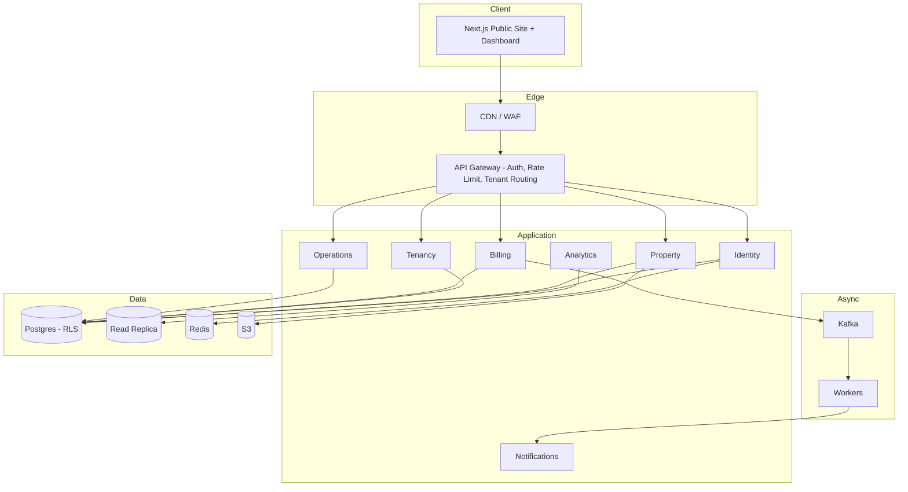
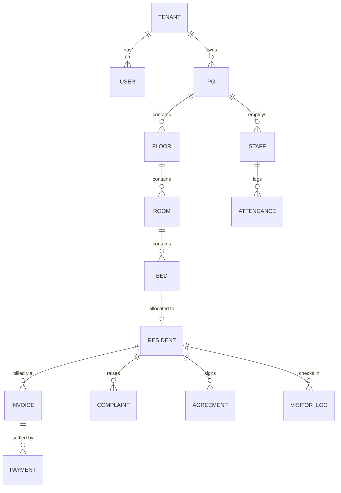

# System Design — PG Management System

This document expands on the architecture summary in the [README](../README.md) with entity relationships, module boundaries, data flow, and the security/tenancy model.

---

## Table of Contents

- [Goals & Constraints](#goals--constraints)
- [High-Level Architecture](#high-level-architecture)
- [Module Boundaries](#module-boundaries)
- [Multi-Tenancy Model](#multi-tenancy-model)
- [Entity Relationships](#entity-relationships)
- [Data Flow: Rent Payment](#data-flow-rent-payment)
- [Data Flow: Resident Onboarding](#data-flow-resident-onboarding)
- [Caching Strategy](#caching-strategy)
- [Async & Messaging](#async--messaging)
- [Security Model](#security-model)
- [Scalability Path](#scalability-path)

---

## Goals & Constraints

- Support a single PG owner with one property, up to a platform tenant with hundreds of properties, without a schema change.
- Strict tenant data isolation — a bug in application-layer authorization must never be able to leak another tenant's data.
- Payment and booking writes must be safe to retry (idempotent) since mobile networks and payment gateways are unreliable.
- Keep operational complexity low in the early phases — a modular monolith over microservices — while leaving a clean extraction path for modules that outgrow it (Billing and Analytics are the most likely first candidates).

---

## High-Level Architecture

The API Gateway is the single entry point for all client traffic. It terminates TLS, authenticates the JWT, resolves the tenant from the token claims, applies rate limiting, and forwards the request with tenant context attached — every downstream module can assume tenant context is already present and verified.

---

## Module Boundaries

| Module | Owns | Talks to |
|---|---|---|
| **Identity** | Users, roles, sessions, 2FA, tenant accounts | Redis (session cache) |
| **Property** | PGs, floors, rooms, beds, occupancy grid | S3 (property images/documents) |
| **Tenancy** | Resident records, KYC, agreements, allocations | Property (bed availability), Identity (resident accounts) |
| **Billing** | Invoices, payments, late fees, reconciliation | Kafka (payment events), Razorpay/Stripe |
| **Operations** | Complaints, visitor log, staff attendance, notices | Tenancy (resident context) |
| **Notification** | WhatsApp/SMS/email dispatch, templates | Kafka (consumes events from Billing/Operations) |
| **Analytics** | Occupancy rate, revenue, churn, late-payer risk scoring | Read Replica only — never the primary |

Each module owns its own tables and exposes a Java service interface to the others; there is no direct cross-module SQL. This is what makes the eventual extraction of a module (e.g., Billing) into a standalone service a matter of moving code and swapping the in-process interface for a network call, rather than a rewrite.

---

## Multi-Tenancy Model

**Approach:** shared database, shared schema, `tenant_id` column on every tenant-scoped table.

Isolation is enforced at two layers:

1. **Application layer:** every repository query is scoped by the authenticated tenant's ID, injected from the gateway-verified JWT claims.
2. **Database layer (backstop):** Postgres Row-Level Security policies restrict every SELECT/INSERT/UPDATE/DELETE to rows matching the current session's `tenant_id`, set via `SET app.current_tenant_id` at the start of each request-scoped transaction.

The RLS layer exists specifically so that an application-layer bug — a missing `WHERE tenant_id = ?` clause, a bad join — cannot leak data across tenants. RLS is the last line of defense, not the only one.

---

## Entity Relationships

Every entity below `TENANT` carries a `tenant_id` foreign key (denormalized down to leaf tables like `PAYMENT` and `ATTENDANCE`) specifically so RLS policies can be applied uniformly without needing a join back up to `TENANT` on every query.

---

## Data Flow: Rent Payment

1. Dashboard calls `POST /api/v1/invoices/{id}/pay` with a client-generated `Idempotency-Key` header.
2. Billing module checks the idempotency key against a short-lived Redis record — a retried request with the same key returns the original result instead of double-charging.
3. Billing creates a `payment_intent` record (status: `pending`) and calls Razorpay (falling back to Stripe on Razorpay outage).
4. On gateway webhook callback, Billing verifies the webhook signature, marks the payment `settled` or `failed`, and publishes a `payment.settled` event to Kafka.
5. Workers consume the event: Notification sends a WhatsApp/SMS/email receipt; Analytics' read model is updated asynchronously via the replica.
6. Reconciliation job periodically diffs gateway settlement reports against local `payment` records to catch any missed webhook.

---

## Data Flow: Resident Onboarding

1. Owner/admin initiates onboarding from the dashboard; Tenancy module creates a `resident` record in `pending_kyc` status.
2. Resident (or owner, on their behalf) uploads KYC documents to S3 via a pre-signed URL; document metadata is stored in Tenancy, not the file bytes.
3. Digital agreement is generated and sent for e-sign; on completion, Tenancy transitions the resident to `active` and Property marks the assigned bed as `occupied`.
4. Notification module sends a welcome message and move-in checklist.

---

## Caching Strategy

- **Redis** is used for read-heavy, low-volatility data: dashboard occupancy summaries, session/JWT blacklist, idempotency keys.
- All writes go directly to the Postgres primary — Redis is never the system of record and is treated as fully disposable/rebuildable from Postgres.
- Cache entries are invalidated on write (not time-based expiry alone) for anything occupancy-related, since stale bed-availability data directly causes double-booking.

---

## Async & Messaging

Kafka decouples the request path from slower or less reliable side effects:

- **Payment events** (`payment.initiated`, `payment.settled`, `payment.failed`) — consumed by Notification and Analytics.
- **Notification dispatch** — Notification module itself is largely a Kafka consumer, so a WhatsApp/SMS provider outage doesn't block the request that triggered it.
- **Reconciliation** — a scheduled worker reconciles gateway settlement reports against local payment state independent of the event stream, as a safety net for missed or out-of-order events.

---

## Security Model

- **Transport:** TLS 1.3 everywhere, HSTS, strict CSP.
- **AuthN:** JWT access + refresh tokens; Argon2id for password hashing; mandatory TOTP 2FA for Owner/Admin roles.
- **AuthZ:** role-based access control evaluated at the gateway and re-checked at the module boundary (defense in depth — the gateway check is not trusted blindly by downstream modules).
- **Data at rest:** field-level AES-256 encryption for sensitive fields (Aadhar, PAN, bank details), independent of Postgres's own disk encryption.
- **Tenant isolation:** Postgres RLS, as described above.
- **Auditability:** append-only audit log for all sensitive mutations (payment changes, KYC access, role changes) — this table has no UPDATE/DELETE grants at the database role level.
- **Perimeter:** WAF, per-user and per-API-key rate limiting at the gateway.
- **Write safety:** idempotency-key required on all payment and booking writes to make retries safe.
- **Supply chain:** automated dependency scanning (Dependabot/Snyk) and OWASP ZAP dynamic scanning in CI.

See [SECURITY.md](../SECURITY.md) for the vulnerability disclosure process.

---

## Scalability Path

The modular monolith is designed so that, if a specific module becomes a bottleneck, it can be pulled out without a rewrite:

1. **Billing** is the most likely first extraction candidate — payment volume and reconciliation load scale independently of the rest of the system, and it's already decoupled via Kafka.
2. **Analytics** already reads exclusively from the replica, so moving it to a separate service mainly means moving compute, not re-plumbing data access.
3. Because every module talks to others only through a Java service interface (never direct cross-module SQL), extracting a module is a matter of replacing that in-process interface with a network call (REST/gRPC) behind the same contract.