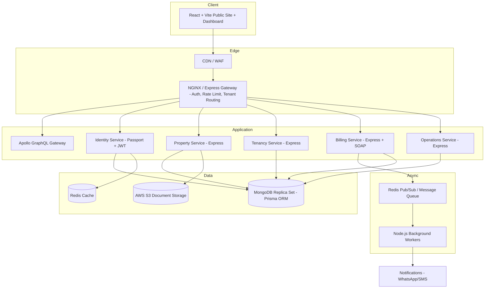
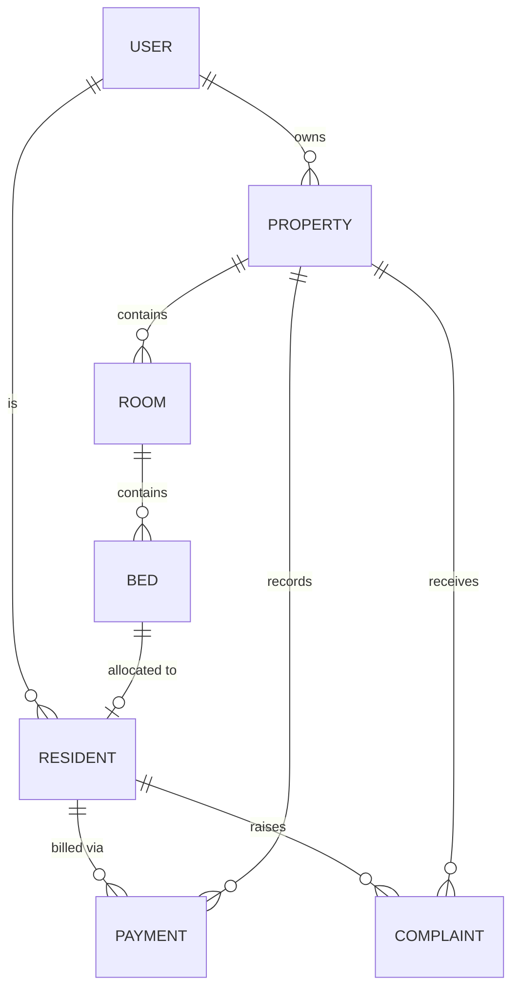

# System Design — PG Management System

This document expands on the architecture summary in the [README](../README.md) with entity relationships, module boundaries, data flow, and the security/tenancy model for the Node.js + Express + Prisma ORM + MongoDB stack.

---

## Table of Contents

- [Goals & Constraints](#goals--constraints)
- [High-Level Architecture](#high-level-architecture)
- [Module Boundaries](#module-boundaries)
- [Multi-Tenancy Model](#multi-tenancy-model)
- [Entity Relationships (Prisma & MongoDB)](#entity-relationships-prisma--mongodb)
- [Data Flow: Rent Payment](#data-flow-rent-payment)
- [Data Flow: Resident Onboarding](#data-flow-resident-onboarding)
- [Caching Strategy](#caching-strategy)
- [Async & Messaging](#async--messaging)
- [Security Model](#security-model)
- [Scalability Path](#scalability-path)

---

## Goals & Constraints

- Support a single PG owner with one property, up to a platform tenant with hundreds of properties, using MongoDB document flexibility with Prisma ORM type safety.
- Strict tenant data isolation — a bug in application-layer authorization must never be able to leak another tenant's data.
- Payment and booking writes must be safe to retry (idempotent) since mobile networks and payment gateways are unreliable.
- Keep operational complexity low using a clean modular Node.js/Express architecture while providing a clean extraction path for modules that outgrow it (Billing and Analytics).

---

## High-Level Architecture

The NGINX Gateway is the single entry point for all client traffic. It terminates TLS, routes to Node.js instances, authenticates JWTs, resolves tenant claims, applies rate limiting, and forwards requests to Apollo GraphQL or Express REST/SOAP endpoints.

---

## Module Boundaries

| Module | Owns | Talks to |
|---|---|---|
| **Identity** | Users, roles, sessions, Google OAuth2, tenant accounts | Redis (session & token blacklist cache) |
| **Property** | PGs, floors, rooms, beds, occupancy grid | S3 (property images/documents) |
| **Tenancy** | Resident records, KYC, agreements, allocations | Property (bed availability), Identity (resident accounts) |
| **Billing** | Invoices, payments, late fees, SOAP web services | Redis Pub/Sub, Razorpay/Stripe |
| **Operations** | Complaints, visitor log, staff attendance, notices | Tenancy (resident context) |
| **Notification** | WhatsApp/SMS/email dispatch, templates | Redis Pub/Sub (consumes events from Billing/Operations) |
| **Analytics** | Occupancy rate, revenue, churn metrics | MongoDB Aggregation Pipelines + Redis Cache |

Each module exposes clean TypeScript service interfaces and Prisma models; there is no direct cross-module raw querying.

---

## Multi-Tenancy Model

**Approach:** Shared MongoDB Database, shared collections with `tenantId` (or `ownerId`) fields on tenant-scoped documents.

Isolation is enforced at two layers:

1. **Application Layer (Prisma Middleware):** Every Prisma query is scoped by the authenticated tenant's ID (`ownerId`), injected from gateway-verified JWT claims.
2. **Repository Layer:** Custom Prisma Client extensions automatically inject `{ where: { ownerId } }` filters on all document queries.

---

## Entity Relationships (Prisma & MongoDB)

Every document below `User` carries `ownerId` / `propertyId` references so Prisma filters can be applied uniformly across MongoDB queries.

---

## Data Flow: Rent Payment

1. Dashboard calls Apollo GraphQL mutation `createPayment` or REST `POST /api/v1/invoices/:id/pay` with a client-generated `Idempotency-Key` header.
2. Express middleware checks the idempotency key against a short-lived Redis record.
3. Billing service creates a payment record in MongoDB via Prisma (status: `PENDING`) and calls payment gateway (Razorpay / Stripe).
4. On gateway webhook callback, Express verifies the webhook signature, updates payment status to `PAID`, and emits a `payment.settled` event to Redis Pub/Sub.
5. Workers consume the event to send a WhatsApp/SMS receipt and refresh Redis analytics caches.

---

## Data Flow: Resident Onboarding

1. Owner initiates onboarding from the dashboard; Tenancy service creates a `Resident` document with Prisma status `ACTIVE`.
2. Resident uploads KYC documents to AWS S3 via pre-signed URLs; document metadata URL is stored in MongoDB.
3. Assigned bed status is updated to `isOccupied: true` in MongoDB via Prisma transaction.
4. Notification worker dispatches welcome message and move-in checklist.

---

## Caching Strategy

- **Redis** (`ioredis`) is used for read-heavy data: dashboard summaries, JWT blacklists, and idempotency locks.
- All writes go directly to MongoDB via Prisma ORM — Redis is treated as a disposable cache.
- Cache entries are invalidated on write for occupancy-related data to prevent double-booking.

---

## Security Model

- **Transport:** TLS 1.3, HSTS, strict CSP headers.
- **AuthN:** Passport.js with Google OAuth2 (`passport-google-oauth20`) and signed JWT access tokens.
- **AuthZ:** Role-based access control (`PUBLIC`, `TENANT`, `OWNER`, `ADMIN`) checked via Express middleware and Apollo context.
- **Data at Rest:** Field-level encryption for sensitive KYC fields (Aadhar, PAN) stored in MongoDB.
- **Auditability:** Immutable complaint logs and transaction records stored in MongoDB.

---

## Scalability Path

1. **Billing** (including SOAP web services) can be extracted into a standalone Node.js microservice if payment processing load increases.
2. **Analytics** uses MongoDB aggregation pipelines cached in Redis for real-time dashboard performance.
3. Modular TypeScript architecture allows swapping in-process function calls for REST / gRPC microservices whenever needed.