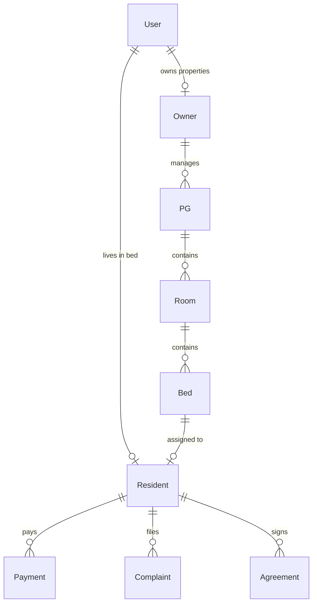

# Phase 0: Ground-Truth Project Context & Codebase Inventory

> **Document Status**: Complete  
> **Phase**: Phase 0 — Understand the actual project (read-only)  
> **Target Branch**: `rewrite/api-websocket-v1`  
> **Deliverable Path**: `/docs/rewrite/00-project-context.md`  

---

## 1. Executive Overview & Architecture Topology

RoomBae is an enterprise multi-tenant PG (Paying Guest) and Co-Living property management platform.

### Core Stack & Runtime
- **Backend Runtime**: Node.js v20+ with TypeScript 5.7+, Express.js 4.21+
- **Primary Database**: MongoDB Atlas 7.0 (Replica Set) via Prisma ORM 5.22.0
- **Cache / Distributed Coordination**: Redis 6.x/7.x (ioredis / node-redis) for session caches, Redlock bed reservation concurrency locks, rate limiting, and Socket.IO multi-node Redis adapter
- **Real-Time Communication**: Socket.IO 4.8.3 with WebSocket and HTTP polling fallbacks
- **Secondary API Protocols**: 
  - SOAP 1.1 ERP Billing WSDL service (`node-soap`) at `/soap/billing?wsdl`
  - GraphQL Apollo Server: Referenced in earlier system documentation, but **not present in runtime package dependencies or frontend client code** (confirmed 100% REST + WebSocket in live application).
- **Authentication**: Stateless JWT (Access Token 15m + Refresh Token 7d), Google OAuth 2.0 via Passport.js, Twilio Programmable SMS OTP, Nodemailer SMTP OTP
- **Third-Party Integrations**: Razorpay (Orders, Payments, Webhook verification, Invoicing), Cloudinary (Property media & KYC image storage), PDFKit (Dynamic PDF agreement & invoice rendering)
- **Frontend**: React 19.0.0, Vite 8.1.5, Tailwind CSS v4, Zustand 5.0+, Lucide Icons, Framer Motion, GSAP, Recharts

---

## 2. Backend Structural Mapping & Divergence Analysis

The backend follows a domain-driven modular structure in `backend/src/modules/` alongside legacy layers in `backend/src/controllers/`, `backend/src/services/`, `backend/src/repositories/`, and `backend/src/routes/`.

```
backend/src/
├── api/                    # API definitions and contracts
├── application/            # Application-level orchestration & CQRS handlers
├── config/                 # Prisma, Redis, Cloudinary, Passport, Swagger, Env configuration
├── container/              # Centralized Dependency Injection Container (Container.ts)
├── controllers/            # Legacy standalone controllers (to be consolidated into modules)
├── core/                   # Core middlewares (tenantMiddleware, errorMiddleware)
├── infrastructure/         # Crypto, OTP, Token, and Storage infrastructure services
├── interfaces/             # Strict repository and service TypeScript interfaces
│   ├── infrastructure/     # IOtpService, ITokenService, ICryptoService, IStorageService
│   ├── repositories/       # IUserRepository, IResidentRepository, IPropertyRepository, etc.
│   └── services/           # IDomainService interfaces
├── jobs/                   # Node-cron workers (Monthly invoice, late fee, SLA escalation)
├── middleware/             # Rate limiters, RBAC auth guards, file uploads, audit loggers
├── modules/                # 25 Domain Modules (Module = DTO + Repository + Service + Controller + Routes + Socket)
│   ├── agreements/
│   ├── analytics/
│   ├── applications/
│   ├── auth/
│   ├── beds/
│   ├── billing/
│   ├── complaints/
│   ├── devices/
│   ├── documents/
│   ├── email/
│   ├── marketing/
│   ├── messages/
│   ├── moveIn/
│   ├── notifications/
│   ├── operations/
│   ├── owners/
│   ├── payments/
│   ├── phone-auth/
│   ├── properties/
│   ├── residents/
│   ├── rooms/
│   ├── search/
│   ├── settings/
│   ├── tours/
│   └── visitors/
├── repositories/           # Legacy repository implementations (re-exported or mirrored in modules)
├── routes/                 # Express route aggregators (apiRouter.ts) and legacy route files
├── services/               # Legacy service implementations (re-exported or mirrored in modules)
├── shared/                 # Shared utilities, validation schemas, and constants
├── socket/                 # Central Socket.IO server initialization (socketServer.ts)
└── utils/                  # Logger, error classes (AppError), path resolvers
```

### Architectural Divergence & Duplication Points
1. **Dual Routing Definitions**: Some routes are declared in `backend/src/routes/*.ts` (e.g. `residentManagementRoutes.ts`, `saasManagementRoutes.ts`, `media.routes.ts`, `dashboard.routes.ts`) while others are in `backend/src/modules/*/*.routes.ts`. `apiRouter.ts` mounts a mixture of both.
2. **Dual Controller/Service Layer**: Standalone files in `src/controllers/` (e.g. `residentManagementController.ts`, `ownerOnboardingController.ts`) exist alongside domain modules like `modules/residents/resident.controller.ts` and `modules/owners/owner.controller.ts`.
3. **Dependency Injection**: `backend/src/container/Container.ts` registers singletons for controllers, services, and repositories, but certain route files instantiate controllers directly via `new Controller()` instead of resolving from the DI container.

---

## 3. Frontend Architecture & State Management

```
frontend/src/
├── app/                    # Root Application layout and router shell
├── components/             # Reusable atomic UI components (Buttons, Modals, Tables, Forms)
├── config/                 # Frontend environment constants (env.ts)
├── constants/              # Navigation links, roles, status badge mappings
├── context/ & providers/   # React Context (AuthProvider.tsx, ThemeProvider.tsx)
├── features/               # Domain-driven feature modules
│   ├── analytics/          # Owner revenue and occupancy analytics charts
│   ├── auth/               # Login, Register, OTP verification, Password Reset modals
│   ├── beds/               # Bed allocation matrix, hold management
│   ├── billing/            # Invoices, Razorpay checkout, payment history
│   ├── complaints/         # Resident ticketing system, ticket replies
│   ├── dashboard/          # Owner KPI cards, quick actions, Kanban boards
│   ├── documents/          # Agreement PDF viewer, digital signature pad
│   ├── notifications/      # Notification bell dropdown & real-time toast alerts
│   ├── operations/         # Staff tasks, housekeeping, visitor log
│   ├── owners/             # 10-step PG onboarding wizard, property configuration
│   ├── properties/         # Property listings, room configuration, pricing
│   ├── residents/          # Resident Portal, tenant directory, status manager
│   ├── rooms/              # Room details, room transfer modal
│   ├── search/             # Public PG search, filters (AC, Veg, Rent range)
│   ├── settings/           # Profile settings, 2FA management, audit logs
│   └── visitors/           # Visitor passes, gate passes
├── hooks/                  # Custom React hooks (useAuth, useRealtime, useAdaptiveLoading, useDocumentDownload)
├── services/               # API client services (api.ts, auth.service.ts, resident.service.ts, socket.ts)
└── store/                  # Zustand global UI state (useUIStore.ts)
```

### Frontend State & Data Fetching Patterns
- **Primary Data Fetching**: Standard `fetch` calls through centralized `api.ts` and feature-specific services (`resident.service.ts`, `billing.service.ts`, `property.service.ts`, etc.) attaching Bearer tokens from `localStorage` (`roombae_access_token`, `accessToken`, `token`).
- **Global Auth & Role State**: Managed via React Context in `AuthProvider.tsx` (`useAuth()` hook).
- **Real-Time Synchronisation**: Managed via `socket.ts` and `useRealtime.ts`, connecting to backend Socket.IO server and binding event listeners dynamically.
- **GraphQL / Apollo Status**: Neither `@apollo/client` nor `graphql` is installed in `frontend/package.json`. No GraphQL queries or mutations are executed by the UI.

---

## 4. Complete Live API Surface Inventory

### 4.1 REST API Routes (`/api/v1/*` mounted in `backend/src/routes/apiRouter.ts`)

| Module Prefix | HTTP Method | Endpoint Path | Source File | Auth & Guard | Scoping |
|---|---|---|---|---|---|
| `/auth` | POST | `/login` | `modules/auth/auth.routes.ts` | RateLimit (5/15m), Public | Global |
| `/auth` | POST | `/register` | `modules/auth/auth.routes.ts` | RateLimit (5/1h), Public | Global |
| `/auth` | POST | `/send-otp` | `modules/auth/auth.routes.ts` | RateLimit (3/10m), Public | Global |
| `/auth` | POST | `/verify-otp` | `modules/auth/auth.routes.ts` | Public | Global |
| `/auth` | POST | `/logout` | `modules/auth/auth.routes.ts` | Public | Global |
| `/auth` | POST | `/refresh-token` | `modules/auth/auth.routes.ts` | Public (Cookies/Body) | Global |
| `/auth` | POST | `/send-phone-otp` | `modules/auth/auth.routes.ts` | RateLimit (3/10m), Public | Global |
| `/auth` | POST | `/verify-phone-otp` | `modules/auth/auth.routes.ts` | RateLimit (10/15m), Public | Global |
| `/auth` | POST | `/email/send-otp` | `modules/auth/auth.routes.ts` | RateLimit, Public | Global |
| `/auth` | POST | `/email/verify-otp` | `modules/auth/auth.routes.ts` | Public | Global |
| `/auth` | POST | `/email/resend-otp` | `modules/auth/auth.routes.ts` | RateLimit, Public | Global |
| `/auth` | POST | `/password/send-reset` | `modules/auth/auth.routes.ts` | RateLimit, Public | Global |
| `/auth` | POST | `/password/verify` | `modules/auth/auth.routes.ts` | Public | Global |
| `/auth` | POST | `/2fa/enable` | `modules/auth/auth.routes.ts` | `authenticate` | User Scoped |
| `/auth` | POST | `/2fa/verify` | `modules/auth/auth.routes.ts` | Public | Global |
| `/auth` | POST | `/2fa/disable` | `modules/auth/auth.routes.ts` | `authenticate` | User Scoped |
| `/auth` | GET | `/me` | `modules/auth/auth.routes.ts` | `authenticate` | User Scoped |
| `/auth` | GET | `/google` | `modules/auth/auth.routes.ts` | Passport Google | Global |
| `/auth` | GET | `/google/callback` | `modules/auth/auth.routes.ts` | Passport Google | Global |
| `/security/devices` | POST | `/identify` | `modules/devices/device.routes.ts` | `authenticate`, RateLimit | User Scoped |
| `/security/devices` | GET | `/` | `modules/devices/device.routes.ts` | `authenticate` | User Scoped |
| `/security/devices` | PATCH | `/:deviceId/trust` | `modules/devices/device.routes.ts` | `authenticate` | User Scoped |
| `/security/devices` | POST | `/:deviceId/revoke` | `modules/devices/device.routes.ts` | `authenticate` | User Scoped |
| `/security/devices` | POST | `/:deviceId/block` | `modules/devices/device.routes.ts` | `authenticate` | User Scoped |
| `/security/devices` | POST | `/:deviceId/unblock` | `modules/devices/device.routes.ts` | `authenticate` | User Scoped |
| `/security/devices` | GET | `/events` | `modules/devices/device.routes.ts` | `authenticate` | User Scoped |
| `/upload` | POST | `/` | `routes/upload.routes.ts` | `authenticate`, Multer | User Scoped |
| `/upload` | POST | `/kyc` | `routes/upload.routes.ts` | `authenticate`, Multer | User Scoped |
| `/media` | POST | `/upload` | `routes/media.routes.ts` | `authenticate`, Multer | Owner/Admin |
| `/media` | POST | `/bulk-upload` | `routes/media.routes.ts` | `authenticate`, Multer | Owner/Admin |
| `/media` | PUT | `/tags` | `routes/media.routes.ts` | `authenticate` | Owner/Admin |
| `/media` | DELETE | `/:publicId` | `routes/media.routes.ts` | `authenticate` | Owner/Admin |
| `/media` | POST | `/bulk-delete` | `routes/media.routes.ts` | `authenticate` | Owner/Admin |
| `/media` | GET | `/metadata/:publicId` | `routes/media.routes.ts` | `authenticate` | Owner/Admin |
| `/media` | PATCH | `/reorder` | `routes/media.routes.ts` | `authenticate` | Owner/Admin |
| `/dashboard` | GET | `/overview` | `routes/dashboard.routes.ts` | `authenticate` | `tenantId`/Owner |
| `/dashboard` | GET | `/revenue` | `routes/dashboard.routes.ts` | `authenticate` | `tenantId`/Owner |
| `/dashboard` | GET | `/occupancy` | `routes/dashboard.routes.ts` | `authenticate` | `tenantId`/Owner |
| `/onboarding` & `/owners` | GET | `/` | `modules/owners/owner.routes.ts` | `authenticate`, `SUPER_ADMIN, ADMIN` | System |
| `/onboarding` & `/owners` | GET | `/profile` | `modules/owners/owner.routes.ts` | `authenticate`, `OWNER, ADMIN` | Owner Scoped |
| `/onboarding` & `/owners` | POST | `/onboard` | `modules/owners/owner.routes.ts` | `authenticate`, `OWNER` | Owner Scoped |
| `/onboarding` & `/owners` | GET | `/:id` | `modules/owners/owner.routes.ts` | `authenticate`, `OWNER, ADMIN` | Owner Scoped |
| `/properties` | GET | `/` | `modules/properties/property.routes.ts` | Public | Global |
| `/properties` | GET | `/public` | `modules/properties/property.routes.ts` | Public | Global |
| `/properties` | GET | `/:id` | `modules/properties/property.routes.ts` | Public | Property Scoped |
| `/properties` | GET | `/owner-summary` | `modules/properties/property.routes.ts` | `authenticate`, `OWNER` | Owner Scoped |
| `/properties` | GET | `/:pgId/meal-schedules`| `modules/properties/property.routes.ts` | `authenticate` | `pgId` Scoped |
| `/properties` | POST | `/` | `modules/properties/property.routes.ts` | `authenticate`, `OWNER` | Owner Scoped |
| `/rooms` | PUT | `/:roomId/convert` | `modules/rooms/room.routes.ts` | `authenticate`, `OWNER, ADMIN` | Room Scoped |
| `/rooms` | GET | `/pg/:pgId` | `modules/rooms/room.routes.ts` | `authenticate` | `pgId` Scoped |
| `/rooms` | POST | `/transfer-requests` | `modules/rooms/room.routes.ts` | `authenticate`, `RESIDENT` | Resident Scoped |
| `/rooms` | GET | `/transfer-requests` | `modules/rooms/room.routes.ts` | `authenticate`, `OWNER, ADMIN` | `tenantId`/PG |
| `/rooms` | PUT | `/transfer-requests/:id/approve` | `modules/rooms/room.routes.ts` | `authenticate`, `OWNER, ADMIN` | `tenantId`/PG |
| `/rooms` | PUT | `/transfer-requests/:id/reject` | `modules/rooms/room.routes.ts` | `authenticate`, `OWNER, ADMIN` | `tenantId`/PG |
| `/rooms` | POST | `/transfer-requests/:id/complete`| `modules/rooms/room.routes.ts` | `authenticate`, `OWNER, ADMIN` | `tenantId`/PG |
| `/beds` | PUT | `/:bedId/status` | `modules/beds/bed.routes.ts` | `authenticate`, `OWNER, ADMIN` | Bed Scoped |
| `/beds` | POST | `/holds` | `modules/beds/bed.routes.ts` | `authenticate`, `OWNER, ADMIN` | Bed Scoped |
| `/beds` | DELETE | `/holds/:holdId` | `modules/beds/bed.routes.ts` | `authenticate`, `OWNER, ADMIN` | Hold Scoped |
| `/beds` | GET | `/holds` | `modules/beds/bed.routes.ts` | `authenticate` | `tenantId`/PG |
| `/residents` | GET | `/` | `modules/residents/resident.routes.ts` | `authenticate`, `OWNER, ADMIN` | `tenantId`/PG |
| `/residents` | GET | `/directory` | `modules/residents/resident.routes.ts` | `authenticate`, `OWNER, ADMIN` | `tenantId`/PG |
| `/residents` | GET | `/profile` | `modules/residents/resident.routes.ts` | `authenticate` | Resident Scoped |
| `/residents` | GET | `/me` | `modules/residents/resident.routes.ts` | `authenticate` | Resident Scoped |
| `/residents` | GET | `/portal/me` | `modules/residents/resident.routes.ts` | `authenticate`, `RESIDENT` | Resident Scoped |
| `/residents` | POST | `/onboard` | `modules/residents/resident.routes.ts` | `authenticate`, `OWNER, ADMIN` | `tenantId`/PG |
| `/residents` | POST | `/visitor-pass` | `modules/residents/resident.routes.ts` | `authenticate`, `RESIDENT` | Resident Scoped |
| `/residents` | POST | `/gate-pass` | `modules/residents/resident.routes.ts` | `authenticate`, `RESIDENT` | Resident Scoped |
| `/residents` | POST | `/meal-skip` | `modules/residents/resident.routes.ts` | `authenticate`, `RESIDENT` | Resident Scoped |
| `/residents` | PATCH | `/:residentId/status` | `modules/residents/resident.routes.ts` | `authenticate`, `OWNER, ADMIN` | `tenantId`/PG |
| `/residents` | GET | `/:residentId/status-history` | `modules/residents/resident.routes.ts` | `authenticate` | `tenantId`/PG |
| `/residents` | GET | `/:id` | `modules/residents/resident.routes.ts` | `authenticate` | `tenantId`/PG |
| `/billing` | POST | `/webhook` | `modules/billing/billing.routes.ts` | Public / Razorpay Signature | Webhook |
| `/billing` | GET | `/fine-rules` | `modules/billing/billing.routes.ts` | `authenticate`, `OWNER, ADMIN` | `tenantId`/PG |
| `/billing` | POST | `/fine-rules` | `modules/billing/billing.routes.ts` | `authenticate`, `OWNER, ADMIN` | `tenantId`/PG |
| `/billing` | POST | `/fines` | `modules/billing/billing.routes.ts` | `authenticate`, `OWNER, ADMIN` | `tenantId`/PG |
| `/billing` | POST | `/fines/:fineId/waive` | `modules/billing/billing.routes.ts` | `authenticate`, `OWNER, ADMIN` | `tenantId`/PG |
| `/billing` | GET | `/residents/:residentId/fines` | `modules/billing/billing.routes.ts` | `authenticate` | Resident Scoped |
| `/billing` | POST | `/orders` & `/create-order` | `modules/billing/billing.routes.ts` | `authenticate` | Resident/PG |
| `/billing` | POST | `/verify` & `/verify-payment` | `modules/billing/billing.routes.ts` | `authenticate` | Resident/PG |
| `/billing` | GET | `/invoices/:paymentId/pdf` | `modules/billing/billing.routes.ts` | `authenticate` | Payment Scoped |
| `/billing` | GET | `/invoices/:paymentId/download`| `modules/billing/billing.routes.ts` | `authenticate` | Payment Scoped |
| `/billing` | GET | `/receipts/:paymentId/pdf` | `modules/billing/billing.routes.ts` | `authenticate` | Payment Scoped |
| `/billing` | GET | `/receipts/:paymentId/download`| `modules/billing/billing.routes.ts` | `authenticate` | Payment Scoped |
| `/billing` | POST | `/send-receipt` | `modules/billing/billing.routes.ts` | `authenticate`, `OWNER, ADMIN` | `tenantId`/PG |
| `/billing` | POST | `/send-invoice` | `modules/billing/billing.routes.ts` | `authenticate`, `OWNER, ADMIN` | `tenantId`/PG |
| `/billing` | GET | `/payments` | `modules/billing/billing.routes.ts` | `authenticate` | `tenantId`/PG |
| `/billing` | POST | `/refunds` | `modules/billing/billing.routes.ts` | `authenticate`, `OWNER, ADMIN` | `tenantId`/PG |
| `/billing` | GET | `/analytics` | `modules/billing/billing.routes.ts` | `authenticate`, `OWNER, ADMIN` | `tenantId`/PG |
| `/payments` | POST | `/webhook` | `modules/payments/payment.routes.ts` | Razorpay Webhook Guard | Webhook |
| `/payments` | POST | `/create-order` | `modules/payments/payment.routes.ts` | `authenticate` | Payment Scoped |
| `/payments` | POST | `/verify` & `/verify-payment` | `modules/payments/payment.routes.ts` | `authenticate` | Payment Scoped |
| `/payments` | GET | `/history` | `modules/payments/payment.routes.ts` | `authenticate` | User Scoped |
| `/payments` | GET | `/analytics` | `modules/payments/payment.routes.ts` | `authenticate`, `OWNER, ADMIN` | `tenantId`/PG |
| `/payments` | GET | `/export/csv` | `modules/payments/payment.routes.ts` | `authenticate`, `OWNER, ADMIN` | `tenantId`/PG |
| `/payments` | GET | `/:id` | `modules/payments/payment.routes.ts` | `authenticate` | Payment Scoped |
| `/payments` | GET | `/:id/invoice` | `modules/payments/payment.routes.ts` | `authenticate` | Payment Scoped |
| `/payments` | POST | `/:id/refund` | `modules/payments/payment.routes.ts` | `authenticate`, `OWNER, ADMIN` | Payment Scoped |
| `/complaints` & `/support` | POST | `/` | `modules/complaints/complaint.routes.ts` | `authenticate` | `tenantId`/PG |
| `/complaints` & `/support` | GET | `/` | `modules/complaints/complaint.routes.ts` | `authenticate` | `tenantId`/PG |
| `/complaints` & `/support` | PUT & PATCH | `/:id/status` | `modules/complaints/complaint.routes.ts` | `authenticate`, `OWNER, ADMIN` | `tenantId`/PG |
| `/complaints` & `/support` | POST | `/send-reply` | `modules/complaints/complaint.routes.ts` | `authenticate` | Ticket Scoped |
| `/marketing` | POST | `/` | `modules/marketing/marketing.routes.ts` | `authenticate`, `OWNER, ADMIN` | `tenantId`/PG |
| `/marketing` | POST | `/send` | `modules/marketing/marketing.routes.ts` | `authenticate`, `OWNER, ADMIN` | `tenantId`/PG |
| `/marketing` | POST | `/preview` | `modules/marketing/marketing.routes.ts` | `authenticate`, `OWNER, ADMIN` | `tenantId`/PG |
| `/marketing` | GET | `/` & `/campaigns` | `modules/marketing/marketing.routes.ts` | `authenticate`, `OWNER, ADMIN` | `tenantId`/PG |
| `/agreements` | POST | `/` | `modules/agreements/agreement.routes.ts` | `authenticate`, `OWNER, ADMIN` | `tenantId`/PG |
| `/agreements` | GET | `/resident/:residentId` | `modules/agreements/agreement.routes.ts` | `authenticate` | Resident Scoped |
| `/agreements` | GET | `/:id` | `modules/agreements/agreement.routes.ts` | `authenticate` | Agreement Scoped |
| `/agreements` | POST | `/:id/sign` | `modules/agreements/agreement.routes.ts` | `authenticate` | Signer Scoped |
| `/agreements` | GET | `/:id/pdf` | `modules/agreements/agreement.routes.ts` | `authenticate` | Agreement Scoped |
| `/search` | GET | `/` | `modules/search/search.routes.ts` | Public | Global |
| `/analytics` | GET | `/occupancy` | `modules/analytics/analytics.routes.ts` | `authenticate`, `OWNER, ADMIN` | `tenantId`/PG |
| `/analytics` | GET | `/financials` | `modules/analytics/analytics.routes.ts` | `authenticate`, `OWNER, ADMIN` | `tenantId`/PG |
| `/analytics` | GET | `/complaints` | `modules/analytics/analytics.routes.ts` | `authenticate`, `OWNER, ADMIN` | `tenantId`/PG |
| `/notifications` | GET | `/` | `modules/notifications/notification.routes.ts` | `authenticate` | User Scoped |
| `/notifications` | PUT | `/:id/read` | `modules/notifications/notification.routes.ts` | `authenticate` | User Scoped |
| `/settings` | GET | `/admin/verification-queue` | `modules/settings/settings.routes.ts` | `authenticate`, `SUPER_ADMIN` | System |
| `/settings` | POST | `/admin/approve-pg/:pgId` | `modules/settings/settings.routes.ts` | `authenticate`, `SUPER_ADMIN` | System |
| `/settings` | POST | `/account/delete` | `modules/settings/settings.routes.ts` | `authenticate` | User Scoped |
| `/settings` | GET | `/audit-logs` | `modules/settings/settings.routes.ts` | `authenticate`, `OWNER, ADMIN` | `tenantId`/PG |
| `/resident-management` | GET | `/` | `routes/residentManagementRoutes.ts` | `authenticate`, `OWNER, ADMIN` | `tenantId`/PG |
| `/resident-management` | POST | `/` | `routes/residentManagementRoutes.ts` | `authenticate`, `OWNER, ADMIN` | `tenantId`/PG |
| `/resident-management` | GET | `/export/csv` | `routes/residentManagementRoutes.ts` | `authenticate`, `OWNER, ADMIN` | `tenantId`/PG |
| `/resident-management` | GET | `/export/pdf` | `routes/residentManagementRoutes.ts` | `authenticate`, `OWNER, ADMIN` | `tenantId`/PG |
| `/resident-management` | POST | `/import/csv` | `routes/residentManagementRoutes.ts` | `authenticate`, `OWNER, ADMIN` | `tenantId`/PG |
| `/saas` | GET | `/subscriptions` | `routes/saasManagementRoutes.ts` | `authenticate`, `SUPER_ADMIN` | System |
| `/saas` | POST | `/subscriptions` | `routes/saasManagementRoutes.ts` | `authenticate`, `SUPER_ADMIN` | System |
| `/saas` | PUT | `/subscriptions/:id` | `routes/saasManagementRoutes.ts` | `authenticate`, `SUPER_ADMIN` | System |
| `/saas` | GET | `/system-health` | `routes/saasManagementRoutes.ts` | `authenticate`, `SUPER_ADMIN` | System |
| `/documents` | GET | `/invoice/:entityId` | `modules/documents/documents.routes.ts` | `authenticate` | User/Entity |
| `/documents` | GET | `/receipt/:entityId` | `modules/documents/documents.routes.ts` | `authenticate` | User/Entity |
| `/documents` | GET | `/agreement/:entityId` | `modules/documents/documents.routes.ts` | `authenticate` | User/Entity |
| `/documents` | GET | `/kyc/:entityId` | `modules/documents/documents.routes.ts` | `authenticate` | User/Entity |
| `/documents` | GET | `/refund/:entityId` | `modules/documents/documents.routes.ts` | `authenticate` | User/Entity |
| `/documents` | GET | `/status/:documentKey` | `modules/documents/documents.routes.ts` | `authenticate` | User/Entity |
| `/tours` & `/shortlist` | POST | `/shortlist/:propertyId` | `modules/tours/tours.routes.ts` | `authenticate` | User Scoped |
| `/tours` & `/shortlist` | GET | `/shortlist` | `modules/tours/tours.routes.ts` | `authenticate` | User Scoped |
| `/tours` & `/shortlist` | POST | `/` | `modules/tours/tours.routes.ts` | `authenticate` | User Scoped |
| `/tours` & `/shortlist` | GET | `/` | `modules/tours/tours.routes.ts` | `authenticate` | User/Owner |
| `/tours` & `/shortlist` | PATCH | `/:id` | `modules/tours/tours.routes.ts` | `authenticate` | User/Owner |
| `/applications` | POST | `/` | `modules/applications/applications.routes.ts` | `authenticate` | User Scoped |
| `/applications` | GET | `/` | `modules/applications/applications.routes.ts` | `authenticate` | User/Owner |
| `/applications` | GET | `/:id` | `modules/applications/applications.routes.ts` | `authenticate` | User/Owner |
| `/applications` | PATCH | `/:id/status` | `modules/applications/applications.routes.ts` | `authenticate`, `OWNER, ADMIN` | Owner Scoped |
| `/applications` | POST | `/:id/sign-lease` | `modules/applications/applications.routes.ts` | `authenticate` | User Scoped |
| `/messages` | POST | `/thread` | `modules/messages/messages.routes.ts` | `authenticate` | User Scoped |
| `/messages` | GET | `/threads` | `modules/messages/messages.routes.ts` | `authenticate` | User Scoped |
| `/messages` | GET | `/thread/:threadId` | `modules/messages/messages.routes.ts` | `authenticate` | User Scoped |
| `/messages` | POST | `/` | `modules/messages/messages.routes.ts` | `authenticate` | User Scoped |
| `/move-in` | GET | `/tenant-summary` | `modules/moveIn/moveIn.routes.ts` | `authenticate` | Resident Scoped |
| `/move-in` | GET | `/:propertyId` | `modules/moveIn/moveIn.routes.ts` | `authenticate` | User Scoped |
| `/move-in` | POST | `/:propertyId` | `modules/moveIn/moveIn.routes.ts` | `authenticate` | User Scoped |

### 4.2 Top-Level Infrastructure & Telemetry Endpoints (`app.ts`)

| HTTP Method | Path | Description | Access Guard |
|---|---|---|---|
| `GET` | `/health` | Deep health probe (MongoDB ping, Redis latency, SMTP check, Memory) | Public |
| `GET` | `/ready` | Kubernetes/Render readiness probe (DB & Redis connection check) | Public |
| `GET` | `/live` | Liveness probe (Immediate 200 OK timestamp) | Public |
| `GET` | `/metrics` | Prometheus metrics text format | Non-production only (403 in Prod) |
| `GET` | `/api/docs` & `/api/docs.json` | Swagger UI OpenAPI specification | Non-production only |
| `GET` | `/` | API Root Metadata banner | Public |

### 4.3 SOAP 1.1 ERP Billing WSDL Service (`backend/src/services/soapService.ts`)

- **WSDL Endpoint**: `/soap/billing?wsdl`
- **HTTP Transport**: `POST /soap/billing`
- **WSDL Operation**: `GetInvoiceDetails`
  - **Input XML**: `invoiceNumber` (string)
  - **Output XML**: `status` (string), `totalAmount` (string), `paymentMethod` (string)
- **Runtime Consumer**: Enterprise ERP Billing integrations (e.g. SAP/Tally sync). Frontend does not consume this endpoint.

---

## 5. Socket.IO Real-Time Engine Inventory

**Server Implementation**: `backend/src/socket/socketServer.ts`  
**Client Implementation**: `frontend/src/services/socket.ts` & `frontend/src/hooks/useRealtime.ts`  

### 5.1 Handshake Authentication & Security
- **Middleware**: Pre-connection handshake interceptor (`io.use`)
- **Token Resolution Strategy**: Checks `socket.handshake.auth.token` -> `socket.handshake.headers.authorization` (`Bearer <token>`) -> `socket.handshake.query.token`.
- **User Attachment**: Decodes JWT and attaches `(socket as any).user = { id, email, role, residentCode }`.
- **CORS Config**: Dynamically matches cleaned origin against allowed set (`https://ayushman-glb.github.io`, `https://pg-management-system-boxb.onrender.com`, `http://localhost:5173`, etc.) with `credentials: true`.

### 5.2 Room Structure
- `user_${userId}`: Scoped directly to the authenticated user account.
- `owner_${ownerId}`: Scoped to the PG Owner account (restricted: only ADMIN or matching owner may join).
- `resident_${residentId}`: Scoped to the Resident profile (restricted: only ADMIN, OWNER, or matching resident may join).
- `pg_${pgId}`: Multi-tenant room representing all active users connected to a specific PG property.

### 5.3 Complete Socket Event Matrix

| Event Name | Direction | Server Handler / Trigger | Client Listener | Payload Shape |
|---|---|---|---|---|
| `auth:ping` / `auth:pong` | Client <-> Server | `auth.socket.ts` | Heartbeat / Debug | `{ timestamp: string }` |
| `auth_refresh` | Client -> Server | `socketServer.ts:147` | `updateSocketAuth()` in `socket.ts` | `newToken: string` |
| `auth_refresh_success` | Server -> Client | `socketServer.ts:151` | `socket.ts` | `{ status: "OK", userId: string }` |
| `auth_refresh_failed` | Server -> Client | `socketServer.ts:154` | `socket.ts` | `{ error: string }` |
| `join_pg` | Client -> Server | `socketServer.ts:170` | `useRealtimeRoom('pg', pgId)` | `pgId: string` |
| `join_owner` | Client -> Server | `socketServer.ts:184` | `useRealtimeRoom('owner', ownerId)` | `ownerId: string` |
| `join_resident` | Client -> Server | `socketServer.ts:200` | `useRealtimeRoom('resident', residentId)` | `residentId: string` |
| `agreement:created` | Server -> Client | `agreement.service.ts:27` | Resident & Owner Dashboards | Agreement document object |
| `agreement:signed` | Server -> Client | `agreement.service.ts:69` | Resident & Owner Dashboards | `{ agreementId, signature, status }` |
| `application:submitted` | Server -> Client | `applications.service.ts:39` | Owner Dashboard (`owner_${ownerId}`) | `{ applicationId, applicantName, propertyTitle }` |
| `application:status_changed` | Server -> Client | `applications.service.ts:113` | Resident Portal (`user_${userId}`) | `{ applicationId, status, remarks }` |
| `application:lease_signed` | Server -> Client | `applications.service.ts:158` | Owner Dashboard (`owner_${ownerId}`) | `{ applicationId, residentName }` |
| `complaint:created` | Server -> Client | `complaint.service.ts:38` | PG Staff/Owner (`pg_${pgId}`) | Complaint ticket object |
| `complaint:status_change` | Server -> Client | `complaint.service.ts:79` | PG Staff/Owner/Resident (`pg_${pgId}`) | Updated ticket object |
| `chat:message` | Server -> Client | `messages.service.ts:89` | Chat UI (`user_${recipientId}`) | `{ threadId, senderId, content, timestamp }` |
| `tour:created` | Server -> Client | `tours.service.ts:56` | Owner Dashboard (`owner_${ownerId}`) | `{ tourId, tourDate, timeSlot, applicantName }` |
| `tour:updated` | Server -> Client | `tours.service.ts:103` | Resident Portal (`user_${userId}`) | `{ tourId, status, notes }` |
| `resident:status_updated` | Server -> Client | `resident.socket.ts` | `KanbanBoards.tsx:116` | Resident status payload |
| `bed:status_updated` | Server -> Client | `bed.socket.ts` | `KanbanBoards.tsx:120` | Bed allocation payload |
| `transfer:requested` | Server -> Client | `room.socket.ts` | `KanbanBoards.tsx:124` | Room transfer payload |

---

## 6. Prisma Database Schema & Multi-Tenancy Architecture

**Schema Path**: `backend/prisma/schema.prisma` (1,629 lines, 74 Models, 22 Enums)  
**Database**: MongoDB Atlas via Prisma MongoDB Connector (`@map("_id") @db.ObjectId`)

### 6.1 Multi-Tenant Data Isolation Strategy
RoomBae implements a **Logical Tenant Isolation Pattern**:
1. **Tenant Anchor**: Properties (`PG` model) represent individual operating tenants. Each PG is linked to an `Owner` (`ownerId`) and an optional parent `Business` entity (`businessId`).
2. **Scoping Columns**:
   - `pgId`: Added to `Building`, `Floor`, `Room`, `Bed`, `Resident`, `Complaint`, `Attendance`, `Visitor`, `FineRule`, `Fine`, `ActivityLog`.
   - `ownerId`: Added to `PG`, `PropertyDocument`, `Subscription`, `OwnerKYC`, `Agreement`, `MarketingCampaign`.
   - `userId`: Distinct authentication anchor (`User` model) linked 1-to-1 with `Resident` (`resident.userId`), `Owner` (`owner.userId`), or `Admin` (`admin.userId`).
3. **Tenant Request Pipeline**:
   - Inbound HTTP requests pass through `tenantMiddleware` (`backend/src/core/middleware/tenantMiddleware.ts`), extracting `tenantId` from `X-Tenant-ID`, `X-PG-ID`, query string, or body.
   - Controllers and services pass `pgId` / `ownerId` filters down to Prisma queries to ensure cross-tenant boundary isolation.

### 6.2 Primary Domain Model Inventory



1. **Authentication & Identity**: `User`, `PhoneOTP`, `EmailOTP`, `RefreshToken`, `PasswordResetToken`, `OtpToken`, `LoginHistory`, `UserDevice`, `SecurityAuditEvent`, `DeviceHistory`.
2. **RBAC & Administration**: `Admin`, `RbacRole`, `Permission`.
3. **Property & Infrastructure Hierarchy**: `Owner`, `OwnerKYC`, `Business`, `Subscription`, `PG`, `PropertyDocument`, `Building`, `Floor`, `Room`, `Bed`, `BedHold`, `BedHistory`.
4. **Resident Domain**: `Resident`, `Guardian`, `EmergencyContact`, `Document`, `Agreement`, `AgreementVersion`, `Signature`, `Verification`, `LeaveApplication`, `HoldApplication`, `MealPlan`, `MealSchedule`, `ResidentStatusHistory`, `RoomTransferRequest`, `RoomTransferHistory`, `MoveInInfo`.
5. **Billing & Financials**: `Payment`, `Invoice`, `PaymentAnalytics`, `PaymentWebhookLog`, `FineRule`, `Fine`.
6. **Operations & Facility**: `Complaint`, `ComplaintReply`, `Maintenance`, `Visitor`, `CheckIn`, `CheckOut`, `Attendance`, `KanbanBoard`, `KanbanColumn`, `KanbanCard`, `ActivityLog`.
7. **Media & Storage**: `Images`, `MediaRecord`, `GeneratedDocument`, `DocumentAuditLog`.
8. **Leasing, Tours & Chat**: `Shortlist`, `Tour`, `Application`, `ApplicationDocument`, `LeaseSignature`, `ChatThread`, `Message`.
9. **Marketing & Analytics**: `Analytics`, `EmailLog`, `EmailTemplate`, `MarketingCampaign`.

---

## 7. Deployment Specifics & Environment Topography

### 7.1 Production URLs
- **Frontend URL**: `https://ayushman-glb.github.io/PG-Management-System` (Host Origin: `https://ayushman-glb.github.io`)
- **Backend API Base**: `https://pg-management-system-boxb.onrender.com`
- **Socket.IO Real-Time Endpoint**: `wss://pg-management-system-boxb.onrender.com/socket.io/`

### 7.2 Reverse Proxy & Networking Constraints
- **Render Deployment**: Express app is mounted behind Render's Cloudflare TLS reverse proxy. Requires `app.set("trust proxy", 1)` for accurate client IP identification and rate limiting.
- **CORS Spec Compliance**: The HTTP `Origin` header sent by browsers visiting GitHub Pages contains strictly `https://ayushman-glb.github.io` (no subpath). All backend CORS and Socket.IO origin parsers must match against normalized origin domains.
- **IPv4 DNS Ordering**: Render container networking requires `dns.setDefaultResultOrder("ipv4first")` in `server.ts` to prevent IPv6 connection timeouts to MongoDB Atlas and Redis Cloud instances.

---

## 8. Phase 0 Exit Criteria Verification

- [x] Every existing backend directory and file path mapped.
- [x] Every frontend service, hook, provider, and UI feature folder identified.
- [x] Every REST API route, HTTP method, and controller mapped.
- [x] GraphQL status definitively confirmed (absent from runtime and client).
- [x] SOAP 1.1 ERP Billing WSDL service documented.
- [x] Socket.IO server/client lifecycle, handshake auth, rooms, and complete event catalog accounted for.
- [x] Prisma MongoDB models, enums, relations, and multi-tenant scoping patterns documented.
- [x] Deployment origins and infrastructure specifics detailed.
