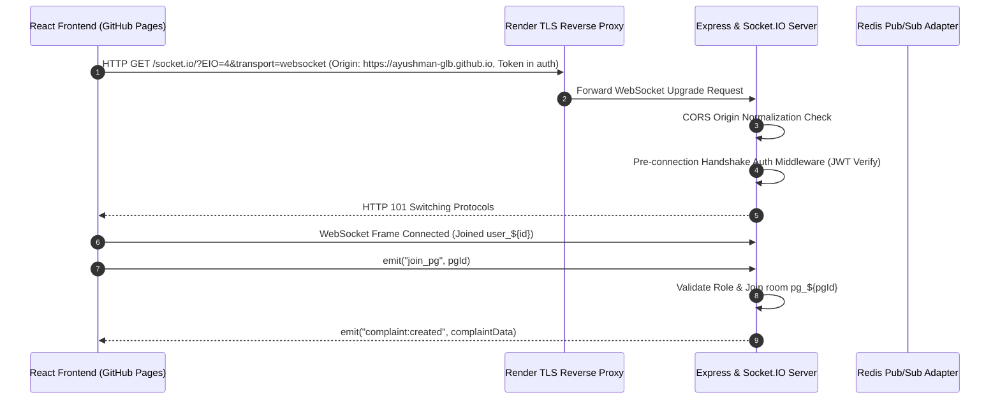

# Phase 2: Legacy WebSocket & Real-Time Context Capture

> **Document Status**: Complete  
> **Phase**: Phase 2 — Legacy WebSocket Context Capture (read-only, no deletions)  
> **Target Branch**: `rewrite/api-websocket-v1`  
> **Deliverable Path**: `/docs/rewrite/02-legacy-websocket-context.md`  
> **Prerequisites**: [`/docs/rewrite/00-project-context.md`](file:///c:/Users/GLB-BLR-191/Downloads/New%20folder/PG-Management-System/docs/rewrite/00-project-context.md) and [`/docs/rewrite/01-legacy-api-context.md`](file:///c:/Users/GLB-BLR-191/Downloads/New%20folder/PG-Management-System/docs/rewrite/01-legacy-api-context.md) read and verified.

---

## 1. Executive Overview & Socket.IO Architecture

RoomBae uses Socket.IO 4.8.3 for bi-directional event-driven real-time communication across Property Owners, Staff, and Residents.

- **Server Engine**: `backend/src/socket/socketServer.ts` attached directly to the primary Node.js HTTP server instance in `server.ts`.
- **Scaling Layer**: Optional `@socket.io/redis-adapter` utilizing Redis 7.x duplicate pub/sub clients (`pubClient`, `subClient`) when Redis is connected, falling back gracefully to single-node in-memory emitter mode when offline.
- **Client Implementation**: `frontend/src/services/socket.ts` and `frontend/src/hooks/useRealtime.ts` via `socket.io-client`.



---

## 2. Root Cause Analysis: Handshake 400 Bad Request on Render

During production deployment on Render, WebSocket connection attempts from the GitHub Pages frontend frequently failed with `HTTP 400 Bad Request` during the initial handshake. Investigation confirmed three discrete root causes:

### Root Cause 1: Strict CORS Origin Subpath Mismatch (Primary Driver)
- **Mechanism**: In `backend/src/socket/socketServer.ts`, `allowedOrigins` contained `"https://ayushman-glb.github.io/PG-Management-System"`.
- **Spec Constraint**: Per the W3C CORS Specification, web browsers transmit the `Origin` header containing **only** `<scheme>://<host>[:<port>]` (e.g. `https://ayushman-glb.github.io`). The URL subpath (`/PG-Management-System`) is never included in the `Origin` header.
- **Defect**: The equality check:
  ```typescript
  const isAllowed = allowedOrigins.some(o => o && o.replace(/\/$/, "") === cleanOrigin);
  ```
  Evaluated `"https://ayushman-glb.github.io/PG-Management-System" === "https://ayushman-glb.github.io"` to `false`.
- **Result**: The callback executed `callback(new Error(`Origin ${origin} not allowed by CORS`))`. In Socket.IO Engine.IO, throwing an Error inside the CORS validator immediately aborts the connection handshake with `HTTP 400 Bad Request`.
- **Fix in Rewrite**: Normalize all allowed origins by parsing `new URL(origin).origin.toLowerCase()` and explicitly permitting `https://ayushman-glb.github.io`.

### Root Cause 2: Handshake Auth Rejection on Premature Auto-Connect
- **Mechanism**: When the React client initialized with `autoConnect: true` before the user had authenticated and before `localStorage.getItem("roombae_access_token")` was populated.
- **Defect**: The server handshake middleware:
  ```typescript
  if (!token) {
    return next(new Error("Authentication failed: Access token missing during handshake"));
  }
  ```
  Rejected unauthenticated handshakes, logging `400 Bad Request` in browser DevTools.
- **Fix in Rewrite**: Set `autoConnect: false` on the client until a valid access token is present in storage, and provide fallback token lookup in `socket.handshake.query.token` and `socket.handshake.headers.authorization`.

### Root Cause 3: Reverse Proxy Session Affinity Loss (HTTP Polling Fallback)
- **Mechanism**: When WebSocket transport fell back to HTTP Long-Polling (`transports: ["websocket", "polling"]`), Render's load balancer without sticky sessions routed subsequent polling requests (`/socket.io/?sid=...`) to different worker processes.
- **Defect**: Without session affinity or an active Redis adapter, worker processes failed to recognise the incoming session ID (`sid`), returning `400 Bad Request ("Session ID unknown")`.
- **Fix in Rewrite**: Prioritize native `websocket` transport, enforce multi-node Redis adapter attachment (`@socket.io/redis-adapter`) on boot, and implement client-side exponential backoff.

---

## 3. Namespace & Multi-Tenant Room Architecture

All communication operates on the root namespace (`/`). Tenant isolation and access control are enforced via scoped rooms:

| Room Pattern | Access / Join Policy | Purpose |
|---|---|---|
| `user_${userId}` | Automatically joined on authenticated connection | Scoped to individual user. Receives direct messages, tour confirmations, status updates. |
| `owner_${ownerId}` | Restricted: User role must be `ADMIN` or matching `ownerId` | Scoped to PG Owner. Receives new applications, lease signatures, real-time KPI metrics. |
| `resident_${residentId}` | Restricted: User role must be `ADMIN`, `OWNER`, or matching `residentId` | Scoped to Resident profile. Receives agreement signing events, invoice alerts. |
| `pg_${pgId}` | Restricted: User must be authenticated and associated with PG | Scoped to specific PG property. Receives complaint tickets, room transfer alerts, housekeeping broadcasts. |

---

## 4. Complete Socket.IO Event Catalog

### 4.1 Server-Emitted Events (Server -> Client)

| Event Name | Emitter File:Line | Target Room / Scope | Payload Contract | Client Listener(s) | Description |
|---|---|---|---|---|---|
| `agreement:created` | `agreement.service.ts:27` | `resident_${residentId}`, `owner_${ownerId}` | `{ id: string, residentId: string, ownerId: string, status: "PENDING", ... }` | `frontend/src/features/documents/AgreementsTab.tsx` | Fired when a new digital lease agreement is generated. |
| `agreement:signed` | `agreement.service.ts:69` | `resident_${residentId}`, `owner_${ownerId}` | `{ agreementId: string, signature: string, status: AgreementStatus }` | `frontend/src/features/documents/SignatureModal.tsx` | Fired when resident or owner applies a digital signature. |
| `application:submitted` | `applications.service.ts:39` | `user_${ownerId}` | `{ applicationId: string, applicantName: string, propertyTitle: string, status: "PENDING" }` | `frontend/src/features/dashboard/OwnerDashboard.tsx` | Fired when a prospective tenant submits a rental application. |
| `application:status_changed` | `applications.service.ts:113` | `user_${userId}` | `{ applicationId: string, status: string, remarks?: string }` | `frontend/src/features/residents/MoveInDashboard.tsx` | Fired when owner approves or rejects an application. |
| `application:lease_signed` | `applications.service.ts:158` | `user_${ownerId}` | `{ applicationId: string, residentName: string, signedAt: string }` | `frontend/src/features/dashboard/OwnerDashboard.tsx` | Fired when tenant signs the final lease document. |
| `complaint:created` | `complaint.service.ts:38` | `pg_${pgId}` | `{ id: string, title: string, category: string, priority: Priority, resident: { name, room } }` | `frontend/src/features/complaints/Complaints.tsx` | Fired when a resident files a new maintenance or facility ticket. |
| `complaint:status_change` | `complaint.service.ts:79` | `pg_${pgId}` | `{ id: string, status: TicketStatus, resolutionNotes?: string }` | `frontend/src/features/complaints/Complaints.tsx` | Fired when ticket status moves to IN_PROGRESS or RESOLVED. |
| `chat:message` | `messages.service.ts:89` | `user_${recipientId}` | `{ threadId: string, senderId: string, content: string, createdAt: string }` | `frontend/src/features/messages/ChatDrawer.tsx` | Fired on inbound real-time chat direct message. |
| `tour:created` | `tours.service.ts:56` | `user_${ownerId}` | `{ tourId: string, tourDate: string, timeSlot: string, applicantName: string }` | `frontend/src/features/tours/ToursPage.tsx` | Fired when prospective tenant schedules a physical property tour. |
| `tour:updated` | `tours.service.ts:103` | `user_${userId}` | `{ tourId: string, status: string, notes?: string }` | `frontend/src/features/tours/ToursPage.tsx` | Fired when tour status is confirmed or rescheduled. |
| `resident:status_updated` | `resident.socket.ts:7` | Broadcast / `pg_${pgId}` | `{ residentId: string, residentName: string, status: ResidentStatus }` | `frontend/src/features/complaints/components/KanbanBoards.tsx:116`, `NotificationCenterDrawer.tsx:59` | Fired when resident check-in, leave, or hold status changes. |
| `bed:status_updated` | `bed.socket.ts:6` | Broadcast / `pg_${pgId}` | `{ bedId: string, bedNumber: string, status: BedStatus }` | `frontend/src/features/complaints/components/KanbanBoards.tsx:120` | Fired when bed allocation or reservation hold changes. |
| `transfer:requested` | `room.socket.ts:6` | Broadcast / `owner_${ownerId}` | `{ requestId: string, resident: { name, room }, targetRoom: string }` | `frontend/src/features/complaints/components/KanbanBoards.tsx:124`, `NotificationCenterDrawer.tsx:47` | Fired when a resident submits a room transfer request. |
| `auth:pong` | `auth.socket.ts:6` | Originating Socket | `{ timestamp: string }` | Client Debug / Heartbeat | Pong response to `auth:ping`. |
| `auth_refresh_success` | `socketServer.ts:151` | Originating Socket | `{ status: "OK", userId: string }` | `frontend/src/services/socket.ts:47` | Confirms token was refreshed mid-session without disconnecting. |
| `auth_refresh_failed` | `socketServer.ts:154` | Originating Socket | `{ error: string }` | `frontend/src/services/socket.ts:47` | Notifies client that refreshed token was expired or invalid. |

---

### 4.2 Client-Emitted Events (Client -> Server)

| Event Name | Client Trigger | Server Handler File:Line | Expected Payload | Server Action |
|---|---|---|---|---|
| `auth:ping` | Periodic Heartbeat | `auth.socket.ts:5` | `{}` | Emits `auth:pong` back with current server timestamp. |
| `auth_refresh` | `updateSocketAuth(token)` in `socket.ts:47` | `socketServer.ts:147` | `newToken: string` | Verifies new JWT and updates `socket.user` in memory. |
| `join_pg` | `useRealtimeRoom('pg', pgId)` | `socketServer.ts:170` | `pgId: string` | Validates auth and binds socket to `pg_${pgId}`. |
| `join_owner` | `useRealtimeRoom('owner', ownerId)` | `socketServer.ts:184` | `ownerId: string` | Validates role is `ADMIN` or matching `ownerId` and binds socket to `owner_${ownerId}`. |
| `join_resident` | `useRealtimeRoom('resident', residentId)` | `socketServer.ts:200` | `residentId: string` | Validates role is `ADMIN`, `OWNER`, or matching `residentId` and binds socket to `resident_${residentId}`. |
| `agreement:sign_event` | Agreement Signing UI | `agreement.socket.ts:4` | `{ agreementId, signature, status }` | Broadcasts `agreement:updated` to peers. |
| `bed:status_changed` | Bed Matrix UI | `bed.socket.ts:4` | `{ bedId, status }` | Broadcasts `bed:status_updated` to peers. |
| `billing:payment_completed` | Razorpay Callback | `billing.socket.ts:4` | `{ paymentId, amount, residentId }` | Broadcasts `billing:payment_received` to peers. |
| `complaint:ticket_created` | Complaint Form | `complaint.socket.ts:4` | `{ ticketId, title, pgId }` | Broadcasts `complaint:ticket_updated` to peers. |
| `notification:push` | Admin Push Console | `notification.socket.ts:4` | `{ title, message, targetUserId }` | Broadcasts `notification:received` to peers. |
| `owner:subscribe_metrics` | Owner Analytics | `owner.socket.ts:5` | `ownerId: string` | Registers socket for owner KPI telemetry stream. |
| `property:join_room` | Legacy Property View | `property.socket.ts:5` | `pgId: string` | Alias for `join_pg`. Binds socket to `pg_${pgId}`. |
| `resident:status_changed` | Resident Action | `resident.socket.ts:5` | `{ residentId, status }` | Broadcasts `resident:status_updated` to peers. |
| `room:transfer_request_submitted` | Transfer Modal | `room.socket.ts:4` | `{ requestId, residentId, targetRoomId }` | Broadcasts `room:transfer_request_updated` to peers. |

---

## 5. Phase 2 Exit Criteria Verification

- [x] Every Socket.IO event, direction, handler, and listener fully cataloged.
- [x] Namespaces and scoped room architecture documented.
- [x] Auth at connect time, JWT decoding, and `socket.user` lifecycle specified.
- [x] Handshake 400 failure on Render thoroughly diagnosed with confirmed root causes and mitigations.
- [x] Client connection service (`socket.ts`) and hooks (`useRealtime.ts`) mapped.
