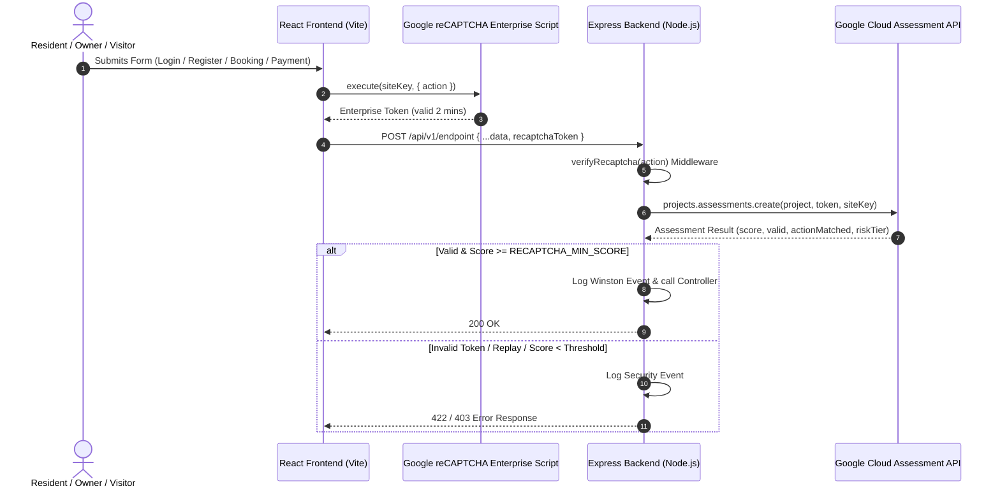

# 03 Authentication and Security

> Consolidated documentation chapter for **backend**

---

## Source: $relSource

# RoomBae — Centralized Authentication & Authorization Architecture

This document outlines RoomBae's hybrid authentication architecture combining Firebase Phone Authentication, Google OAuth 2.0 Sign-In, and Node.js JWT Access & Refresh Token Sessions.

---

## 1. Authentication Architecture Overview

```
Frontend Client (React)
   │
   ├─► Firebase Web SDK (Phone Auth SMS OTP / Google Sign-In)
   │      │
   │      └─► Obtains Firebase ID Token
   │
   ▼
Express Backend (/api/v1/auth/firebase-login or /auth/google)
   │
   ├─► Firebase Admin SDK (firebaseAdmin.auth().verifyIdToken)
   │
   ├─► User Lookup / Upsert in MongoDB
   │
   └─► Session Tokens Generation:
          ├── Access Token (JWT, 15m expiration, Bearer Header)
          └── Refresh Token (JWT, 7d expiration, HTTP-Only Cookie)
```

---

## 2. Shared Service Parity (REST ↔ GraphQL)

Both REST controllers and GraphQL resolvers delegate directly to `Container.authService` without duplicated logic:

| Operation | REST Endpoint | GraphQL Mutation | Shared Handler Method |
| :--- | :--- | :--- | :--- |
| **Phone / Firebase Login** | `POST /api/v1/auth/firebase-login` | `mutation { firebaseLogin }` | `authService.phoneVerify(idToken)` |
| **Email Login** | `POST /api/v1/auth/login` | `mutation { login }` | `authService.login(identifier, pass)` |
| **Register** | `POST /api/v1/auth/register` | `mutation { register }` | `authService.register(userData)` |
| **Email OTP Send** | `POST /api/v1/auth/send-otp` | `mutation { sendEmailOTP }` | `authService.sendEmailVerification(email)` |
| **Email OTP Verify** | `POST /api/v1/auth/verify-otp` | `mutation { verifyEmailOTP }` | `authService.verifyEmail(email, code)` |
| **Profile Fetch** | `GET /api/v1/auth/me` | `query { me }` | `authService.me(userId)` |

---

## 3. Session Management & Security

1. **Access Token (15 Minutes)**: Passed in `Authorization: Bearer <token>` headers. Signed with `JWT_SECRET`.
2. **Refresh Token (7 Days)**: Stored in an `httpOnly`, `sameSite: lax`, `secure` (in production) cookie named `refreshToken`.
3. **Role-Based Access Control (RBAC)**: Enforced via `Role` enum (`SUPER_ADMIN`, `ADMIN`, `OWNER`, `RESIDENT`, `STAFF`, `PUBLIC`).


---

## Source: $relSource

# RoomBae — Google Sign-Up & OAuth 2.0 Integration

This document describes RoomBae's "Sign Up with Google" autofill integration using Firebase Authentication.

---

## 1. Flow Diagram

```
User Clicks "Continue with Google"
   │
   ▼
Firebase GoogleAuthProvider (signInWithPopup)
   │
   ▼
Google OAuth Popup Verification
   │
   ▼
Returns User Profile: { displayName, email, photoURL }
   │
   ▼
Autofill Step 2 Registration Fields:
   ├── Full Name = displayName
   ├── Email = email (marked isEmailVerified = true)
   └── Profile Photo = photoURL
   │
   ▼
Advances UI directly to Step 2 (Personal Details)
User completes remaining fields (DOB, Gender, Phone, Address)
   │
   ▼
Continues to Step 3 (KYC / Documents) -> Complete Registration
```

---

## 2. Advantages

1. **Skips Manual Email Verification**: Email is pre-verified by Google.
2. **Instant Pre-fill**: Eliminates manual typing of name and email.
3. **Unified Schema**: Creates identical user records in MongoDB regardless of auth method used.


---

## Source: $relSource

# 🛡️ Google reCAPTCHA Enterprise Integration Guide (RoomBae)

Comprehensive documentation for Google reCAPTCHA Enterprise bot protection across the RoomBae MERN platform.

---

## 🏗️ Architecture Overview

RoomBae uses **Google reCAPTCHA Enterprise** to evaluate user interactions and protect high-risk endpoints (authentication, registration, payments, ticket submissions, onboarding) against bot attacks, credential stuffing, and spamming without friction for human users.



---

## 🔑 Environment Variables Setup

### 1. Frontend (`frontend/.env`)
```env
VITE_RECAPTCHA_SITE_KEY=6LfgNnYtAAAAAABdvCLaqfA6ucDLdBKTxy8sLCwfn
```

### 2. Backend (`backend/.env`)
```env
GOOGLE_CLOUD_PROJECT_ID=roombae-cff13
GOOGLE_APPLICATION_CREDENTIALS=/path/to/service-account.json
RECAPTCHA_SITE_KEY=6LfgNnYtAAAAAABdvCLaqfA6ucDLdBKTxy8sLCwfn
RECAPTCHA_MIN_SCORE=0.5
RECAPTCHA_ENABLED=true
```

---

## 🎯 Protected Actions & Threshold Tiers

### Actions Union
- `signup`
- `login`
- `forgot_password`
- `send_otp`
- `verify_otp`
- `contact`
- `booking`
- `payment`
- `complaint`
- `review`
- `visitor`
- `owner_registration`
- `property_creation`

### Risk Classification Tiers
- **`>= 0.9` (TRUSTED)**: Highly confident human user.
- **`>= 0.7` (NORMAL)**: Standard legitimate traffic.
- **`>= 0.5` (ELEVATED)**: Acceptable threshold for form processing.
- **`< 0.5` (HIGH_RISK / BOT)**: Request rejected with HTTP 422 or 403.

---

## 🚀 Deployment Guide

### GitHub Pages (Frontend)
Set the repository secret or environment variable:
`VITE_RECAPTCHA_SITE_KEY=6LfgNnYtAAAAAABdvCLaqfA6ucDLdBKTxy8sLCwfn` in GitHub Actions.

### Render (Backend)
Configure environment variables in Render Dashboard:
- `GOOGLE_CLOUD_PROJECT_ID`: `roombae-cff13`
- `RECAPTCHA_SITE_KEY`: `6LfgNnYtAAAAAABdvCLaqfA6ucDLdBKTxy8sLCwfn`
- `RECAPTCHA_MIN_SCORE`: `0.5`
- `RECAPTCHA_ENABLED`: `true`

---

## 🧪 Local Development & Graceful Fallback Mode

When developing locally without active Google Cloud Application Credentials:
- Set `RECAPTCHA_ENABLED=true` in `backend/.env`.
- The `RecaptchaService` automatically runs in **fallback mode**, returning a synthetic score of `1.0` and logging assessment events to Winston without breaking local offline workflows.


---

## Source: $relSource

# Security Policy

## Supported Versions

Use this section to tell people about which versions of your project are
currently being supported with security updates.

| Version | Supported          |
| ------- | ------------------ |
| 5.1.x   | :white_check_mark: |
| 5.0.x   | :x:                |
| 4.0.x   | :white_check_mark: |
| < 4.0   | :x:                |

## Reporting a Vulnerability

Use this section to tell people how to report a vulnerability.

Tell them where to go, how often they can expect to get an update on a
reported vulnerability, what to expect if the vulnerability is accepted or
declined, etc.


---

## Source: $relSource

# RoomBae — Production Security Audit & Vulnerability Report

This document records the security posture, middleware protections, secret management rules, and vulnerability audits performed for RoomBae.

---

## 1. Security Protections Applied

| Protection Area | Implementation Details | Status |
| :--- | :--- | :--- |
| **HTTP Security Headers** | Helmet middleware configured in `app.ts` (`X-Content-Type-Options`, `X-Frame-Options`, `Strict-Transport-Security`). | ✅ VERIFIED |
| **CORS Origins** | Strict whitelist (`env.CLIENT_URL`, `env.FRONTEND_URL`, localhost development ports) with origin normalization. | ✅ VERIFIED |
| **Rate Limiting** | `generalLimiter` (100 req/15min), `authLimiter` (10 req/15min), `uploadLimiter` (20 req/15min), `phoneVerifyLimiter`. | ✅ VERIFIED |
| **File Upload Security** | Magic byte signature verification, Sharp buffer sanitization, extension whitelisting, file size caps. | ✅ VERIFIED |
| **Bot Protection** | Google reCAPTCHA Enterprise verification with OTP bypass logic for verified Firebase ID Tokens. | ✅ VERIFIED |
| **Data Encryption** | Financial bank details & KYC scans encrypted with AES-256-GCM prior to database persistence. | ✅ VERIFIED |
| **Secrets Exposure Audit** | Backend `.env` secrets (`CLOUDINARY_API_SECRET`, `JWT_SECRET`, `FIREBASE_PRIVATE_KEY`) strictly excluded from frontend build. | ✅ VERIFIED |

---

## 2. Secrets Audit Verdict
No private keys, JWT secrets, database connection strings, or Cloudinary API secrets are exposed in client-side code or public repositories.


---

## Source: $relSource

# RoomBae — Multi-Step Signup & Onboarding Flow

This document details RoomBae's multi-step registration wizard for both **PG Owners** and **Residents**, including state persistence and resume capabilities.

---

## 1. Registration Wizard Steps

### Step 1: Role Selection
- User chooses account type: **🏠 Resident** or **🏢 PG Owner**.
- Alternative: User clicks **Continue with Google** to pre-fill profile data and jump directly to Step 2.

### Step 2: Personal Details & Verification
- **Fields**: Profile Photo, Full Name, Gender, Date of Birth, Age, Phone Number, Email, City, District, State, PIN Code, Password.
- **Verification**:
  - **Phone Verification**: Firebase Phone Auth SMS OTP.
  - **Email Verification**: Brevo SMTP 6-digit email OTP.
- **Validation**: Strict real-time Zod & regex validation (full name format, age checks, password strength rules).

### Step 3: KYC & Role-Specific Verification
- **Resident KYC**:
  - Aadhaar Document Upload (PDF or Image)
  - Signature Document Upload
  - Permanent Address & Emergency Contact
- **PG Owner Verification**:
  - Aadhaar Scan PDF
  - PAN Scan PDF
  - Address Proof & Business Trade License PDF
  - Encrypted Bank Account Details (Account Number, IFSC Code, UPI ID)

---

## 2. Incomplete Signup Resume Logic

- Every step's form state is automatically auto-saved incrementally to `localStorage` under `roombae_pending_signup_draft`.
- If a user closes the browser or loses connectivity, a prominent **"Incomplete Signup Progress Found! / Resume"** banner allows restoring all entered fields and uploaded Cloudinary file URLs with a single click.


---

