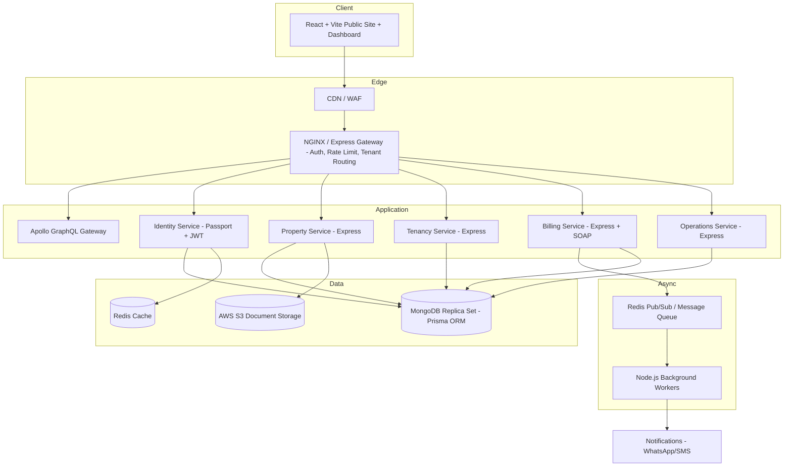
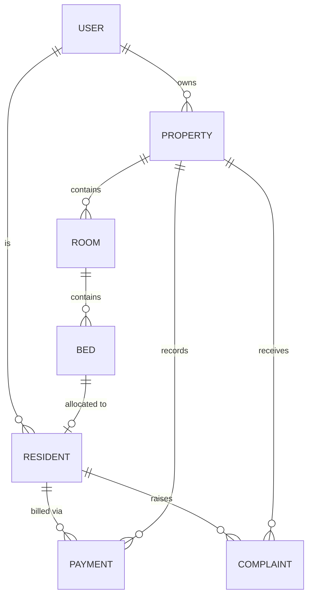
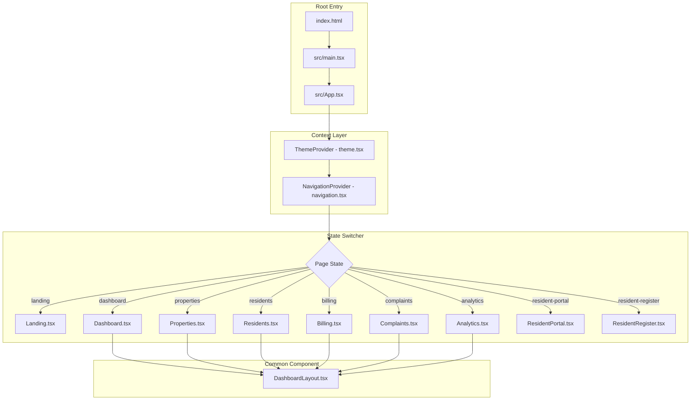

# 01 Frontend Architecture and SRS

> Consolidated documentation chapter for **frontend**

---

## Source: $relSource

# 🖥️ RoomBae Responsive Frontend UI & Design System Specification (`frontend_design.md`)

> **Visual Design Specification & Responsive Architecture Document** for the RoomBae React 19 + Vite 6 + TypeScript Single Page Application (SPA).

---

## 🎨 1. Global Visual Language & Responsive Design Tokens

RoomBae uses a warm, inviting luxury palette built on relative units (`rem`, `em`, `%`, `vw`) and fluid typography `clamp()` definitions:

### 1.1 Color Engine & Tokens
- **Canvas Background (`--bg-primary`)**: `#FFF8F2` (Light) / `#1D1B1A` (Dark).
- **Surface / Sidebar (`--bg-surface`)**: `#F8EEE5` (Light) / `#2B2725` (Dark).
- **Card Fills (`--bg-card`)**: `#FFFDFB` (Light) / `#332D2B` (Dark).
- **Primary Gold Accent (`--accent-gold`)**: `#D9A87C` (Light) / `#C89A4B` (Dark).
- **Secondary Bronze Accent (`--accent-bronze`)**: `#C58B63` (Light) / `#D8B36A` (Dark).
- **High-Contrast Text (`--text-main`)**: `#3B2A24` (Light) / `#F7F3EE` (Dark).
- **Secondary Text (`--text-muted`)**: `#6E5A52` (Light) / `#C6B9AE` (Dark).
- **Structural Borders (`--border-main`)**: `#E6D7CA` (Light) / `#4A443F` (Dark).

### 1.2 Fluid Typography Scale (`clamp()`)
- **Hero Display**: `font-size: clamp(2.2rem, 5.5vw, 4.75rem); line-height: 1.08;`
- **Section Heading H1**: `font-size: clamp(1.75rem, 3.8vw, 2.75rem); line-height: 1.15;`
- **Card Heading H2**: `font-size: clamp(1.35rem, 2.8vw, 2rem); line-height: 1.25;`
- **Body Large**: `font-size: clamp(0.95rem, 1.8vw, 1.25rem); line-height: 1.6;`

---

## 📐 2. Responsive Breakpoint Rules (320px to 2560px)

RoomBae implements a 14-tier responsive breakpoint strategy:

1. **Ultra Small Mobile (`320px - 374px`)**: Icon-only logo, hidden text labels on action buttons, single column stack, 44px min touch target buttons.
2. **Small Mobile (`375px - 413px`)**: Compact search pill icon, hamburger menu drawer, responsive stat cards.
3. **Standard Mobile (`414px - 639px`)**: 1-column grid, full-width modal drawers, scrollable navigation tabs.
4. **Tablet Portrait (`640px - 767px`)**: 2-column feature cards, compact header spacing, responsive stat widgets.
5. **Tablet Landscape (`768px - 1023px`)**: Sidebar navigation drawer, 3-column feature grid, fluid hero text scaling.
6. **Laptop & Desktop (`1024px - 1439px`)**: Persistent left sidebar, 4-column metrics grid, visible search bar (`Ctrl+K`).
7. **Ultra-Wide & 4K (`1440px - 2560px`)**: Centered max-w-7xl container, floating stat card overlays (`-left-8`, `-right-8`), high-resolution visual hierarchy.

---

## 🧩 3. Core Reusable Design System Components

1. **`<Logo />` (`Logo.tsx`)**:
   - Responsive brand logo featuring `full` (Icon + Text), `compact`, and `icon-only` variants.
   - Guaranteed zero text clipping and high-contrast color tokens across light/dark themes.
2. **`<Button />` (`Button.tsx`)**:
   - Centralized UI button supporting `primary`, `secondary`, `outline`, `ghost`, and `danger` variants.
   - Meets WCAG AA 44px minimum touch target size with loading spinners and focus rings (`focus-visible`).
3. **`<TypedText />` (`TypedText.tsx`)**:
   - Layout-shift-free typing animation component with reserved container width (`min-w-[280px] sm:min-w-[360px]`).
4. **`<DashboardLayout />` (`DashboardLayout.tsx`)**:
   - Header with responsive search bar, icon-collapsed action buttons (`Verification Queue`, `Issue Fine`), and overflow protection.


---

## Source: $relSource

# 🖥️ RoomBae Frontend Architecture & Responsive Design Specification (`frontend/DESIGN.md`)

> **Visual Design Specification, Component Architecture & Responsive Systems Blueprint** for the RoomBae React 19 + Vite 6 + TypeScript Single Page Application (SPA).

---

## 📋 Executive Overview

**RoomBae** is an ultra-luxury, high-performance Paying Guest (PG) & Co-Living Management SaaS Web Application. The frontend architecture relies on a **component-driven design system** built with **Tailwind CSS v4**, **Framer Motion**, **GSAP 3**, **Lenis Smooth Scroll**, and **Lucide React**.

This document details the visual design system, relative unit architecture, fluid typography clamp scales, responsive 19-tier breakpoint grid system, accessibility standards (WCAG AA), component hierarchy, motion guidelines, and state management patterns.

---

## 🎨 1. Global Visual Language & Design Tokens

RoomBae replaces cold industrial SaaS aesthetics with warm, inviting luxury tones built using relative units (`rem`, `em`, `%`, `vw`, `vh`, `clamp()`):

### 1.1 Color Palette & Theme Tokens

#### Light Theme (`Warm Sand & Luxury Amber`)
- **Canvas Background (`--bg-primary`)**: `#FFF8F2` — Soft warm cream.
- **Surface / Sidebar (`--bg-surface`)**: `#F8EEE5` — Warm neutral container fill.
- **Card Fills (`--bg-card`)**: `#FFFDFB` — Elevated card background.
- **Primary Gold Accent (`--accent-gold`)**: `#D9A87C` — Primary CTAs, active highlights.
- **Secondary Bronze Accent (`--accent-bronze`)**: `#C58B63` — Hover states, gradient endpoints.
- **High-Contrast Text (`--text-main`)**: `#3B2A24` — Deep espresso brown.
- **Secondary Text (`--text-muted`)**: `#6E5A52` — Muted labels, subtitles.
- **Structural Borders (`--border-main`)**: `#E6D7CA` — Subtle 1px dividers.

#### Dark Theme (`Espresso Charcoal & Gold`)
- **Dark Canvas (`--bg-primary-dark`)**: `#1D1B1A` — Dark charcoal canvas.
- **Dark Surface (`--bg-surface-dark`)**: `#2B2725` — Dark container surface.
- **Dark Cards (`--bg-card-dark`)**: `#332D2B` — Elevated dark card fill.
- **Gold Accent (`--accent-gold-dark`)**: `#C89A4B` — Metallic gold highlights.
- **Dark Text (`--text-main-dark`)**: `#F7F3EE` — Warm off-white body copy.
- **Dark Borders (`--border-main-dark`)**: `#4A443F` — Muted dark dividers.

### 1.2 Fluid Responsive Typography Scale (`clamp()`)

All font sizes, line heights, and margins dynamically adapt using CSS `clamp()` without layout jumps:

```css
/* Typography Scale */
.text-clamp-hero {
  font-size: clamp(2.2rem, 5.5vw, 4.75rem);
  line-height: 1.08;
  letter-spacing: -0.025em;
}

.text-clamp-h1 {
  font-size: clamp(1.75rem, 3.8vw, 2.75rem);
  line-height: 1.15;
  letter-spacing: -0.02em;
}

.text-clamp-h2 {
  font-size: clamp(1.35rem, 2.8vw, 2rem);
  line-height: 1.25;
}

.text-clamp-body {
  font-size: clamp(0.95rem, 1.4vw, 1.15rem);
  line-height: 1.6;
}

.text-clamp-sub {
  font-size: clamp(0.85rem, 1.2vw, 1rem);
  line-height: 1.5;
}
```

---

## 📐 2. Responsive Grid System & Breakpoint Tiers

RoomBae supports 19 screen resolution tiers (from 320px mobile up to 2560px 4K displays):

```
+-----------------------------------------------------------------------+
| 320px - 479px  | Single-Column Flex Stack | Touch Targets: 44px min   |
| 480px - 639px  | 4-Column Grid           | Collapsed Search Icon     |
| 640px - 767px  | 4-Column Grid           | Tablet Drawer Navigation  |
| 768px - 1023px | 8-Column Grid           | 2-Column Dashboard Cards  |
| 1024px - 1439px| 12-Column Grid          | Persistent Left Sidebar   |
| 1440px - 2560px| 12-Column Grid          | Centered max-w-7xl Grid   |
+-----------------------------------------------------------------------+
```

### 2.1 Grid Layout Column Strategy
- **Desktop / 4K (`1280px - 2560px`)**: 12-column responsive CSS Grid (`grid-cols-12`).
- **Laptop (`1024px - 1279px`)**: 12-column compressed grid (`lg:grid-cols-12`).
- **Tablet (`768px - 1023px`)**: 8-column grid (`md:grid-cols-8`).
- **Mobile (`480px - 767px`)**: 4-column grid (`sm:grid-cols-4`).
- **Ultra Small Mobile (`320px - 479px`)**: Single-column flex stack (`grid-cols-1`).

---

## 🧩 3. Component Architecture & System Design

The application is built using reusable design system primitives:

```
src/
├── components/
│   ├── ui/
│   │   ├── Logo.tsx               # Responsive brand logo (full, compact, icon-only)
│   │   ├── Button.tsx             # Design system button (sm, md, lg, 44px touch min)
│   │   ├── Avatar.tsx             # User avatar with status indicator
│   │   └── AnimatedBadge.tsx      # Status badge with glow pill
│   ├── animations/
│   │   └── TypedText.tsx          # Zero-CLS width-reserved typewriter animation
│   └── layouts/
│       └── DashboardLayout.tsx    # Responsive shell layout with drawer navigation
└── features/
    ├── dashboard/                 # Bento Grid & Metrics
    ├── properties/                # Property Cards & Room Matrix
    ├── residents/                 # Resident Directory & Resident Portal
    ├── billing/                   # Invoices, Razorpay & GST Calculator
    └── complaints/                # SLA Helpdesk Kanban Boards
```

### 3.1 Key UI Components

1. **`<Logo />` (`Logo.tsx`)**:
   - Renders `full` (Icon + Text + Badge), `compact`, or `icon-only` variants.
   - Preserves aspect ratio with `flex-shrink-0` to eliminate text clipping or logo distortion on mobile viewports.
2. **`<Button />` (`Button.tsx`)**:
   - Supports `primary`, `secondary`, `outline`, `ghost`, and `danger` variants.
   - Enforces a minimum 44px touch target height for mobile ergonomics with `focus-visible` accessibility rings.
3. **`<TypedText />` (`TypedText.tsx`)**:
   - Layout-shift-free typewriter effect using reserved inline container width (`min-w-[280px] sm:min-w-[360px]`).
4. **`<DashboardLayout />` (`DashboardLayout.tsx`)**:
   - Top header search bar collapses to an icon button on mobile (`<sm`), while action buttons (`Verification Queue`, `Issue Fine`) collapse text labels on tablet (`<md`) to icon badges.

---

## ♿ 4. Accessibility (WCAG AA Compliance)

1. **Keyboard Accessibility**: Every interactive element features visible `focus-visible:ring-2` focus indicators.
2. **Touch Targets**: All buttons, links, inputs, and controls adhere to the 44px × 44px minimum touch target guideline.
3. **Color Contrast**: Color pairings meet the WCAG AA contrast ratio threshold of **4.5:1** for body text and **3:1** for large headings.
4. **ARIA & Semantics**: Accessible names via `aria-label`, `role="switch"`, `aria-checked`, and semantic HTML5 tags (`<header>`, `<nav>`, `<main>`, `<aside>`, `<article>`).

---

## 🚀 5. Performance Guidelines & Motion Architecture

1. **Cumulative Layout Shift (CLS < 0.05)**: Standardized aspect ratios (`aspect-video`, `aspect-square`) and reserved widths for animated text.
2. **Largest Contentful Paint (LCP < 1.5s)**: Lazy-loading images (`loading="lazy"`), system font fallbacks, and optimized SVG icons.
3. **Reduced Motion**: Respects `prefers-reduced-motion` media query to disable heavy parallax animations for motion-sensitive users.


---

## Source: $relSource

# 🖥️ RoomBae Frontend Architecture & Responsive Design Specification (`FRONTEND_UI_DESIGN.md`)

> **Visual Design Specification, Component Architecture & Responsive Systems Blueprint** for the RoomBae React 19 + Vite 6 + TypeScript Single Page Application (SPA).

---

## 📋 Executive Overview

**RoomBae** is an ultra-luxury, high-performance Paying Guest (PG) & Co-Living Management SaaS Web Application. The frontend architecture relies on a **component-driven design system** built with **Tailwind CSS v4**, **Framer Motion**, **GSAP 3**, **Lenis Smooth Scroll**, and **Lucide React**.

This document details the visual design system, relative unit architecture, fluid typography clamp scales, responsive 19-tier breakpoint grid system, accessibility standards (WCAG AA), component hierarchy, motion guidelines, and state management patterns.

---

## 🎨 1. Global Visual Language & Design Tokens

RoomBae replaces cold industrial SaaS aesthetics with warm, inviting luxury tones built using relative units (`rem`, `em`, `%`, `vw`, `vh`, `clamp()`):

### 1.1 Color Palette & Theme Tokens

#### Light Theme (`Warm Sand & Luxury Amber`)
- **Canvas Background (`--bg-primary`)**: `#FFF8F2` — Soft warm cream.
- **Surface / Sidebar (`--bg-surface`)**: `#F8EEE5` — Warm neutral container fill.
- **Card Fills (`--bg-card`)**: `#FFFDFB` — Elevated card background.
- **Primary Gold Accent (`--accent-gold`)**: `#D9A87C` — Primary CTAs, active highlights.
- **Secondary Bronze Accent (`--accent-bronze`)**: `#C58B63` — Hover states, gradient endpoints.
- **High-Contrast Text (`--text-main`)**: `#3B2A24` — Deep espresso brown.
- **Secondary Text (`--text-muted`)**: `#6E5A52` — Muted labels, subtitles.
- **Structural Borders (`--border-main`)**: `#E6D7CA` — Subtle 1px dividers.

#### Dark Theme (`Espresso Charcoal & Gold`)
- **Dark Canvas (`--bg-primary-dark`)**: `#1D1B1A` — Dark charcoal canvas.
- **Dark Surface (`--bg-surface-dark`)**: `#2B2725` — Dark container surface.
- **Dark Cards (`--bg-card-dark`)**: `#332D2B` — Elevated dark card fill.
- **Gold Accent (`--accent-gold-dark`)**: `#C89A4B` — Metallic gold highlights.
- **Dark Text (`--text-main-dark`)**: `#F7F3EE` — Warm off-white body copy.
- **Dark Borders (`--border-main-dark`)**: `#4A443F` — Muted dark dividers.

### 1.2 Fluid Responsive Typography Scale (`clamp()`)

All font sizes, line heights, and margins dynamically adapt using CSS `clamp()` without layout jumps:

```css
/* Typography Scale */
.text-clamp-hero {
  font-size: clamp(2.2rem, 5.5vw, 4.75rem);
  line-height: 1.08;
  letter-spacing: -0.025em;
}

.text-clamp-h1 {
  font-size: clamp(1.75rem, 3.8vw, 2.75rem);
  line-height: 1.15;
  letter-spacing: -0.02em;
}

.text-clamp-h2 {
  font-size: clamp(1.35rem, 2.8vw, 2rem);
  line-height: 1.25;
}

.text-clamp-body {
  font-size: clamp(0.95rem, 1.4vw, 1.15rem);
  line-height: 1.6;
}

.text-clamp-sub {
  font-size: clamp(0.85rem, 1.2vw, 1rem);
  line-height: 1.5;
}
```

---

## 📐 2. Responsive Grid System & Breakpoint Tiers

RoomBae supports 19 screen resolution tiers (from 320px mobile up to 2560px 4K displays):

```
+-----------------------------------------------------------------------+
| 320px - 479px  | Single-Column Flex Stack | Touch Targets: 44px min   |
| 480px - 639px  | 4-Column Grid           | Collapsed Search Icon     |
| 640px - 767px  | 4-Column Grid           | Tablet Drawer Navigation  |
| 768px - 1023px | 8-Column Grid           | 2-Column Dashboard Cards  |
| 1024px - 1439px| 12-Column Grid          | Persistent Left Sidebar   |
| 1440px - 2560px| 12-Column Grid          | Centered max-w-7xl Grid   |
+-----------------------------------------------------------------------+
```

### 2.1 Grid Layout Column Strategy
- **Desktop / 4K (`1280px - 2560px`)**: 12-column responsive CSS Grid (`grid-cols-12`).
- **Laptop (`1024px - 1279px`)**: 12-column compressed grid (`lg:grid-cols-12`).
- **Tablet (`768px - 1023px`)**: 8-column grid (`md:grid-cols-8`).
- **Mobile (`480px - 767px`)**: 4-column grid (`sm:grid-cols-4`).
- **Ultra Small Mobile (`320px - 479px`)**: Single-column flex stack (`grid-cols-1`).

---

## 🧩 3. Component Architecture & System Design

The application is built using reusable design system primitives:

```
src/
├── components/
│   ├── ui/
│   │   ├── Logo.tsx               # Responsive brand logo (full, compact, icon-only)
│   │   ├── Button.tsx             # Design system button (sm, md, lg, 44px touch min)
│   │   ├── Avatar.tsx             # User avatar with status indicator
│   │   └── AnimatedBadge.tsx      # Status badge with glow pill
│   ├── animations/
│   │   └── TypedText.tsx          # Zero-CLS width-reserved typewriter animation
│   └── layouts/
│       └── DashboardLayout.tsx    # Responsive shell layout with drawer navigation
└── features/
    ├── dashboard/                 # Bento Grid & Metrics
    ├── properties/                # Property Cards & Room Matrix
    ├── residents/                 # Resident Directory & Resident Portal
    ├── billing/                   # Invoices, Razorpay & GST Calculator
    └── complaints/                # SLA Helpdesk Kanban Boards
```

### 3.1 Key UI Components

1. **`<Logo />` (`Logo.tsx`)**:
   - Renders `full` (Icon + Text + Badge), `compact`, or `icon-only` variants.
   - Preserves aspect ratio with `flex-shrink-0` to eliminate text clipping or logo distortion on mobile viewports.
2. **`<Button />` (`Button.tsx`)**:
   - Supports `primary`, `secondary`, `outline`, `ghost`, and `danger` variants.
   - Enforces a minimum 44px touch target height for mobile ergonomics with `focus-visible` accessibility rings.
3. **`<TypedText />` (`TypedText.tsx`)**:
   - Layout-shift-free typewriter effect using reserved inline container width (`min-w-[280px] sm:min-w-[360px]`).
4. **`<DashboardLayout />` (`DashboardLayout.tsx`)**:
   - Top header search bar collapses to an icon button on mobile (`<sm`), while action buttons (`Verification Queue`, `Issue Fine`) collapse text labels on tablet (`<md`) to icon badges.

---

## ♿ 4. Accessibility (WCAG AA Compliance)

1. **Keyboard Accessibility**: Every interactive element features visible `focus-visible:ring-2` focus indicators.
2. **Touch Targets**: All buttons, links, inputs, and controls adhere to the 44px × 44px minimum touch target guideline.
3. **Color Contrast**: Color pairings meet the WCAG AA contrast ratio threshold of **4.5:1** for body text and **3:1** for large headings.
4. **ARIA & Semantics**: Accessible names via `aria-label`, `role="switch"`, `aria-checked`, and semantic HTML5 tags (`<header>`, `<nav>`, `<main>`, `<aside>`, `<article>`).

---

## 🚀 5. Performance Guidelines & Motion Architecture

1. **Cumulative Layout Shift (CLS < 0.05)**: Standardized aspect ratios (`aspect-video`, `aspect-square`) and reserved widths for animated text.
2. **Largest Contentful Paint (LCP < 1.5s)**: Lazy-loading images (`loading="lazy"`), system font fallbacks, and optimized SVG icons.
3. **Reduced Motion**: Respects `prefers-reduced-motion` media query to disable heavy parallax animations for motion-sensitive users.


---

## Source: $relSource

# 🎨 RoomBae Design System & UI Architecture (`DESIGN.md`)

> **Single Source of Truth** for the RoomBae UI/UX Visual Language, Design System, Motion Primitives, Component Guidelines, Theme Tokens, Loading System, Accessibility Standards, and Layout Specifications.

---

## Table of Contents

1. [Project Overview](#1-project-overview)
2. [Design Principles](#2-design-principles)
3. [Color System](#3-color-system)
4. [Typography](#4-typography)
5. [Spacing System](#5-spacing-system)
6. [Layout System](#6-layout-system)
7. [Component Library & Motion Primitives](#7-component-library--motion-primitives)
8. [Iconography](#8-iconography)
9. [Motion Design & Animation Engine](#9-motion-design--animation-engine)
10. [Theme System (Light & Dark Mode)](#10-theme-system-light--dark-mode)
11. [Loading Architecture & Skeleton System](#11-loading-architecture--skeleton-system)
12. [Forms & Input Design](#12-forms--input-design)
13. [Accessibility Standards (WCAG 2.1 AA)](#13-accessibility-standards-wcag-21-aa)
14. [Responsiveness & Grid Breakpoints](#14-responsiveness--grid-breakpoints)
15. [Shadows, Elevation & Glassmorphism](#15-shadows-elevation--glassmorphism)
16. [Border Radius & Corner System](#16-border-radius--corner-system)
17. [Interaction Patterns](#17-interaction-patterns)
18. [UI States](#18-ui-states)
19. [Page-by-Page Architectural Breakdown](#19-page-by-page-architectural-breakdown)
20. [Design Tokens Reference](#20-design-tokens-reference)
21. [File & Directory Architecture](#21-file--directory-architecture)
22. [Future UI Guidelines](#22-future-ui-guidelines)
23. [Do's and Don'ts](#23-dos-and-donts)

---

## 1. Project Overview

### Product Vision
**RoomBae** is a luxury, modern SaaS platform engineered for premium Paying Guest (PG) accommodation and co-living space management. It bridges property owners, operational staff, and residents with an ultra-polished, responsive digital experience.

### Brand Personality
- **Sophisticated & Warm**: Replaces cold industrial SaaS aesthetics with warm, inviting luxury tones (`Warm Sand`, `Muted Bronze`, `Champagne Gold`, `Espresso Dark Charcoal`).
- **High-Performance & Fluid**: Silky smooth 60fps animations, hardware-accelerated transitions, and zero Cumulative Layout Shift (CLS).
- **Intuitive & Empathetic**: Minimal cognitive load with progressive disclosure of complex management controls.

### Target Audience
1. **PG Owners & Property Managers**: Require high-density data clarity (Occupancy, Revenue, Complaints, Billing, Resident Registrations).
2. **Residents & Guests**: Require clean, effortless self-service portals (Rent Payments, Room Bookings, Complaint Lodging, Visitors).

---

## 2. Design Principles

1. **Luxury Warmth**: Avoid harsh `#000000` blacks or stark `#FFFFFF` whites. Use curated warm neutral tones (`#FFF8F2` warm canvas in light mode, `#1D1B1A` dark charcoal in dark mode).
2. **Intentional Hierarchy**: Establish strong visual emphasis through typographic scale, weight contrasts, glassmorphic elevation, and subtle accent highlights.
3. **Motion Primitives First**: Utilize spring-driven Framer Motion primitives (`AnimatedTabs`, `SpotlightCard`, `AnimatedCounter`, `AnimatedDialog`, `AnimatedBadge`, `FloatingTooltip`) for tactile, physical user feedback.
4. **Predictable Layout Math**: Maintain rigid spatial consistency using an 8px grid system. Skeletons and actual components share identical dimensions to eliminate layout shifts.
5. **Universal Accessibility**: WCAG 2.1 AA compliance with high-contrast text, clear `:focus-visible` rings, ARIA landmarks, and automatic `prefers-reduced-motion` fallbacks.

---

## 3. Color System

RoomBae uses a dual-palette luxury color engine with CSS custom properties (`@theme` in Tailwind CSS v4) and theme class overrides (`html.dark-theme`).

### 3.1 Light Theme Palette

| Token | CSS Variable / Tailwind | Hex Code | Visual Role |
| :--- | :--- | :--- | :--- |
| **Canvas Background** | `--color-lux-bg` | `#FFF8F2` | Main page background |
| **Surface / Sidebar** | `--color-lux-surface` | `#F8EEE5` | Secondary containers, sidebar background |
| **Card Background** | `--color-lux-card` | `#FFFDFB` | Elevated card surfaces, tables, forms |
| **Primary Accent** | `--color-lux-accent` | `#D9A87C` | Primary buttons, active highlights, gradients |
| **Secondary Accent** | `--color-lux-accent2` | `#C58B63` | Gradient endpoints, hover states, icons |
| **Highlight** | `--color-lux-highlight` | `#E7C4A0` | Subtle active fills, pill badges, active borders |
| **Text Primary** | `--color-lux-text` | `#3B2A24` | Primary headings, body copy, high contrast |
| **Text Secondary** | `--color-lux-text2` | `#6E5A52` | Subtitles, labels, metadata, captions |
| **Border / Divider** | `--color-lux-border` | `#E6D7CA` | Structural borders, card outlines, table rows |
| **Success** | `--color-lux-success` | `#5E9F72` | Paid status, resolved complaints, active beds |
| **Warning** | `--color-lux-warning` | `#D9A441` | Pending rent, warnings, partial occupancy |
| **Danger / Error** | `--color-lux-danger` | `#D96B5D` | Overdue status, urgent complaints, delete |

---

### 3.2 Dark Theme Palette

| Token | CSS Variable / Tailwind | Hex Code | Visual Role |
| :--- | :--- | :--- | :--- |
| **Canvas Background** | `--color-dark-bg` | `#1D1B1A` | Main dark background |
| **Surface / Sidebar** | `--color-dark-surface` | `#2B2725` | Dark surface containers, sidebar |
| **Card Background** | `--color-dark-card` | `#332D2B` | Elevated dark card surfaces, tables, forms |
| **Primary Accent** | `--color-dark-accent` | `#C89A4B` | Dark mode gold accent, primary buttons |
| **Secondary Accent** | `--color-dark-accent2` | `#D8B36A` | Soft gold highlights, gradient fills |
| **Highlight** | `--color-dark-highlight` | `#E8C98A` | Text highlights, active state glows |
| **Text Primary** | `--color-dark-text` | `#F7F3EE` | Dark mode high-contrast text |
| **Text Secondary** | `--color-dark-text2` | `#C6B9AE` | Muted subtitles, descriptions |
| **Muted Text** | `--color-dark-muted` | `#756A63` | Placeholders, disabled states |
| **Border / Divider** | `--color-dark-border` | `#4A443F` | Dark mode borders, structural dividers |

---

## 4. Typography

RoomBae uses **Poppins** from Google Fonts as its core typeface across all viewports.

### 4.1 Typographic Scale

| Role | Font Size | Line Height | Weight | Letter Spacing | Usage Example |
| :--- | :--- | :--- | :--- | :--- | :--- |
| **Hero Display** | `3.5rem` (56px) | `1.1` | 800 (ExtraBold) | `-0.02em` | Landing Hero Headline |
| **Heading 1 (H1)** | `2.25rem` (36px) | `1.2` | 700 (Bold) | `-0.01em` | Main Page Titles |
| **Heading 2 (H2)** | `1.75rem` (28px) | `1.25` | 700 (Bold) | `0` | Section Titles, Modals |
| **Heading 3 (H3)** | `1.25rem` (20px) | `1.3` | 600 (SemiBold) | `0.01em` | Card Headers, Widget Titles |
| **Heading 4 (H4)** | `1.0rem` (16px) | `1.4` | 600 (SemiBold) | `0.01em` | Table Headers, Sub-sections |
| **Body Large** | `1.125rem` (18px) | `1.6` | 400 / 500 | `0.01em` | Lead paragraphs |
| **Body Base** | `0.875rem` (14px) | `1.5` | 400 (Regular) | `0.01em` | Standard text, inputs |
| **Body Small** | `0.75rem` (12px) | `1.5` | 500 (Medium) | `0.02em` | Metadata, badges, table cells |
| **Caption / Micro**| `0.625rem` (10px) | `1.4` | 600 (SemiBold) | `0.05em` | Micro labels, uppercase tags |

---

## 5. Spacing System

The spacing system relies on an **8px base grid** (with 4px micro-steps).

```css
--spacing-1: 4px;   /* Micro gaps, icon padding */
--spacing-2: 8px;   /* Small gaps, badge padding */
--spacing-3: 12px;  /* Button padding, internal input spacing */
--spacing-4: 16px;  /* Standard container padding, card gaps */
--spacing-6: 24px;  /* Large card padding, section gaps */
--spacing-8: 32px;  /* Modal margins, page headers */
--spacing-12: 48px; /* Section separation */
--spacing-16: 64px; /* Hero section padding */
```

---

## 6. Layout System

### 6.1 Core Layout Architecture
- **Dashboard View**: Sidebar + Sticky Glass Header + Scrollable Main Content Area (`h-screen overflow-hidden`).
- **Public & Content Views**: Full-width smooth scroll canvas with fixed navigation header.

### 6.2 Structural Dimensions
- **Sidebar Width**: `256px` (Expanded `w-64`), `64px` (Collapsed `w-16`).
- **Header Height**: `64px` (`h-16`).
- **Max Width Containers**: `max-w-7xl` (1280px) for listings/dashboard, `max-w-4xl` (896px) for content/forms.
- **Grid Systems**: 12-column responsive layout (`grid-cols-1 md:grid-cols-2 lg:grid-cols-3 xl:grid-cols-4`).

---

## 7. Component Library & Motion Primitives

In addition to base UI components, RoomBae includes a dedicated suite of **Motion Primitives** (`MotionPrimitives.tsx`):

### 7.1 Motion Primitives (`src/components/MotionPrimitives.tsx`)

#### 1. `AnimatedTabs`
- **Purpose**: Tab navigation switcher with a fluid sliding pill indicator.
- **Physics**: Framer Motion `layoutId` with spring animation (`stiffness: 400, damping: 32`).
- **Usage**: Role switcher in `Auth.tsx` ("Owner" vs "Resident"), status filters in `Complaints.tsx`.

#### 2. `SpotlightCard`
- **Purpose**: Interactive card component with a mouse-tracking radial spotlight glow.
- **Behavior**: Tracks relative cursor coordinates `(x, y)` on mouse move and renders a hardware-accelerated radial spotlight layer.
- **Usage**: Main statistics widget grid in `Dashboard.tsx`.

#### 3. `AnimatedCounter`
- **Purpose**: Smooth spring-based numeric interpolation for stats and monetary values.
- **Behavior**: Interpolates numbers using `useSpring` and `useTransform` with locale formatting.

#### 4. `AnimatedAccordion`
- **Purpose**: Collapsible item container.
- **Behavior**: Auto-height collapse/expand using `AnimatePresence` and 180° chevron icon rotation.

#### 5. `AnimatedDialog`
- **Purpose**: Accessible modal overlay dialog.
- **Behavior**: Backdrop blur opacity fade with spring scale/slide modal entrance (`scale: 0.95, y: 16` → `scale: 1, y: 0`).

#### 6. `AnimatedBadge`
- **Purpose**: Status pill tag.
- **Variants**: `success`, `warning`, `danger`, `info`, `neutral`.
- **Behavior**: Includes a subtle animated pulsing halo indicator ring.
- **Usage**: Priority tags in `Complaints.tsx`.

---

## 8. Theme System & Tokens

```css
@theme {
  --font-sans: "Poppins", sans-serif;
  --color-lux-bg: #FFF8F2;
  --color-lux-surface: #F8EEE5;
  --color-lux-card: #FFFDFB;
  --color-lux-accent: #D9A87C;
  --color-lux-accent2: #C58B63;
  --color-lux-text: #3B2A24;
  --color-lux-border: #E6D7CA;
  --color-dark-bg: #1D1B1A;
  --color-dark-surface: #2B2725;
  --color-dark-card: #332D2B;
  --color-dark-accent: #C89A4B;
  --color-dark-text: #F7F3EE;
  --radius: 20px;
}
```


---

## Source: $relSource

---
version: "neuform-top-creators-featured"
name: "Aether - Traverse The Unknown"
description: "Aether Traverse UI Showcase Section is designed for demonstrating an application interface and hierarchy. Key features include dashboard-like visual hierarchy and dense but readable content organization. Built with custom CSS, it is suitable for product showcases and interface-first landing experiences."
colors:
  primary: "#B08D6A"
  secondary: "#000000"
  accent: "#8E7B68"
  background: "#000000"
  surface: "#B08D6A"
  text-primary: "#FFFFFF"
  text-secondary: "#A1A1AA"
  border: "#27272A"
typography:
  display-lg:
    fontFamily: "Inter"
    fontSize: "64px"
    fontWeight: 500
    lineHeight: "1.04"
    letterSpacing: "0"
  body-md:
    fontFamily: "Oswald"
    fontSize: "16px"
    fontWeight: 400
    lineHeight: "1.6"
  label-md:
    fontFamily: "JetBrains Mono"
    fontSize: "12px"
    fontWeight: 600
    lineHeight: "1.2"
spacing:
  base: "8px"
  gap: "16px"
  card-padding: "24px"
  section-padding: "80px"
rounded:
  card: "11px"
  control: "11px"
  pill: "9999px"
components:
  card:
    background: "Use the surface token with subtle borders and HTML-matched shadow depth"
    radius: "Match the declared card radius token"
  button:
    background: "Use primary or accent colors for the main action"
    radius: "Use the control or pill radius based on the source HTML"
---
# Aether - Traverse The Unknown
Source: Neuform Featured templates from top creators. Author: Meng To (@mengto). Views: 9; favorites: 3; remixes: 0.
Tags: dashboard, charts, bento, animated, webgl, threejs, dither, navigation.
## Overview
Aether Traverse UI Showcase Section is designed for demonstrating an application interface and hierarchy. Key features include dashboard-like visual hierarchy and dense but readable content organization. Built with custom CSS, it is suitable for product showcases and interface-first landing experiences.

Aether Expeditions Landscapes Origins Begin Expedition Beyond The Horizon Deploy advanced tactical gear for harsh environments. + 89K Pioneers currently navigating the frontier. Featured Chart Patagonia Glacial peaks an…
## Composition
Use the attached HTML reference as the source of truth. Preserve the visible hierarchy, first-screen composition, section rhythm, density, and interaction tone before adapting copy or content.
Key visible headings include: Beyond; The Horizon; Chart Patagonia.
## Colors
Anchor the palette in primary #B08D6A, secondary #000000, accent #8E7B68, background #000000, surface #B08D6A, text-primary #FFFFFF. Keep background, surface, text, and border roles distinct so generated layouts retain the same contrast pattern as the source.
## Typography
Use Inter for display moments and Oswald for body copy unless the HTML clearly demands a compatible fallback. Labels and technical metadata should use JetBrains Mono or an equivalent mono face.
## Layout
Keep spacing deliberate and stable. Favor the same grid direction, max-width behavior, card density, and responsive stacking seen in the HTML. Do not replace distinctive source structures with generic SaaS sections.
## Components
Dashboard, chart, and data panels should preserve their compact operational hierarchy, nested surfaces, and metric emphasis.
## Motion
Preserve existing motion cues such as masked reveals, staggered entrance, hover lift, scroll-triggered transitions, and ambient movement. Keep easing smooth and restrained.
## WebGL & Effects

If the source includes canvas, WebGL, Three.js, gradients, particles, or atmospheric effects, rebuild them as supporting layers behind the content. Keep effects performant, responsive, and secondary to the interface.

## Guardrails
- Do not flatten the source into a generic card grid.
- Do not swap the color mode unless the source clearly supports it.
- Preserve the first viewport signal, focal object, and visual density.
- Keep buttons, cards, and badges aligned to the same radius and border language.


---

## Source: $relSource

# RoomBae Enterprise Architecture Documentation

## 1. Executive Summary
RoomBae is an enterprise-grade PG and Co-Living Management SaaS platform built on standard Domain-Driven Design (DDD) principles. This document outlines the frontend and backend domain alignment, system boundaries, and architectural patterns.

---

## 2. Directory & Domain Alignment Structure

### Frontend Structure (`frontend/src/`)
```text
src/
├── app/          # Core App bootstrapping, providers, routes, navigation
├── assets/       # Static assets, branding images
├── components/   # Categorized UI, Shared, Layouts, Animations, Feedback
│   ├── ui/       # Atomistic UI (Button, Card, Input, Modal, Avatar, Badge, Spinner)
│   ├── shared/   # Domain-shared drawers, portals, search
│   ├── layouts/  # Page layouts (DashboardLayout, LandingLayout, AuthLayout)
│   ├── animations/# Motion primitives, GSAP wrappers, smooth scroll
│   └── feedback/ # Toast, EmptyState, ErrorBoundary
├── features/     # Self-contained domain modules
│   ├── auth/
│   ├── dashboard/
│   ├── owners/
│   ├── residents/
│   ├── rooms/
│   ├── beds/
│   ├── properties/
│   ├── complaints/
│   ├── billing/
│   ├── analytics/
│   ├── notifications/
│   ├── visitors/
│   ├── documents/
│   ├── operations/
│   └── search/
├── graphql/      # Queries, Mutations, Subscriptions, Fragments, Generated types
├── hooks/        # Reusable domain & utility hooks
├── services/     # Domain REST & GraphQL service layer
├── store/        # Zustand global UI state store
├── config/       # Environment, API, Apollo, Socket configuration
├── constants/    # Roles, permissions, status, routes constants
├── schemas/      # Zod validation schemas
├── guards/       # RouteGuard, RoleGuard, PermissionGuard
└── theme/        # Design system & ThemeProvider
```

### Backend Structure (`backend/src/`)
```text
src/
├── modules/      # Mirroring frontend domain modules
│   ├── auth/
│   ├── owners/
│   ├── residents/
│   ├── rooms/
│   ├── beds/
│   ├── properties/
│   ├── complaints/
│   ├── billing/
│   ├── analytics/
│   ├── notifications/
│   ├── visitors/
│   ├── documents/
│   ├── operations/
│   └── search/
├── controllers/  # Express REST controllers
├── services/     # Core domain business logic services
├── repositories/ # Prisma ORM repositories
├── graphql/      # Apollo Server schema & resolvers
└── socket/       # Socket.IO real-time event handlers
```

---

## 3. Communication Protocols

| Protocol | Usage | Domain Services |
| :--- | :--- | :--- |
| **REST APIs** | Auth, File Uploads, Payments, Downloads | `authService`, `documentService`, `billingService` |
| **GraphQL** | Dashboard analytics, Directory queries, Aggregations | `graphqlService`, `apolloClient` |
| **Socket.IO** | Real-time notifications, Bed availability, Complaints | `socketService` |

---

## 4. Path Aliases

- `@app` -> `src/app`
- `@components` -> `src/components`
- `@features` -> `src/features`
- `@hooks` -> `src/hooks`
- `@services` -> `src/services`
- `@graphql` -> `src/graphql`
- `@types` -> `src/types`
- `@config` -> `src/config`
- `@utils` -> `src/utils`
- `@constants` -> `src/constants`
- `@theme` -> `src/theme`
- `@store` -> `src/store`
- `@providers` -> `src/providers`
- `@schemas` -> `src/schemas`
- `@guards` -> `src/guards`
- `@assets` -> `src/assets`


---

## Source: $relSource

# System Design — PG Management System

This document expands on the architecture summary in the [README](../README.md) with entity relationships, module boundaries, data flow, and the security/tenancy model for the Node.js + Express + Prisma ORM + MongoDB stack.

---

## Table of Contents

- [Goals & Constraints](#goals--constraints)
- [High-Level Architecture](#high-level-architecture)
- [Module Boundaries](#module-boundaries)
- [Multi-Tenancy Model](#multi-tenancy-model)
- [Entity Relationships (Prisma & MongoDB)](#entity-relationships-prisma--mongodb)
- [Data Flow: Rent Payment](#data-flow-rent-payment)
- [Data Flow: Resident Onboarding](#data-flow-resident-onboarding)
- [Caching Strategy](#caching-strategy)
- [Async & Messaging](#async--messaging)
- [Security Model](#security-model)
- [Scalability Path](#scalability-path)

---

## Goals & Constraints

- Support a single PG owner with one property, up to a platform tenant with hundreds of properties, using MongoDB document flexibility with Prisma ORM type safety.
- Strict tenant data isolation — a bug in application-layer authorization must never be able to leak another tenant's data.
- Payment and booking writes must be safe to retry (idempotent) since mobile networks and payment gateways are unreliable.
- Keep operational complexity low using a clean modular Node.js/Express architecture while providing a clean extraction path for modules that outgrow it (Billing and Analytics).

---

## High-Level Architecture



The NGINX Gateway is the single entry point for all client traffic. It terminates TLS, routes to Node.js instances, authenticates JWTs, resolves tenant claims, applies rate limiting, and forwards requests to Apollo GraphQL or Express REST/SOAP endpoints.

---

## Module Boundaries

| Module | Owns | Talks to |
|---|---|---|
| **Identity** | Users, roles, sessions, Google OAuth2, tenant accounts | Redis (session & token blacklist cache) |
| **Property** | PGs, floors, rooms, beds, occupancy grid | S3 (property images/documents) |
| **Tenancy** | Resident records, KYC, agreements, allocations | Property (bed availability), Identity (resident accounts) |
| **Billing** | Invoices, payments, late fees, SOAP web services | Redis Pub/Sub, Razorpay/Stripe |
| **Operations** | Complaints, visitor log, staff attendance, notices | Tenancy (resident context) |
| **Notification** | WhatsApp/SMS/email dispatch, templates | Redis Pub/Sub (consumes events from Billing/Operations) |
| **Analytics** | Occupancy rate, revenue, churn metrics | MongoDB Aggregation Pipelines + Redis Cache |

Each module exposes clean TypeScript service interfaces and Prisma models; there is no direct cross-module raw querying.

---

## Multi-Tenancy Model

**Approach:** Shared MongoDB Database, shared collections with `tenantId` (or `ownerId`) fields on tenant-scoped documents.

Isolation is enforced at two layers:

1. **Application Layer (Prisma Middleware):** Every Prisma query is scoped by the authenticated tenant's ID (`ownerId`), injected from gateway-verified JWT claims.
2. **Repository Layer:** Custom Prisma Client extensions automatically inject `{ where: { ownerId } }` filters on all document queries.

---

## Entity Relationships (Prisma & MongoDB)



Every document below `User` carries `ownerId` / `propertyId` references so Prisma filters can be applied uniformly across MongoDB queries.

---

## Data Flow: Rent Payment

1. Dashboard calls Apollo GraphQL mutation `createPayment` or REST `POST /api/v1/invoices/:id/pay` with a client-generated `Idempotency-Key` header.
2. Express middleware checks the idempotency key against a short-lived Redis record.
3. Billing service creates a payment record in MongoDB via Prisma (status: `PENDING`) and calls payment gateway (Razorpay / Stripe).
4. On gateway webhook callback, Express verifies the webhook signature, updates payment status to `PAID`, and emits a `payment.settled` event to Redis Pub/Sub.
5. Workers consume the event to send a WhatsApp/SMS receipt and refresh Redis analytics caches.

---

## Data Flow: Resident Onboarding

1. Owner initiates onboarding from the dashboard; Tenancy service creates a `Resident` document with Prisma status `ACTIVE`.
2. Resident uploads KYC documents to AWS S3 via pre-signed URLs; document metadata URL is stored in MongoDB.
3. Assigned bed status is updated to `isOccupied: true` in MongoDB via Prisma transaction.
4. Notification worker dispatches welcome message and move-in checklist.

---

## Caching Strategy

- **Redis** (`ioredis`) is used for read-heavy data: dashboard summaries, JWT blacklists, and idempotency locks.
- All writes go directly to MongoDB via Prisma ORM — Redis is treated as a disposable cache.
- Cache entries are invalidated on write for occupancy-related data to prevent double-booking.

---

## Security Model

- **Transport:** TLS 1.3, HSTS, strict CSP headers.
- **AuthN:** Passport.js with Google OAuth2 (`passport-google-oauth20`) and signed JWT access tokens.
- **AuthZ:** Role-based access control (`PUBLIC`, `TENANT`, `OWNER`, `ADMIN`) checked via Express middleware and Apollo context.
- **Data at Rest:** Field-level encryption for sensitive KYC fields (Aadhar, PAN) stored in MongoDB.
- **Auditability:** Immutable complaint logs and transaction records stored in MongoDB.

---

## Scalability Path

1. **Billing** (including SOAP web services) can be extracted into a standalone Node.js microservice if payment processing load increases.
2. **Analytics** uses MongoDB aggregation pipelines cached in Redis for real-time dashboard performance.
3. Modular TypeScript architecture allows swapping in-process function calls for REST / gRPC microservices whenever needed.


---

## Source: $relSource

# 📄 Software Requirements Specification (SRS)
## For PG Management System ("Room Bae")

**IEEE Standard 830-1998 Format**

---

### Document Control & Metadata

| Metadata Field | Document Detail |
| :--- | :--- |
| **Document Title** | Software Requirements Specification for PG Management System ("Room Bae") |
| **Standard Baseline** | IEEE Std 830-1998 / IEEE/ISO/IEC 29148:2018 |
| **Version** | 1.0.0 |
| **Date** | July 28, 2026 |
| **Author** | Ayushman Saha ([@ayushman-glb](https://github.com/ayushman-glb)) |
| **Project Status** | Production / Active Deployment |
| **Live Web App URL** | [https://ayushman-glb.github.io/PG-Management-System/](https://ayushman-glb.github.io/PG-Management-System/) |

---

## Table of Contents

- [1. Introduction](#1-introduction)
  - [1.1 Purpose](#11-purpose)
  - [1.2 Scope](#12-scope)
  - [1.3 Definitions, Acronyms, and Abbreviations](#13-definitions-acronyms-and-abbreviations)
  - [1.4 References](#14-references)
  - [1.5 Document Overview](#15-document-overview)
- [2. Overall Description](#2-overall-description)
  - [2.1 Product Perspective](#21-product-perspective)
  - [2.2 Product Functions](#22-product-functions)
  - [2.3 User Classes and Characteristics](#23-user-classes-and-characteristics)
  - [2.4 Operating Environment](#24-operating-environment)
  - [2.5 Design and Implementation Constraints](#25-design-and-implementation-constraints)
  - [2.6 User Documentation](#26-user-documentation)
  - [2.7 Assumptions and Dependencies](#27-assumptions-and-dependencies)
- [3. Specific Requirements](#3-specific-requirements)
  - [3.1 External Interface Requirements](#31-external-interface-requirements)
  - [3.2 System Functional Requirements](#32-system-functional-requirements)
  - [3.3 Non-Functional Requirements](#33-non-functional-requirements)
- [4. System Architecture & Data Modeling](#4-system-architecture--data-modeling)
  - [4.1 Component Flow Diagram](#41-component-flow-diagram)
  - [4.2 Navigation & Routing State Machine](#42-navigation--routing-state-machine)
- [5. Requirements Traceability Matrix (RTM)](#5-requirements-traceability-matrix-rtm)

---

## 1. Introduction

### 1.1 Purpose
This Software Requirements Specification (SRS) document defines the complete functional, non-functional, interface, and behavioral requirements for the **PG Management System ("Room Bae")**. This document serves as the authoritative technical reference for developers, software architects, QA engineers, and project stakeholders.

### 1.2 Scope
The **PG Management System** is a web-based, multi-tenant SaaS application designed to streamline Paying Guest (PG) hostel operations. The system encompasses:
- A public discovery portal for prospective tenants to view, search, and register for PG accommodations.
- An owner dashboard for PG property owners to manage inventory (properties, rooms, beds), track rent payments, handle complaint tickets, and view financial analytics.
- A tenant self-service portal for active residents to view payment history, pay rent dues, and lodge maintenance complaints.

### 1.3 Definitions, Acronyms, and Abbreviations

| Term / Abbreviation | Definition |
| :--- | :--- |
| **MERN** | Full-stack architecture (MongoDB, Express.js, React 19, Node.js 20). |
| **PG** | Paying Guest (Hostel / Coliving accommodation facility). |
| **SaaS** | Software as a Service. |
| **SRS** | Software Requirements Specification. |
| **IEEE** | Institute of Electrical and Electronics Engineers. |
| **DOM** | Document Object Model. |
| **HMR** | Hot Module Replacement (Vite feature for instant UI refresh). |
| **KYC** | Know Your Customer (Identity verification process for tenants). |
| **RBAC** | Role-Based Access Control. |
| **JWT** | JSON Web Token (used for stateless authentication). |
| **UI / UX** | User Interface / User Experience. |

### 1.4 References
1. IEEE Std 830-1998, *IEEE Recommended Practice for Software Requirements Specifications*.
2. React 19 Documentation: [https://react.dev/](https://react.dev/)
3. Vite 6 Documentation: [https://vite.dev/](https://vite.dev/)
4. Project Repository: [https://github.com/ayushman-glb/PG-Management-System](https://github.com/ayushman-glb/PG-Management-System)
5. System Architecture Spec: [docs/System.md](file:///c:/Users/GLB-BLR-191/Documents/pg%20management/New%20folder/PG%20Management%20system2/docs/System.md)

### 1.5 Document Overview
The remainder of this document follows the IEEE Std 830-1998 outline:
- **Section 2** describes the high-level system perspective, user classes, and operating constraints.
- **Section 3** specifies detailed functional and non-functional requirements.
- **Section 4** provides architectural and data flow diagrams.
- **Section 5** contains the Requirements Traceability Matrix (RTM).

---

## 2. Overall Description

### 2.1 Product Perspective
The system is an autonomous, self-contained single-page frontend web application (SPA) designed to communicate with a modular Node.js + Express.js + Prisma ORM backend via REST / GraphQL / SOAP protocols.

```
┌────────────────────────────────────────────────────────────────────────┐
│                      CLIENT BROWSER ENVIRONMENT                        │
│                                                                        │
│  React 19 + Vite 6 Single Page Application                             │
│  ├── ThemeProvider (Dark / Light Luxury Tokens)                        │
│  ├── NavigationProvider (State-Based Routing)                          │
│  └── Pages (Landing, Dashboard, Properties, Billing, Complaints, etc.) │
└───────────────────────────────────┬────────────────────────────────────┘
                                    │
                        HTTP / REST / GraphQL / SOAP
                                    │
┌───────────────────────────────────▼────────────────────────────────────┐
│                       BACKEND API & DATABASE                           │
│  Node.js 20 + Express + Prisma ORM + MongoDB + Redis Caching           │
└────────────────────────────────────────────────────────────────────────┘
```

### 2.2 Product Functions
1. **Public Property Discovery**: Browse PG listings by city, rent range, room types, and amenities.
2. **Digital Tenant Onboarding**: Online application submission with KYC document upload.
3. **Inventory Management**: Property, floor, room, and bed-level allocation tracking.
4. **Automated Billing & Dues**: Invoicing, payment status tracking, and payment history logs.
5. **Helpdesk & Ticket Resolution**: Complaint registration, priority sorting, and resolution tracking.
6. **Financial & Occupancy Analytics**: Visual charts for revenue trends, occupancy %, and pending dues.
7. **Multi-Theme Support**: Instant switching between Light Warm Luxury and Dark Gold themes.

### 2.3 User Classes and Characteristics

| User Class | Description & Technical Skill Level | System Rights |
| :--- | :--- | :--- |
| **Public Prospect** | Prospective tenant seeking accommodation. Low technical skill. | Read-only access to PG listings, read PG details, access registration form. |
| **Active Resident** | Tenant living in a PG. Low-to-medium technical skill. | Access Tenant Portal, view assigned bed, view invoices, submit complaints. |
| **PG Owner / Manager** | Property manager operating one or more PGs. Medium technical skill. | Full access to Dashboard, Properties, Rooms, Beds, Residents, Billing, Analytics. |
| **System Admin** | System administrator managing multi-tenant platform. High technical skill. | Global platform configuration and monitoring. |

### 2.4 Operating Environment
- **Client Web Browsers**: Google Chrome (v100+), Mozilla Firefox (v100+), Apple Safari (v15+), Microsoft Edge (v100+).
- **Supported Devices**: Mobile smartphones (320px+), tablets, laptops, and desktop displays up to 4K resolution.
- **Development Environment**: Node.js v18+, Vite 6, npm v9+.

### 2.5 Design and Implementation Constraints
1. **Framework Constraint**: Must use React 19 with Vite 6 and TypeScript for all frontend logic.
2. **Styling Constraint**: Utility-first CSS using Tailwind CSS v4 design tokens without heavy third-party UI framework lock-in.
3. **Performance Constraint**: Total initial gzipped JavaScript bundle size must not exceed 300 kB.
4. **State Routing Constraint**: Client-side navigation must run smoothly without full browser reloads.

### 2.6 User Documentation
The software includes inline interactive visual indicators, loading overlays, tooltips, and built-in help center documentation pages ([ContentPage.tsx](file:///c:/Users/GLB-BLR-191/Documents/pg%20management/New%20folder/PG%20Management%20system2/src/pages/ContentPage.tsx)).

### 2.7 Assumptions and Dependencies
- The user's web browser has JavaScript enabled.
- The user has an active internet connection for fetching external media assets and fonts.

---

## 3. Specific Requirements

### 3.1 External Interface Requirements

#### 3.1.1 User Interfaces
- **Header & Navigation**: Fixed top bar containing branding, active route indicators, and `<ThemeToggle />`.
- **Sidebar Navigation**: Dashboard layout sidebar providing one-click access to Dashboard, Properties, Residents, Billing, Complaints, and Analytics screens ([DashboardLayout.tsx](file:///c:/Users/GLB-BLR-191/Documents/pg%20management/New%20folder/PG%20Management%20system2/src/components/DashboardLayout.tsx)).
- **Responsive Layout**: Fluid grid layout converting 4-column cards into 1-column layouts on viewport widths < 768px.

#### 3.1.2 Hardware Interfaces
No dedicated hardware interface required beyond standard client display screen, keyboard, and touch/mouse input devices.

#### 3.1.3 Software Interfaces
- **Browser LocalStorage**: Key `pg-manager-theme` stores user theme preference (`"dark"` or `"light"`).
- **Web APIs**: Uses Browser `window.matchMedia` API to detect system dark mode preference.

---

### 3.2 System Functional Requirements

#### Module 1: Public Discovery & PG Listing

##### FR-1.1: PG Search & Filter
- **Input**: Search query (city/location), minimum rent, maximum rent, room type filter.
- **Processing**: Filters property array in real time based on user inputs.
- **Output**: Rendered grid of matching PG cards with image, price, location, rating, and amenity badges ([PGListing.tsx](file:///c:/Users/GLB-BLR-191/Documents/pg%20management/New%20folder/PG%20Management%20system2/src/pages/PGListing.tsx)).

##### FR-1.2: PG Property Details View
- **Input**: User clicks on a specific PG card.
- **Processing**: Navigates state to `"pg-details"`.
- **Output**: Displays full gallery, owner contact info, room availability grid, rules, and address map ([PGDetails.tsx](file:///c:/Users/GLB-BLR-191/Documents/pg%20management/New%20folder/PG%20Management%20system2/src/pages/PGDetails.tsx)).

---

#### Module 2: Resident Registration & Onboarding

##### FR-2.1: Digital Application Form
- **Input**: Tenant personal info, emergency contact, ID proof number, move-in date selection.
- **Processing**: Validates input fields and submits registration state.
- **Output**: Confirmation banner and redirect to applicant summary ([ResidentRegister.tsx](file:///c:/Users/GLB-BLR-191/Documents/pg%20management/New%20folder/PG%20Management%20system2/src/pages/ResidentRegister.tsx)).

---

#### Module 3: Owner Dashboard & Analytics

##### FR-3.1: High-Level Operational Summary
- **Input**: App state load.
- **Processing**: Calculates total revenue, occupancy %, pending dues total, and active ticket counts.
- **Output**: Displays 4 metric summary cards with trend indicators (+12%, -3%, etc.) ([Dashboard.tsx](file:///c:/Users/GLB-BLR-191/Documents/pg%20management/New%20folder/PG%20Management%20system2/src/pages/Dashboard.tsx)).

##### FR-3.2: Analytics & Revenue Reports
- **Input**: Date range selection or metric dropdown.
- **Processing**: Aggregates payment collection data and room occupancy metrics.
- **Output**: Renders visual bar charts, line graphs, and distribution breakdowns ([Analytics.tsx](file:///c:/Users/GLB-BLR-191/Documents/pg%20management/New%20folder/PG%20Management%20system2/src/pages/Analytics.tsx)).

---

#### Module 4: Property & Inventory Management

##### FR-4.1: Room & Bed Allocation Grid
- **Input**: Property selection.
- **Processing**: Maps rooms and child bed records with occupied/available status flags.
- **Output**: Color-coded visual bed allocation grid (Green = Available, Red = Occupied, Yellow = Maintenance) ([Properties.tsx](file:///c:/Users/GLB-BLR-191/Documents/pg%20management/New%20folder/PG%20Management%20system2/src/pages/Properties.tsx)).

---

#### Module 5: Billing & Rent Collection

##### FR-5.1: Payment & Invoice Tracker
- **Input**: Status filter (All, Paid, Pending, Overdue).
- **Processing**: Filters transaction records by selected status.
- **Output**: Rendered table listing tenant name, room #, rent amount, due date, payment method, and status badge ([Billing.tsx](file:///c:/Users/GLB-BLR-191/Documents/pg%20management/New%20folder/PG%20Management%20system2/src/pages/Billing.tsx)).

---

#### Module 6: Complaint & Helpdesk Ticketing

##### FR-6.1: Complaint Resolution Workflow
- **Input**: Complaint ticket selection, status update trigger.
- **Processing**: Updates ticket status (`OPEN` → `IN_PROGRESS` → `RESOLVED`).
- **Output**: Instant status badge update and timestamp reflection ([Complaints.tsx](file:///c:/Users/GLB-BLR-191/Documents/pg%20management/New%20folder/PG%20Management%20system2/src/pages/Complaints.tsx)).

---

### 3.3 Non-Functional Requirements

#### 3.3.1 Performance Requirements
- **NFR-PERF-1**: Initial page load time under 1.5 seconds on standard 4G connections.
- **NFR-PERF-2**: Local development HMR update time under 50 milliseconds via Vite 6.
- **NFR-PERF-3**: Total gzipped production JS asset size <= 265 kB.

#### 3.3.2 Security & Safety Requirements
- **NFR-SEC-1**: All input forms must sanitize raw string inputs against Cross-Site Scripting (XSS).
- **NFR-SEC-2**: No sensitive API keys or database passwords committed to source control.
- **NFR-SEC-3**: Theme preferences saved strictly within client domain `localStorage`.

#### 3.3.3 Software Quality Attributes
- **Availability**: 99.9% uptime when deployed to static CDN hosting (GitHub Pages).
- **Maintainability**: Fully typed codebase using TypeScript 5.5 interfaces to prevent regression bugs.
- **Accessibility**: Compliant with WCAG 2.1 Level AA color contrast ratios in both Light and Dark modes.

---

## 4. System Architecture & Data Modeling

### 4.1 Component Flow Diagram



---

## 5. Requirements Traceability Matrix (RTM)

| Requirement ID | Requirement Description | Implementation File | Verification Method | Status |
| :--- | :--- | :--- | :--- | :--- |
| **FR-1.1** | PG Search & Filtering | [src/pages/PGListing.tsx](file:///c:/Users/GLB-BLR-191/Documents/pg%20management/New%20folder/PG%20Management%20system2/src/pages/PGListing.tsx) | Manual UI test & filter check | **VERIFIED** |
| **FR-1.2** | Property Details View | [src/pages/PGDetails.tsx](file:///c:/Users/GLB-BLR-191/Documents/pg%20management/New%20folder/PG%20Management%20system2/src/pages/PGDetails.tsx) | Inspection of amenities & gallery | **VERIFIED** |
| **FR-2.1** | Resident Onboarding Form | [src/pages/ResidentRegister.tsx](file:///c:/Users/GLB-BLR-191/Documents/pg%20management/New%20folder/PG%20Management%20system2/src/pages/ResidentRegister.tsx) | Form submission test | **VERIFIED** |
| **FR-3.1** | Owner Dashboard Metrics | [src/pages/Dashboard.tsx](file:///c:/Users/GLB-BLR-191/Documents/pg%20management/New%20folder/PG%20Management%20system2/src/pages/Dashboard.tsx) | Verification of metric cards | **VERIFIED** |
| **FR-3.2** | Revenue Analytics Charts | [src/pages/Analytics.tsx](file:///c:/Users/GLB-BLR-191/Documents/pg%20management/New%20folder/PG%20Management%20system2/src/pages/Analytics.tsx) | Analytical graph render check | **VERIFIED** |
| **FR-4.1** | Room & Bed Allocation Grid | [src/pages/Properties.tsx](file:///c:/Users/GLB-BLR-191/Documents/pg%20management/New%20folder/PG%20Management%20system2/src/pages/Properties.tsx) | Inspection of room grid colors | **VERIFIED** |
| **FR-5.1** | Billing & Rent Invoicing | [src/pages/Billing.tsx](file:///c:/Users/GLB-BLR-191/Documents/pg%20management/New%20folder/PG%20Management%20system2/src/pages/Billing.tsx) | Table status filter test | **VERIFIED** |
| **FR-6.1** | Complaint Ticket Workflow | [src/pages/Complaints.tsx](file:///c:/Users/GLB-BLR-191/Documents/pg%20management/New%20folder/PG%20Management%20system2/src/pages/Complaints.tsx) | Ticket status change test | **VERIFIED** |
| **NFR-PERF-3** | Production JS Bundle <= 265kB | `dist/assets/index-*.js` | `npm run build` audit (260 kB) | **VERIFIED** |

---

<div align="center">

**End of IEEE Std 830-1998 Software Requirements Specification**

[📖 Return to Main Project README](../README.md)

</div>


---

